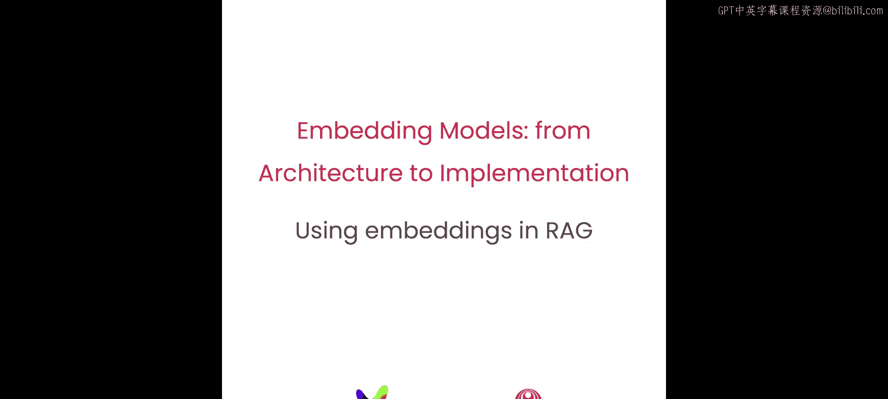
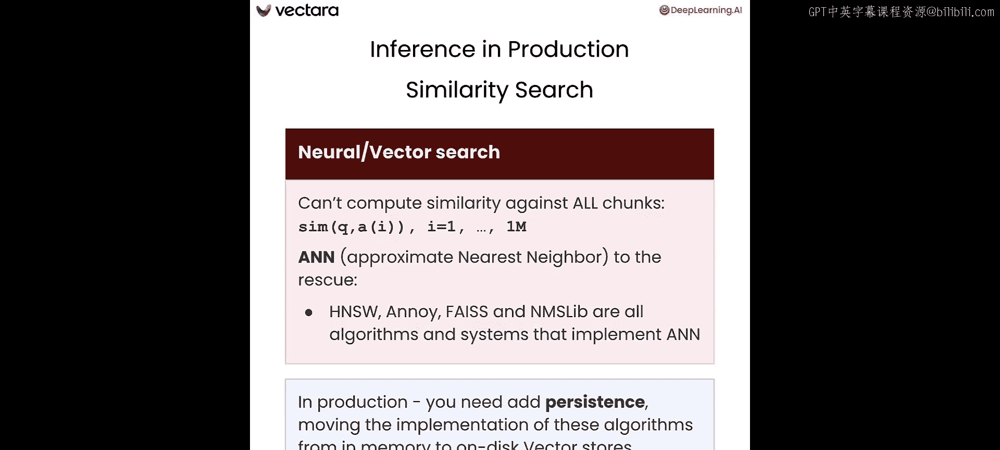
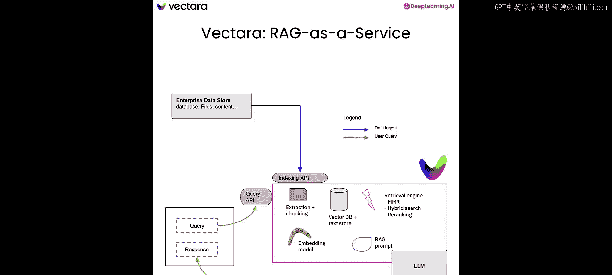

# 006：推理

## 概述

在本节课中，我们将学习如何在生产环境中使用句子嵌入模型，并了解在检索增强生成（RAG）等检索流程中，问题编码器和答案编码器这两种不同的编码器是如何被使用的。

## 推理流程

上一节我们介绍了双编码器模型的训练。现在，我们有两个已训练好的编码器：问题编码器和答案编码器。

在数据摄取阶段，我们使用答案编码器对每个文本块进行编码，并将生成的向量嵌入存储到向量数据库中。

当用户发出查询时，我们使用问题编码器生成查询嵌入向量。该向量随后被用于检索最匹配的事实或文本片段，这些内容将作为RAG流程的一部分发送给大语言模型。

## 检索匹配文本

在计算出问题嵌入后，我们如何找到匹配的文本块呢？

以下是几种方法：

*   **朴素方法**：计算问题嵌入与所有答案嵌入之间的相似度。这种方法计算量大，对于实际生产系统来说可能耗时过长。
*   **近似最近邻算法**：幸运的是，我们有许多近似最近邻算法可供选择，例如HNSW、Annoy、Faiss等。这些算法能以高精度近似最近邻搜索，同时显著降低计算时间，因此被广泛用于此任务。

大多数ANN算法是在内存中运行的。因此，当你在生产中实现它，并且面对非常大的数据集时，你还需要额外考虑使用基于磁盘的持久化数据存储来实现你的ANN方法。

## 代码示例

让我们通过代码来看看这一切。在这个笔记本中，我们首先忽略警告信息，并像往常一样导入一系列我们将要使用的包。

以下是关键步骤：

1.  **导入包**：特别注意两个新包：`DPRContextEncoder` 和 `DPRQuestionEncoder`。我们将使用它们来加载预训练的双编码器模型。
2.  **准备数据**：我们准备了五个不同的潜在答案和一个问题：“世界上最高的山是什么？”
3.  **使用纯相似度模型**：你可以使用名为 `all-MiniLM-L6-v2` 的纯相似度模型。计算问题的嵌入，然后计算每个答案的嵌入，最后计算问题与每个答案之间的相似度。你会发现，相似度最高的答案正是与问题完全相同的那个，相似度为1.0，这符合预期。
4.  **使用双编码器模型**：我们使用完全预训练的DPR模型。加载模型后，再次计算问题的标记和嵌入。嵌入是一个768维的向量。
5.  **处理答案**：对每个答案进行标记化，使用答案编码器获取答案嵌入，计算相似度，并找出最佳答案。结果是，我们得到了正确的答案：“世界上最高的山是珠穆朗玛峰”。与问题完全相同的那个答案（答案0）并没有得到最高分。

## 完整的RAG流程

现在，让我们退一步，看看完整的RAG流程。

*   **数据摄取阶段**：接收输入文档或文本，将其分块，使用答案编码器将这些块编码成嵌入向量，然后将其存储到向量数据库中。
*   **查询响应阶段**：收到用户查询后，使用问题编码器获取问题嵌入，然后使用ANN算法检索最相关的文本块。这些文本块随后作为上下文包含在提示词中，并发送给LLM，由LLM生成所需的响应。

在实践中，有几种方法可以构建RAG流程：

*   **从零开始编码**：完全自己编写代码。
*   **使用DIY框架**：例如LangChain或LlamaIndex。
*   **使用RAG服务平台**：例如Vectara，它为你完成了大部分繁重的工作。

## 总结

本节课中，我们一起学习了如何在生产RAG流程中使用问题编码器和答案编码器，并了解了ANN算法对于使检索延迟达到可接受水平的重要性。在下一课也是最后一课中，我们将总结本课程，并解释两阶段检索流程是如何工作的。