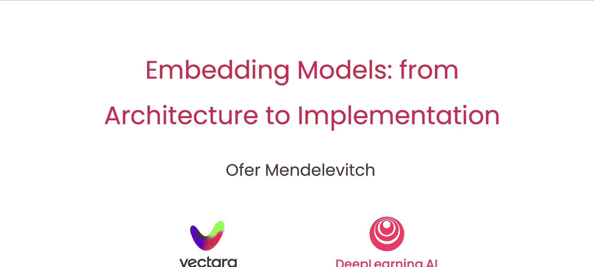

# 007：课程概述

在本节课中，我们将要学习嵌入模型的基本概念、历史发展及其在检索系统中的应用。嵌入模型能够将文本转换为代表其含义的向量，这是构建现代语义检索系统的核心。

## 课程简介

欢迎来到与Vectara合作的《从架构到实现的嵌入模型》课程。嵌入模型创建嵌入向量，使构建语义或基于意义的检索系统成为可能。本课程将详细描述历史、技术架构和实施细节。这是一门技术课程，因此我们将专注于构建模块而非应用。

你可能听说过嵌入向量在生成式人工智能应用中的应用。这些向量具有捕捉单词或短语含义的惊人能力。你可能已经使用过嵌入模型来创建这些向量。但是，这些模型究竟是如何工作的呢？

为了帮助我们深入了解这一点，我很高兴介绍Amin Ahmad，Vectara的联合创始人兼作者，以及Mendeleevich，他是公司的开发者关系负责人。

谢谢，Andrew。我很高兴能在这里。在Vectara，我们已经构建了自己的嵌入模型来支持不同的RAG系统。因此，我们必须深入研究如何选择、构建和训练它们。在这门课程中，我们将与您分享一些关键的技术细节。

听起来很棒。

## 嵌入模型的核心思想

创建一个能够生成代表单词含义的向量模型是一个具有挑战性的问题。你可能希望利用大量现有文本作为训练数据。但是，你该如何操作呢？

有一个想法是使用目标词周围的词作为线索。以单词“tree”为例。一个文本训练句子可能会说：“树上的叶子是绿色的。”而另一个句子可能会说：“树上的树枝正在落下。”因此，出现在单词“tree”附近的词会告诉你有关“tree”含义的一些信息。如果你有数百万个类似的句子，那么你可能会对“tree”这个词有一个相当不错的理解。

## 历史发展：从Word2Vec到Transformer

这种方法由Thomas Mikolov、Kai Chen、Greg Corrado和Jeff Dean开发的Word2Vec嵌入模型推广开来，他们大多数曾是我在Google Brain的前同事。Word2Vec模型是一个在自然语言上训练的模型，通过预测目标词周围几个词来学习嵌入。

随后，斯坦福大学的Jeffrey Pennington、Richard Socher和Chris Manning提出的GloVe方法进一步改进了Word2Vec，简化了学习嵌入所需的数学方法。

扩大单词周围的上下文窗口以产生更精确的嵌入之前，一直涉及使用像LSTM这样的循环神经网络。2017年，引入了transformer模型，这改变了局面，使得前馈神经网络能够高效处理顺序数据，远比循环网络更易训练。

BERT模型于随后的一年发布，采用了深度transformer网络，在简单的填空任务训练中深入理解语言，开启了现代自然语言处理的时代，并为随后出现的GPT等系统奠定了基础。

## 从词到句：嵌入的应用扩展

你还可以将注意力从单词扩展到短语或句子等更长的文本段落。在检索系统中，你可能希望为查询句子生成一个嵌入向量，并将其与响应句子的向量进行比较。事实证明，你可以对这些强大的词嵌入模型进行微调，以评估句子。Ofer会向你展示如何操作。

没错。在本课程中，你将首先学习嵌入模型的应用领域和使用方式。接着，你将学习BERT模型。这是一个典型的双向transformer的例子。BERT被广泛应用于多种场景，但在这里我们将专注于其在检索中的应用。

随后，你将学习如何构建和使用对比损失来训练双编码器模型，这对于RAG应用非常适用。它包含一个用于查询的编码器和一个专门用于响应的编码器。你将亲眼见证这一切。

## 致谢

许多人为创作这门课程付出了努力。我要感谢Vectara的Vivek Saurabh，以及deeplearning.ai的Eshmel Gargari和Jeff Ludwig也为这门课程做出了贡献。

## 课程预告

第一课将从检索系统中的嵌入模型概述开始。听起来很不错。

---

本节课中我们一起学习了嵌入模型的基本概念、其通过上下文学习词义的核心思想，以及从Word2Vec到Transformer和BERT的关键技术演进。我们还了解了本课程的结构，即从应用概述到BERT模型，再到用于检索的双编码器训练。下一节课，我们将深入探讨嵌入模型在检索系统中的具体应用。