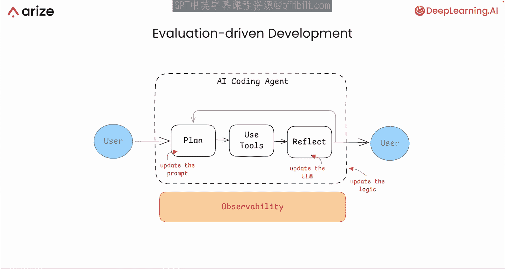
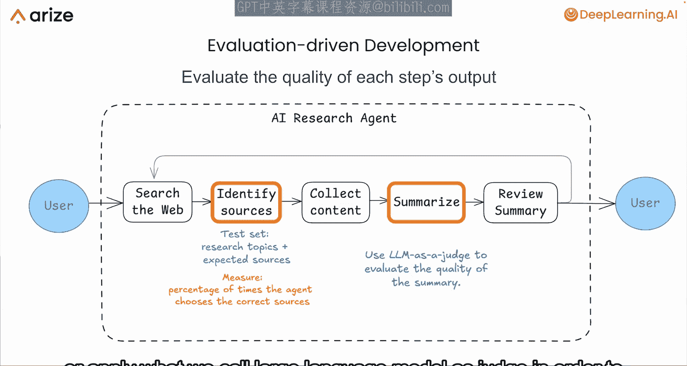
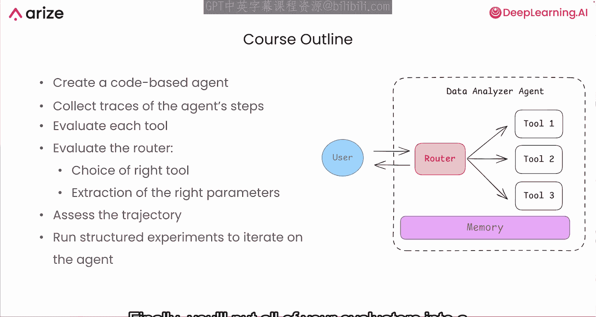

# 001：课程概述 🎯

在本课程中，我们将学习如何为基于代理的应用程序添加可观测性，并通过评估驱动的开发流程来高效地改进AI代理。

评估驱动的开发流程能让你的开发工作更高效。如果你正在构建一个AI编码代理，它可能需要执行许多步骤来生成优质代码，例如规划、使用工具、反思等。本课程将教你如何为基于代理的应用程序添加可观测性，这意味着你将能看到它在每一步的具体操作。这样，你就可以对各个组件进行评估，并高效地推动组件乃至整个系统层面的改进。

如果你正在思考诸如“是否应该更新某个特定步骤的提示词”、“是否应该更新工作流的逻辑”或“是否应该更换使用的大语言模型”这类问题，那么一个严谨的评估驱动流程将对你大有裨益。它能帮助你系统地做出这些决策，而不是随机地尝试大量方法，然后看哪个有效。

如果你听说过“错误分析”这个概念，它是机器学习中的一个关键概念，本课程将教你如何在代理工作流开发过程中应用它。如果你没听说过也没关系，本课程将介绍一系列重要的思想，并展示如何高效地开发代理工作流。

本课程的讲师是来自Arise AI的开发者关系负责人John Gurui和产品总监Aman Khan。他们将在评估AI代理工作流这一重要主题上为我们提供专业指导。

---

## 为何需要评估AI代理？🤔

上一节我们介绍了课程的整体目标，本节中我们来看看为何评估对于构建复杂的AI代理系统至关重要。

假设你正在构建一个研究代理，它需要搜索网络、识别来源、收集内容、总结发现，并可能评估其发现的弱点。在构建这样一个复杂系统时，你需要评估每个步骤输出的质量。

以下是评估不同步骤的具体方法：

*   **对于来源选择**：你可以创建一个测试集，其中包含研究主题和对应的预期来源集，然后测量代理选择正确来源的百分比。
*   **对于开放式任务（如总结）**：你可以提示另一个大语言模型，或者应用我们称之为“大语言模型即法官”的方法，来评估这种更开放的文本摘要输出的质量。

除了测试和改进代理输出的质量，你还需要评估代理所采取的路径，以确保它不会陷入循环或不必要地重复步骤。

因此，在本课程中，你将学习如何构建你的评估体系，以迭代改进代理的输出质量和所采取的路径。

---

## 课程实践项目与学习路径 🛠️

上一节我们探讨了评估的必要性，本节中我们将了解本课程将通过什么实践项目来学习这些评估方法。

你将通过创建一个作为数据分析师运行的代码代理来进行实践。这个代理将拥有一套工具，允许它连接到数据库并执行分析，一个用于识别使用哪个工具的路由器，以及一个用于跟踪聊天记录的记忆模块。

以下是本课程的核心学习路径：

1.  **收集与可视化**：你将收集并评估代理处理查询时所采取步骤的“痕迹”，并对收集到的数据进行可视化。
2.  **组件评估**：你将学习如何使用不同类型的评估器来评估代理工作流中的每个工具。
3.  **路由与参数评估**：你将评估路由器是否根据用户查询选择了正确的工具，以及它是否提取了正确的参数来执行该工具。
4.  **路径评估**：你将评估代理所采取的轨迹。
5.  **整合实验**：最后，你将把所有评估器整合到一个结构化的实验中，用于迭代和改进你的代理。

虽然本课程侧重于在开发过程中应用评估，但你也将学习如何在生产环境中监控你的代理。

---

## 总结 📝

本节课中我们一起学习了评估AI代理的重要性与基本框架。我们了解到，通过为代理系统添加可观测性，并采用评估驱动的开发流程，可以系统地提升代理在输出质量和执行路径上的表现。本课程将通过一个数据分析代理的实践项目，引导我们学习如何收集痕迹、评估各个组件（如工具、路由器），并最终整合成结构化的改进实验。现在，让我们进入下一个视频，开始具体的学习。