# 002：大语言模型时代的评估 🧠

在本节课中，我们将学习如何评估基于大语言模型的系统，特别是AI代理。我们将探讨LLM评估与传统软件测试的区别，并了解评估AI代理时需要考虑的关键因素。

---

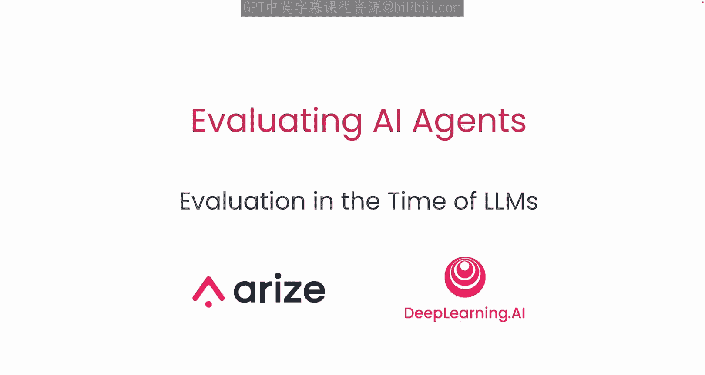

## 概述

AI代理是由大语言模型驱动的软件应用。在第一课中，你将学习评估基于LLM的系统与传统软件测试有何不同。我们将探讨“代理”的含义，并讨论评估代理时需要考虑的事项。

---

## LLM评估的两个层面

当我们谈论评估时，通常有两个层面。

在左侧，是**LLM模型评估**。这侧重于大语言模型执行特定任务的能力。你可能见过像**MMLU**（涵盖数学、哲学、医学等领域的问答）或**HumanEval**（用于代码生成任务）这样的基准测试。模型提供商经常使用这些基准来展示其基础模型的性能。

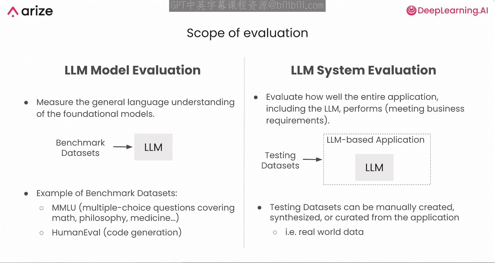

在右侧，是**LLM系统或应用评估**。这专注于你的整体应用（LLM只是其中的一部分）的表现。用于此评估的数据集通常是手动、自动或使用真实世界数据合成创建的。

---

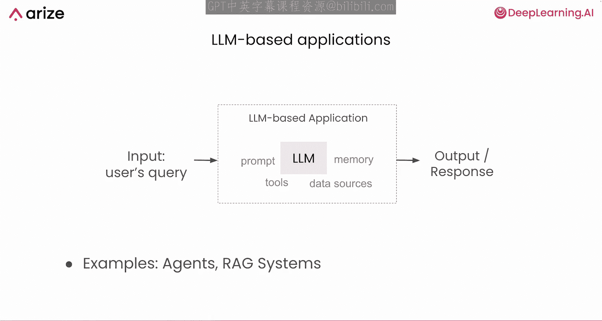

## 从模型到系统评估

上一节我们介绍了评估的两个层面，本节中我们来看看当LLM被集成到更广泛的系统中时，评估重点的转变。

当你将LLM集成到一个更广泛的系统或产品中时，你需要理解整个系统（包括提示词、工具、记忆和路由组件）是否输出了你期望的结果。

---

## 传统软件测试 vs. LLM系统测试

你可能有过传统软件测试的经验，那里的系统在很大程度上是确定性的。你可以把它想象成轨道上的火车。通常有明确的起点和终点，检查每个部分（火车或轨道）是否正常工作通常很简单。

另一方面，基于LLM的系统感觉更像在繁忙的城市里开车。环境是多变的，系统是非确定性的。

以下是两者的关键区别：

*   **传统软件测试**：你依靠**单元测试**来检查系统的各个部分，依靠**集成测试**来确保它们按预期组合在一起，结果通常是相当确定的。
*   **LLM系统测试**：当你多次向LLM提供相同的提示时，你可能会看到略有不同的响应，就像司机在城市交通中的行为可能不同一样。你通常需要处理更定性或开放式的指标，例如输出的相关性或连贯性，这可能无法严格地套用“通过/失败”的测试模型。

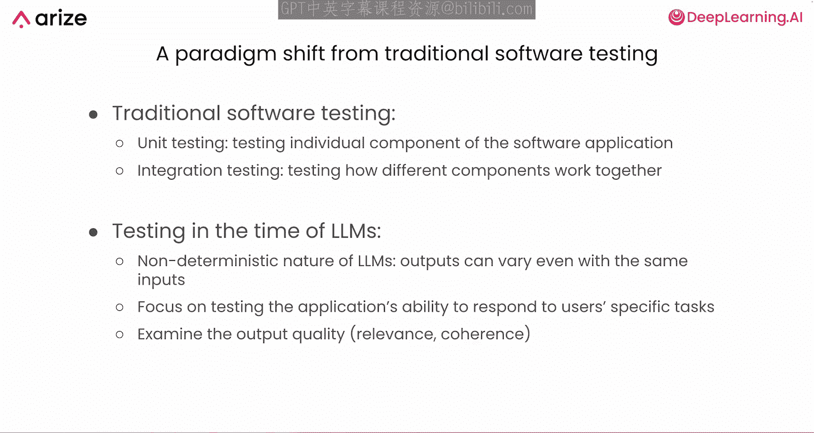

---

## LLM系统的常见评估类型

了解了测试方法的差异后，我们来看看针对LLM系统的一些常见评估类型。

以下是几种主要的评估类型：

*   **幻觉**：LLM是准确使用提供的上下文，还是在编造内容？
*   **检索相关性**：如果系统检索文档或上下文，它们是否真的与查询相关？
*   **问答准确性**：响应是否与事实或用户需求相符？
*   **毒性**：LLM是否输出了有害或不受欢迎的语言？
*   **整体性能**：系统实现其目标的效果如何？

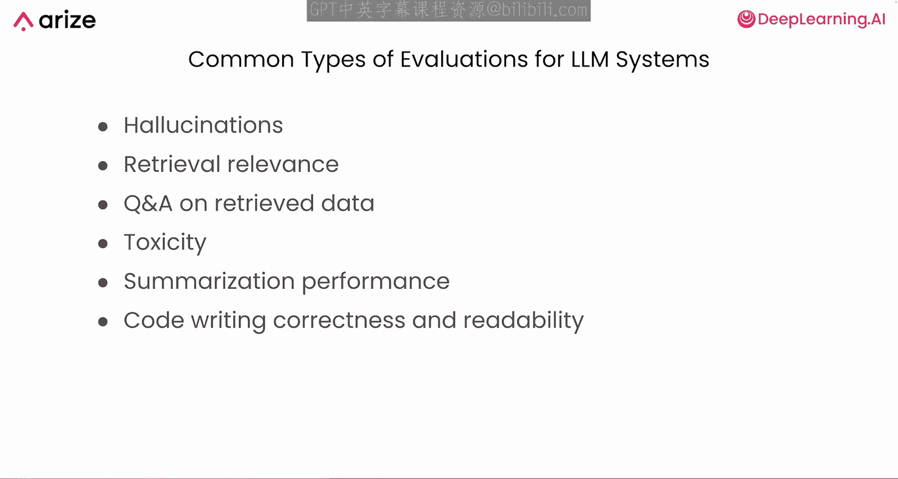

有许多开源工具和数据集可以帮助你衡量这些方面，并帮助你开发自己的评估方法，我们将在课程后面介绍其中的一些。

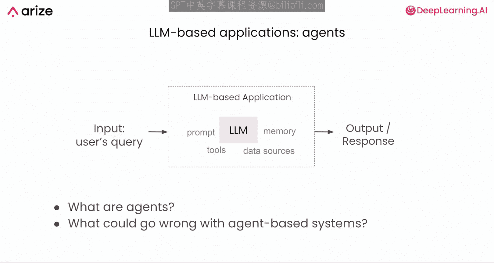

---

## 从LLM应用到AI代理

上一节我们介绍了LLM系统的评估，本节中我们来看看当系统升级为“代理”时，评估会变得更加复杂。

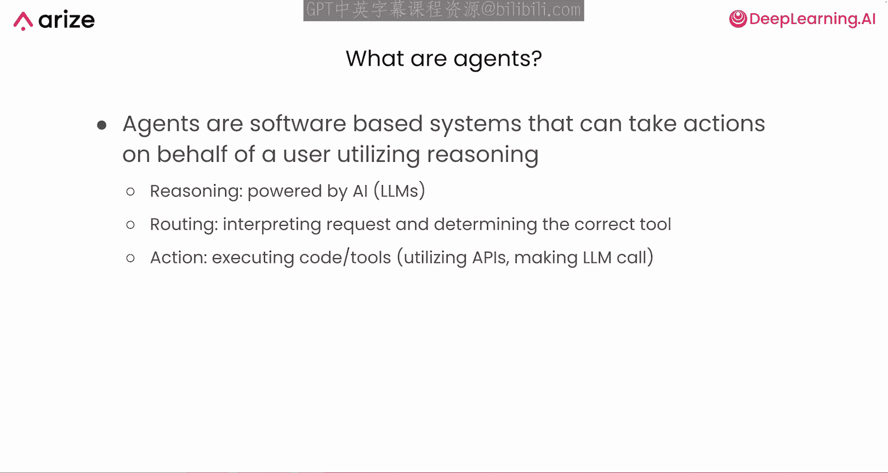

一旦你从基于LLM的应用转向代理，你就增加了一层额外的复杂性。代理使用LLM进行推理，但它们也通过选择工具、API或其他能力来代表你采取行动。

---

## 代理的核心组件

那么，什么是代理呢？代理是一个基于软件的系统，可以利用推理代表用户采取行动。一个代理通常有三个主要组件。

以下是代理的三个核心组件：

*   **推理**：由LLM驱动。
*   **路由**：决定使用哪个工具或技能。
*   **行动**：执行工具调用、API调用或代码。

---

## 代理用例示例

你可能已经见过代理的用例示例，例如帮助你做笔记或转录信息的个人助理代理、帮助自动化重复任务的桌面或浏览器代理、用于数据抓取和总结的代理，以及可以进行搜索和汇编研究的代理。

让我们用一个示例用例来说明代理实际上是如何工作的。假设你想要一个代理为你预订一次去旧金山的旅行。幕后有很多事情在进行。

首先，代理必须根据你的请求确定应该调用哪个工具或API。它需要理解你真正想要什么，以及哪些资源会有帮助。

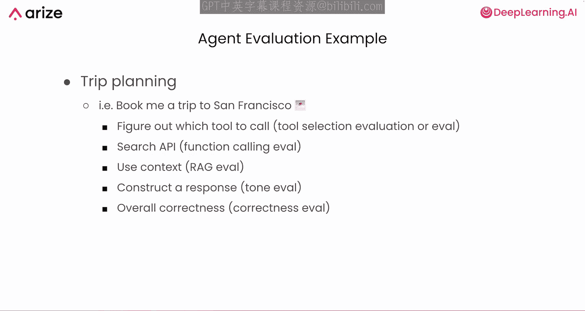

接下来，它可能会调用搜索API来查询可用的航班或酒店，并且它可能决定向你提出后续问题，或优化它为该工具构建请求的方式。

最后，你希望它返回一个友好且准确的响应，最好包含正确的旅行详情。

现在，让我们思考如何一步一步地评估这个过程：

*   代理一开始是否选择了正确的工具来形成搜索或预订请求？
*   它是否用正确的参数调用了正确的函数？
*   它是否准确使用了你的上下文（例如，日期、偏好和地点）？
*   最终响应看起来如何？语气是否恰当，事实是否准确？

---

## 代理评估的挑战与重要性

在这个系统中，有很多可能出错的地方。也许代理返回了去圣地亚哥而不是旧金山的航班。这对某些人来说可能没问题，但如果人们想去旧金山却得到了圣地亚哥的信息，大多数人会不高兴。

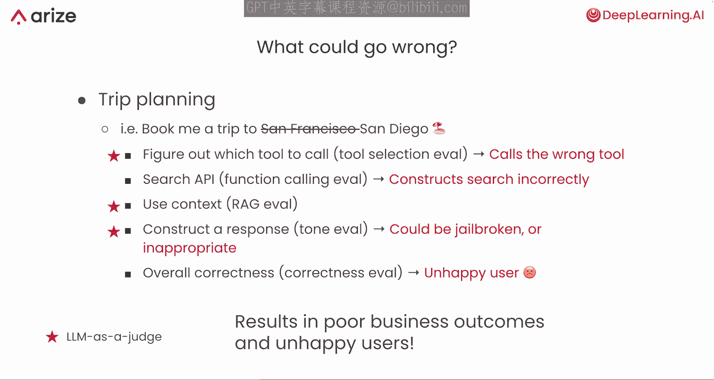

这凸显了你不仅需要评估LLM的原始输出，还需要评估代理如何决定其每一步行动。

你可能会遇到诸如代理调用错误工具、误用上下文，甚至采用讽刺或不恰当语气等问题。有时用户也会试图“越狱”系统，这可能会产生更多意想不到的输出。

为了评估这些因素，你可以使用人类反馈或“人在回路”的方法，或者使用LLM本身作为“法官”来评估代理的最终响应是否真正满足了你的要求。我们将在本课程后面深入探讨“LLM即法官”在代理评估中是如何工作的。

---

## 迭代测试与回归预防

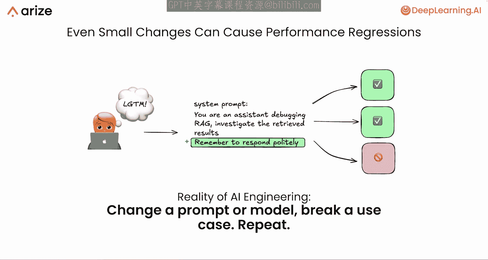

最后，请记住，即使对你的提示词或代码进行微小的更改，也可能产生意想不到的连锁反应。例如，添加一句简单的“记得礼貌回应”可能有助于改进许多用例，但也可能导致在你意想不到的测试用例中出现性能倒退。

这就是为什么你需要维护一组有代表性的测试用例或数据集，以反映你的关键用例。每次调整系统时，你都可以在这些数据集上重新运行评估，以捕捉性能倒退，并随着时间的推移不断构建新的代理能力。这种方法是开发稳健的代理评估的关键。

---

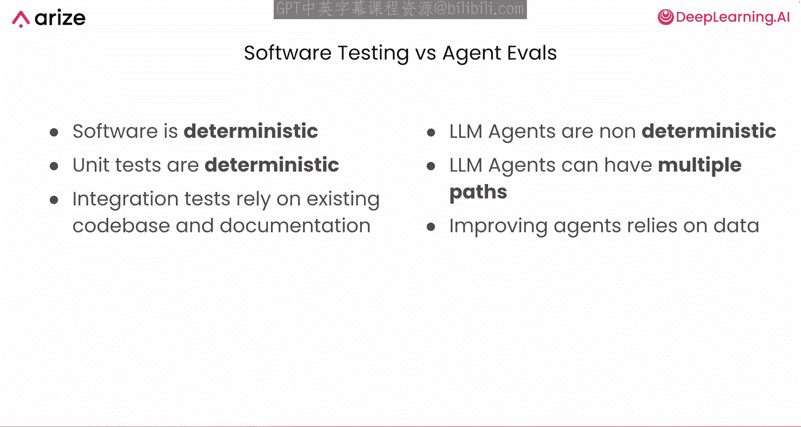

## 建立一致的测试流程

就像对待传统软件一样，你希望对代理的性能进行迭代改进。然而，你不能依赖纯粹的确定性检查。代理本身是非确定性的，可以采取多种路径，并且可能在一个场景中性能倒退，同时在另一个场景中有所改进。

为了处理这个问题，你需要一套覆盖不同用户用例的一致性测试，每次做出更改时都运行这些测试。

---

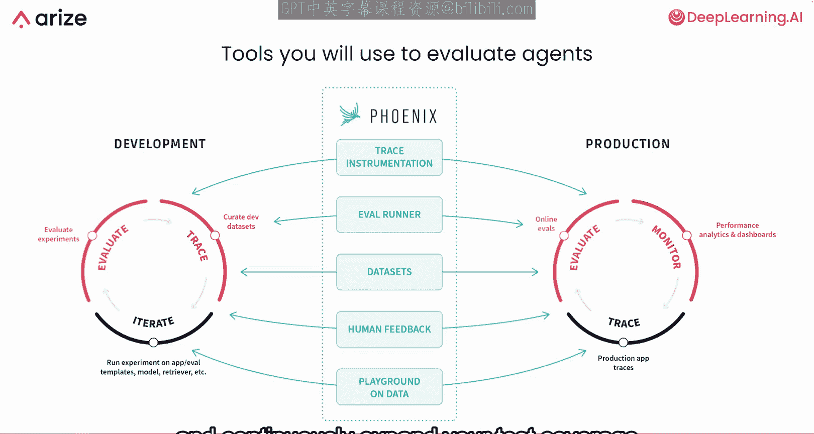

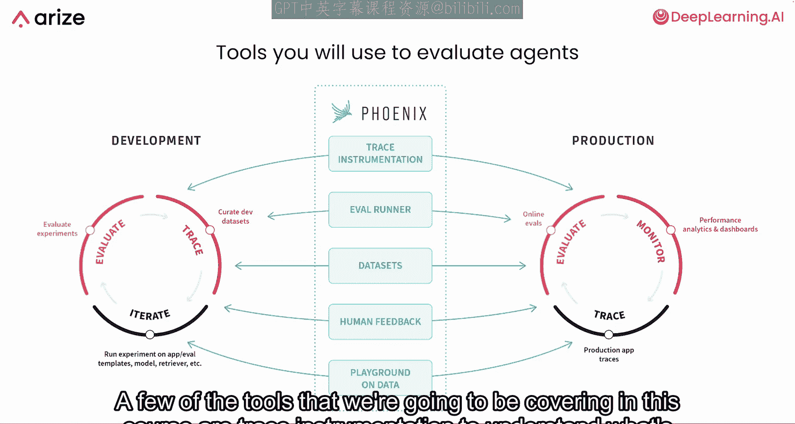

## 从开发到生产的工具链

这些测试通常从生产数据（如真实世界的查询和真实的用户交互）循环回到开发环节，在那里你可以优化提示词、工具或你的方法。这可以帮助你在代理部署到生产环境时捕捉性能倒退，并随着时间的推移不断扩大测试覆盖范围，以改进你的系统。

本课程将涵盖的一些工具包括：

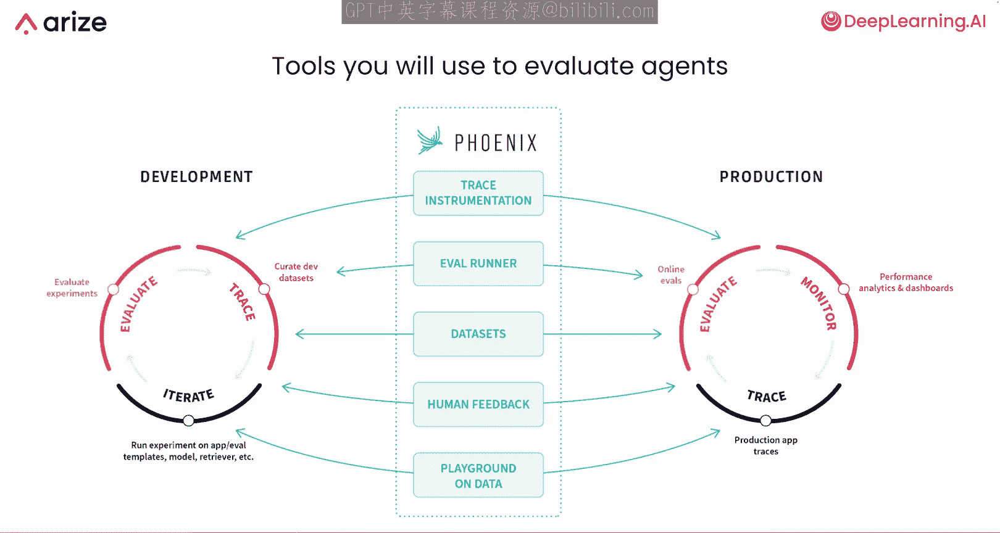

*   **跟踪检测**：用于理解你的代理在底层发生了什么。
*   **评估运行器**：包含“LLM即法官”功能。
*   **数据集**：可用于重新运行实验。
*   **人类反馈**：允许你捕获人类标注和生产数据。
*   **提示词实验场**：可用于迭代你的数据。

---

## 总结

在本节课中，我们广泛了解了LLM模型评估与系统评估的比较，为什么基于LLM的应用需要不同于传统软件的测试方法，代理在推理、路由和行动方面带来的额外复杂性，代理的常见陷阱（如工具选择错误、上下文使用不当），以及使用一套从开发到生产的工具进行迭代测试的重要性。

你很快就能看到所有这些的实际应用，并深入研究实践代码。在接下来的课程中，你将更仔细地研究如何评估代理、收集哪些数据，以及如何构建这些评估，以使你的代理在现实世界中保持正轨。

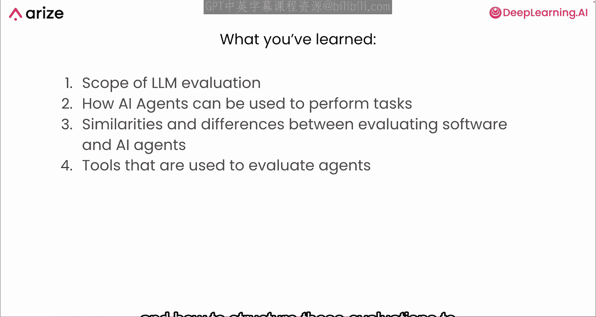

