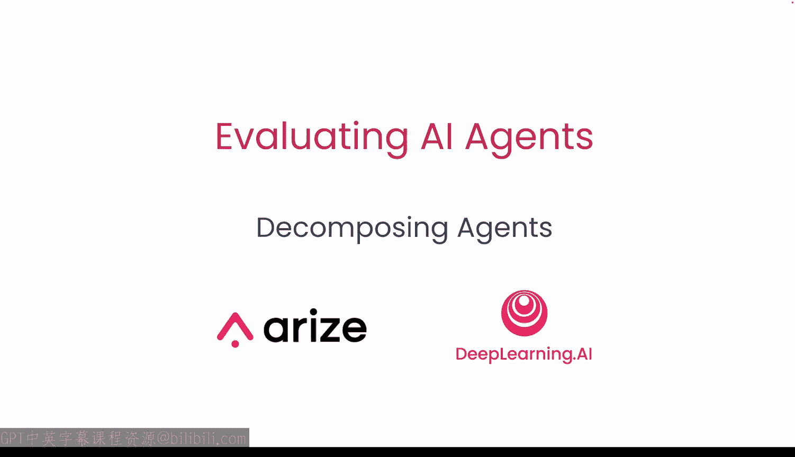
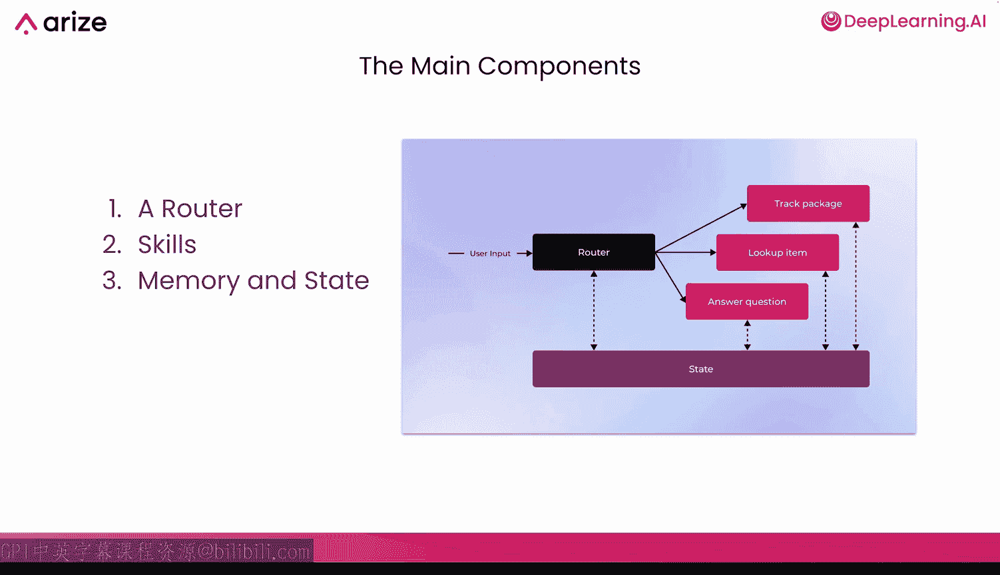
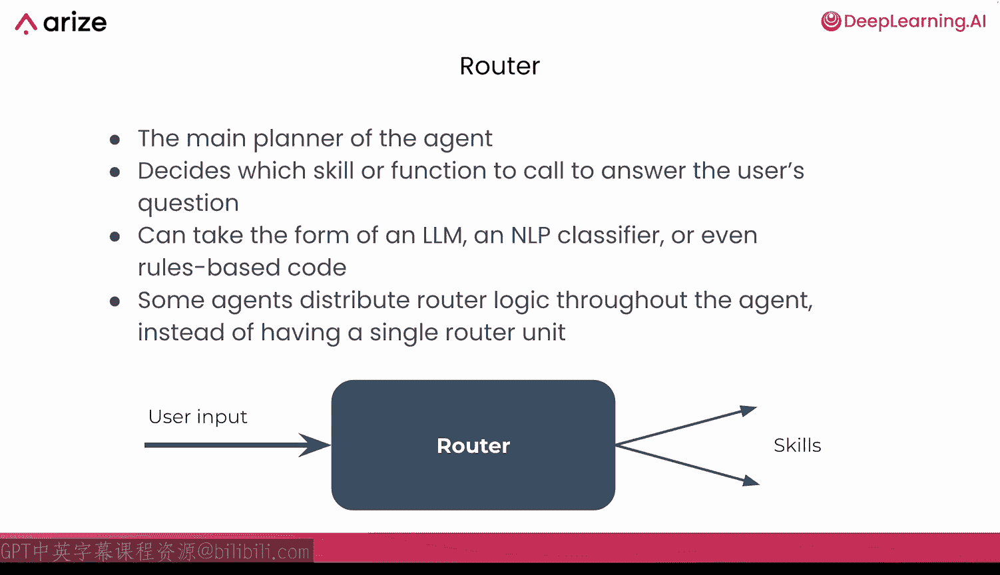
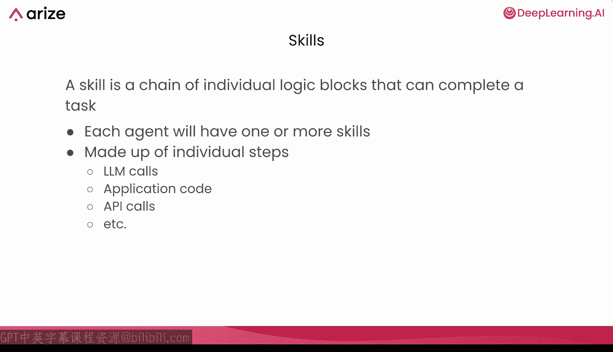
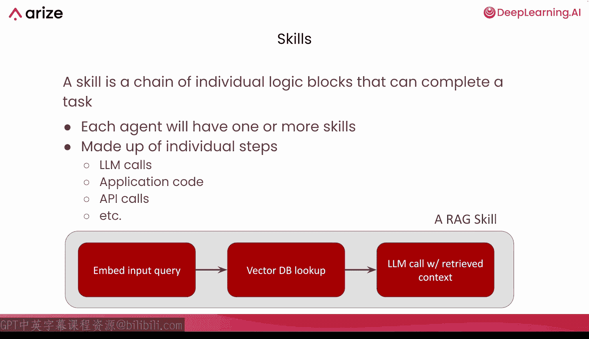
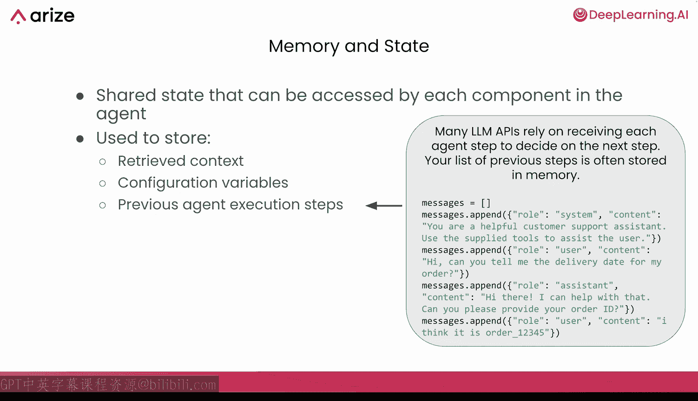
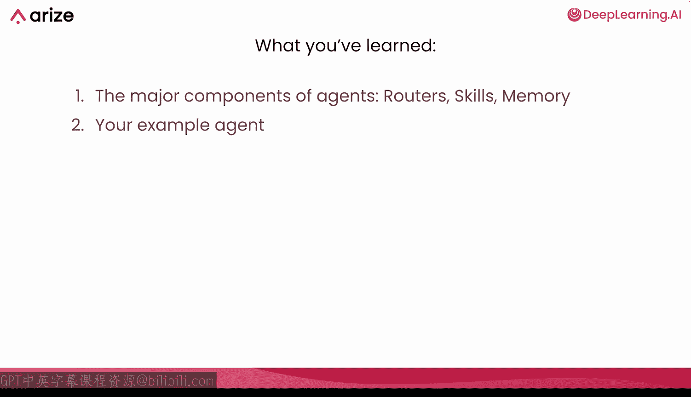

# 003：分解智能体 🧠

在本节课中，我们将学习智能体的核心构成。我们将深入探讨智能体的结构细节，并分析一个能够执行数据分析的智能体示例。你将了解智能体通常由哪些组件构成，以及这些组件如何协同工作。

智能体通常由三种主要类型的组件构成：路由器、技能，以及内存和状态。右侧的图片展示了一个智能体示例，其中黑色部分是路由器，底部的深紫色是状态，还有一组该智能体可以调用的三个不同技能（在本例中是跟踪包裹、查找商品和回答问题）。这些不同的组件都可以与状态交互，而路由器负责处理用户输入，然后将输出返回给用户。

## 路由器：智能体的大脑 🧭

首先来看路由器，它是智能体的主要规划器，在某种程度上可以说是智能体的大脑。路由器负责决定智能体将调用哪个技能或功能来回答用户的问题。因此，当路由器接收到用户输入或来自不同技能的响应时，路由器将决定接下来调用哪个其他技能。

路由器可以采取几种不同的形式：
*   它可以是一个配备了函数调用功能的大语言模型，正如你将在本课程中使用的那样。
*   或者是一个更简单的自然语言处理分类器。
*   甚至只是基于规则的代码。

通常，你使用的路由器类型越简单，性能就越好，性能也越稳定，但也会限制该路由器的能力范围。像配备函数调用的大语言模型这样的路由器能力范围非常广，但比基于规则的代码更不可靠。这也是评估可以帮助你弥补差距的地方。

一些智能体不使用单一的路由器步骤，而是将逻辑分布在整个智能体中。采用这种方法的流行框架包括 LangGraph 和 OpenAI 的 Agents。它们仍然有路由逻辑，但不是只有一个单一的路由器步骤，而是将责任分布在整个智能体本身。

## 技能：智能体的能力模块 🛠️

接下来，技能是智能体拥有的独立逻辑块和能力。因此，技能是让智能体真正能够做任何事情的部分，它们允许智能体通过 API 与外部世界连接，或调用数据库，或真正完成你的智能体能够完成的任何不同任务。

每个智能体将拥有一个或多个技能。一个没有任何技能的智能体实际上什么也做不了，这不是一个真实的用例。技能由独立的步骤组成，包括大语言模型调用、应用程序代码、API 调用，或者任何你想在那里使用的其他代码。

一个非常常见的技能例子是 RAG 技能。在这种情况下，你的智能体内部可以有一个检索增强生成能力，它将处理从嵌入到从向量数据库查找数据，再到使用检索到的上下文进行大语言模型调用等所有事情。所有这些都包含在一个单一的 RAG 技能中。因此，你可以看到技能如何能够包含多个不同的步骤，并且整个大语言模型应用程序在智能体的上下文中都可以被视为技能。

一旦技能完成，在大多数智能体上下文中，它们也会返回到路由器，以便路由器可以选择返回给用户或从那里调用另一个技能。

## 内存与状态：智能体的记忆 📝

内存和状态也被智能体用来存储信息，这些信息可以被智能体内的每个组件访问。通常，内存和状态用于存储诸如检索到的上下文、配置变量，或者非常常见的是，存储先前智能体执行步骤的日志。

最后一种可能是你最常看到的，许多大语言模型 API 实际上依赖于传入一个完整的字典或消息列表，其中包含智能体在决定下一步调用之前已经做了什么。你将在本课程中使用的 OpenAI 函数调用路由器就采用了这种方法，因此你将非常熟悉这种方法。

## 示例智能体：数据分析助手 📊

现在，我们来看看你将在本课程中构建的示例智能体。你要创建的示例智能体是一个数据分析助手，它可以帮助你理解并询问你所拥有的销售数据库的问题。该智能体有几个不同的技能：
*   它有一个**数据查询技能**，可以从连接的数据库中查询信息。
*   它有一个**数据分析技能**，可以从数据中得出结论、发现趋势并进行计算。
*   最后，它有一个**数据可视化技能**，可以生成 Python 代码，并通过该代码创建图表和可视化。

从视觉上看你的示例智能体，你会看到一个用户正在向路由器发送查询（在本例中是一个配备了函数调用功能的 GPT-4o-mini 调用），然后该路由器将调用三个不同工具中的一个：查询销售数据工具、数据分析工具或数据可视化工具。然后，这些工具将返回到路由器，路由器再决定是返回给用户还是从那里调用另一个工具。

这里我们使用“工具”这个词，因为这是 GPT-4o-mini 所期望的，在这种情况下它等同于技能。因此，你的查询销售数据工具就等同于查询销售数据技能。

更深入地探讨一下这些技能，你会发现每个技能都有几个不同的步骤，通过这些步骤来完成任务：
*   **查询销售数据工具**：首先准备数据库，即加载本地数据库并确保其已准备好接受查询。然后，它将使用另一次大语言模型调用来生成 SQL 以查询该数据库，最后执行该 SQL 并将结果一路返回到路由器。
*   **数据分析工具**：进行一次调用以生成分析，即只进行一次大语言模型调用，然后将响应返回给路由器。
*   **数据可视化工具**：实际上进行两次连续的大语言模型调用，首先生成图表配置，然后根据该配置生成 Python 代码。这样做的原因是，虽然你可以直接要求大语言模型生成代码并一次性完成这两个步骤，但那样得到的响应会更不可靠。并且由于 Python 中的图表可视化在某种程度上是程式化的，先使用几个关键变量生成这个图表配置，然后根据该图表配置生成 Python 代码会更有帮助。这样就把任务分解成了两个更简单的任务，而不是要求大语言模型完成一个更困难的任务。

在本节课中，我们学习了智能体的主要组件：路由器、技能和内存，并分析了将要构建的示例智能体。在下一个视频中，你将通过一个笔记本来实际实现和构建这个示例智能体。