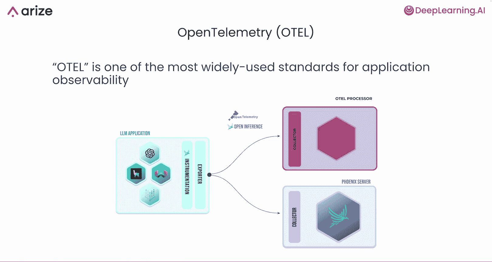
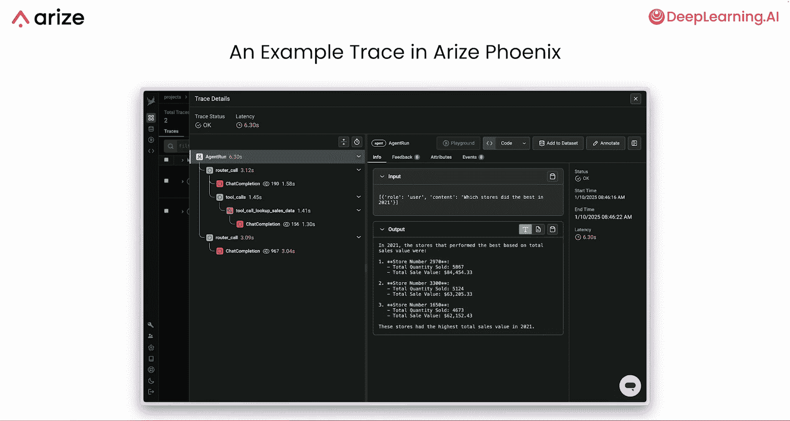
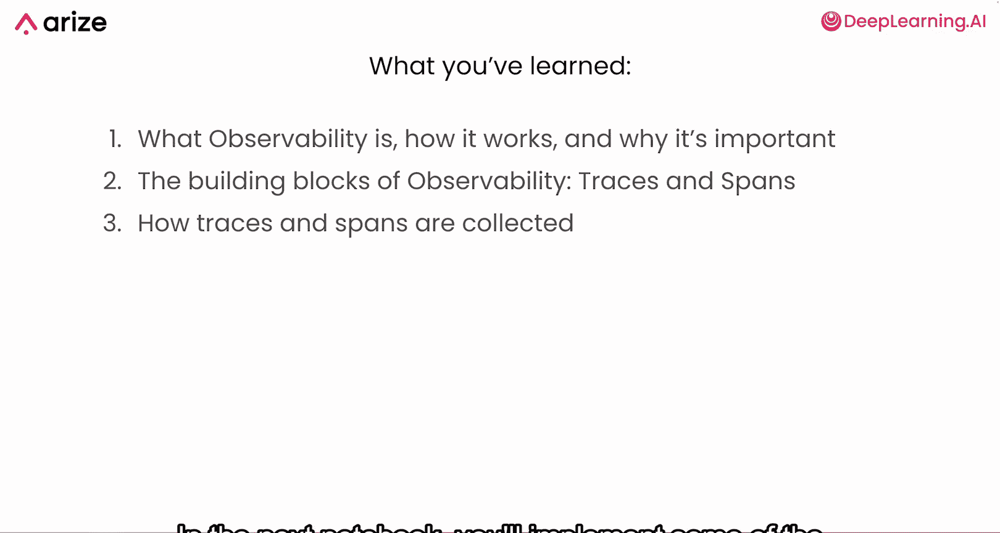

# 004：追踪代理 🔍

在本节课中，我们将学习如何为你的AI代理代码添加“可观测性”。这将帮助你深入了解代理在响应用户查询时所采取的步骤轨迹或序列。你将学习如何“插桩”你的代理，即添加代码来追踪代理的步骤，然后在Phoenix UI中可视化收集到的信息或“追踪”。

## 理解可观测性

上一节我们介绍了代理示例，本节中我们来看看如何观察它的运行。在软件领域，**可观测性**是一个通用概念，指的是能够完全洞察应用程序的每一层。在LLM应用上下文中，这通常意味着追踪诸如**提示词**、**响应**、**令牌使用量**以及围绕LLM调用发生的任何其他调用。

可观测性通常由**追踪**和**跨度**构成。

*   **追踪** 指的是应用程序的完整运行过程。一次追踪就是从输入到输出的单次端到端应用程序运行。
*   **跨度** 是追踪中的单个步骤，例如对LLM的调用、代码执行、数据库查询等。

一次追踪由多个跨度组成，它们通常以分层方式呈现，跨度可以相互嵌套，表明它们在另一个跨度内运行。一组跨度构成一个追踪层级。

## 核心概念：追踪与跨度

以下是追踪与跨度的关系公式：

**一次追踪 = 多个跨度（可能嵌套）**

在可视化界面中，跨度通常以分层方式展示。如下图所示，一个追踪可能包含LLM调用跨度（橙色）、工具调用跨度（黄色）以及表示通用逻辑步骤的链跨度（蓝色）。

## 技术标准：OpenTelemetry

追踪和跨度的概念来源于一个名为 **OpenTelemetry** 的框架，常缩写为 **OTel**。它是应用可观测性领域最广泛使用的标准之一，不仅限于LLM和AI代理。OTel定义了在应用程序中捕获追踪和跨度的标准方法。

这个过程通常被称为 **插桩**，即标记你希望作为跨度追踪的代码块或函数，并为其附加属性。虽然可以手动使用装饰器进行插桩，但像Phoenix这样的工具可以为你自动化部分过程，特别是当你使用OpenAI、LlamaIndex或LangChain等流行库时。

## 可观测性的重要性

了解这些概念后，你可能会问：为什么可观测性如此重要？以下是几个关键原因：

*   **简化调试**：在开发初期，通过清晰的可视化追踪来调试，远比在代码中翻查打印语句和日志要容易得多。
*   **记录运行详情**：当应用面向更多用户或进入测试/生产环境时，可观测性提供了所有调用和输入输出的详细日志，形成了一个庞大的应用运行信息数据库，便于监控性能。
*   **支撑评估工作**：这些追踪记录将成为后续进行评估的基石。你可以从Phoenix导出数据，用于跨多次应用运行的大规模评估。
*   **理解与控制LLM**：LLM本质上具有一定不可预测性。应对此问题的最佳方法就是监控它们，并在应用中对它们进行评估。

## 工具介绍：Arize Phoenix

在本课程中，我们将使用一个名为 **Arize Phoenix** 的工具。它充当OTel数据的收集器，允许你接收、可视化并评估追踪信息。下图展示了Phoenix中一条追踪记录的样子，在后续的实践练习中你会经常看到类似的界面。

## 总结与预告

本节课中，我们一起学习了可观测性的定义、工作原理及其重要性，也了解了其基本构成单元——追踪和跨度，以及它们是如何被收集的。

在接下来的实践环节中，你将应用本课所见的插桩技术，设置你的第一个Phoenix实例，并开始收集代理运行的追踪数据。