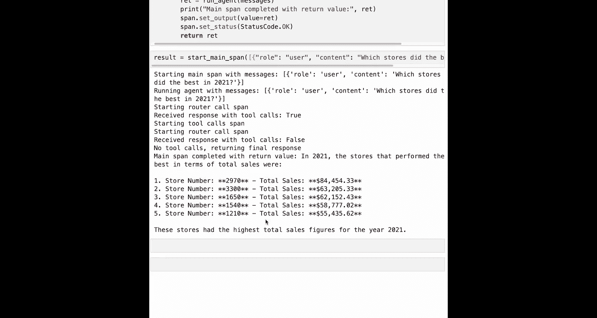
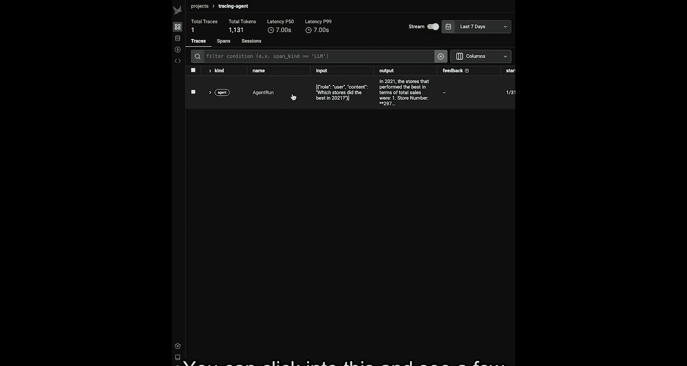
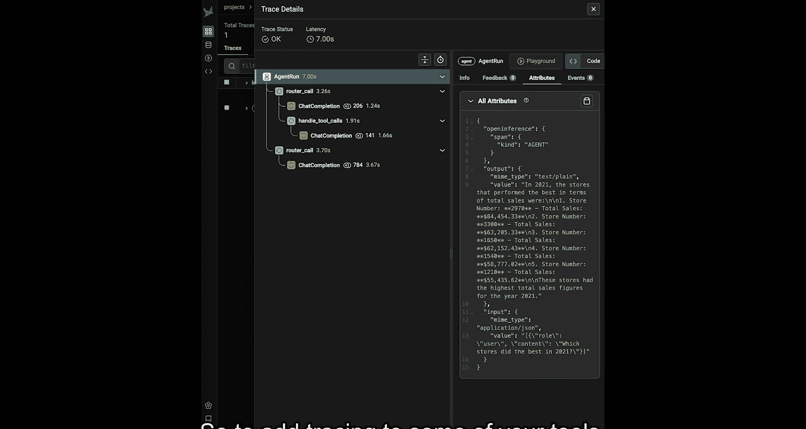
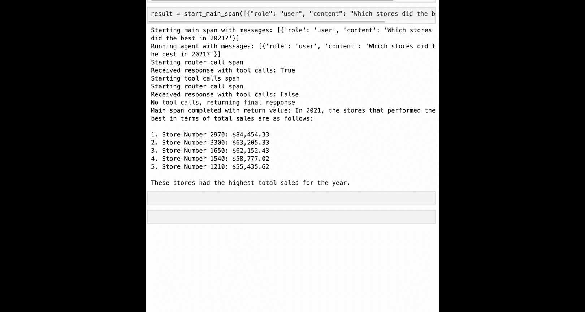
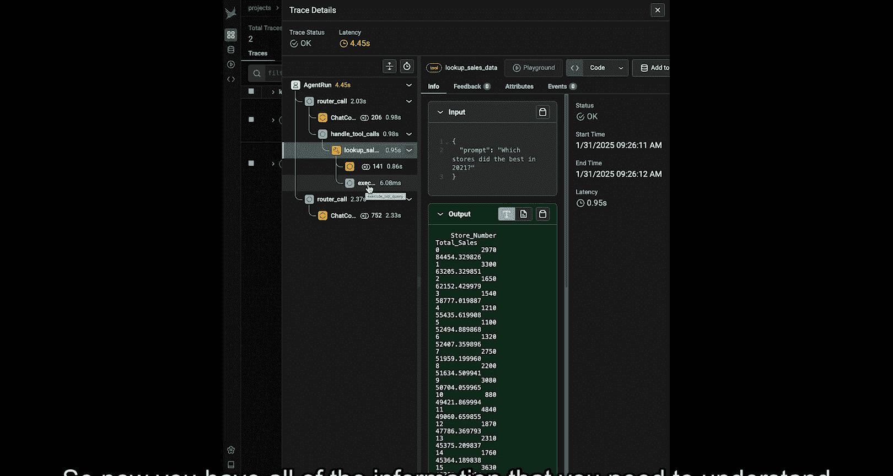

# 005：追踪代理（代码）🔍

在本节课中，我们将学习如何为之前构建的 AI 代理添加追踪和可观测性功能。我们将使用 Phoenix 和 OpenTelemetry 等工具，对代理的各个执行步骤进行监控和可视化，从而更好地理解其内部工作流程。

## 概述

我们将从一个已构建好的基础代理开始，逐步为其添加追踪功能。主要内容包括：设置 Phoenix 环境、自动和手动添加追踪点（Span）、以及如何在 Phoenix UI 中查看和分析追踪数据。通过本教程，你将掌握如何为复杂的 AI 应用添加可观测性。

## 1. 导入必要的库

首先，我们需要导入用于实现追踪和可观测性的库。这些库包括 Phoenix 本身、OpenTelemetry 相关组件，以及一个名为 OpenInference 的辅助库，它有助于优化 LLM 相关的追踪。

```python
import phoenix as px
from phoenix.trace import openai
from phoenix.trace import register
from openinference.instrumentation import openai as openai_instrumentor
from opentelemetry import trace
```

## 2. 设置模型与 Phoenix 连接

在添加追踪之前，我们需要设置好要使用的 AI 模型（例如 OpenAI）并启动 Phoenix 实例。Phoenix 是一个可以接收和可视化追踪数据的应用程序。

```python
# 设置 OpenAI 客户端和模型
from openai import OpenAI
client = OpenAI()
model = "gpt-4"

# 启动并连接到 Phoenix 实例
# 在笔记本环境中，Phoenix 通常已预先启动
endpoint = "http://localhost:6006" # 示例端点，实际值需根据环境获取
project_name = "tracing_agents"
register(project_name=project_name, endpoint=endpoint)
```

上一节我们完成了环境设置，接下来需要配置自动追踪。

## 3. 配置自动追踪

对于直接调用 OpenAI API 的部分，我们可以使用 OpenInference 提供的自动插桩工具，这能大大简化追踪设置。

```python
# 设置自动追踪器，用于捕获所有后续的 OpenAI 调用
tracer_provider = trace.get_tracer_provider()
openai_instrumentor.instrument(tracer_provider=tracer_provider)
```

配置好自动追踪后，我们还需要为代理中更复杂的逻辑（如工具调用）添加手动追踪。

## 4. 设置手动追踪

为了追踪代理的核心逻辑，我们需要获取一个 Tracer 对象，并用它来手动标记我们感兴趣的代码段。

```python
# 获取 Tracer 对象，用于创建手动追踪点
tracer = trace.get_tracer(__name__)
```

现在，让我们从最外层的代理执行逻辑开始添加追踪。

## 5. 为代理运行创建顶层追踪点

代理的 `run_agent` 方法可能包含循环或递归调用。为了更好地追踪整个会话，我们创建一个新的外层方法作为顶级追踪点。

以下是创建顶层追踪点的方法：



```python
@tracer.start_as_current_span("agent_run", kind=openai.SpanKind.AGENT)
def start_main_span(messages):
    """
    启动代理的主追踪点。
    参数 messages: 输入的对话消息列表。
    返回: 代理的最终响应。
    """
    span = trace.get_current_span()
    # 设置输入属性
    span.set_attribute("input", str(messages))
    try:
        # 调用原有的代理运行逻辑
        final_response = run_agent(messages)
        # 设置输出属性
        span.set_attribute("output", str(final_response))
        span.set_status(trace.Status(trace.StatusCode.OK))
        return final_response
    except Exception as e:
        span.set_status(trace.Status(trace.StatusCode.ERROR, str(e)))
        raise
```

## 6. 为路由逻辑添加追踪



在 `run_agent` 方法内部，每次调用路由决策（决定是调用工具还是回复用户）都是一个关键步骤，值得单独追踪。

以下是更新后的 `run_agent` 方法片段：

```python
def run_agent(messages):
    # ... 之前的初始化代码 ...
    while not done:
        # 为每次路由调用创建追踪点
        with tracer.start_as_current_span("router_call", kind=openai.SpanKind.CHAIN) as span:
            span.set_attribute("input", str(messages))
            # 原有的调用 OpenAI 进行路由决策的代码
            response = client.chat.completions.create(model=model, messages=messages, tools=tools)
            # ... 处理响应的逻辑 ...
            if tool_calls:
                span.set_attribute("output", f"Tool calls: {tool_calls}")
                # 调用工具处理函数
                handle_tool_calls(tool_calls, messages)
            else:
                done = True
                final_response = response.choices[0].message.content
                span.set_attribute("output", f"Final response: {final_response}")
            span.set_status(trace.Status(trace.StatusCode.OK))
    return final_response
```

## 7. 为工具调用处理添加追踪

处理工具调用的方法 `handle_tool_calls` 是一个独立的功能单元，非常适合使用装饰器来为其添加一个完整的追踪点。



以下是使用装饰器添加追踪的方法：

```python
@tracer.start_as_current_span("handle_tool_calls", kind=openai.SpanKind.CHAIN)
def handle_tool_calls(tool_calls, messages):
    """
    处理工具调用的函数。
    装饰器会自动将函数输入作为追踪点的输入，返回值作为输出。
    """
    # ... 原有的工具调用处理逻辑 ...
    for tool_call in tool_calls:
        function_name = tool_call.function.name
        function_args = json.loads(tool_call.function.arguments)
        # 调用对应的工具函数
        # ... 
    # 将工具结果追加回消息历史
    # ...
    return updated_messages
```

## 8. 为具体工具添加追踪

每个工具函数（例如查询数据、生成图表）的执行也需要被追踪。我们可以根据工具的复杂程度，选择使用装饰器或在函数内部嵌套更细粒度的追踪点。

以下是几种为工具添加追踪的方式：

*   **简单工具（使用装饰器）**：对于逻辑简单的工具，直接使用 `@tracer.tool` 装饰器最为便捷。
    ```python
    @tracer.start_as_current_span("simple_tool", kind=openai.SpanKind.TOOL)
    def simple_calculation_tool(prompt):
        # 工具逻辑
        result = perform_calculation(prompt)
        return result
    ```

*   **复杂工具（内部嵌套追踪点）**：对于包含多个步骤的工具（如先生成 SQL 再执行查询），可以在内部使用 `with` 语句创建嵌套的追踪点。
    ```python
    @tracer.start_as_current_span("lookup_sales_data", kind=openai.SpanKind.TOOL)
    def lookup_sales_data(prompt):
        # 步骤1：生成 SQL 查询（已通过自动追踪捕获，或可单独标记）
        sql_query = generate_sql_query(prompt)
        
        # 步骤2：执行 SQL 查询 - 创建嵌套追踪点
        with tracer.start_as_current_span("execute_sql_query", kind=openai.SpanKind.CHAIN) as span:
            span.set_attribute("input", sql_query)
            query_result = run_sql_query(sql_query) # 假设的数据库调用函数
            span.set_attribute("output", str(query_result))
            span.set_status(trace.Status(trace.StatusCode.OK))
        
        return format_result(query_result)
    ```

*   **工具链中的辅助方法**：对于被工具调用的内部辅助方法，可以使用 `@tracer.chain` 装饰器。
    ```python
    @tracer.start_as_current_span("extract_chart_config", kind=openai.SpanKind.CHAIN)
    def extract_chart_config(prompt):
        # 从提示词中提取图表配置的逻辑
        config = parse_prompt_for_config(prompt)
        return config
    ```

## 9. 运行代理并查看追踪结果

完成所有追踪点的添加后，运行代理并生成一些交互。然后，打开 Phoenix 的 Web UI（通常运行在 `http://localhost:6006`）查看结果。

在 Phoenix UI 中，你可以：
1.  在项目列表中选择你的项目（例如 `tracing_agents`）。
2.  看到每次代理运行产生的**追踪（Trace）**列表。
3.  点击单个追踪，查看其内部的所有**跨度（Span）**，它们按层级关系排列。
4.  点击每个 Span，可以检查其详细的**属性（Attributes）**，如输入、输出、状态、耗时等。
5.  区分不同颜色的 Span（如 Agent、Chain、Tool、LLM），快速理解代理的执行流程。



## 总结



本节课中，我们一起学习了如何为 AI 代理系统添加完整的可观测性。我们从设置 Phoenix 和自动插桩开始，然后逐步为代理的顶层执行、路由逻辑、工具调用处理以及每个具体工具添加了手动追踪点。通过结合自动和手动追踪，我们能够在 Phoenix UI 中获得代理执行的完整、清晰的视图，这对于调试复杂逻辑、分析性能瓶颈和理解代理行为至关重要。