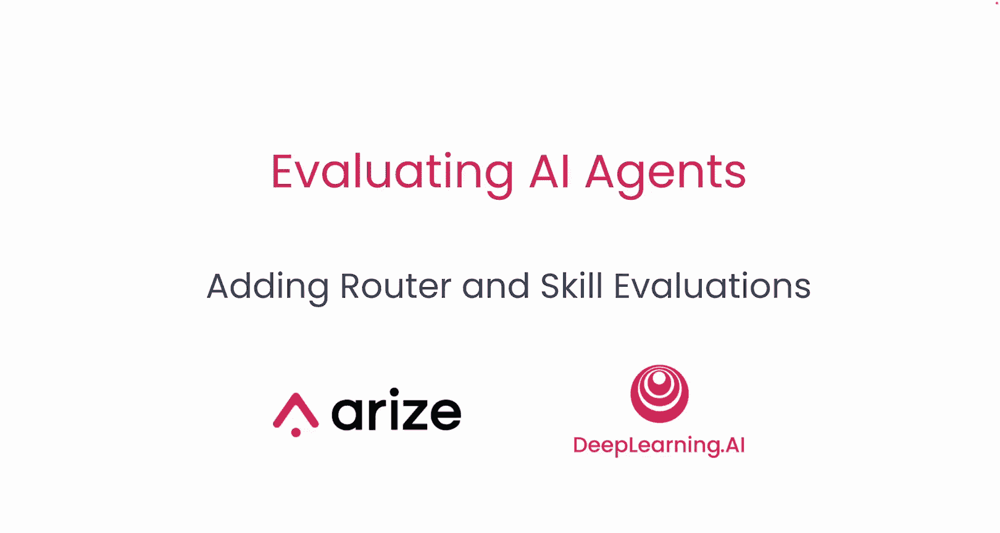
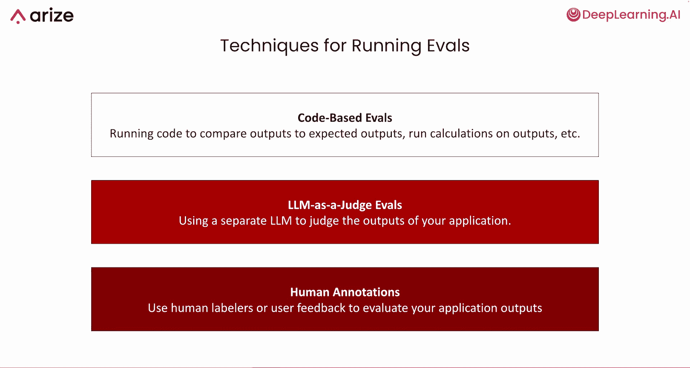
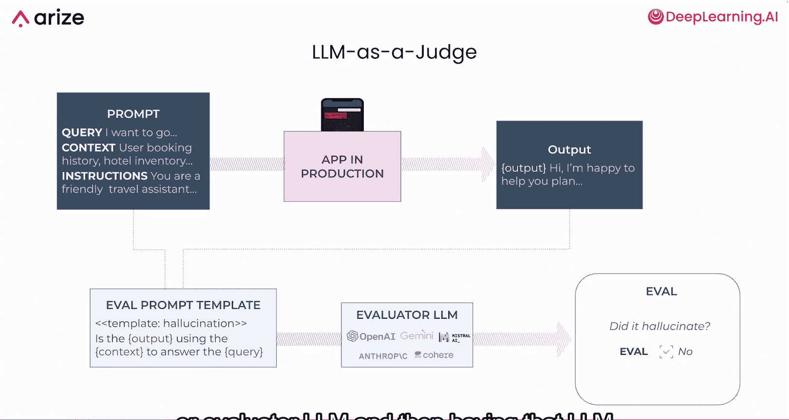
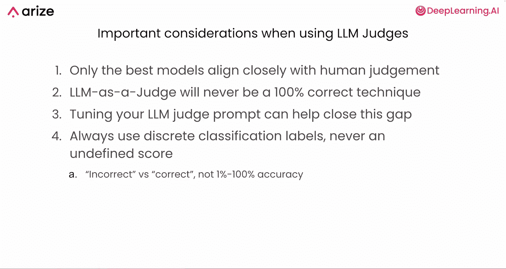
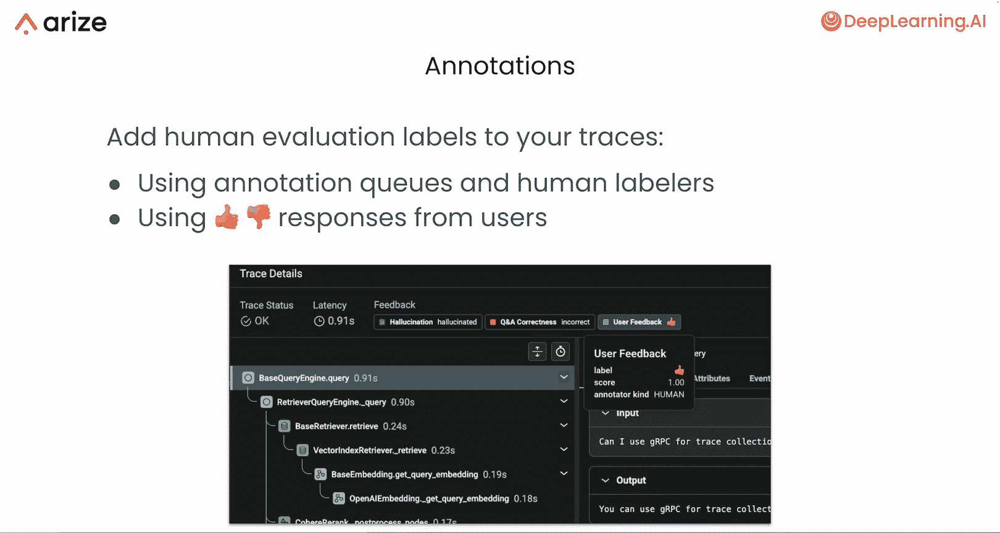
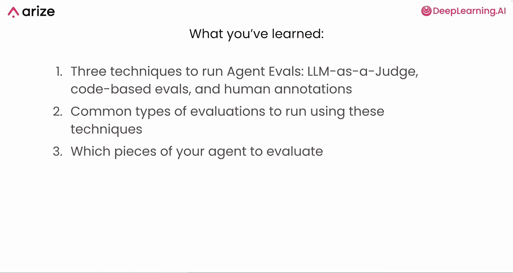

# 006：添加路由器和技能评估 🧪

在本节课中，我们将学习如何评估 AI 代理。我们将重点关注评估代理的各个技能，以及路由器根据用户请求选择正确工具并正确执行的能力。我们将介绍三种主要的评估技术：基于代码的评估、LLM 作为评判者以及人工标注。最后，我们将学习如何将这些评估技术应用到代理的不同组成部分上。

## 三种主要的评估技术

上一节我们介绍了评估的重要性，本节中我们来看看三种核心的评估技术。每种技术都可用于评估代理的不同部分，同时也适用于更传统的 LLM 应用。

以下是三种主要的评估技术：

1.  **基于代码的评估**：这是最简单、最类似于传统软件集成测试的评估方法。
2.  **LLM 作为评判者**：使用另一个 LLM 来评判应用程序的输出。
3.  **人工标注**：由人类评估者或最终用户提供反馈和标签。

## 基于代码的评估

基于代码的评估涉及对应用程序的输出运行某种代码检查。这种方法通常用于检查输出是否符合特定规则或与预期结果进行比较。

以下是基于代码的评估的常见示例：

*   **正则表达式匹配**：检查响应是否只包含数字或非字母数字字符。例如，使用 `re.match(r'^\d+$', response)` 来验证响应是否为纯数字。
*   **JSON 可解析性**：确保响应是有效的 JSON 格式。例如，使用 `json.loads(response)` 来尝试解析。
*   **关键词检查**：确保聊天机器人的响应不包含某些特定词汇，例如竞争对手的名称。
*   **与预期输出比较**：如果有输入对应的真实预期输出，可以直接比较，或使用余弦相似度等指标进行语义匹配。例如，计算 `cosine_similarity(actual_output_embedding, expected_output_embedding)`。

## LLM 作为评判者

LLM 作为评判者，顾名思义，是使用一个独立的 LLM 来评估你的应用程序的输出。其核心流程是：收集一次应用程序运行的输入、输出及其他关键信息，构建一个独立的提示词来评估特定标准，然后将该提示词发送给作为评判者的 LLM，由该 LLM 对响应给出特定维度的标签。

例如，在评估 RAG 系统中检索到的文档相关性时，流程如下：

1.  输入：用户查询和为该查询检索到的文档。
2.  构建评判提示词模板，询问“这些检索到的参考文档与用户的问题相关吗？”
3.  独立的评判 LLM 输出标签：“相关”或“不相关”。

使用 LLM 作为评判者时，需要注意以下几点：

*   **模型选择**：通常需要使用 GPT-4、Claude 3.5 Sonnet 等高性能模型，它们的判断才更接近人类。
*   **非 100% 准确**：LLM 作为评判者永远不会是 100% 准确或完全确定性的，总会存在误差。
*   **使用离散分类标签**：在设置 LLM 评判者的输出时，应始终使用离散的分类标签（如“正确/错误”、“相关/不相关”），而不是模糊的分数（如“在 1 到 100 的范围内打分”）。因为 LLM 难以精确区分 83 分和 79 分的细微差别。

## 人工标注

人工标注是指利用人工来评估应用程序的输出。主要有两种方式：

1.  **构建标注队列**：使用 Phoenix 等可观测性平台，收集大量应用程序的运行记录，构建一个待标注队列，然后由人工标注员逐一审查并给出反馈或判断。
2.  **收集最终用户反馈**：在应用程序中集成反馈机制，例如“点赞/点踩”按钮，让用户直接评价 LLM 系统的回复质量。

## 如何选择合适的评估技术

了解了这些技术后，如何为特定的评估任务选择合适的方法呢？可以从以下两个角度考虑：

1.  **评估指标的定性 vs. 定量程度**：
    *   如果要评估总结的质量或分析的清晰度等**定性指标**，很难用代码进行量化测量，此时更适合依赖 **LLM 作为评判者**或**人工标注**。
    *   如果要评估输出是否匹配某个正则表达式等**可明确定义的、刚性的指标**，则**基于代码的评估**会更有效。
2.  **对准确性的要求**：
    *   如果需要 **100% 的准确性**，则必须依赖**人工标注**或**基于代码的评估**。
    *   如果可以接受**低于 100% 的准确性**，则可以使用 **LLM 作为评判者**。

人工标注在理论上是最佳选择（灵活且确定），但在实践中难以大规模实施，因为它是一个劳动密集型过程。依赖最终用户反馈则可能存在选择偏差。因此，通常不建议将其作为大规模评估的主要技术。

## 评估代理的组成部分：路由器和技能

现在，我们将学习如何将这些评估技术应用到代理的具体组成部分上。本节课重点评估**路由器**和**技能**。

### 评估路由器

路由器通常从两个方面进行评估：

1.  **函数调用选择**：路由器是否选择了正确的函数进行调用？
2.  **参数提取**：路由器在选定函数后，是否从用户问题中正确提取了参数并传递给该函数？

评估路由器的一种有效方法是使用 **LLM 作为评判者**。你需要构建一个提示词模板，其中包含：
*   给评判 LLM 的指令。
*   用户的问题和实际选择的工具调用。
*   要求 LLM 以“正确”或“错误”等单个词语回应。
*   对“正确”和“错误”含义的详细说明。
*   所有可能被调用的工具的定义信息，以便评判 LLM 了解所有选项。

**示例分析**：
*   用户问：“你能帮我查看订单号 1234 的状态吗？”
*   代理：调用 `check_order_status` 函数，并提取参数 `order_number: 1234`。✅ **函数调用和参数提取均正确**。
*   用户接着问：“好的，它什么时候能到？”
*   代理：调用 `check_shipping_status` 函数，但错误地将 `1234` 作为 `shipping_tracking_id` 参数传递。❌ **函数调用正确，但参数提取失败**（订单号不是物流跟踪号）。

### 评估技能

技能本质上是封装成代理可调用形式的其他 LLM 应用或软件应用（如 API 调用）。因此，评估技能的技术与评估标准软件或 LLM 应用的技术相同。

你可以使用以下技术评估技能：

*   **LLM 作为评判者**：评估相关性、幻觉、问答正确性、生成代码的可读性、总结质量等。
*   **基于代码的评估**：评估正则表达式匹配、响应 JSON 可解析性、与真实数据的对比等。

**以示例代理中的三个技能为例**：

1.  **数据库查询技能**：可以使用 **LLM 作为评判者**或**基于代码的评估**来检查生成的 SQL 是否正确。
2.  **数据分析技能**：可以使用 **LLM 作为评判者**来评估分析的清晰度，并确保分析中提到的所有实体都与输入数据或其他数据部分匹配。
3.  **数据可视化代码生成技能**：可以使用**基于代码的评估**来确保生成的代码是可运行的。

**关于 SQL 生成正确性的评估**：
你可以选择两种方式：
*   **LLM 作为评判者**：让 LLM 判断生成的 SQL 是否正确。
*   **基于代码的评估**：将生成的 SQL 与真实 SQL 进行比较，或者将 SQL 执行的结果与真实数据进行比较。

## 总结

在本节课中，我们一起学习了三种运行代理评估的技术：**LLM 作为评判者**、**基于代码的评估**和**人工标注**。我们还了解了使用每种技术的常见评估类型，并最终明确了应将哪些技术应用于代理的哪些部分（路由器和技能）进行评估。

在接下来的实践中，你将应用 LLM 作为评判者和基于代码的评估，详细了解它们如何与你的示例代理协同工作。