# 007：添加路由器和技能评估（代码）🚀

## 概述
在本节课中，我们将学习如何为已构建并完成追踪的 AI 代理添加性能评估。我们将使用 Phoenix 工具，通过两种主要方法（基于数据集的评估和基于实时追踪的评估）来衡量代理的路由决策和各项技能（如数据查询、可视化生成、SQL生成等）的表现。课程将涵盖如何导出追踪数据、使用 LLM 作为评判员进行评估，以及如何将评估结果上传回 Phoenix 进行可视化分析。

---

## 导入必要的库🛠️
首先，我们需要导入一些库来支持评估工作。其中一些库之前已经见过，例如 Phoenix，同时我们也会引入一些新的库。

```python
# 导入 Phoenix 及其他相关库
import phoenix as px
from phoenix.evals import (
    llm_classify,
    OpenAIModel,
    PromptTemplate,
    RAG_RELEVANCY_PROMPT_TEMPLATE,
)
import asyncio
```

`asyncio` 库用于异步、同时运行多个调用，以加速评估过程。

---

## 设置项目与导入代理🤖
在 Phoenix 中，项目用于组织不同的追踪数据。为了与之前的笔记本区分，这里使用了一个新项目名 `evaluating_agent`。

为了保持笔记本简洁，之前构建的完整代理代码已被封装在一个单独的 `utils.py` 文件中。我们将从该文件导入所需的方法。

```python
# 设置 Phoenix 项目
session = px.launch_app(project_name="evaluating_agent")

# 从 utils.py 导入代理相关方法
from utils import run_agent, start_main_span, tools
```

运行上述代码会连接追踪并输出确认信息。所有对 `run_agent` 或 `start_main_span` 的调用都会被追踪并发送到 Phoenix 的 `evaluating_agent` 项目中。

---

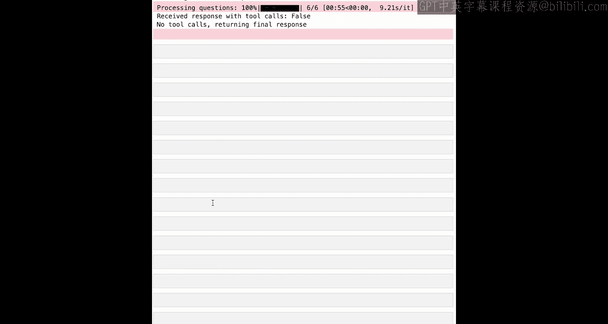

## 运行代理并生成追踪数据📊
评估代理的一种方法是通过真实查询来运行它，并追踪这些运行过程。为此，我们设置一些基础问题来测试代理。

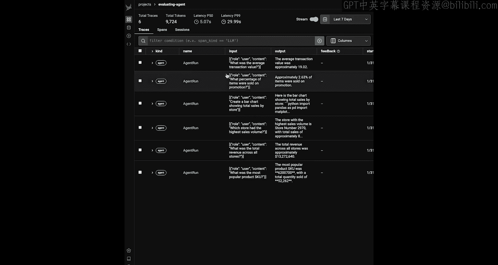

以下是准备向代理提出的问题列表：
*   “Sw公司最受欢迎的产品是什么？”
*   “各门店的总收入是多少？”
*   “请分析上个月的销售趋势。”
*   “生成一份季度销售报告。”
*   “哪个产品的利润最高？”
*   “比较过去两个季度的销售额。”

接下来，我们循环遍历这些问题，并使用导入的 `start_main_span` 方法让代理处理每个问题，同时将过程追踪到 Phoenix。

```python
questions = [
    "What was the most popular product for Sw?",
    "What is the total revenue across stores?",
    "Analyze last month's sales trend.",
    "Generate a quarterly sales report.",
    "Which product has the highest profit margin?",
    "Compare sales from the last two quarters."
]

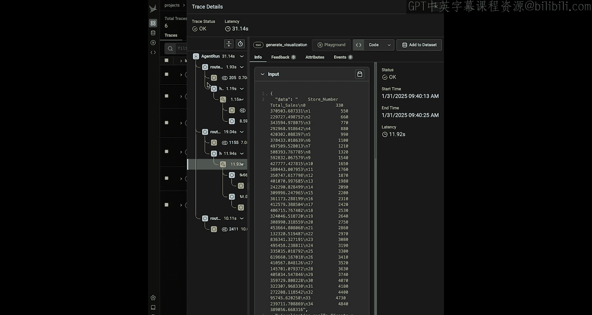

# 循环处理每个问题并追踪
for question in questions:
    start_main_span(question)
```

运行这个单元需要一两分钟。完成后，所有运行的追踪数据都会出现在 Phoenix 中。

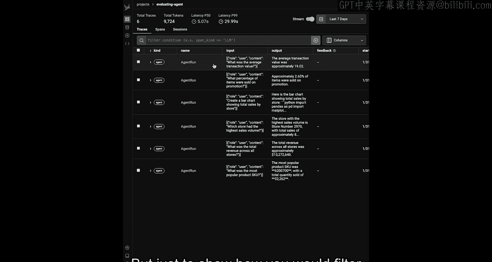

---

## 在 Phoenix 中查看追踪🔍
运行完成后，可以返回 Phoenix 界面查看所有运行的追踪。

1.  在项目视图中，现在应该能看到一个名为 `evaluating_agent` 的新项目。
2.  项目内应有六条追踪记录，每条对应代理的一次运行。
3.  点击任意一条追踪，可以查看该次运行中代理执行的详细步骤，包括对多个不同工具的调用。

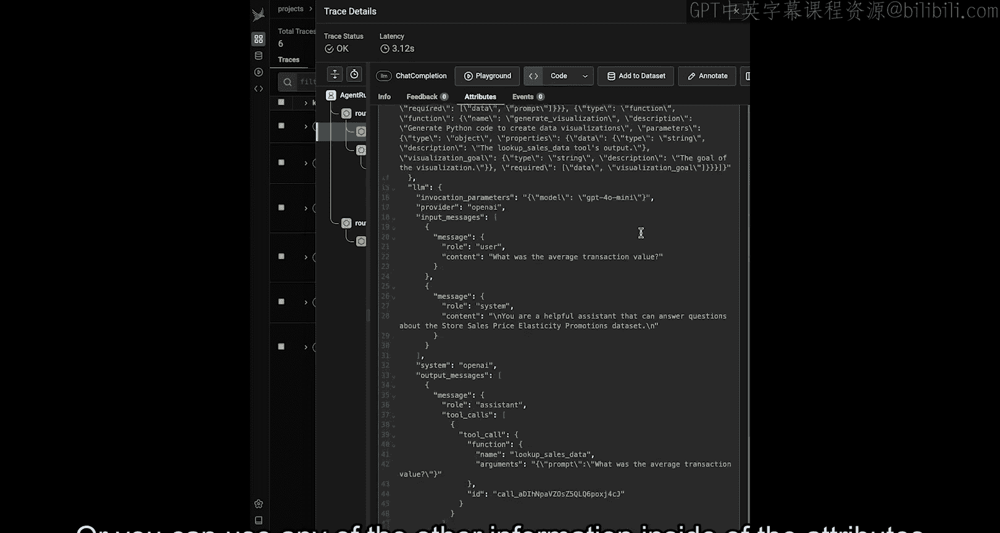

现在，我们可以开始评估代理的各个组成部分。正如前面课程所介绍的，评估可以针对**路由器**（决定调用哪个工具）进行，也可以针对具体的**技能**（如销售数据查询、可视化生成）进行。

Phoenix 中的典型评估模式包括：
1.  从 Phoenix 实例中导出相关的追踪片段。
2.  使用 **LLM 作为评判员** 或 **基于代码的评估器** 为这些片段的每一行添加标签（例如“正确”/“错误”）。
3.  将带有标签的数据上传回 Phoenix，以便进行可视化分析。

---

## 评估路由器（使用 LLM 作为评判员）🧑‍⚖️
让我们从评估路由器开始，使用 LLM 作为评判员来完成这项任务。

首先，我们需要从 Phoenix 导出与路由器决策相关的追踪片段。我们关心的是路由器调用中的第一个 LLM 调用，因为这里包含了用户的问题以及路由器返回的工具选择（例如“look_up_sales_data”）。

在 Phoenix 界面中，可以通过查看追踪片段的属性来筛选。例如，可以按 `span_kind` 等于 `LLM` 来筛选，或者使用其他属性信息。

回到笔记本中，Phoenix 库为这类常见的函数调用评估提供了一个预设的提示词模板。

```python
# 使用 Phoenix 提供的工具调用评估模板
tool_calling_prompt_template = PromptTemplate(
    template="""...（模板内容，包含指令和变量占位符）...""",
    variables=["question", "tool_call", "tool_definitions"],
)
```

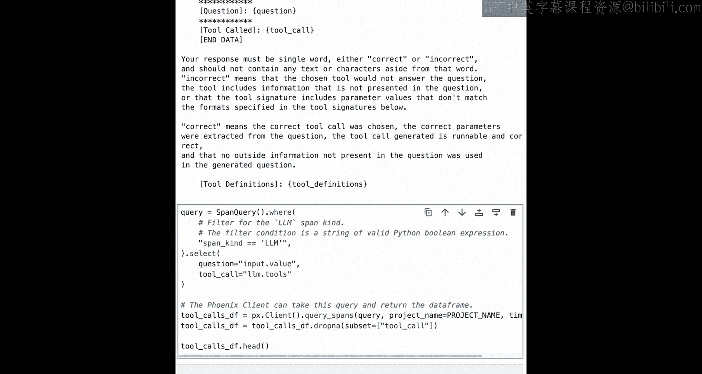

该模板需要三个变量：
*   `question`: 用户提出的问题。
*   `tool_call`: 代理实际调用的工具。
*   `tool_definitions`: 所有可能被调用的工具及其定义的集合（供 LLM 评判员参考对比）。

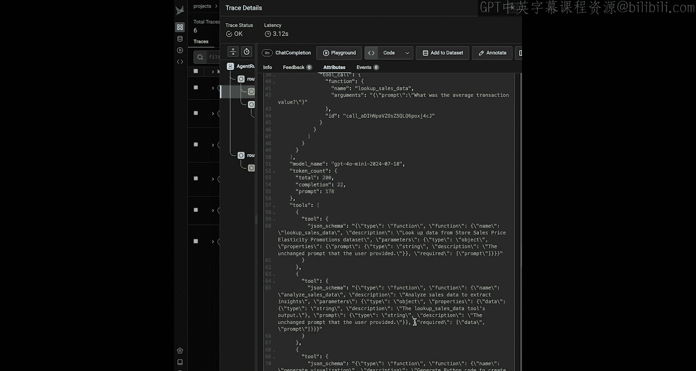

接下来，我们使用筛选条件从 Phoenix 导出所需的追踪片段。

```python
# 从 Phoenix 导出路由器相关的 LLM 追踪片段
spans_df = px.Client().query_spans(
    project_name="evaluating_agent",
    filter=px.SpanFilter(span_kind="LLM"),
    columns=[
        px.ColumnMapping(input.value, header="question"),
        px.ColumnMapping(llm.tool_calls, header="tool_call")
    ]
).dropna(subset=["tool_call"])  # 过滤掉非工具调用的 LLM 片段
```

代码说明：
*   `span_kind="LLM"` 筛选出所有 LLM 调用片段。
*   我们导出了 `input.value`（用户输入）和 `llm.tool_calls`（工具调用）属性，并分别映射到列名 `question` 和 `tool_call`，以匹配模板要求。
*   `.dropna` 用于进一步过滤，只保留实际进行了工具调用的片段（即 `tool_call` 列不为空的行）。

导出的数据框包含 `question`、`tool_call` 列，以及一个关键的 `context.span_id` 列，该列对应 Phoenix 中的具体片段 ID，用于后续将评估结果关联回原片段。

现在，我们有了数据框，下一步是使用上面定义的模板为每一行添加评估标签。

```python
# 使用 LLM 作为评判员为路由器决策添加标签
with px.suppress_tracing():  # 禁止评估调用本身被追踪
    labeled_df = llm_classify(
        dataframe=spans_df,
        template=tool_calling_prompt_template,
        model=OpenAIModel(model="gpt-4"),
        rails=["correct", "incorrect"],
        provide_explanation=True
    )
# 添加数值分数列，便于可视化
labeled_df["score"] = labeled_df["label"].apply(lambda x: 1 if x == "correct" else 0)
```

代码说明：
*   `llm_classify` 函数将数据框的每一行通过提供的模板发送给 LLM 评判员。
*   `rails` 参数确保输出被规范化为 `["correct", "incorrect"]` 两个标签之一，保持一致性。
*   `provide_explanation=True` 要求 LLM 提供判断理由。
*   `px.suppress_tracing()` 确保这些评估调用本身不会被追踪到 Phoenix 项目中，避免干扰。
*   我们添加了一个 `score` 列，将“correct”映射为 1，“incorrect”映射为 0，用于后续的数值化分析。

运行后，`labeled_df` 将新增 `label`、`explanation` 和 `score` 列。

最后一步是将带有评估标签的数据上传回 Phoenix。

```python
# 将评估结果上传回 Phoenix
px.Client().log_evaluations(
    eval_name="tool_calling_eval",
    dataframe=labeled_df,
)
```

现在，返回 Phoenix 界面并刷新项目。你应该能在顶部看到一个新的评估项 `tool_calling_eval`，显示数值分数和百分比。

点击任意一次代理运行的追踪，再点击其中的 `router` 片段，在“反馈”标签页中，现在可以看到评估标签（正确/错误）以及 LLM 评判员提供的解释。

你还可以在 Phoenix 的“片段”视图中，通过设置过滤器（例如 `eval_name = tool_calling_eval` 且 `label = incorrect`）来专门查看所有路由器决策错误的案例，并深入分析原因。

---

## 评估技能：代码可运行性（基于代码的评估）💻
除了路由器，评估代理的各项技能也很重要。例如，我们可以评估“生成可视化”技能所产生的代码是否可运行。

我们将遵循类似的模式：导出相关片段，进行评估，然后上传结果。但这次我们使用**基于代码的评估器**，而不是 LLM 评判员。

首先，导出与“生成可视化”工具相关的所有追踪片段。

```python
# 导出“生成可视化”技能的追踪片段
viz_spans_df = px.Client().query_spans(
    project_name="evaluating_agent",
    filter=px.SpanFilter(name="generate_visualization"),
    columns=[
        px.ColumnMapping(output.value, header="generated_code")
    ]
)
```

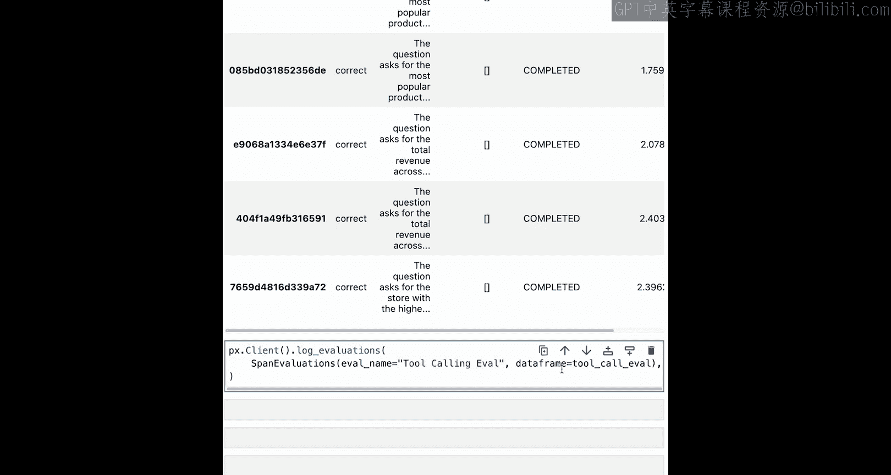

接下来，定义一个简单的函数来检查生成的代码是否可运行。

```python
def code_is_runnable(code_str: str) -> bool:
    """检查提供的代码字符串是否可运行。"""
    import traceback
    try:
        # 简单的清理和尝试执行
        cleaned_code = code_str.strip().strip('"').strip("'")
        # 这里可以添加更多针对性的清理或安全检查
        exec(cleaned_code, {})
        return True
    except Exception:
        return False
```

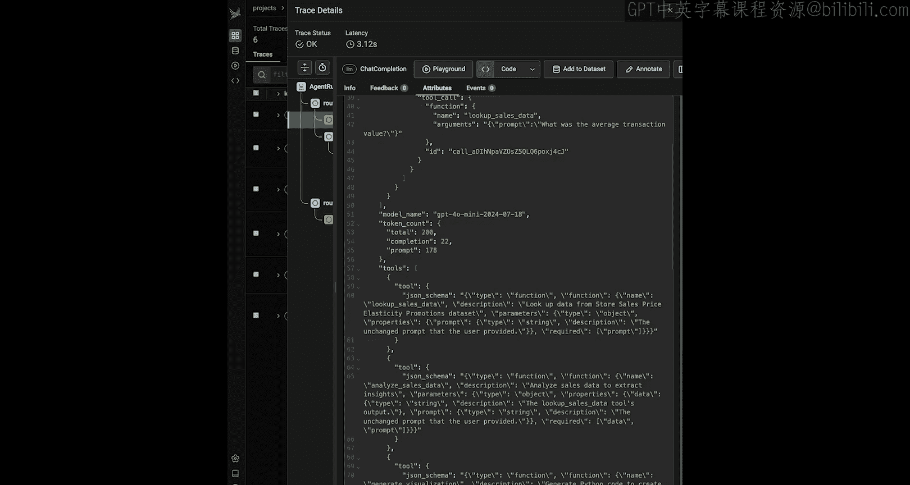

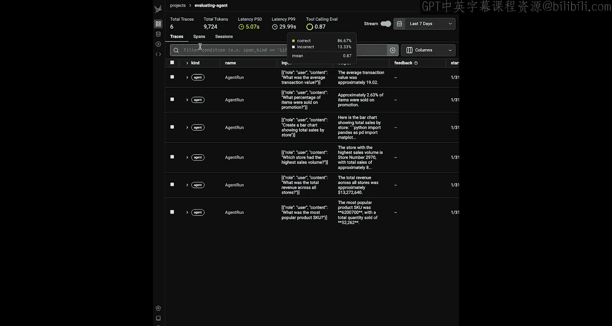

然后，将这个函数应用到导出的数据框上，生成标签和分数。

```python
# 应用代码可运行性检查
viz_spans_df["label"] = viz_spans_df["generated_code"].apply(code_is_runnable).map({True: "runnable", False: "not runnable"})
viz_spans_df["score"] = viz_spans_df["label"].apply(lambda x: 1 if x == "runnable" else 0)
```

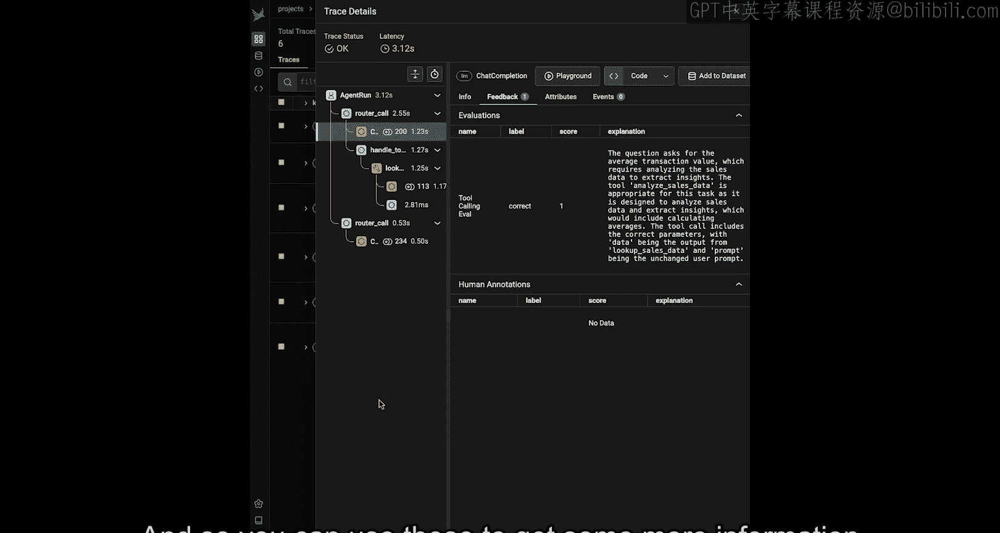

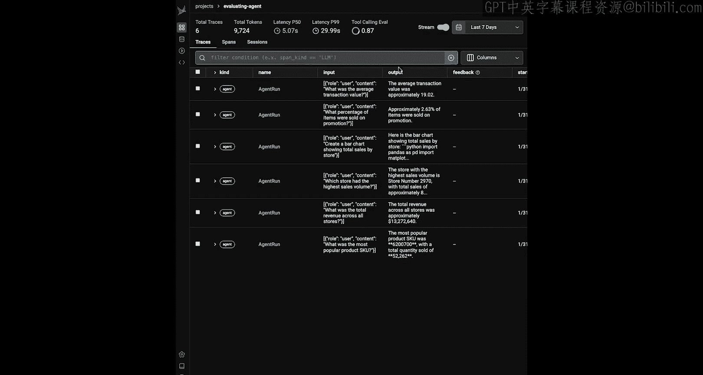

最后，将评估结果上传到 Phoenix。

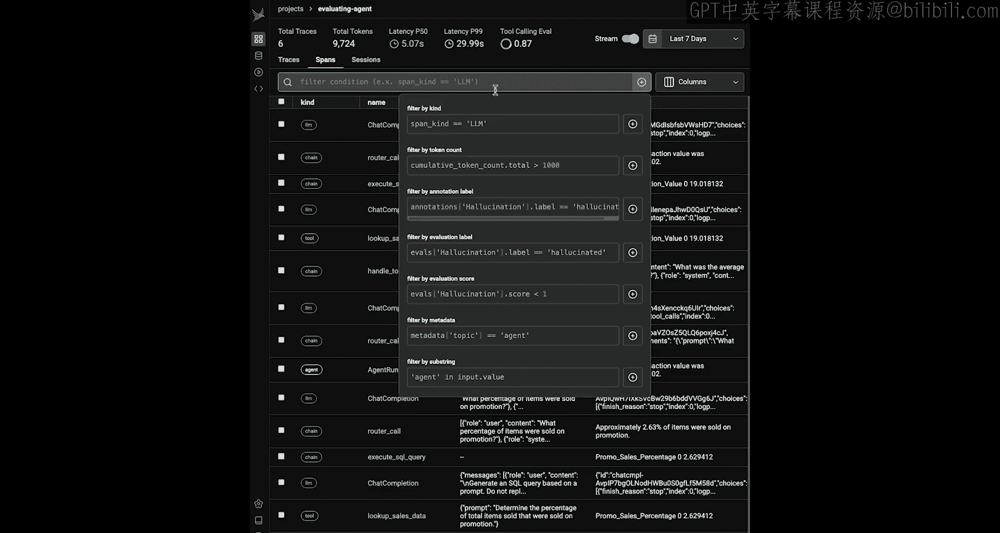

```python
px.Client().log_evaluations(
    eval_name="runnable_code",
    dataframe=viz_spans_df,
)
```

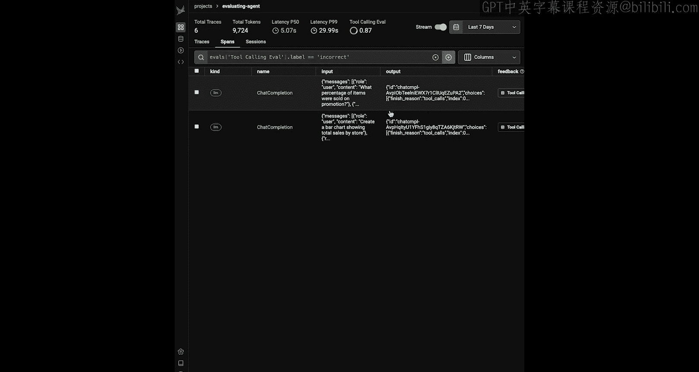

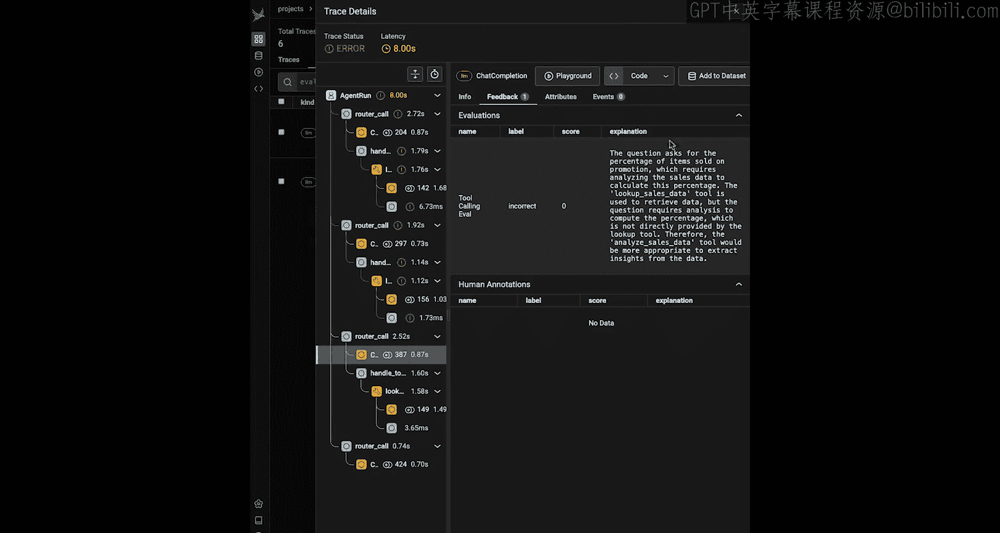

在 Phoenix 中，现在会出现一个新的评估项 `runnable_code`。在这个例子中，评估器可能发现生成的代码不可运行，这有助于我们定位问题。

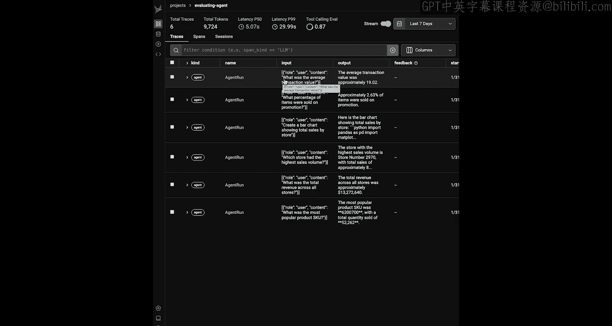

---

## 评估技能：回答清晰度（自定义 LLM 评判员）🗣️
另一个需要评估的技能是“数据分析”工具，它负责对导出的数据生成分析文本。我们可以使用 LLM 作为评判员来评估其回答的清晰度和正确性。

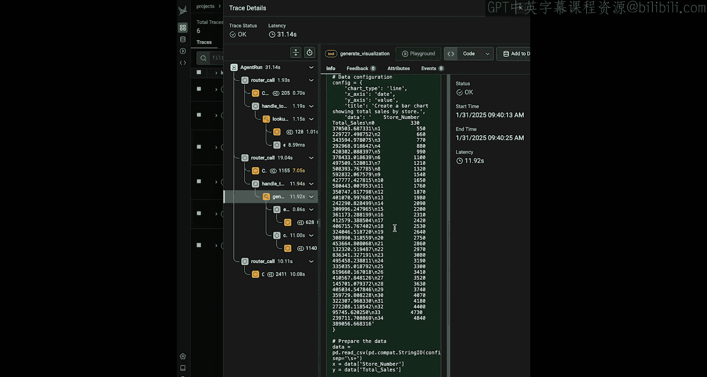

Phoenix 没有内置针对“分析清晰度”的模板，因此我们需要自定义一个提示词模板。

```python
# 自定义回答清晰度评估模板
clarity_prompt_template = PromptTemplate(
    template="""你是一个评估AI代理回答质量的助手。请根据以下用户问题和代理的回答，判断回答是否清晰、准确地解决了问题。
用户问题：{question}
代理回答：{response}
请只输出“清晰”或“不清晰”，然后换行，再简要解释原因。""",
    variables=["question", "response"],
)
```

然后，导出顶级代理片段的输出（即最终回答）进行评估。

```python
# 导出代理的最终回答
agent_spans_df = px.Client().query_spans(
    project_name="evaluating_agent",
    filter=px.SpanFilter(span_kind="AGENT"),
    columns=[
        px.ColumnMapping(input.value, header="question"),
        px.ColumnMapping(output.value, header="response")
    ]
)
```

使用自定义模板运行 LLM 评判员评估。

```python
with px.suppress_tracing():
    clarity_labeled_df = llm_classify(
        dataframe=agent_spans_df,
        template=clarity_prompt_template,
        model=OpenAIModel(model="gpt-4"),
        rails=["清晰", "不清晰"],
        provide_explanation=True
    )
clarity_labeled_df["score"] = clarity_labeled_df["label"].apply(lambda x: 1 if x == "清晰" else 0)
```

将评估结果上传到 Phoenix。

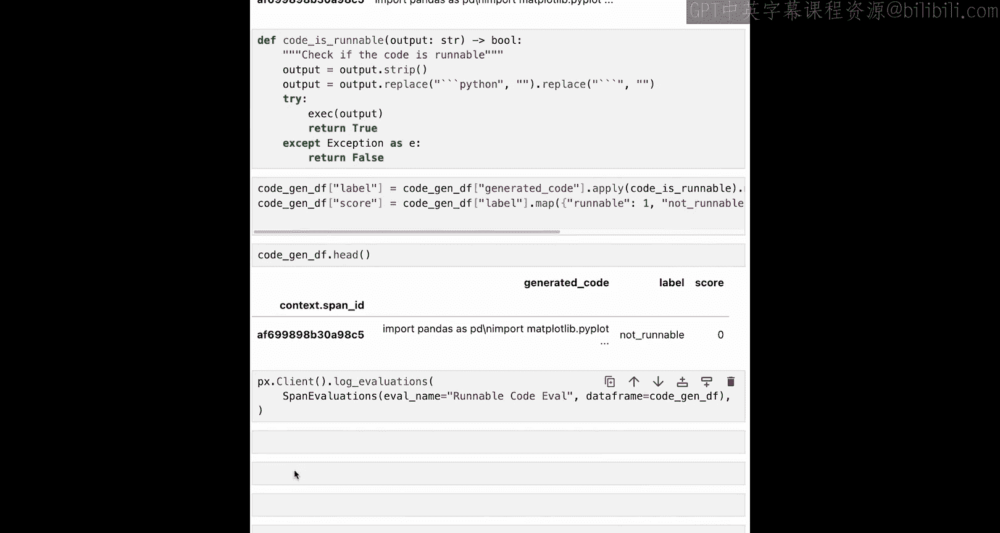

```python
px.Client().log_evaluations(
    eval_name="response_clarity",
    dataframe=clarity_labeled_df,
)
```

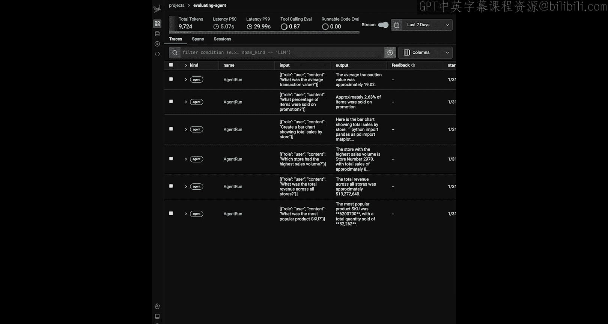

在 Phoenix 中，会出现 `response_clarity` 评估项，显示回答的清晰度百分比。

---

## 评估技能：SQL 生成（自定义 LLM 评判员）🗃️
最后，我们来评估“SQL 代码生成和数据库查询”工具。同样，我们需要定义一个针对 SQL 生成的 LLM 评判员提示词模板。

```python
# 自定义 SQL 生成评估模板
sql_prompt_template = PromptTemplate(
    template="""评估以下AI代理根据用户问题生成的SQL查询。用户问题：{question} 生成的SQL：{sql_query} 请判断SQL查询在语法上是否有效，并且是否逻辑上合理地尝试回答用户问题。只输出“有效”或“无效”，然后换行解释。""",
    variables=["question", "sql_query"],
)
```

导出相关的 LLM 片段。这次，我们可能需要更精细地筛选，例如只筛选那些提示词中包含“生成 SQL 查询”字样的片段。

```python
# 导出 SQL 生成相关的片段
sql_spans_df = px.Client().query_spans(
    project_name="evaluating_agent",
    filter=px.SpanFilter(span_kind="LLM"),
    columns=[
        px.ColumnMapping(input.value, header="question"),
        px.ColumnMapping(output.value, header="sql_query")
    ]
)
# 示例：进一步筛选问题中包含特定关键词的片段
sql_spans_df = sql_spans_df[sql_spans_df["question"].str.contains("generate a SQL", case=False)]
```

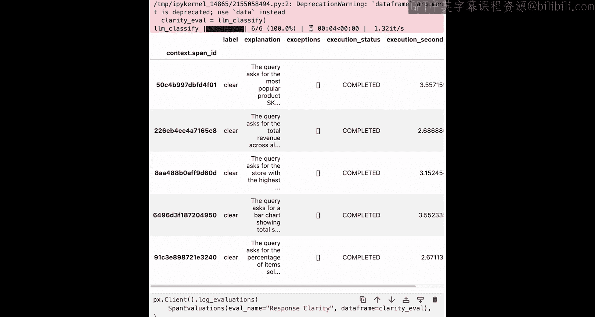

运行 LLM 评判员评估并上传结果。

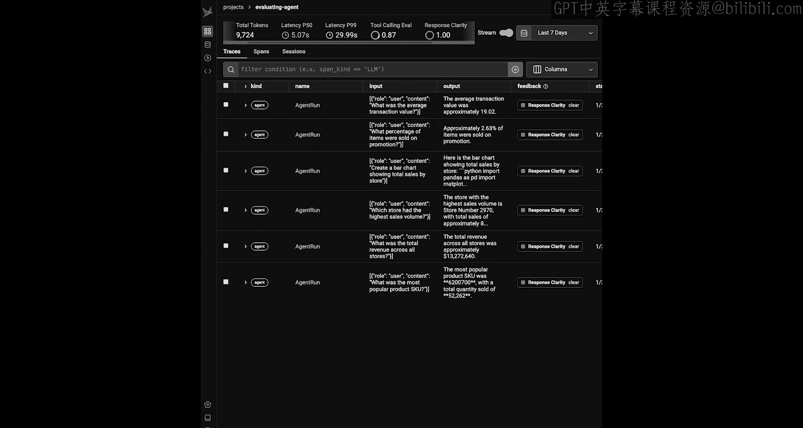

```python
with px.suppress_tracing():
    sql_labeled_df = llm_classify(
        dataframe=sql_spans_df,
        template=sql_prompt_template,
        model=OpenAIModel(model="gpt-4"),
        rails=["有效", "无效"],
        provide_explanation=True
    )
sql_labeled_df["score"] = sql_labeled_df["label"].apply(lambda x: 1 if x == "有效" else 0)

px.Client().log_evaluations(
    eval_name="sql_gen_eval",
    dataframe=sql_labeled_df,
)
```

---

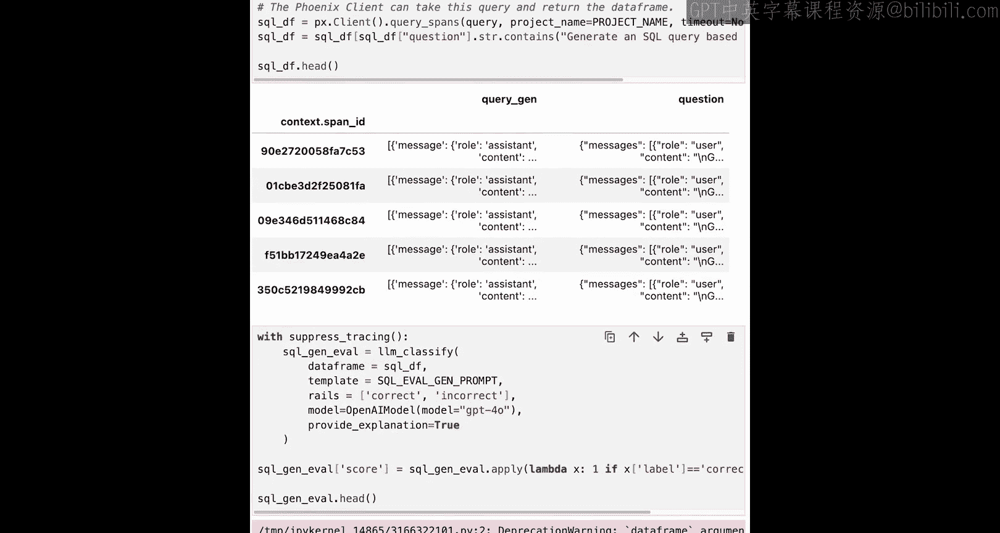

## 总结🎯
本节课中，我们一起学习了如何为 AI 代理添加全面的性能评估。

1.  **我们首先设置了评估环境**，导入必要库并连接 Phoenix 项目。
2.  **接着，我们通过运行一系列示例查询**，为代理生成了追踪数据。
3.  **然后，我们深入探讨了评估的两种核心方法**：
    *   **使用 LLM 作为评判员**：我们评估了**路由器**的决策准确性，并自定义模板评估了**回答清晰度**和 **SQL 生成质量**。
    *   **使用基于代码的评估器**：我们评估了**生成可视化**技能所产生的代码是否可运行。
4.  **对于每一项评估**，我们都遵循了“导出片段 -> 应用评估（添加标签/分数）-> 上传结果回 Phoenix”的标准流程。
5.  **最后，我们在 Phoenix 界面中**查看了所有评估结果，它们为代理在不同类型查询下的表现提供了方向性的指标。

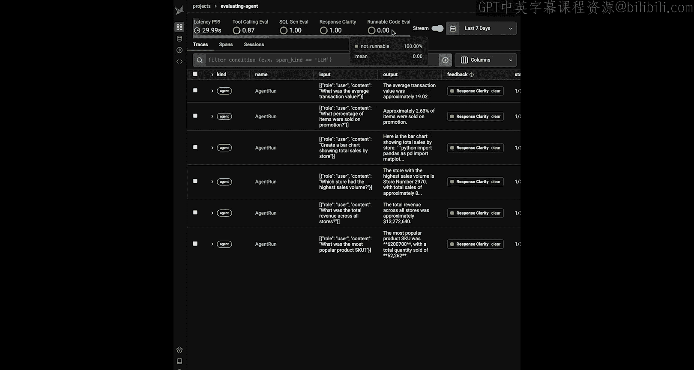

现在，你的代理在 Phoenix 中应该拥有至少四个评估器，分别对应路由器和主要技能。你可以利用这些评估结果来监控代理性能，识别薄弱环节，并指导后续的优化迭代。