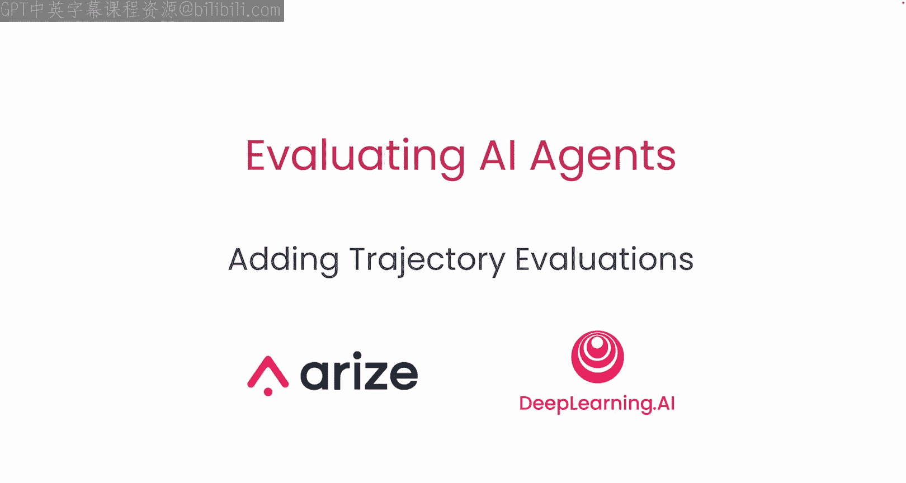
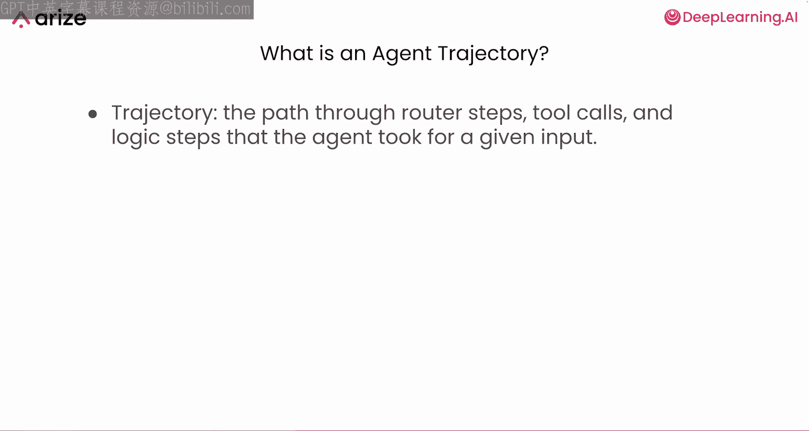
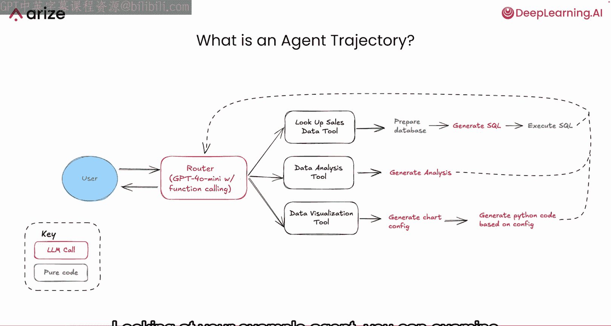
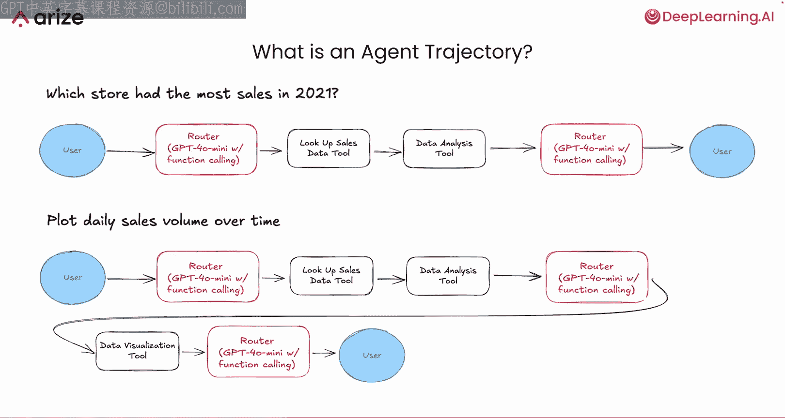
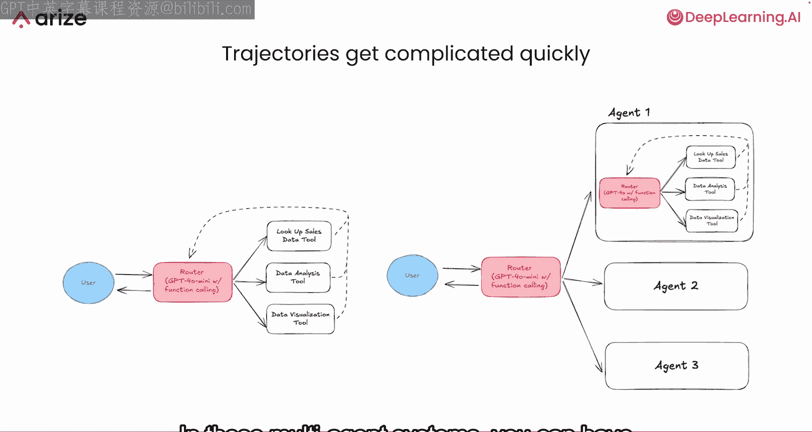
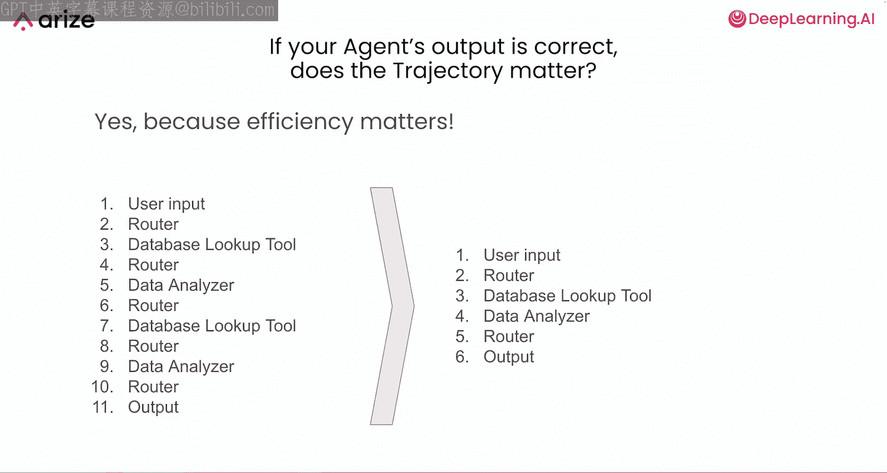
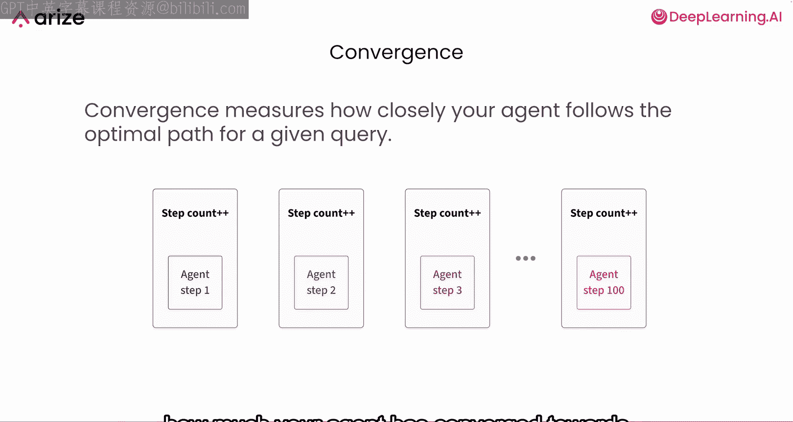
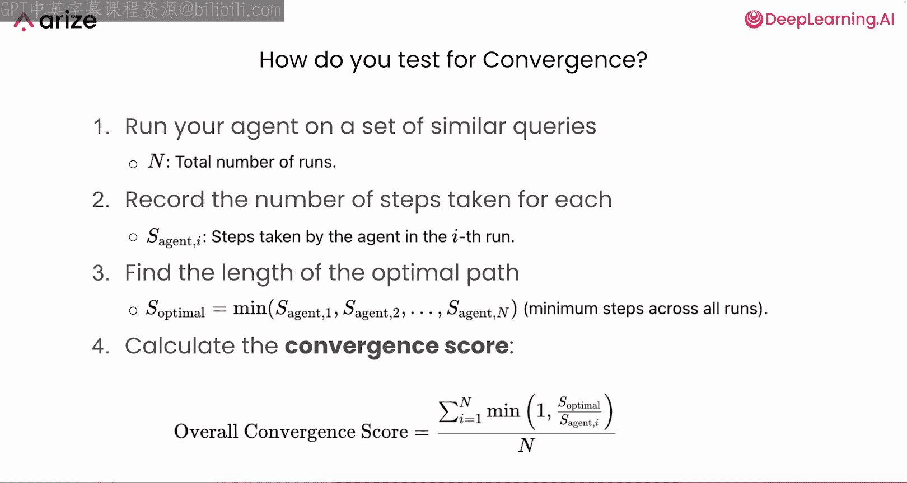
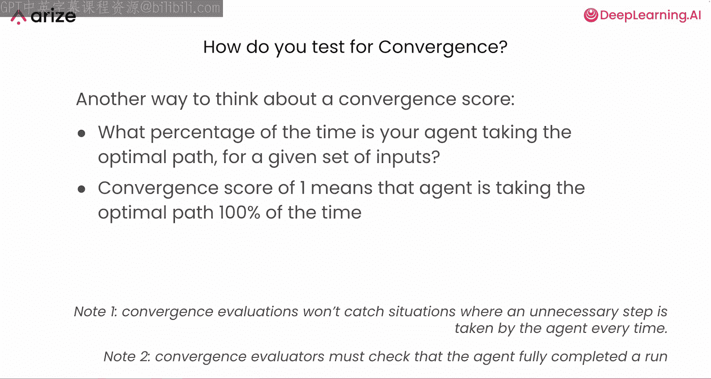
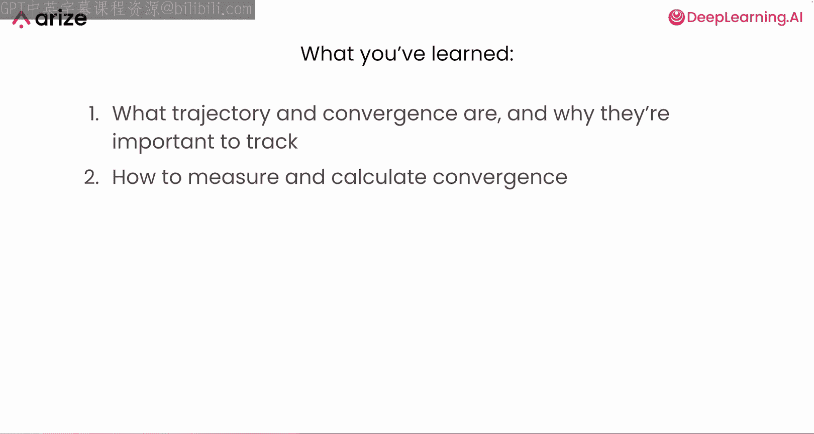

# 008：添加轨迹评估 🛤️

在本节课中，我们将学习如何评估 AI 代理的执行效率。除了测试代理的技能和路由能力，我们还需要确保代理能以高效的步骤数响应用户查询。我们将通过计算**收敛分数**来实现这一评估。

## 什么是代理轨迹？

上一节我们介绍了代理的基本能力评估，本节中我们来看看如何衡量其执行效率。首先，我们需要理解一个核心概念：**代理轨迹**。

代理轨迹是指代理为处理特定输入，在不同路由器、工具和其他逻辑步骤之间所采取的路径。

以下通过你的示例代理来理解几种不同的轨迹：

*   **简单轨迹**：对于查询“2021年哪家店铺销售额最高？”，代理的路径是：用户 → 路由器 → 查询销售数据工具 & 数据分析工具 → 路由器 → 用户。这里需要注意，该代理架构允许路由器在一步中调用多个工具。
*   **复杂轨迹**：对于查询“绘制销售额随时间变化的图表”，代理的路径是：用户 → 路由器 → 查询销售数据工具 & 数据分析工具 → 路由器 → 数据可视化工具 → 路由器 → 用户。

目前这些轨迹看起来还算简单，但可以想象，轨迹的复杂度会迅速增加。生产环境中的代理可能拥有10、20甚至30个不同的工具。有些系统还会组合多个代理协同工作，在这些多代理系统中，轨迹会变得非常非常复杂。

## 为什么轨迹很重要？

你可能会问，如果代理的输出是正确的，轨迹真的那么重要吗？答案是肯定的，因为**效率至关重要**。

在某些用例中，例如业余项目或研究，代理的效率可能无关紧要。但对于大多数生产环境或现实世界的代理，一定的效率是必要的。如果能用6步而非11步回答用户的问题，就意味着更少的大语言模型调用、更低的变异性、更低的成本以及更低的用户延迟。

## 如何衡量轨迹效率？

那么，如何跟踪和衡量轨迹呢？一种方法是使用一个称为**收敛**的工具。

收敛是衡量代理在给定查询下遵循最优路径的紧密程度的指标。你可以将其理解为，代理针对某类查询收敛到最优路径的程度。

### 如何进行收敛测试？

以下是测试收敛性的一种技术：

1.  **运行相似查询**：让代理运行一组相似的查询。例如，可以是一系列要求代理“获取2021年11月的销售数据，然后基于该数据构建不同图表或可视化”的问题。这些查询需要足够相似，以使代理在处理它们时理应采取相同的路径；同时又要足够不同，以便你能发现代理中可改进的差异点。
2.  **记录步骤数**：让代理处理每个查询，并记录每个查询所花费的步骤数。
3.  **确定最优路径长度**：找出代理处理这些查询所用的**最小步骤数**，即最优路径长度。
4.  **计算收敛分数**：利用所有这些数据计算收敛分数。收敛分数是一个数值，代表代理采取最优路径的频率。

另一种理解收敛分数的方式是：对于给定的输入集，你的代理有多大比例的时间在走最优路径？收敛分数为1意味着代理100%的时间都走最优路径，该分数始终在0到1之间。

### 运行收敛评估的注意事项

运行收敛评估时，有几点需要注意：

*   **局限性**：收敛评估通常无法捕捉代理在测试集中每个查询都执行了不必要步骤的情况。因为收敛评估中的最优路径通常是代理处理某个查询所用的最小步骤数。所以，如果所有运行都多了一个不必要的步骤，收敛评估通常无法发现。
*   **完整性**：确保只在代理**完整运行**的情况下进行收敛评估。如果你的代理执行了3步后出错，不应将其计为3步，这会扭曲收敛评估数据。

## 总结

本节课中，我们一起学习了：
1.  **代理轨迹**的含义：即代理处理查询时经过的步骤路径。
2.  跟踪和衡量轨迹**重要性**的原因：它直接影响代理的效率、成本和用户体验。
3.  衡量和计算**收敛分数**的一种方法：通过运行相似查询集，比较实际步骤数与最优步骤数，来评估代理的执行效率。

在接下来的实践中，你将具体实现这种收敛测量和评估技术。