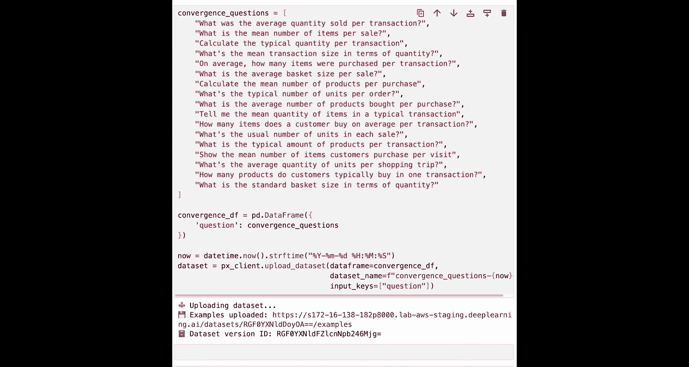
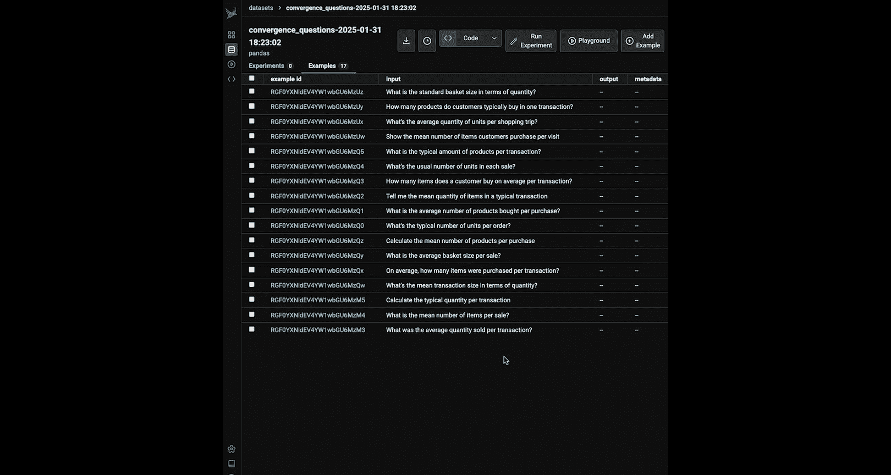
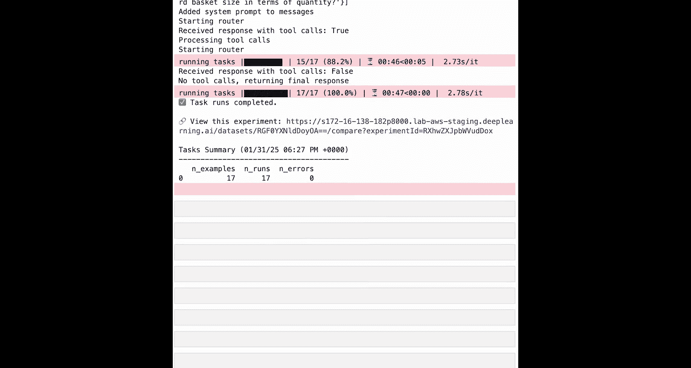
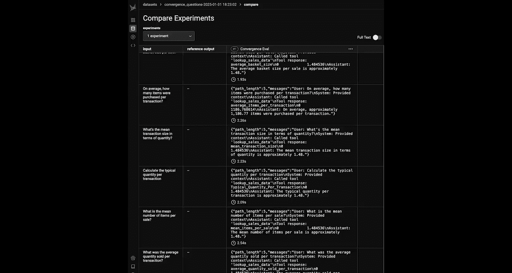
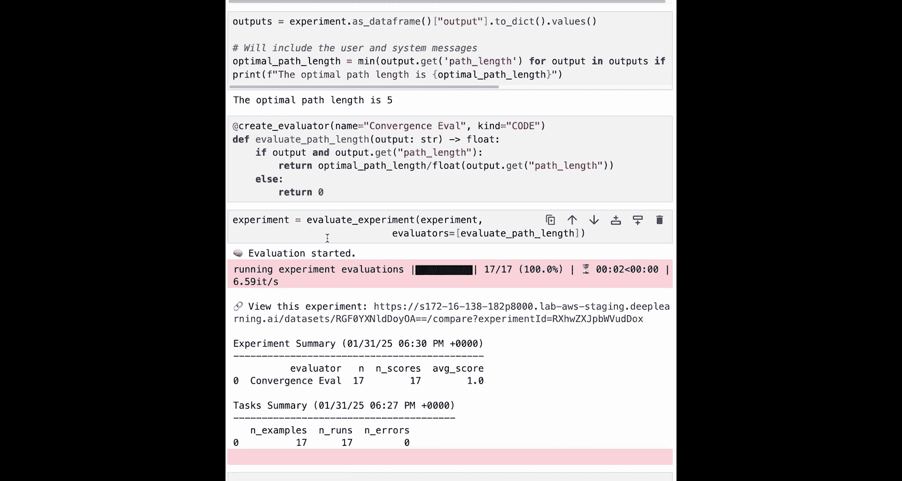
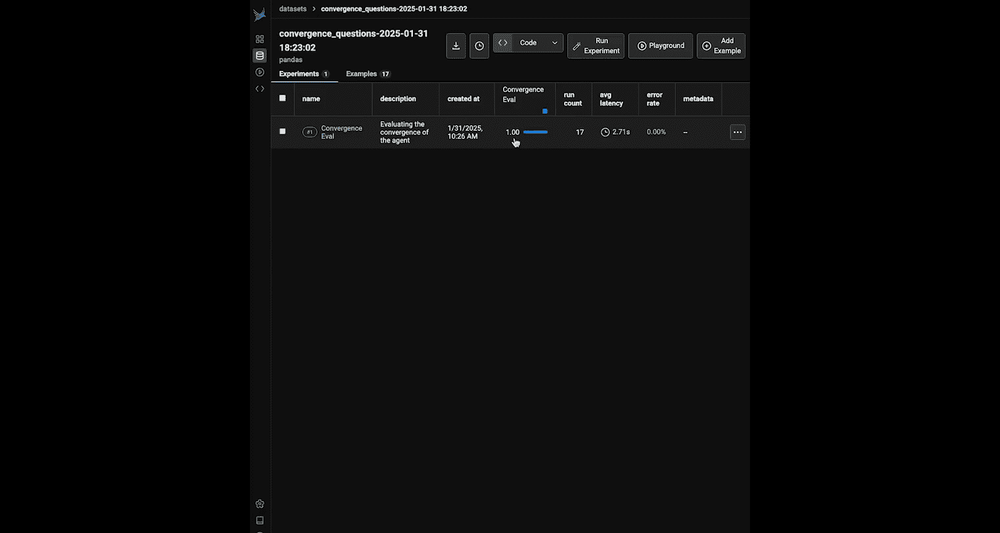

# 009：添加轨迹评估 🛤️

在本节课中，我们将学习如何评估 AI 代理的“轨迹”，即它处理查询时所采取的步骤路径。我们将使用 Phoenix 工具来运行实验，比较代理在不同查询下的表现，并计算其路径效率，以判断代理是否在高效地执行任务。

---

上一节我们介绍了如何为路由器和技能添加评估。本节中，我们来看看如何评估代理的路径，或者说，理解它是否为给定的查询采取了高效的路径。

为了实现这一点，你需要从导入一些有用的库开始。大部分是你在 Phoenix 中已经见过的，但现在你将从 Phoenix 的 `experiments` 模块中导入一些新东西，稍后你会了解它们。

以下是需要导入的库：
```python
import phoenix as px
from phoenix.experiments import run_experiment, evaluate_experiment
from phoenix.trace import create_evaluator
```
另外需要注意，代理是从你的 `Us` 方法中导入的，这意味着你一直在使用同一个代理。你导入了 `run_agent` 方法，请知晓这段代码在后台运行。

然后，你仍然需要连接到 Phoenix 客户端。在这个例子中，你只需保存这个 Phoenix 客户端变量。
```python
client = px.Client()
```

正如你在之前的幻灯片中学到的，评估轨迹的方法是：让代理运行一组查询，然后追踪每个查询所采取的步骤数。

为了在这里评估轨迹，你实际上需要将代理的多次运行结果进行比较。为此，你将使用 Phoenix 中的一个名为 `run_experiment` 的工具，它允许你运行代理的多个不同版本，并以特定方式进行比较。

这是一个很好的暂停点，让我们更深入地了解一下实验及其工作原理。

Phoenix 中的实验由几个不同的步骤组成：
1.  获取包含不同测试用例的数据集。
2.  将这些测试用例发送到特定的任务或作业中运行。
3.  评估该任务的结果。

一个测试用例数据集将包含一系列你可能通过代理运行的不同查询或问题。通常，这些示例中会有一个输入值，有时也可能有一个期望输出。在第一种情况下，你不会有期望输出，只有输入。有时你有期望输出，有时没有，这决定了你稍后可以使用的一些评估器。

你有一组示例，然后你将通过代理的一个版本来运行它们。在这个例子中，只使用代理的单一版本。你会得到该轮运行的输出，并且你会发现，你对代理做了一些微小的修改，以便在该任务中同时追踪所采取的步骤数。

你可以为实验定义任务。一旦你通过任务收集了每个示例的所有结果，你就可以将它们发送给一组评估器。这些评估器可以是你之前几轮设置的，或者在这种情况下，你可以使用更多的比较性评估器来比较代理的不同运行结果。在这种情况下，每个示例都会添加另一个变量，即该示例通过任务后的输出。

在下一课中，你也会学到更多关于实验的知识，这里只是一个入门介绍。



所以，第一步是创建一个测试用例的数据集。

你可以这样做：在这个例子中，你有一组关于“收敛性”的问题。回想一下幻灯片，测试收敛性的方法之一是：向代理发送大量相似类型查询的不同变体，然后追踪所采取的步骤数。你会注意到，这里的每个不同示例都是关于“每笔交易的平均商品数量”的。例如：“每笔交易的平均销售数量”、“每笔销售的平均商品数量”、“计算每笔交易的典型数量”。这些都是同一问题的不同变体。代理应该对每个问题采取相同的路径，但有时会有变化。



你可以获取这个问题列表，从中创建一个数据框，然后将该数据框上传到 Phoenix。这样，你就有了一个存在于 Phoenix 中的数据集。
```python
import pandas as pd

questions = [
    "What is the average quantity sold per transaction?",
    "Tell me the mean number of items per sale.",
    "Calculate the typical quantity per transaction.",
    # ... 更多变体
]
df = pd.DataFrame({"input": questions})
dataset = client.upload_dataset(df, "convergence_dataset")
```

如果你想，可以在这里快速可视化它。现在，如果你想在你的 Phoenix 窗口中查看，你可以在“数据集”标签下看到你刚刚上传的数据集条目。点击进入，你可以看到你上传的所有不同示例。

我可以使用这个数据集来开始运行实验。

对于下一步，你必须为代理定义任务。你可以直接通过这些示例运行你的代理，但同样，你希望记录所采取的步骤数，可能还需要格式化一些消息。因此，在将其设置为任务时，你也可以对代理进行微调。

在这种情况下，你将在这里做几件事：
1.  创建一个方法来格式化一些消息步骤（稍后会回来看）。
2.  在这里创建一个任务。

这个任务是 `run_agent_and_track_path`。从该任务开始，你会看到它接收一个 `example`。请记住，数据集的每一行都是一个示例。在这个例子中，它接收一个 `example` 变量，然后从中获取输入值，并对该特定示例调用 `run_agent` 方法，最后调用 `format_messages_step`。`run_agent_and_track_path` 的返回值将是代理内部消息的长度（作为路径长度）以及实际的消息对象。而这个 `format_message_step` 实际上会遍历代理日志中的所有消息，并以一种更易于阅读的方式格式化它们，你可以看到进行的工具调用，并使其更容易进行比较。

现在，你的任务已准备就绪，数据集也已定义，你可以开始一个实验了。为此，你将调用这个 `run_experiment` 方法。然后，这将接收你的数据以及你的任务（或应用于该数据集每一行的函数）。然后你可以想一个名字，在这个例子中是“Convergence Eval”，以及一个描述。



如果你现在运行它，你的数据集的每一行都将通过 `run_agent_and_track_path` 方法运行，你会得到返回结果。这需要一点时间来运行，因为它相当于运行了 17 次你的代理，所以给它一点时间来完成。

现在你应该有一些看起来像这样的结果，你会看到所有运行都已完成，并且你实际上可以在 Phoenix 内部点击查看该实验的结果。

在你的数据中，你现在有一个“实验”的条目，并且有你命名为“Convergence Eval”的第一次实验运行。你实际上可以点击查看那里每次运行的所有输出。在这个例子中，我们的每次运行看起来都相当成功。



现在你可以做的是，实际上可以回到代码中，将评估器应用到那些不同的实验运行中。在这里，你基本上可以实现你的收敛性评估器。因为你刚刚运行了实验，你已经保留了该实验作为你可以在代码中应用和访问的东西。你总是可以将该实验的结果视为一个数据框，其中包含输出、输入和其他各种列。

这也是你可以用来运行收敛性评估的东西。

为了计算收敛性，首先需要计算你的代理所有运行中所采取的最小步骤数。为此，在这里添加代码：首先像上面那样将你的实验作为数据框获取，然后查看输出列，并将所有这些不同的变量转换为你可以访问的值。

然后，通过在每个不同输出的 `path_length` 变量上使用 `min` 函数来计算最小或最优路径。这将为你提供一个所采取的最小路径长度的数字。

如果你运行它，你应该会得到类似“最优路径长度是...”的结果。你可能会在这里看到 5，这就是正在使用的最优路径长度。

需要注意的一个重要点是，到目前为止的设置方式是：它将每条消息都计入路径长度。因此，它包括了系统消息和用户消息。在这种情况下是可以的，因为你正在比较一堆都包含这两个变量或消息的不同示例。你只需要确保你是一致的。所以，如果你再次包含了用户消息和系统消息，那也没关系，你只需要确保在你测试的每个示例中都这样做。

现在你可以创建一个方法用作你的评估器。在这种情况下，你可以使用这个 `evaluate_path_length` 方法，它将获取一个输出，并将该输出的路径长度与你之前计算的最小或最优路径长度进行比较。

在这里，你还要使用这个 `@create_evaluator` 装饰器。这完全是可选的，但它允许你命名将要在这里运行的评估器，这样它就会标记它在 Phoenix 内部的显示方式。

现在，你可以获取你已经运行的实验，并使用这个 `evaluate_experiment` 方法来接收实验以及你上面运行的 `evaluate_path_length` 方法。这将获取你实验的所有结果，并通过你在这里添加的任何评估器（在这个例子中是 `evaluate_path_length`）运行它们，并在最后给你一个分数。



这会很快，因为它只是一个基于代码的基本评估。如果你现在跳转到 Phoenix，你会看到你的实验。回到你的数据集，你现在会有一个名为“convergence_eval”的列。这个名字来自于你附加的装饰器。在这个例子中，我们得到了完美的分数 1，我们的代理对这里的每个示例都采取了正确的路径。你可能会在这里看到不同的值。我们每次运行都得到了不同的值。所以你可能在这里看到一个不同的值，它会告诉你你的代理是否正在向正确路径收敛。

---



本节课中，我们一起学习了如何通过 Phoenix 实验来评估 AI 代理的轨迹。我们创建了一个测试数据集，定义了追踪路径的任务，运行了实验，并最终实现了一个评估器来计算代理路径的收敛性。这帮助我们判断代理在处理相似查询时是否保持高效和一致的行为。