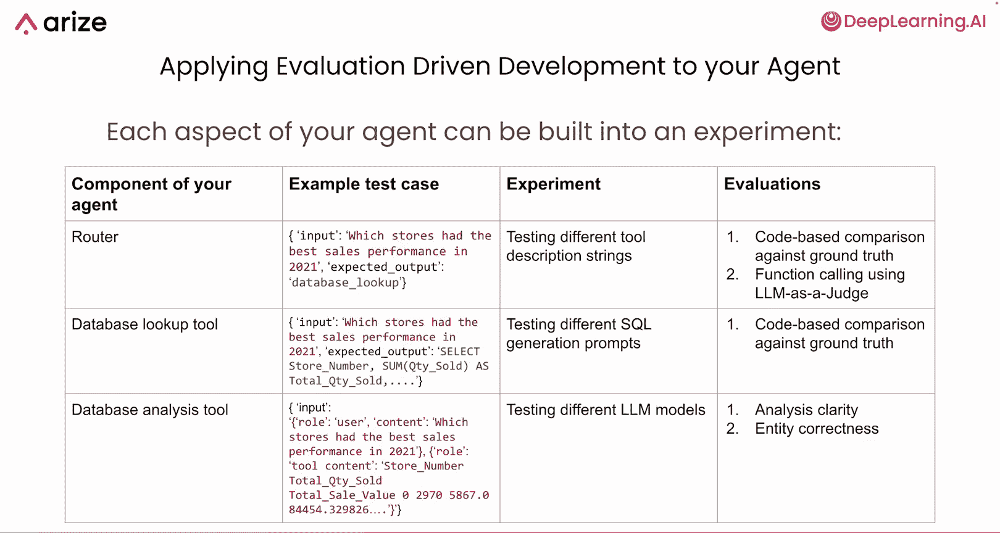
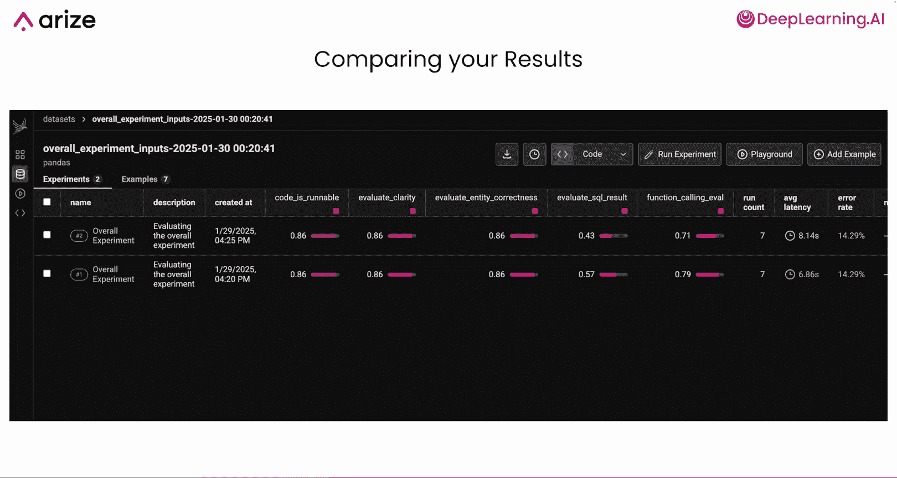
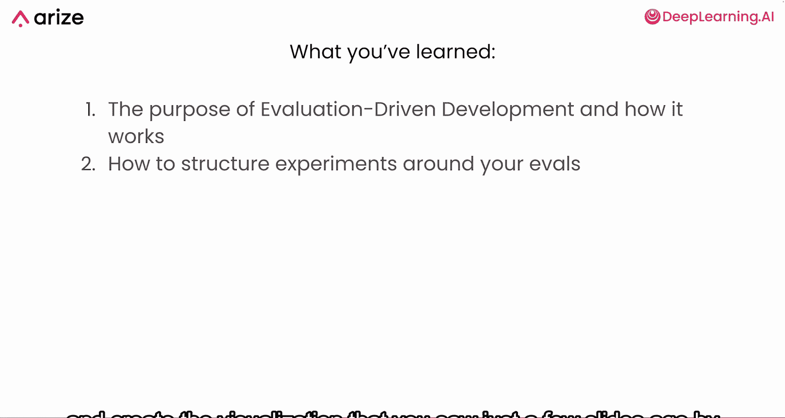

# 010：为评估添加结构 🏗️

在本节课中，我们将学习如何将多个独立的评估器组合成一个结构化的实验框架，用以迭代和改进你的 AI 代理。我们将介绍“评估驱动开发”的概念及其核心步骤。

## 概述

到目前为止，我们已经学习了如何评估代理的技能、路由器和路径收敛。现在，我们将学习如何将这些评估器整合到一个结构化的实验中，以便系统地迭代和改进你的代理。

## 评估驱动开发简介

评估驱动开发是一个概念，它涉及利用来自代理的评估和测量结果，来指导你投入时间改进、迭代和开发代理的方向。

评估驱动开发由几个不同的步骤组成。

以下是其核心步骤：

1.  **整理测试用例数据集**：收集一组测试用例或示例，这些用例可以发送给代理的不同变体。
2.  **运行实验**：将每个测试用例发送给代理的不同变体，每次可能改变使用的模型、提示词或代理逻辑。
3.  **评估结果**：将所有不同实验的结果通过你的评估器运行，获得一组可用于公平比较不同代理迭代版本的分数。

虽然这里的可视化呈现是线性的，但在实践中，这往往更像一个循环，尤其是在你将代理投入生产环境后。LLM 应用通常需要迭代改进，因此典型的过程是：你完成整个流程，发布你的代理或让其他人使用，然后你会发现需要添加不同的测试用例或评估器。你可以随时更新和更改这些不同的部分，从而创建一个飞轮，将生产环境的信息通过评估驱动开发整合回你的开发流程中。

## 深入各步骤细节

上一节我们介绍了评估驱动开发的整体框架，本节中我们来详细看看每个步骤。

### 1. 整理测试用例数据集

这里的理念是追求**全面性**而非**穷举性**。你可以拥有一组能代表你预期代理会收到的输入类型的示例。对于每种可能收到的输入类型，你只需要一两个示例即可，不需要成百上千个，尤其是当示例类型相似时。

这些示例可以来自代理的实际运行记录，也可以事先手动构建，甚至在有些情况下可以使用另一个模型生成。在实践中，你通常从自己构建示例开始，然后在发布代理后，从实际数据中添加更多示例。

此外，只要可能，最好在测试用例中包含**预期输出**。你可能并不总是有预期输出，但如果能包含它们，就能解锁更多可以运行的评估类型。例如，即使没有预期输出，也可以使用“LLM 即法官”评估器，但某些基于代码的评估器确实需要一个输出来进行比较。

### 2. 运行实验

在准备好数据集和测试用例后，你就可以开始修改你的代理并跟踪每次更改。

以下是你可以经常进行的一些测试：

*   更改代理使用的提示词。
*   更改传递给路由器的工具定义。
*   更改路由逻辑本身。
*   更改某些技能或技能结构。
*   直接换入你想要测试的新模型。

将每个测试用例通过代理的一个变体运行的做法通常被称为**实验**，即你在试验代理的某个特定版本。你可以使用这些实验来记录和测量每次不同运行的结果。

### 3. 评估实验结果

一旦收集了所有实验数据，你就可以使用之前课程中构建的所有评估器，并将它们应用于这些实验的结果。

以下是你可以使用的评估器类型：

*   **基于代码的评估器**：例如，与基准真值进行比较，或检查生成的代码是否可运行。
*   **收敛评估器**：你之前运行过的那些。
*   **LLM 即法官评估器**：例如，函数调用、分析清晰度和实体正确性。

## 应用于你的代理

现在，我们来看看如何将这些步骤应用到你的代理上。快速回顾一下，你的代理设置为使用这个带有函数调用的 OpenAI 路由器，以及三个可以评估的不同技能。

### 路由器实验示例

首先，我们以路由器为例，看看如何围绕它设置实验。

你可能会有一个类似这样的测试用例：
*   **输入**：“2021年哪些门店的销售业绩最好？”
*   **预期输出**：数据库查询工具应被路由器选中。

然后，你可能想尝试实验不同的工具描述。回想一下你传递给 LLM 路由器的 JSON 对象，你可能想要修改给每个工具的描述，看看是否能提高路由器的性能。

运行这些实验后，你可以使用以下方法评估结果：
*   **基于代码的与基准真值比较**：因为你这里有预期输出（基准真值数据）。
*   **函数调用 LLM 即法官评估器**。

### 数据库查询工具实验示例

接下来，我们看看代理的另一个组件：数据库查询工具（或技能）。

你可能会有一个类似这样的测试用例：
*   **输入**：（与上一轮相同）“2021年哪些门店的销售业绩最好？”
*   **预期输出**：一段 SQL 代码。

请注意，这里的 SQL 代码是你的数据库查询工具中的一个**中间步骤**：先生成 SQL，然后运行该 SQL 并获取输出。因此，请记住，你可以单独评估数据库查询工具的 SQL 生成部分。

**请在此暂停视频片刻，思考一下你可以对这个数据库查询工具运行什么实验和评估。**

一个你可以做的实验是**测试不同的 SQL 生成提示词**。你也可以测试不同的模型或其他部分。

然后，你可以使用**基于代码的与基准真值比较评估器**（类似于你在之前 notebook 中看到的），因为你有一个基准真值可以比较。

### 数据库分析工具实验示例

最后，我们看看数据库分析工具。在这种情况下，你可能会有一个像这里看到的测试用例：有一条来自用户的消息，然后你实际上有一些检索到的数据，因为数据库分析工具需要同时接收用户问题和一些要分析的数据。因此，你的测试用例中必须包含这两部分。

在这个测试用例中，你实际上**没有预期输出**。

**请再次暂停视频，思考一下在这种情况下你可以运行什么实验和评估。**

这里的一个实验可以是**测试不同的 LLM 模型**。你也可以测试不同的提示词或其他逻辑更改。

然后，你可以使用之前幻灯片和 notebook 中见过的**分析清晰度和实体正确性 LLM 即法官评估**来评估结果。

## 整合与可视化

当你将所有这些东西结构化，并开始使用多个不同的评估器运行代理的多次迭代，围绕此创建一个完整的流程时，你最终可以得到一个类似这样的仪表板或平视显示器：

*   每一行代表代理的一次运行。
*   所有评估器作为不同的列。

这样，你就可以衡量我对代理所做的每项更改的效果，不仅仅是针对代理的某一部分，而是从整体上评估代理的每个部分。

## 构建持续改进的飞轮

再次强调，当你开始将代理投入生产时，你会发现你会想出新的测试用例、新的评估方法以及你想要利用已有的生产监控数据做出的新更改。然后，你可以将这些信息带回你的测试和开发流程中。

因此，这整个实验框架和评估驱动开发框架不仅使你能够创建一个强大的应用程序并进行开发，还能将你在生产中学到的经验教训整合到开发流程中，从而创建一个强大的飞轮，让你可以随着时间的推移创造出越来越好的代理。

## 总结

在本节课中，我们一起学习了评估驱动开发的目的、它是什么以及它是如何工作的。我们还学习了如何围绕你的评估器构建实验，以便在持续改进代理的过程中扩展它们。

在下一个 notebook 中，你将实现其中一些技术，并通过为你目前一直在开发的代理添加大量评估并将其构建成一个实验，来创建你在前几张幻灯片中看到的可视化效果。