# 011：为评估添加结构（代码）📊

在本节课中，我们将学习如何整合之前学到的所有知识，构建一个大型实验，以便一次性测试智能代理的各个不同部分。我们将结合之前笔记本中创建的评估器与实验结构，创建一个便于迭代优化智能代理的框架。

## 概述

我们将通过以下步骤构建一个完整的评估实验：
1.  准备包含输入和预期输出的数据集。
2.  定义多个评估器，用于评估智能代理的不同组件（如路由、工具调用、SQL生成、代码可运行性等）。
3.  定义智能代理的执行任务。
4.  运行实验，让数据集中的每个样本通过智能代理任务，并使用所有评估器进行评估。
5.  分析结果，并根据结果迭代改进智能代理。

## 准备实验数据

首先，我们需要创建用于实验的数据集。这个数据集包含输入的问题以及对应的预期输出（即“真实值”）。

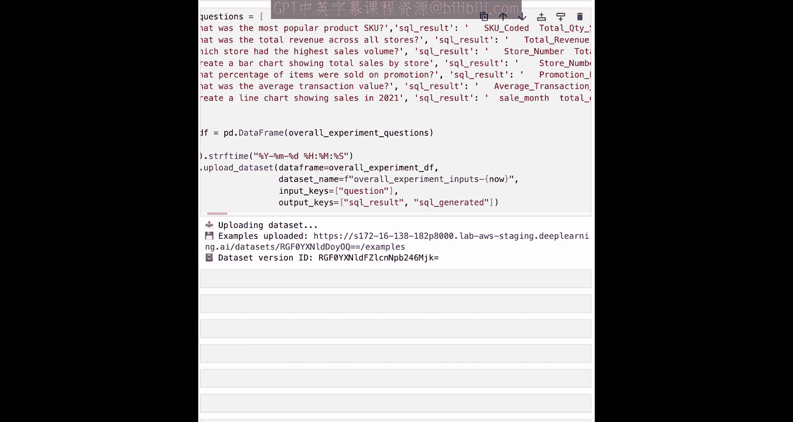

以下是创建数据集的步骤：
*   定义包含问题、预期SQL结果和预期生成SQL的数据集。
*   使用与之前相同的语法，将这些示例转换为数据框。
*   将数据框上传到Phoenix平台，并指定输入键和输出键。

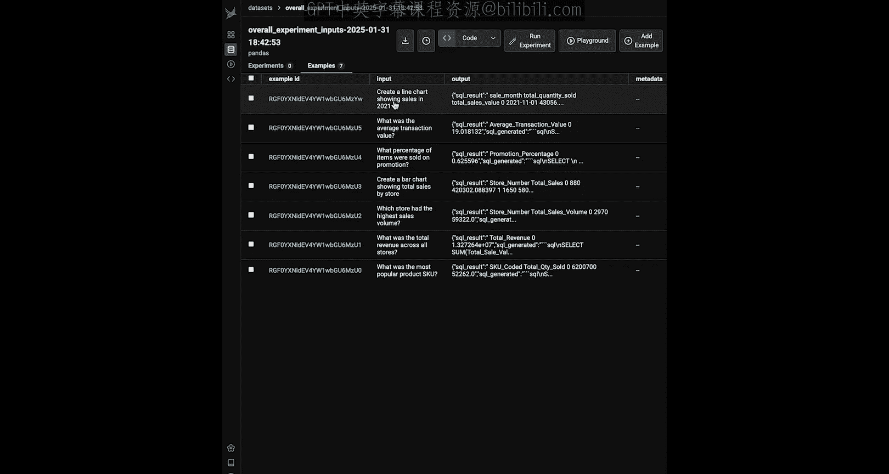

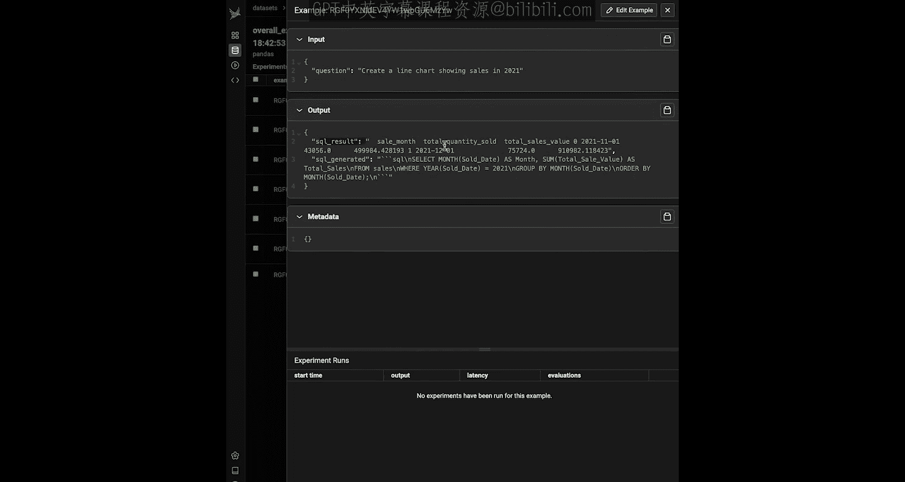

```python
# 示例：创建并上传数据集
import pandas as pd
from phoenix.client import Client

# 定义数据示例
data_examples = [
    {
        "question": "上个月的总销售额是多少？",
        "sql_result": 150000,
        "sql_generated": "SELECT SUM(sales) FROM transactions WHERE month = 'last_month'"
    },
    # ... 更多示例
]

# 创建数据框
df = pd.DataFrame(data_examples)

# 初始化Phoenix客户端并上传数据
client = Client()
client.upload_dataset(
    dataframe=df,
    name="overall_experiment_inputs",
    input_keys=["question"],  # 指定输入列
    output_keys=["sql_result", "sql_generated"]  # 指定输出列
)
```

上传后，你可以在Phoenix平台的“数据”部分看到名为 `overall_experiment_inputs` 的数据集。每个示例都包含输入键 `question` 和输出键 `sql_result` 与 `sql_generated`。

## 定义评估器

上一节我们准备好了实验数据，本节中我们来看看如何定义用于评估智能代理各个组件的评估器。我们将定义多个评估器，每个针对代理的不同功能。

以下是需要定义的评估器列表：

1.  **路由评估器**：评估智能代理是否正确选择了要调用的工具（函数调用）。
2.  **数据库查询工具评估器**：评估生成的SQL查询结果是否正确。
3.  **数据分析工具评估器**：包含两个子评估器。
    *   **清晰度评估**：评估代理响应的清晰程度。
    *   **实体正确性评估**：评估代理在输入输出中是否正确映射了提到的实体（如列名、变量）。
4.  **可视化工具评估器**：评估生成的代码是否可运行。

### 1. 路由评估器 (LLM作为裁判)

这个评估器使用LLM作为裁判来评估函数调用的质量。它不需要真实值进行比较。

```python
def evaluate_router(input, output):
    """
    评估代理的路由（函数调用）决策。
    参数:
        input: 代理的原始输入（问题）。
        output: 代理运行后的输出。
    返回:
        本次运行的平均评分。
    """
    # 从输出中提取工具调用
    tool_calls = output.get('tool_calls', [])
    
    # 构建用于评估的数据框
    eval_data = []
    for call in tool_calls:
        eval_data.append({
            "question": input,
            "tool_call": str(call)  # 工具调用详情
        })
    eval_df = pd.DataFrame(eval_data)
    
    # 使用LLM分类进行评估（与之前笔记本相同）
    scores = llm_classify(
        dataframe=eval_df,
        template=function_calling_prompt_template,  # 预定义的提示模板
        model=evaluator_llm  # 评估用的LLM模型
    )
    # 返回平均分（因为一次调用可能涉及多个工具）
    return scores.mean()
```

### 2. 数据库查询工具评估器 (基于代码)

这个评估器通过比较代理生成的SQL查询结果与数据集中提供的真实值来评估准确性。

```python
def evaluate_db_lookup(input, output, expected):
    """
    评估数据库查询工具生成的SQL结果。
    参数:
        input: 代理的原始输入。
        output: 代理运行后的输出。
        expected: 数据集中预期的输出（包含sql_result）。
    返回:
        True 或 False，表示数字结果是否匹配。
    """
    # 1. 从输出中查找名为“look_up_sales_data”的工具响应
    tool_responses = output.get('tool_responses', [])
    sql_result = None
    for resp in tool_responses:
        if resp.get('tool_name') == 'look_up_sales_data':
            sql_result = resp.get('response')
            break
    
    if not sql_result:
        return False
    
    # 2. 从SQL结果和预期值中提取纯数字
    def extract_numbers(text):
        import re
        return re.findall(r'\d+\.?\d*', str(text))
    
    result_numbers = extract_numbers(sql_result)
    expected_numbers = extract_numbers(expected['sql_result'])
    
    # 3. 比较数字列表是否相同
    return result_numbers == expected_numbers
```

### 3. 数据分析工具评估器 (LLM作为裁判)

这个工具需要两个评估器：一个评估响应的清晰度，另一个评估实体的正确性。

```python
def evaluate_clarity(input, output):
    """评估数据分析工具响应的清晰度。"""
    # 构建数据框
    eval_df = pd.DataFrame([{
        "query": input,
        "response": output.get('analysis_response', '')
    }])
    # 使用清晰度提示模板进行LLM评估
    scores = llm_classify(
        dataframe=eval_df,
        template=clarity_prompt_template,
        model=evaluator_llm
    )
    return scores.iloc[0]  # 返回单个分数

def evaluate_entity_correctness(input, output):
    """评估数据分析工具响应中实体的正确性。"""
    # 构建数据框
    eval_df = pd.DataFrame([{
        "query": input,
        "response": output.get('analysis_response', '')
    }])
    # 使用实体正确性提示模板进行LLM评估
    scores = llm_classify(
        dataframe=eval_df,
        template=entity_correctness_prompt_template,
        model=evaluator_llm
    )
    return scores.iloc[0]
```

### 4. 可视化工具评估器 (基于代码)

这个评估器检查生成的代码是否能够成功执行。

```python
def evaluate_code_runnable(output):
    """评估可视化工具生成的代码是否可运行。"""
    # 1. 从输出中查找生成的代码
    tool_responses = output.get('tool_responses', [])
    generated_code = None
    for resp in tool_responses:
        if resp.get('tool_name') == 'generate_visualization':
            generated_code = resp.get('code')
            break
    
    if not generated_code:
        return False
    
    # 2. 清理代码（例如去除标记）
    cleaned_code = generated_code.strip('```python').strip('```').strip()
    
    # 3. 尝试执行代码
    try:
        exec(cleaned_code, {})  # 在空环境中执行
        return True
    except Exception:
        return False
```

## 定义代理任务

现在我们已经定义了所有评估器，接下来需要定义智能代理的核心任务函数。这个函数将接收数据集中的一个样本（包含输入问题），运行智能代理，并返回处理后的输出。

```python
def run_agent_task(example):
    """
    实验任务：对单个输入运行智能代理。
    参数:
        example: 包含输入键值对的字典（例如 {'question': '...'}）。
    返回:
        代理处理后的输出消息。
    """
    # 1. 从示例中获取输入问题
    input_question = example['question']
    
    # 2. 运行你的智能代理
    raw_agent_output = your_agent.run(input_question)  # 你的代理调用逻辑
    
    # 3. （可选）处理消息格式以便于阅读
    processed_output = process_messages(raw_agent_output)
    
    return processed_output

# 辅助函数：格式化消息
def process_messages(messages):
    """将代理的原始消息输出格式化为更清晰的结构。"""
    # 简化逻辑：提取关键信息，如工具调用和响应
    formatted = {
        'tool_calls': [],
        'tool_responses': [],
        'final_answer': None
    }
    for msg in messages:
        # ... 根据你的代理输出结构进行解析 ...
        pass
    return formatted
```

## 运行综合实验

万事俱备，现在我们可以运行大型实验了。我们将把数据集、代理任务和所有评估器组合在一起。

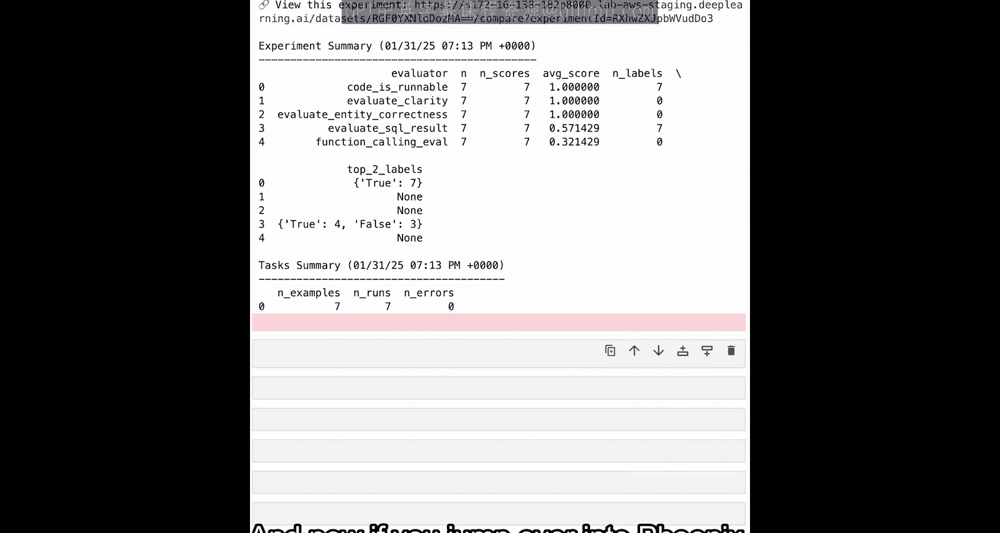

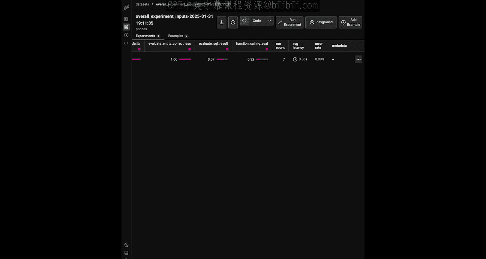

```python
from phoenix.experiments import run_experiment

# 运行实验
experiment_results = run_experiment(
    dataset_name="overall_experiment_inputs",  # 在Phoenix中的数据
    task=run_agent_task,
    evaluators=[
        evaluate_router,
        evaluate_db_lookup,
        evaluate_clarity,
        evaluate_entity_correctness,
        evaluate_code_runnable
    ],
    experiment_name="Baseline_Agent_v1"
)
```

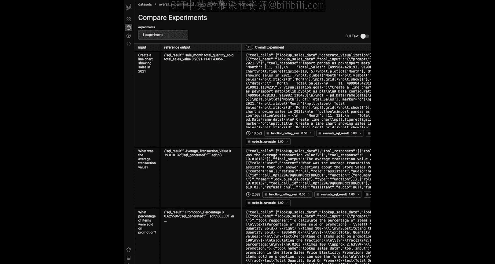

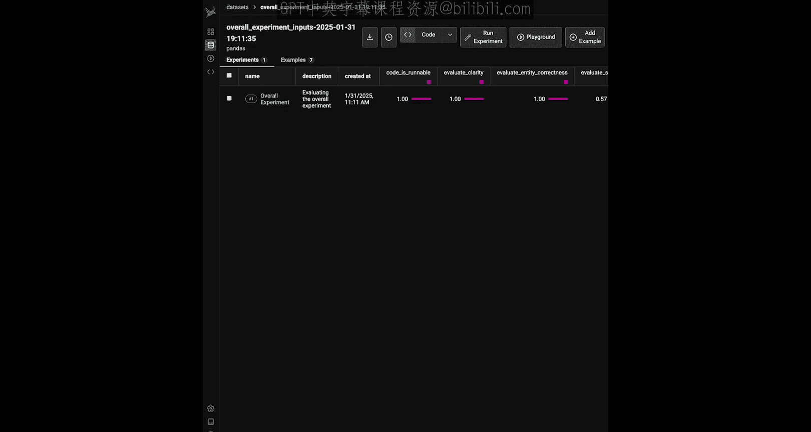

实验运行时，数据集中的每一行（即每个问题）都会通过 `run_agent_task` 函数交给智能代理处理。然后，代理的输出会被传递给每一个评估器进行打分。最终，你会得到一个包含所有评估结果的详细报告。

## 分析与迭代改进

实验运行完成后，你可以在Phoenix平台查看详细结果。结果会以表格形式展示，列出每个测试用例在不同评估器上的得分。

例如，你可能会发现：
*   `code_is_runnable` 列全部为 True，表示代码生成工具工作良好。
*   `analysis_is_clear` 和 `entities_are_correct` 列得分较高。
*   `sql_generation_correct` 和 `function_calling_correct` 列可能存在一些问题，得分较低。

### 如何改进你的代理

根据评估结果，你有两种主要方式来迭代改进智能代理：

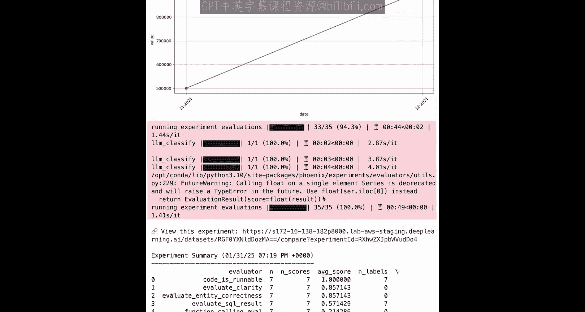

**1. 在代码中直接修改代理**
你可以直接修改代理的源代码，例如改进SQL生成的提示词，然后重新运行实验进行对比。

```python
# 示例：修改SQL生成提示词
new_sql_prompt = """
你是一个SQL专家。在生成查询前，请仔细思考。
确保引用的列名与数据库模式完全一致。
问题：{question}
请生成SQL查询：
"""
# 更新你的代理中使用的提示词
your_agent.update_sql_prompt(new_sql_prompt)

# 使用新名称重新运行实验，以便与基线对比
experiment_results_v2 = run_experiment(
    dataset_name="overall_experiment_inputs",
    task=run_agent_task,  # 任务函数现在使用了更新后的代理
    evaluators=[...],  # 相同的评估器列表
    experiment_name="Agent_v2_with_better_SQL_prompt"
)
```

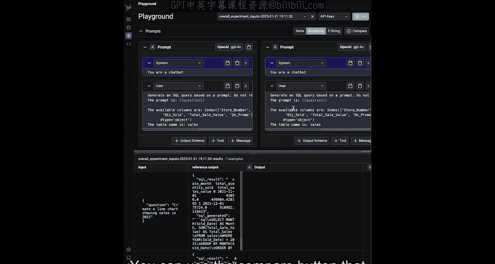

**2. 使用Phoenix Playground进行快速迭代**
Phoenix提供了一个名为Playground的UI工具。你可以在这里直接修改提示词，并立即在数据集上看到不同提示词版本产生的输出对比，从而快速进行迭代，无需每次修改都重新运行整个实验。

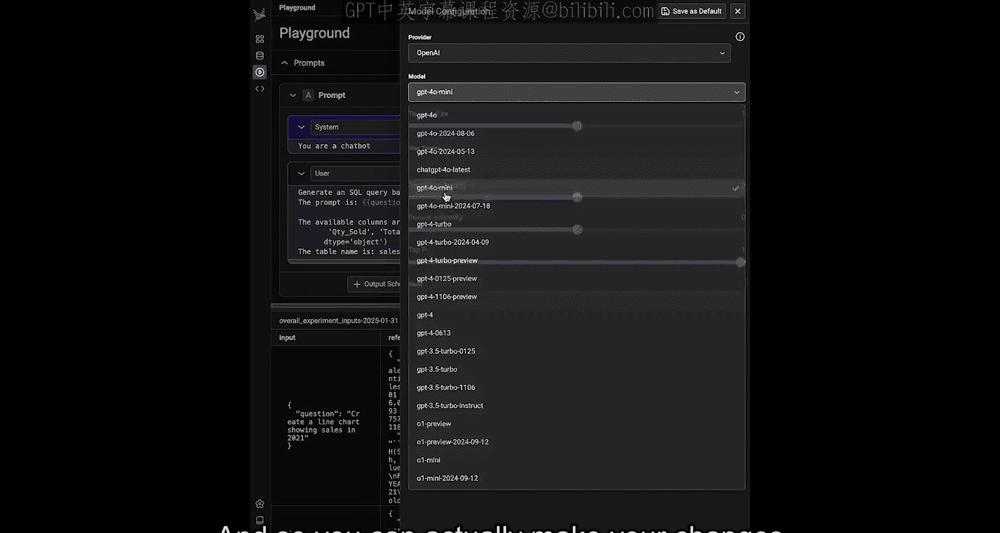

无论使用哪种方法，你都可以通过结构化的实验框架，清晰、量化地看到每一项修改对智能代理性能产生的具体影响，从而实现高效、有据可依的优化。

## 总结

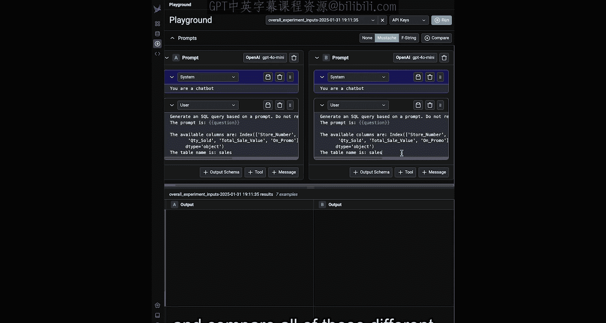

本节课中我们一起学习了如何为AI智能代理的评估构建一个完整的、结构化的实验框架。我们涵盖了从准备带真实值的数据集，到为路由、工具调用、SQL生成、代码执行等不同组件定义多种评估器（包括基于代码和基于LLM裁判的方法），再到整合任务并运行实验的整个过程。最后，我们探讨了如何利用实验结果，通过直接修改代码或使用Playground工具来迭代和改进智能代理的性能。这个框架为你提供了一种系统化的方法来评估和提升代理的可靠性。