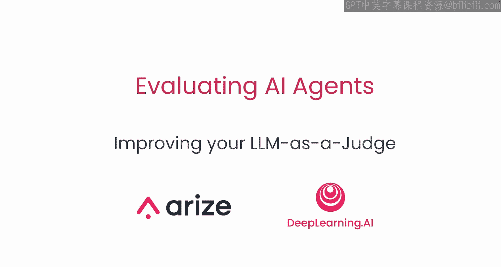
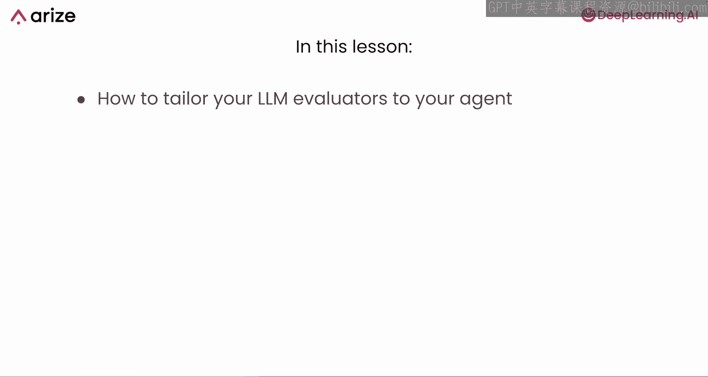
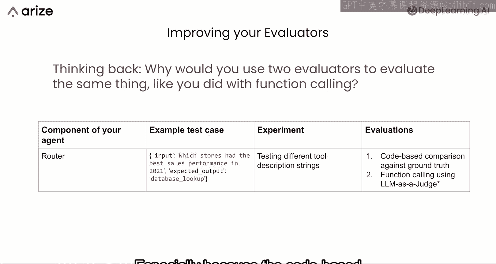
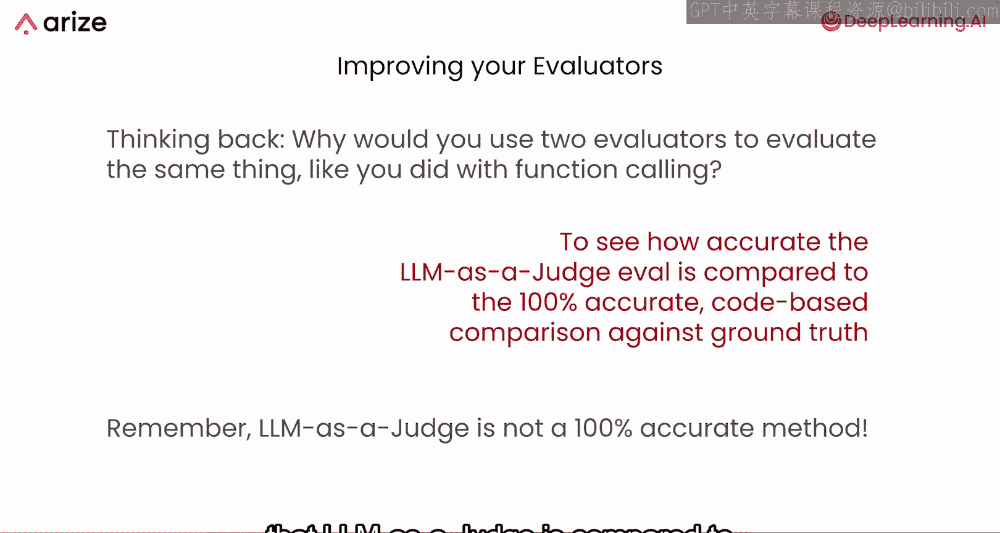
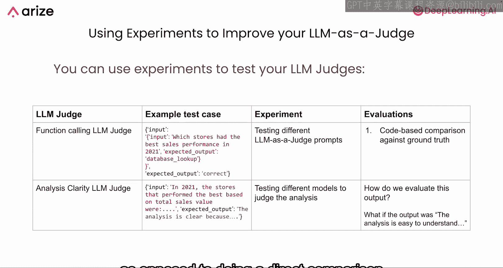
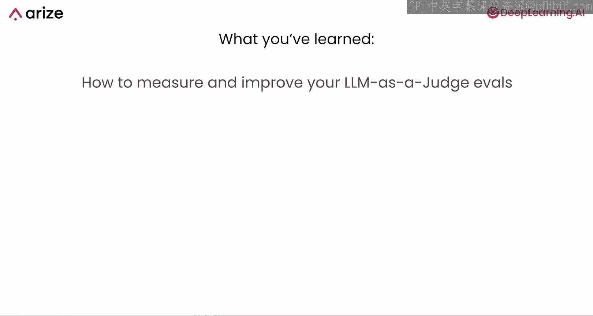

# 012：提升你的 LLM 评判员

在本节课中，我们将学习如何改进你的 LLM 评估器，以及如何提升“LLM 作为评判员”这一评估方法本身的质量。

## 概述

在之前的课程中，我们了解到“LLM 作为评判员”的评估方法并非 100% 准确。因此，本节课将作为一个补充，教你如何在优化智能体本身的过程中，同步改进这些评估器。

## 为何需要改进 LLM 评判员

上一节我们介绍了如何结合基于代码的基准真值比较和 LLM 评判员来评估路由器的性能。你可能会想，既然基于代码的评估器是 100% 准确的，为什么还需要引入 LLM 作为评判员呢？

答案是，你可以利用这项技术来衡量你的 LLM 评判员与 100% 准确的基准真值评估方法之间的契合度。因为 LLM 评判员虽然不完美，但其评估范围可以远超基准真值比较。你可以将 LLM 评判员应用于应用程序的所有运行记录，但了解其相对于准确评估方法的精确度至关重要。

## 通过实验改进 LLM 评判员

上一节我们学习了如何为智能体设置实验。本节中，我们将看看如何将这些实验方法应用于改进 LLM 评判员本身。这听起来有点“元”，但你可以使用相同的技术来“评判你的评判员”。

以下是具体步骤：

首先，为你的函数调用 LLM 评判员设置一个实验。你需要一个测试用例，例如：
*   **输入**：`“2021年哪些门店的销售业绩最好？”`
*   **输出**：`数据库查询操作`
*   **基准真值**：`“正确”`

在这个例子中，**输入**和**输出**（图中红色部分）是提供给 LLM 评判员的输入，用于评判智能体的表现。而**基准真值**（`“正确”`）则是你已知的准确答案。

接着，你可以设计实验来测试不同版本的 LLM 评判员提示词。例如：
*   修改提示词的措辞。
*   添加**少量示例**，即提供一些过往正确的评判案例，以引导评判员。

最后，使用基于代码的基准真值比较来评估 LLM 评判员的表现。公式可以表示为：
**评估结果 = 比较(LLM评判员输出, 基准真值标签)**

## 处理非结构化评估

同样的方法也适用于其他类型的 LLM 评判员，例如评估“分析清晰度”的评判员。在这种情况下，测试用例可能如下：
*   **输入**：`“2021年，表现最好的门店是...（分析内容）”`
*   **基准真值**：`“分析清晰，因为X、Y、Z原因。”`

此时，你可以测试不同的模型或不同的提示词。但问题在于如何评估输出，因为基准真值不再是简单的“正确/错误”标签，而是一段描述性文本。

如果 LLM 评判员返回 `“分析易于理解，因为X、Y、Z原因”`，这应该是正确的，但你不能直接进行字符串精确匹配。这时，你可以使用**语义相似度**来数值化地比较两段文本的含义，而不是直接对比输出字符串。例如，可以使用余弦相似度等算法。

## 总结

本节课中，我们一起学习了如何通过结构化实验来度量和改进你的“LLM 作为评判员”评估方法。你学会了设置实验、使用基准真值进行校准，以及如何处理非结构化的评估输出。

在下一节也是最后一节课中，你将学习如何将智能体部署到生产环境并进行监控，并对本课程的所有内容进行总结。