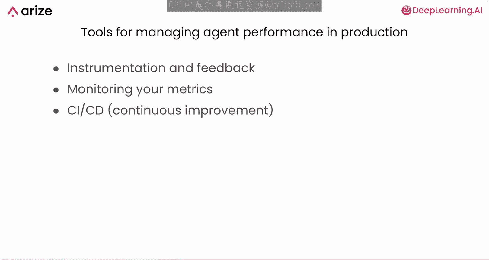
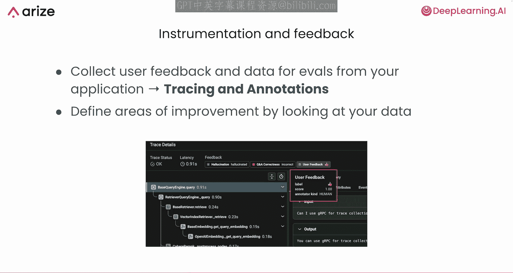
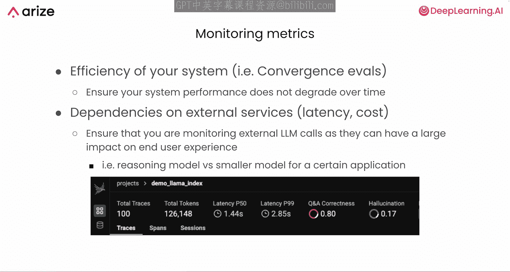
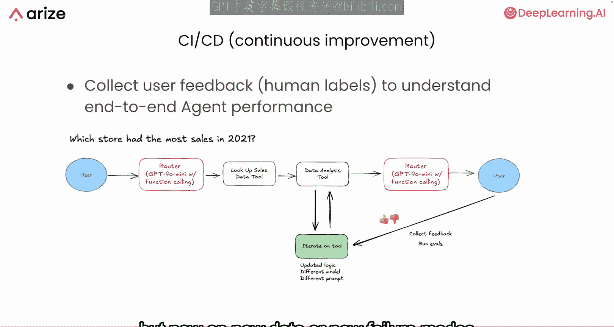
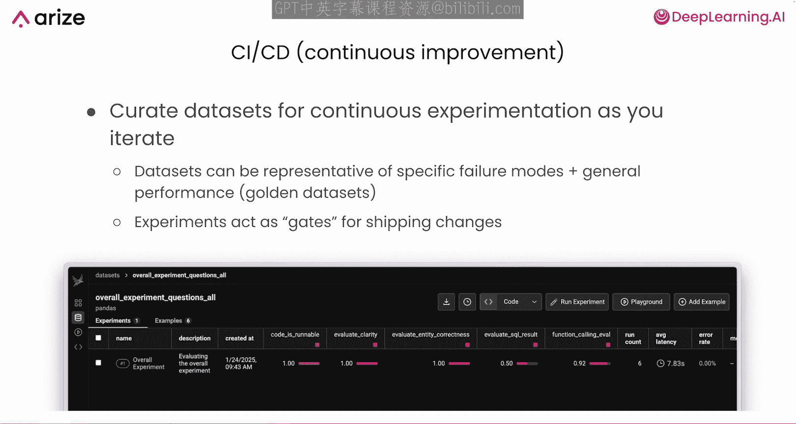
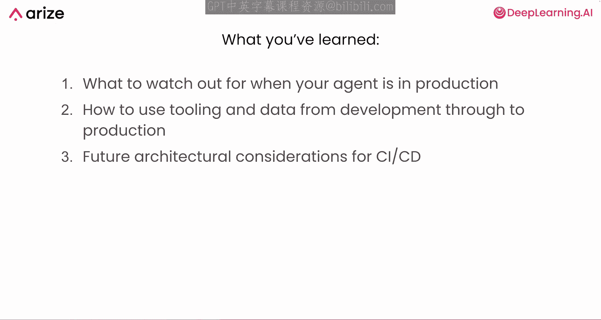

# 013：生产环境监控 🛠️

在本节课中，我们将学习如何将开发阶段使用的评估和实验技术应用到生产环境中，以持续监控和改进 AI 代理的性能。我们将探讨生产环境中的新挑战、监控方法以及如何利用真实用户反馈进行迭代。

---

上一节我们介绍了从原型到生产就绪系统的四个主要步骤。本节中，我们来看看当代理真正部署到生产环境后，我们需要关注什么。

在生产环境中，代码变更或模型更新等因素可能导致代理性能下降。你可以使用评估和运行实验来持续监控和改进你的代理。

## 生产环境的不同之处

与开发环境相比，生产环境会带来新的挑战。

以下是生产环境中可能遇到的新问题：
*   **新的失败模式**：用户可能会提出在开发中从未见过的问题，或引用系统尚未知晓的新事物。
*   **更复杂的架构**：如果代理需要调用其他 AI 或代理，出错或产生意外输出的机会会增加。
*   **意外的性能回归**：A/B 测试或不同的模型策略可能会在受控环境中未预料到的情况下引入令人惊讶的性能倒退。

值得庆幸的是，你在开发中使用的许多工具，如**插桩**和**反馈循环**，在生产中同样有价值。你将持续收集为评估定义的指标，并依赖**持续集成**、**持续交付**流程和**持续实验**来跟踪代理的性能。

## 收集用户反馈与评估

你可以使用与开发阶段相同的追踪和标注方法，只是现在它们被真实的用户数据所丰富。你将从实际交互中收集反馈，标注有问题的输出，并识别代理可能遇到困难的地方。

在生产中收集用户反馈进行评估至关重要。你可以获取真实的使用数据，例如每个用户查询或交互，并附上人工标注以突出显示问题或成功之处。

如果你的评估指标与真实用户的反馈不一致，这可能是一个信号，表明你需要重新检查你的系统或评估方法。也许你测量了错误的指标，或者代理流程中存在更深层的逻辑缺陷。

## 监控关键指标

你还需要长期跟踪指标，以了解效率或执行依赖性。例如，如果你使用收敛性评估，可以看到代理需要多少步骤才能得出正确答案。如果在调整提示词后这个数字增加了，这可能表明出现了性能回归。

由于你很可能调用外部 LLM API，你也应该跟踪这些调用。它们可能对**延迟**和**成本**产生重大影响，进而影响最终用户体验。模型的选择，例如大型推理模型与更小、更快的模型，可能会根据生产环境中任务的复杂性而变化。

密切关注这些决策及其下游影响是稳健生产监控的一部分。

## 在生产环境中运行实验

当你收集到人工反馈并在真实流量上运行评估时，你将更清楚地了解变更（如更换模型或更新提示词）如何影响整个系统。你可以重新运行在开发中使用的相同实验，但现在是在生产中发现的新数据或新失败模式上进行。

因此，你需要维护一致的数据集，并不断用生产样本进行扩充。一个有效的方法是策划**黄金数据集**，这些数据集涵盖你最关键的用例和已知的失败模式。每次推送变更（如调整提示词或逻辑）时，你可以重新检查这些数据集，以确保没有破坏已经解决的问题。

实验可以充当发布变更的**门控机制**，帮助你决定是推进还是回滚某个变更。

## 构建自我改进的代理

想象一下，你有一个自我改进的代理，每当用户与你的系统交互时，它会自动收集反馈。你可以将这些用户示例（包括成功和失败的交互）添加到一个持续更新的数据集中。然后，你在这个数据集上运行 CI/CD 实验，检查新版本的代理在最新的真实场景中表现更好还是更差。

当你优化代理逻辑或调整提示词时，你还可以从新收集的数据中纳入**少样本示例**。这使你的系统能够从错误中学习，并以自我改进和自动化的方式，逐步在最重要的任务上收敛到更好的性能。

你在这里所做的，本质上是在生产中应用**评估驱动开发**。你关注新的失败模式，监控代理处理它们的能力，并自动将生产反馈纳入你的评估中。

---

在本节课中，我们一起学习了在生产环境中需要警惕什么（新的查询、复杂的架构和意外的用户行为），以及如何通过持续测量和优化性能来保持代理的正确轨道。

我们还看到了在开发中使用的工具和数据如何无缝过渡到生产环境，以及如何通过使用带有持续实验的 CI/CD 流水线来扩展这些方法，以构建更健壮的代理系统。通过这种方式，你可以确保对代理的每次更新都能保持或提高你已经实现的质量。

现在，你已经掌握了在生产环境中监控代理并根据真实世界数据持续优化其性能的坚实基础。

