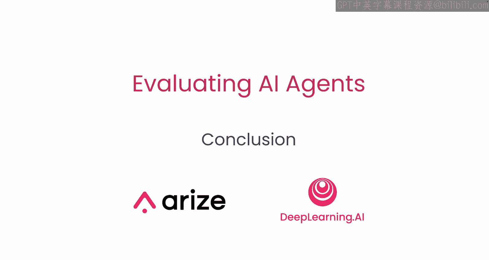

# 014：总结 🎯

在本节课中，我们将一起回顾整个课程的核心内容，总结如何追踪、评估和改进基于代码的AI代理。

---



## 课程概述

在本课程中，我们学习了如何追踪、评估和改进一个基于代码的AI代理。这些技能是构建可靠、高效AI应用的基础。

## 核心内容回顾

上一节我们探讨了具体的改进策略，现在让我们对整个课程进行总结。

以下是本课程涵盖的核心技能：

1.  **追踪代理**：学习如何监控和记录AI代理的执行过程与内部状态。
2.  **评估代理**：掌握使用定量和定性方法衡量代理性能与准确性的技巧。
3.  **改进代理**：应用迭代优化策略来提升代理的可靠性、效率和输出质量。

## 知识的应用与延伸

你现在可以将所学知识应用到任何其他的代理框架中。课程中介绍的核心概念和方法具有普适性。

核心的评估与改进循环可以概括为以下流程：
```
追踪 -> 评估 -> 分析 -> 改进 -> (再次追踪...)
```

## 后续资源

本课程结束后，我们提供了一个资源章节。请查阅该部分以获取进一步学习的材料和工具。

## 总结

本节课中，我们一起学习了追踪、评估和改进基于代码的AI代理的全套方法。掌握这些技能后，你将能够构建、诊断并优化自己的AI代理。期待看到你运用这些知识创造出自己的项目。