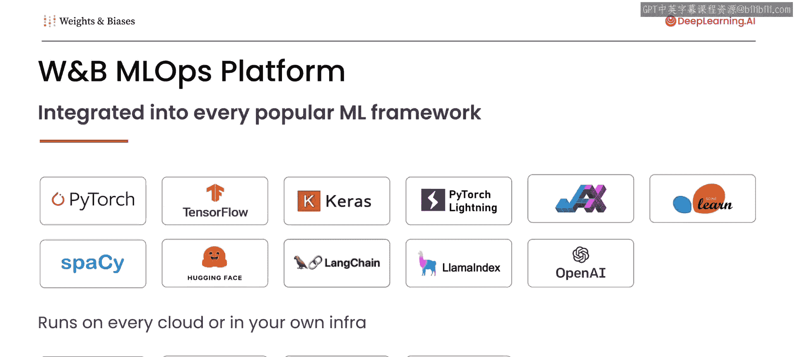
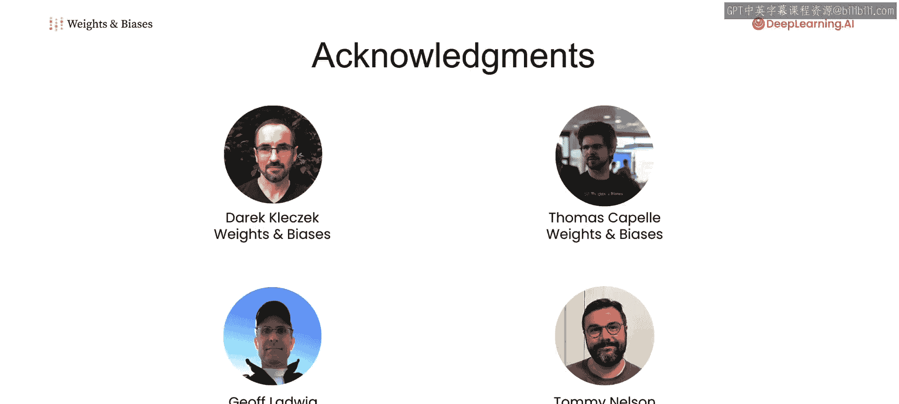

# 001：课程介绍 🎯

在本节课中，我们将一起了解《评估和调试生成式人工智能》这门短期课程的核心内容与目标。课程将重点介绍如何系统化地追踪、评估和优化生成式AI模型，并介绍一套实用的工具集。

---

欢迎来到《评估和调试生成式人工智能》课程。我是吴恩达，与我一同授课的还有来自Weights & Biases的创始产品经理兼本课程讲师——Carrie Fels。

你好，吴恩达，很高兴来到这里。

当你构建一个机器学习系统时，跟踪所有的数据、模型和超参数选项可能会变得非常复杂。我参与过许多项目，过程通常是：训练模型，调整架构，重新训练模型，然后决定改变训练技术，如此循环。在模型上迭代几次后，你最终会问自己：我上周训练的那个效果不错的模型，现在该如何复现当时的结果？我是否不仅保存了超参数值，还保存了当时使用的确切数据集？

更普遍地说，当运行大量模型时，你如何系统地跟踪所有尝试过的方案，并利用看到的结果来有效地推动改进？即使对于一个小团队，管理和跟踪机器学习模型的训练与评估也变得复杂，而团队规模越大，这种复杂性会急剧增加。

我观察到，如果机器学习开发的这个步骤能更严谨地进行，许多团队的效率可以大幅提升。

因此，这门短期课程涵盖了在开发过程中系统化追踪和调试生成式AI模型的工具与最佳实践。我们将使用来自Weights & Biases的工具，它提供了一套易用且灵活的工具集，已成为机器学习实验追踪领域的事实标准。

课程将涵盖用于文本生成的大语言模型和用于图像生成的扩散模型这两类生成式AI模型。但是，与监督学习相比，生成式AI模型增加了一层复杂性，因为它们的输出很复杂，因此评估起来可能更困难。

那么Carrie，你对这些挑战非常了解。你能向学员们分享一下他们将在本课程中学到什么吗？

当然可以。谢谢，吴恩达。大家好，很高兴与你们一起学习这门课程。

在本课程中，我们将专注于评估和调试生成式人工智能。首先，我们将向你展示如何追踪和可视化你的实验。接着，我们将教你如何监控扩散模型。然后，我们会讨论如何评估和微调大语言模型。

在整个课程中，你将学习一系列调试和评估工具，包括：
*   **实验**：用于追踪你的机器学习实验。
*   **工件**：用于版本控制和存储数据集及模型。
*   **表格**：用于可视化和检查模型做出的预测。
*   **报告**：用于协作和分享实验结果。
*   **模型注册表**：用于管理模型的生命周期。
*   **提示**：用于评估大语言模型的生成结果。

这些工具可以与广泛的框架和计算平台协同工作，包括Python、TensorFlow或PyTorch。

课程内容非常丰富，并且有许多人为本课程的开发做出了贡献。我们感谢Weights & Biases的Derek Qiuke和Thomas Capelle，以及DeepLearning.AI的Jeff Ludwig和Tommy Nelson的辛勤工作。

在本课程结束时，你将理解最佳实践，并掌握一套用于系统化评估和调试生成式AI项目的工具。希望你享受这门课程。

---

本节课中，我们一起学习了《评估和调试生成式人工智能》课程的整体框架和目标。我们了解到，系统化地追踪实验、评估复杂输出是开发生成式AI模型的关键挑战，而本课程将提供一套强大的工具和最佳实践来应对这些挑战。接下来，我们将深入第一课，开始学习如何具体地追踪和可视化你的实验。