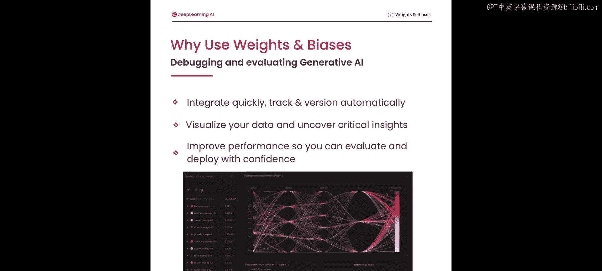
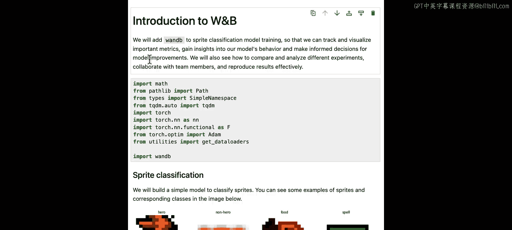
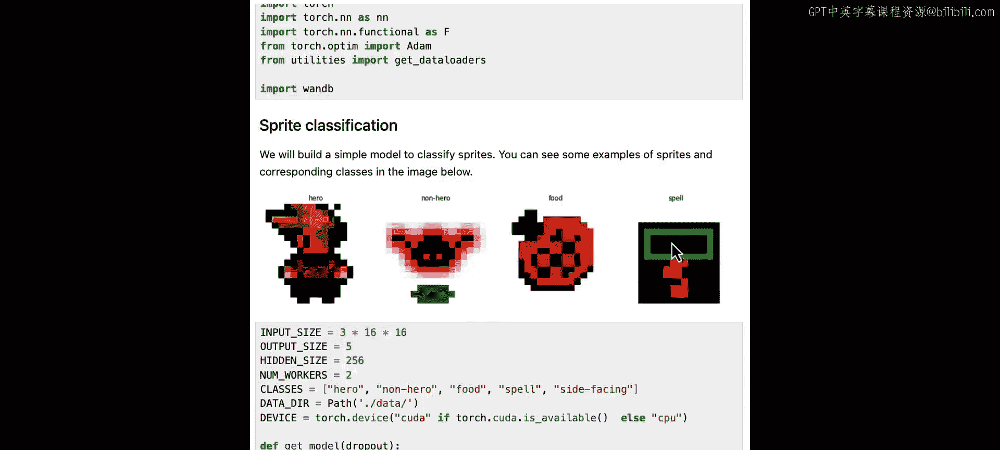
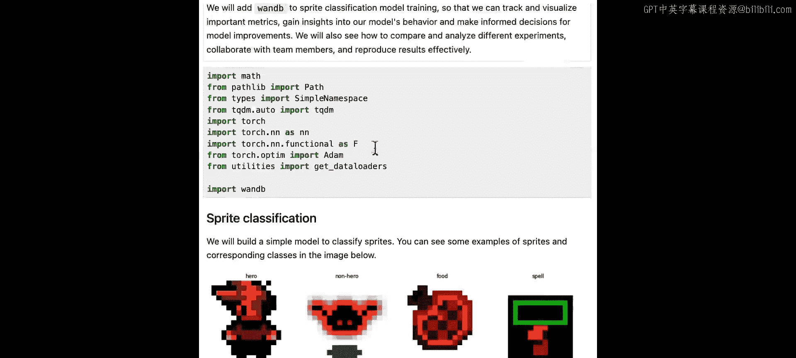
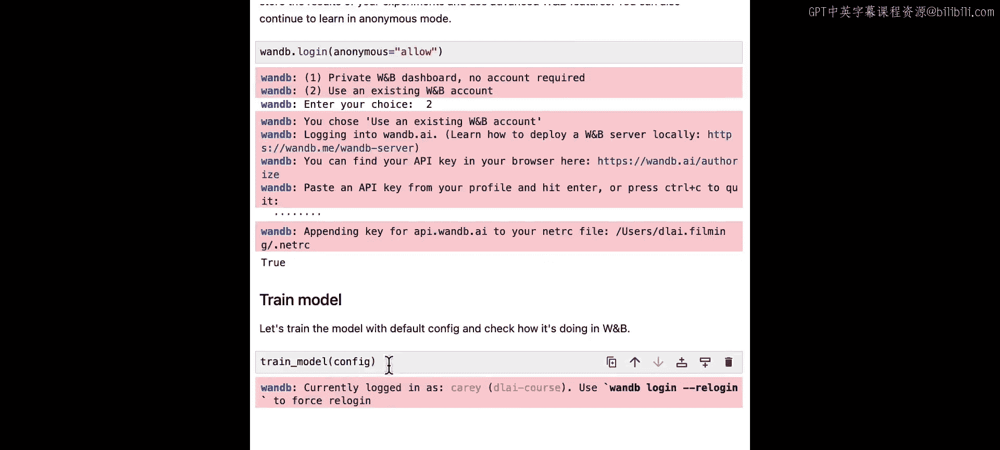
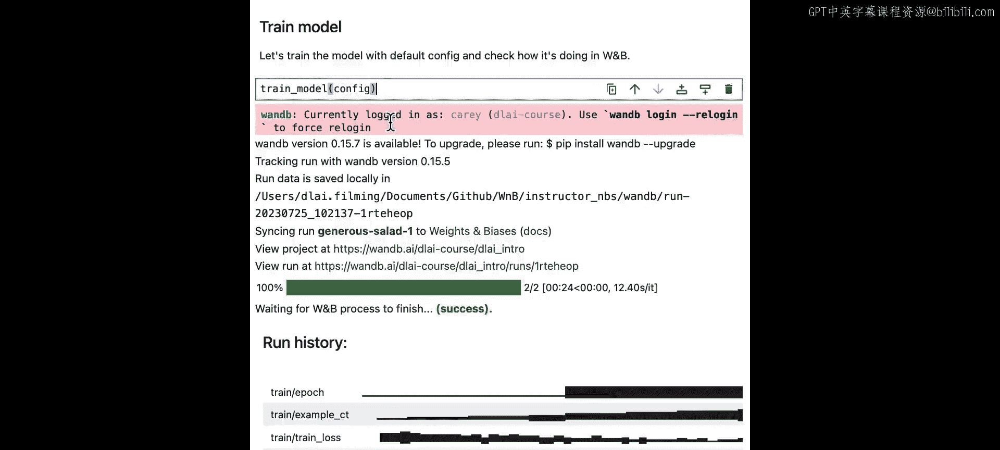
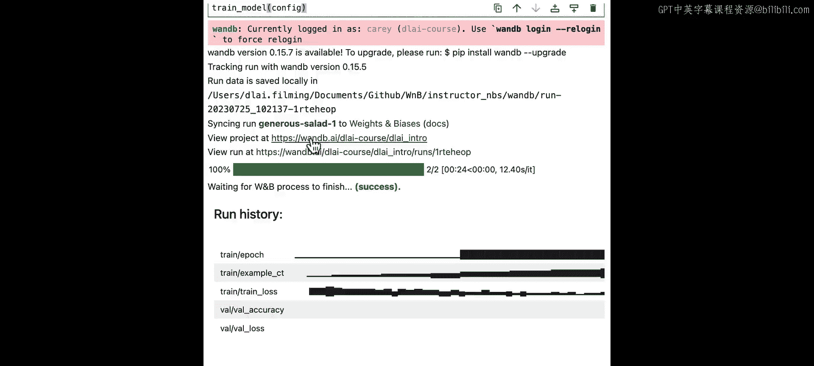
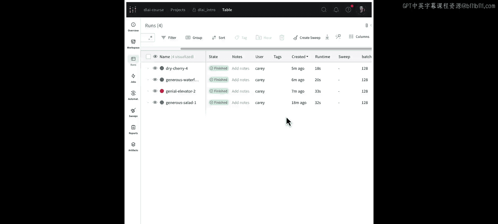
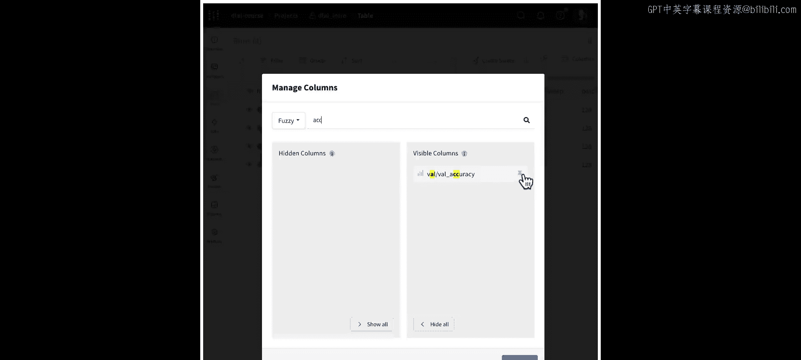
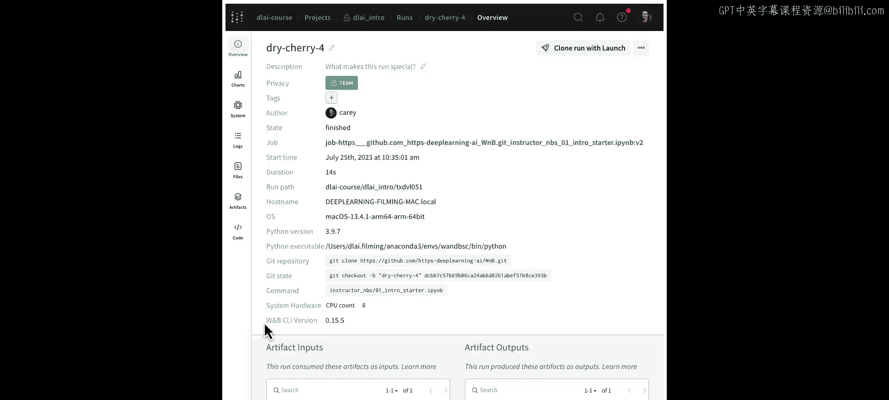

# 002：01_Weights & Biases 简介 🚀

在本节课中，我们将学习如何在机器学习训练代码中集成 Weights & Biases（W&B）工具。我们将了解如何通过几行代码来监控、调试和评估训练过程。

---

## 概述

在第一课中，我将展示如何在你的机器学习训练代码中集成 Weights & Biases。在训练机器学习模型时，许多环节可能出错。W&B 将帮助我们监控、调试和评估整个流程。

现在，让我们开始深入了解。

---

## 集成 W&B 到训练流程

只需几行代码，你就能实时监控指标、CPU 和 GPU 使用情况。你可以对代码进行版本控制，复现模型检查点，并在一个集中的交互式仪表板中可视化预测结果。我们的用户使用 W&B 来评估模型、讨论问题，并通过可配置的报告展示进展。

在本课程结束时，你也能做到这些。让我们从学习如何将 Weights & Biases 集成到你的训练过程中开始。

### 安装与初始化

首先，你需要使用命令 `pip install wandb` 安装 Python 库。

安装完成后，我们只需要几行代码。第一步是导入 W&B。理想情况下，你已经将超参数组织在一个对象中，例如 Python 字典。否则，请将它们放在一个配置对象中。

接着，你需要初始化一个 W&B 运行。在 Weights & Biases 中，一个“运行”代表一个计算单元。通常，一个运行对应一个机器学习实验。你可以通过调用 `wandb.init` 并传入项目名称和配置对象来开始一个运行。

然后，你继续执行模型训练代码。当你到达想要跟踪和可视化某些指标的点时，使用 `wandb.log` 记录它们。如果你在使用笔记本，建议在最后调用 `wandb.finish`。

### 实战演示：训练一个精灵分类模型

现在，让我们在一个笔记本中查看这个过程。在这个训练脚本中，我们将训练一个精灵分类模型。精灵是一个 16x16 像素的小图像，我们的目标是将精灵分类为五个类别之一：英雄、非英雄、食物、法术和侧向（未在图中显示）。

让我们从所有导入开始，并确保 W&B 在其中。

我们定义一个具有两个线性层的简单分类器模型。我们将想要跟踪的参数存储在一个简单的命名空间中，这类似于 Python 字典。

这是我们的训练函数，让我们修改它以添加 W&B 日志记录。

首先，我们需要调用 `wandb.init` 并传入我们的项目名称和配置对象。

一旦我们有了指标，我们将使用 `wandb.log` 将它们记录到 Weights & Biases。

我们还会在每个周期结束时记录验证指标。为了清晰起见，我们可以通过调用 `wandb.finish` 来显式结束我们的 Weights & Biases 运行。

我们不需要在验证函数中做任何更改。所以，我将直接运行这个单元格。

在本课程中，我们将使用 W&B 云平台，这意味着我们需要登录。也有安装本地 W&B 的选项，但这更复杂，因此本课程不涵盖。W&B 对个人和学术用途是免费的，我们鼓励你注册。这样，你可以保存实验跟踪的结果。但你也可以在匿名模式下运行此代码。

现在，我已经运行了登录，使用我的个人账户并粘贴了我的 API 密钥。你可以在 `wandb.ai/authorize` 获取它。我按回车键，这意味着我已在此笔记本中登录。

最后，让我们训练模型。运行我们的训练代码并查看进度。

现在，数据正被记录到 W&B 服务器，在那里保存你的结果。当你执行运行时，你可以看到这里打印出的几个不同链接。首先，“正在同步此运行”指的是你刚刚跟踪的单个实验。你也可以打开项目页面，这将比较你正在跟踪的不同运行。

让我们点击那个链接并检查我们的工作空间。

现在，我来到了项目页面工作空间。这是我可以从刚刚在笔记本中运行的训练运行中看到的数据。这些图表很小，我可以展开它们使其变大。这看起来不错。训练损失随时间下降，我也在检查我的验证指标。

查看验证准确率，看起来大约是 51%，这并不理想。所以，如果我想继续改进这个模型，看起来我可以训练更长时间或提高学习率。让我们回到笔记本并进行这些更新。

---

## 比较与分析实验结果

现在结果已记录到 W&B，我可以回到同一个项目页面，查看最新结果与先前基线的比较。很好，这是我们工作空间中刚刚出现的新运行。你可以看到这个红色的运行实际上比之前的运行表现更好。这是一个好迹象。这正是我们想看到的。

现在，我将回到笔记本并尝试更多操作。我也鼓励你尝试不同的配置。那么，你如何调整超参数以使模型获得更好的性能呢？花一分钟尝试一下，等我完成更多实验后我们再回来。

回到项目页面，我正在比较我们在那些运行中设置的不同超参数的结果。所以你可以看到每个运行都有不同的训练曲线。当我将鼠标悬停在其上时，它会在侧边栏中高亮显示。我可以看到这个紫色的运行似乎表现最好。它有最低的训练损失，并且看起来也获得了 99% 的最佳验证准确率。

另一种比较实验的方法是使用运行表。这以表格格式显示相同的运行，因此我可以并排查看指标和超参数。在这里，我可以看到我在不同运行中更改了 dropout、周期数和学习率。

一个特别感兴趣的指标可能是准确率。要找到它，我可以转到列部分并搜索“准确率”。当你记录大量指标时，这尤其有帮助。在这里，我可以点击“固定”按钮。当我关闭这个窗口时，该指标将出现在侧边栏这里。

现在，当我收起这个视图时，我可以在侧边栏中看到验证准确率以及其他指标。

在这个例子中，我有一个运行，其验证准确率相当差。我可以使用筛选按钮隐藏低于特定阈值的任何运行。在这里，我添加一个筛选器，输入“准确率”，然后选择“大于或等于”，并输入 0.9。

现在筛选器已应用，你可以看到我只剩下三个符合该条件的运行。这帮助我专注于我最好的运行。由于更高的验证准确率更好，我将按降序排序，将最成功的运行放在顶部。在这里，我选择排序，输入“准确率”，并选择它。现在它是降序排列。所以我的最佳运行在最顶部。当你拥有成百上千个运行时，这尤其有用。

现在，我将选择那个最佳运行并查看其概览。

在我的最佳运行的详细视图中，我可以看到关于它如何创建的一些上下文。W&B 会自动获取 Git 仓库，因此我可以轻松回到用于训练此模型的代码。它还会获取最新 Git 提交的哈希值，因此我知道创建此运行时仓库的确切状态。

但现实情况是，我经常在笔记本中进行一些小调整，并不总是记得提交更改。那么，如果你有未提交的更改该怎么办？幸运的是，W&B 会捕获差异补丁。打开文件选项卡，我可以看到差异补丁已与任何未提交的更改一起保存。

所以现在，如果我回到那个概览，我知道通过拉取这个 Git 提交并应用补丁，我可以轻松回到代码的确切状态。这使得这个运行更具可复现性。如果我把它发送给某人，我也可以轻松地与他们沟通我为这个模型选择的设置。在配置中，我捕获了批次大小、dropout、周期数、学习率等我们在笔记本中拥有的所有设置。这是一个易于总结的格式。

当事情进展顺利时，这些信息很有帮助；但当出现问题时，它也非常有价值。我们可以使用这个上下文进行调试，理解实验中使用了什么代码、环境是什么、数据集等等。

---

## 总结

在本节课中，我们一起学习了如何将 Weights & Biases 集成到机器学习训练流程中。我们了解了如何通过简单的代码初始化运行、记录关键指标，并利用 W&B 的仪表板来实时监控训练过程、比较不同实验以及分析最佳模型。我们还看到了 W&B 如何帮助进行版本控制和实验复现，这对于调试和协作至关重要。

在下一课中，我们将探讨如何训练一个生成式 AI 模型，并了解这些工具在那里如何发挥作用。