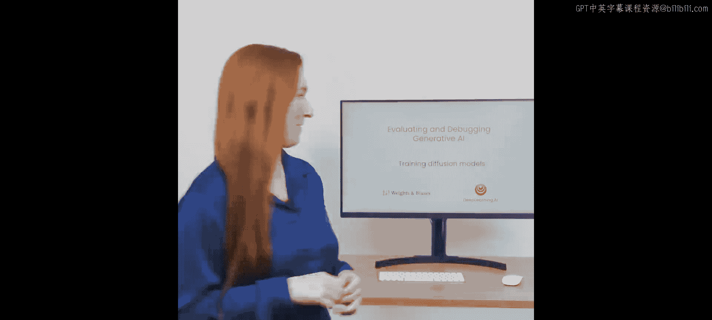
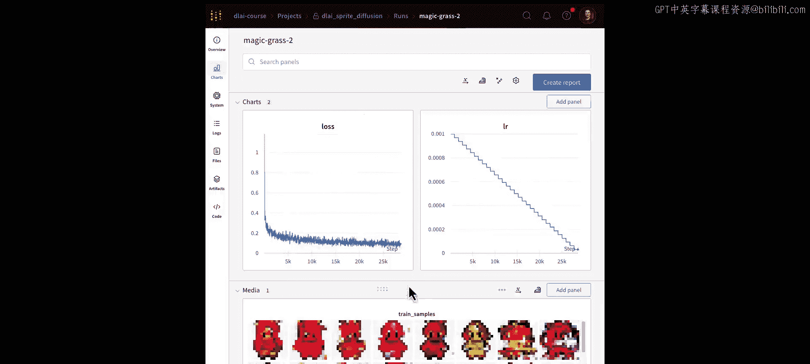
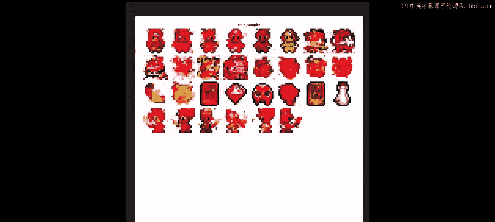
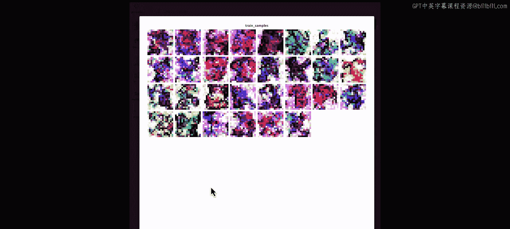
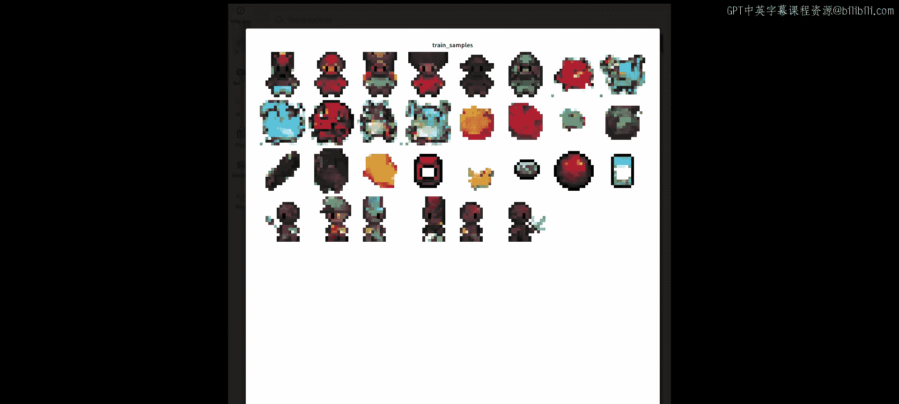
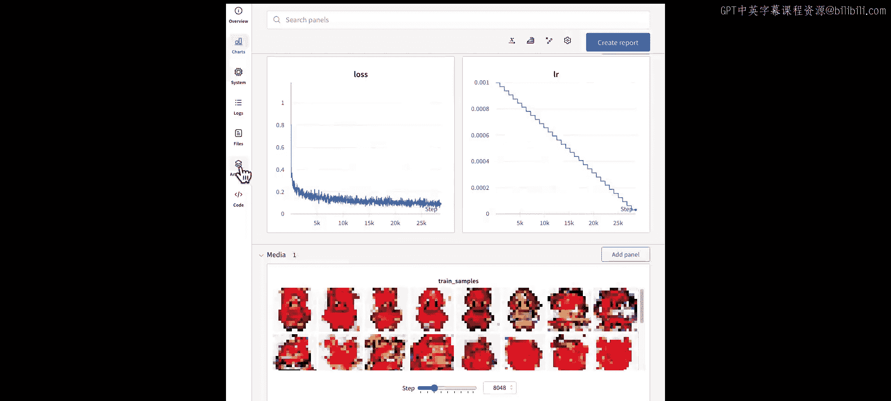
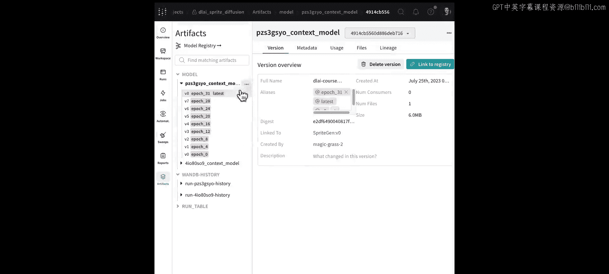
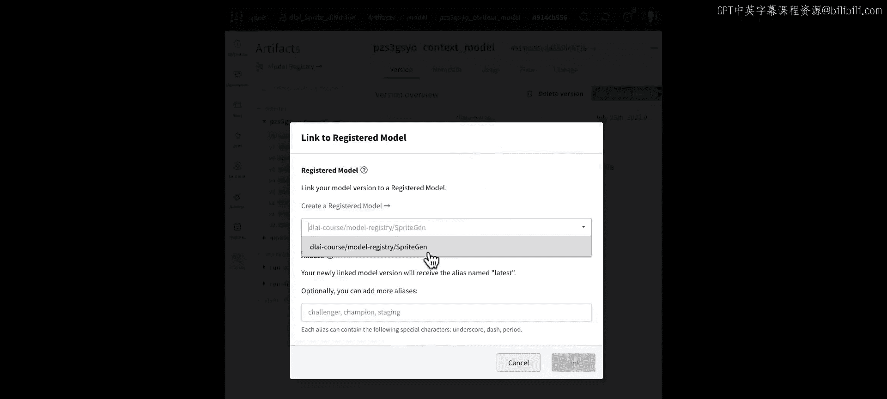
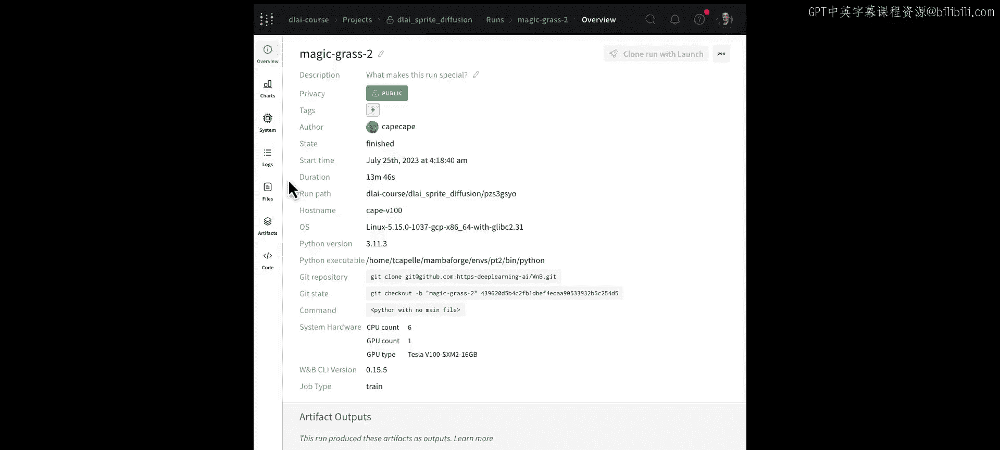

# 003：02_训练笔记本的插装

在本节课中，我们将训练一个扩散模型，并学习在此过程中使用的新工具。我们将从回顾扩散模型的关键概念开始，然后逐步完成一个训练笔记本的配置和运行，最后将训练好的模型注册到中央仓库。



## 概述：扩散模型与训练监控

上一节我们介绍了如何为模型插装。本节中，我们将实际训练一个扩散模型，并学习如何有效地监控和记录训练过程。

扩散模型是一种去噪模型。其核心思想不是直接训练模型生成图像，而是训练它从图像中移除噪声。

**训练过程**可以概括为：我们按照一个调度器向图像中添加噪声，然后让模型预测图像上存在的噪声。

**采样（生成）过程**则是：从纯噪声开始，迭代地去除噪声，直到最终图像显现。

在训练生成模型时，正确设置遥测数据至关重要。我们当然需要跟踪损失曲线等关键指标。然而，如下图所示，损失可能在早期就趋于平缓，但生成的样本质量仍然不佳。


因此，在训练期间定期从模型采样至关重要，即使损失下降幅度很小。图像质量会逐步提升。我们将把这些样本上传到Weights & Biases平台，同时保存模型检查点以保持一切井井有条。

## 进入训练笔记本

现在让我们进入具体的训练笔记本。我们将使用DeepLearning.AI课程《扩散模型工作原理》中的训练笔记本，该笔记本在Sprites数据集上训练一个扩散模型。我们不会深入探讨扩散模型的细节，如果你想了解更多，我们鼓励你学习那门课程。

以下是训练流程的主要步骤：

首先，我们导入相关库和W&B。

```python
import wandb
# ... 其他导入
```

接下来，我们建议你创建一个W&B账户，但你也可以匿名记录结果。这里我登录到我的个人账户，以便在我的共享仪表板中查看指标。

然后，我们将定义一些环境变量，例如保存模型和检查点的路径。如果你的设备支持CUDA GPU，我们也会利用它。

我们更新了这个笔记本，使用一个简单的命名空间来设置可能在多个实验间变化的超参数。

接下来，我们将导入相关的DDPM噪声调度器和采样器。这些元素对扩散模型训练至关重要，因为噪声是在不同时间步通过调度器移除的。

随后，我们创建要训练的神经网络，使用之前课程中的示例数据集，创建数据加载器，并设置优化器。

## 设置训练循环

接下来，让我们设置训练循环。为了保持组织性和一致性，我们只生成一次噪声，用于重复生成样本。

现在，我们进入脚本的训练阶段，开始实际训练模型。我们首先初始化一个W&B运行来跟踪这次训练。

```python
run = wandb.init(project="DLAI-Sprite-diffusion", job_type="training")
```

这个运行将被存储在“DLAI Sprite diffusion”项目中，并分类为“training”。指定任务类型有助于我们日后轻松识别此任务。配置也会被存储，以便跟踪此次训练使用的参数供将来参考。我们还传回W&B配置，以便未来需要时，可以让Weights & Biases来编排和更改这些值。

标准的训练循环会运行多个周期，处理数据加载器并计算前向和后向传播。

这些指标被记录到Weights & Biases。在本例中，跟踪损失、学习率和当前周期数。

接下来，我们希望保存训练结果。我们将每四个周期保存一次模型检查点。

```python
if epoch % 4 == 0:
    checkpoint_path = f"model_epoch_{epoch}.pth"
    torch.save(model.state_dict(), checkpoint_path)
    artifact = wandb.Artifact(name="model-checkpoints", type="model")
    artifact.add_file(checkpoint_path)
    wandb.log_artifact(artifact)
```

为了保存检查点文件，我将添加一个Weights & Biases工件来保存它。这是我们版本化并在运行中存储文件的方式。这里我们使用工件来保存模型检查点，但我们也可以用它来保存数据集、预测结果甚至代码。

同时，我们希望采样一些图像以便在工作区查看，因此我将在这里使用`wandb.log`和`wandb.Image`添加图像记录。

```python
sampled_images = sample_from_model(model, ...)
wandb.log({"samples": [wandb.Image(img) for img in sampled_images]})
```

这使我能够实际可视化地看到结果并查看样本预测。

最后，我们通过调用`wandb.finish()`来结束这次运行。

## 查看训练结果

在CPU上运行此脚本需要一些时间，因此我将切换到一个我们已经为你运行好的示例。

在这个示例工作区中，你会看到你的损失曲线随时间下降。这是一个好迹象，意味着你的模型随着持续训练而变得更好。

让我们也看看你的模型生成的一些样本。如果我滚动回最开始，可以看到这些图像看起来颗粒感很强，噪声很大，很难分辨每张图像应该是什么。

但随着你滚动查看每个步骤，你可以看到随着时间的推移和模型的训练，它开始改进。现在你的模型实际上正在生成一些看起来非常不错的图像。这张看起来有点像尤达大师。

## 注册模型



既然我们有了一个在生成精灵方面表现不错的模型，现在让我们实际获取该模型并使其对团队的其他成员可用。







你将打开“Artifacts”选项卡，然后拉取最新的模型，即最近的版本。






并将其链接到模型注册表。现在，我们有了“Sprite generation model”。链接模型后，你可以在模型注册表中看到结果。




模型注册表为你的团队提供了一个中心位置来查看所有最佳模型版本。你还可以查看模型的来源谱系，并轻松返回到那个训练运行，查看指标、样本图像以及生成此模型的精确Git提交。

## 总结

本节课中，我们一起学习了如何训练一个扩散模型并监控其过程。我们回顾了扩散模型的核心概念，即通过去噪进行训练和采样。我们逐步完成了训练笔记本的设置，包括初始化W&B运行、记录损失和图像、保存模型检查点作为工件。最后，我们将训练好的模型注册到中央模型注册表，以便团队协作和版本管理。



我们已经讨论了跟踪训练和查看最佳模型版本，接下来我们将讨论如何对扩散模型进行采样。