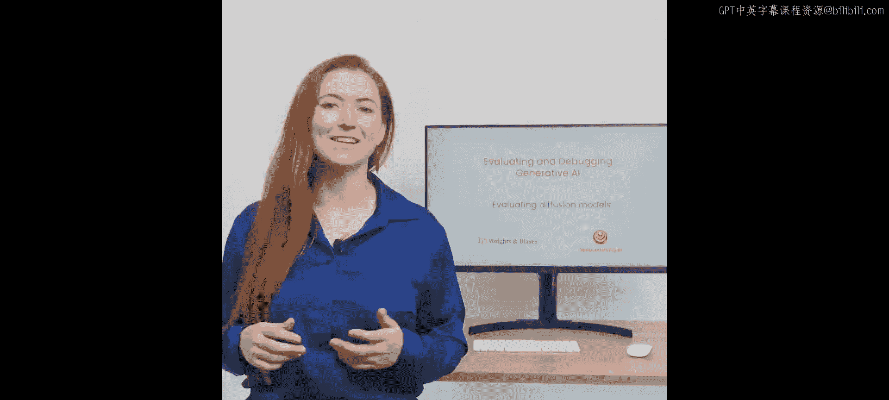
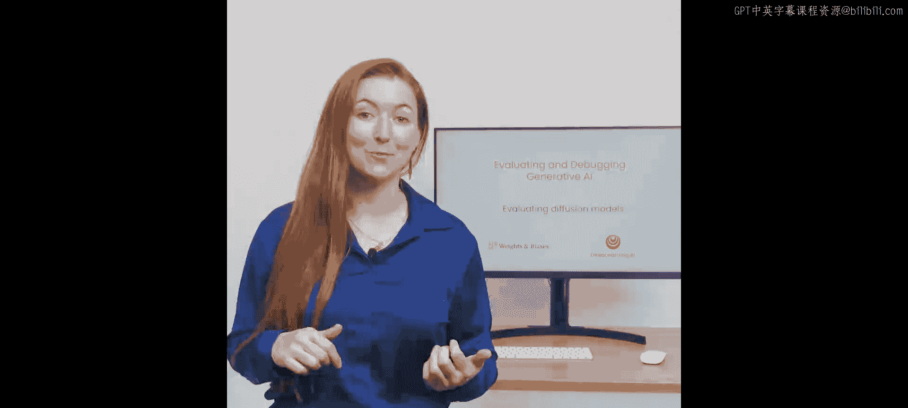
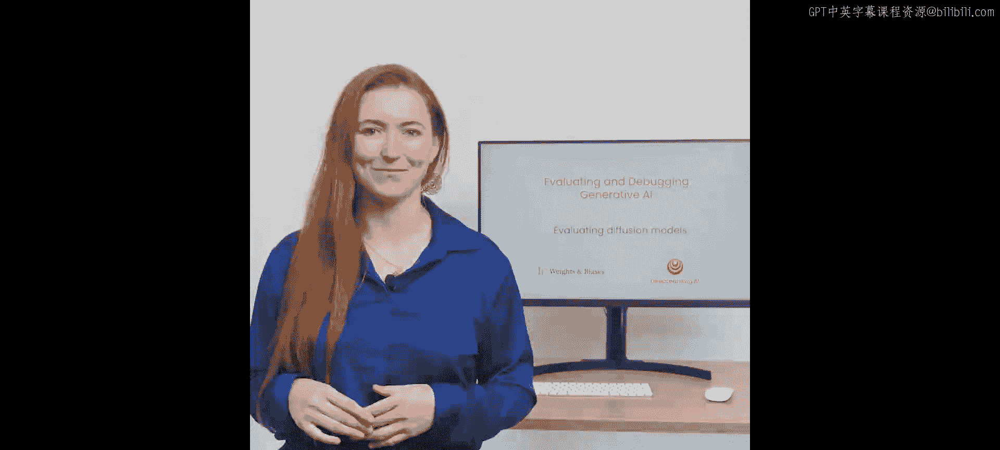
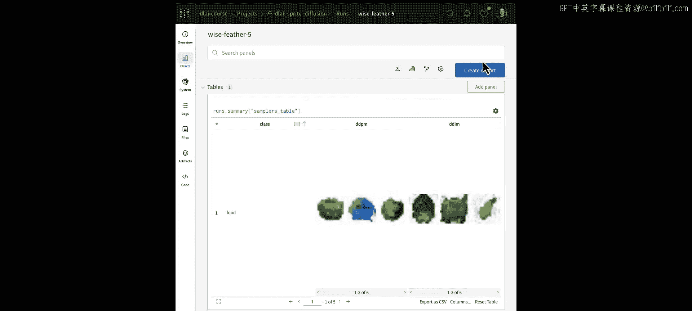
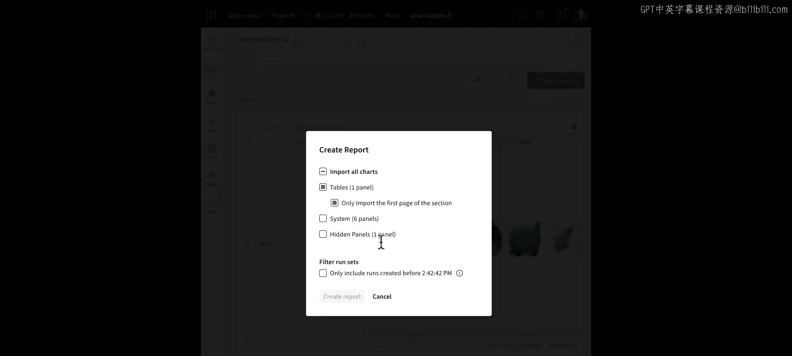
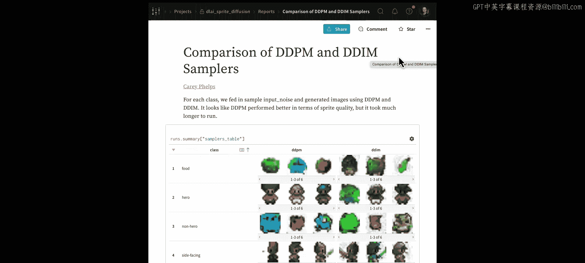
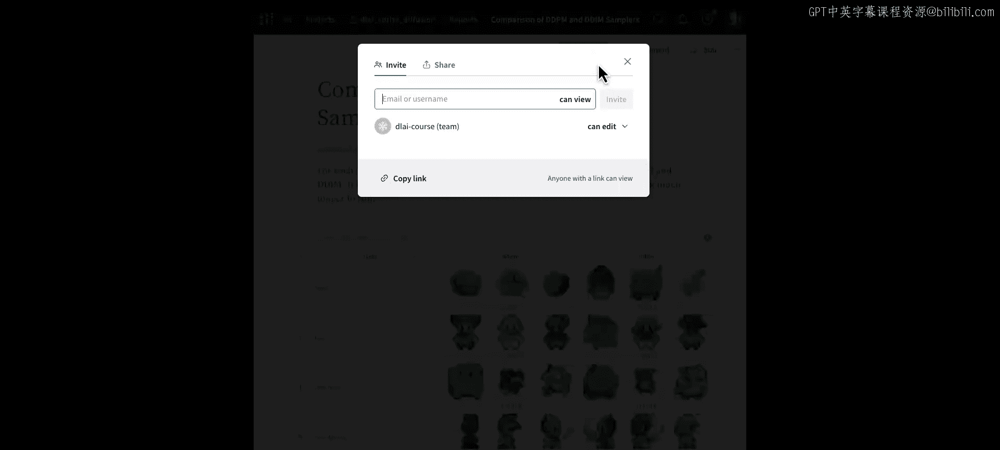
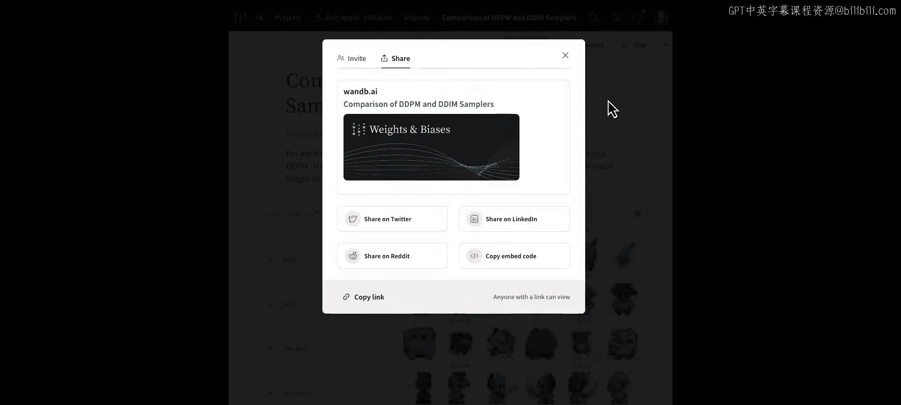
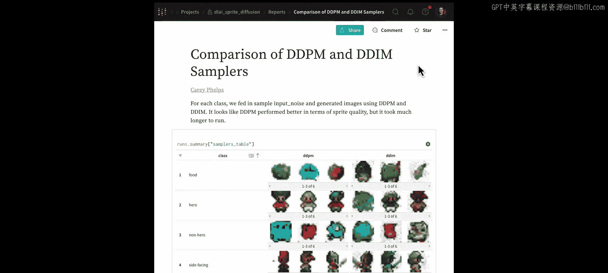

# 004：在W&B中监控和调试训练运行

## 概述
在本节课中，我们将学习如何比较扩散模型的输出。我们将使用上一节课训练好的模型，通过Weights & Biases平台，对比不同采样算法（如DDPM和DDIM）生成图像的质量和速度。你将学会如何从模型注册表中获取模型，生成样本，并使用W&B的表格功能进行可视化比较和分享。

---







## 模型注册表：中央管理系统

上一节我们介绍了扩散模型的训练，本节中我们来看看如何管理已训练好的模型。

模型注册表是一个组织内所有机器学习模型的中央系统。它作为所有生产就绪模型的记录系统，可用于管理模型从测试到生产的整个生命周期。

模型注册表不仅是一个存储系统，还能通过促进不同团队间的协作来提升团队合作效率。它会详细记录模型在训练、评估和生产阶段的谱系，帮助我们控制和理解模型的整个生命周期。

此外，注册表还能自动化多个下游任务，从而提高效率。为了直接从注册表中比较和评估模型，我们将使用“表格”功能。

---

## 使用W&B表格进行可视化比较

表格可以被视为一个强大的、类似数据框的对象，你可以用它来记录、查询和分析数据，包括视频、图像、分子等富媒体内容。

以下是使用表格的基本流程：
1.  创建一个表格。
2.  为表格命名列。
3.  逐行更新表格数据。
4.  完成后，使用 `wandb.log` 记录表格并为其命名。

现在，让我们深入代码部分。

---

## 从训练好的扩散模型中采样

为生成模型计算指标非常困难，并且在质量和速度之间存在权衡。因此，我们通过比较不同的采样算法来评估模型。在本节结束时，你将学会如何直观地比较不同采样器的效果。

首先，运行必要的导入并登录W&B。

```python
# 设置参数并将配置存储在简单的命名空间中
import wandb
# ... 其他导入和设置代码
```

在之前的笔记中，我们保存了一个训练好的模型，将其放入一个“工件”中，并注册到了模型注册表。现在，我们使用以下代码片段将工件拉取回来。

我们首先使用W&B API从注册表中拉取模型，这样就将模型下载到了本地计算机。同时，我们还获取了生成该模型的训练运行的相关信息。

```python
# 从注册表拉取模型
api = wandb.Api()
run = api.run("项目路径/运行ID")
model_artifact = run.use_artifact('模型工件名称')
model_path = model_artifact.download()
```

现在，我们可以从模型工件中加载权重，并使用与原始训练相同的参数来重建模型。

```python
# 加载模型权重并重建模型
model = create_model_with_original_params()
model.load_state_dict(torch.load(f'{model_path}/pytorch_model.bin'))
model.eval()
model.to(device)
```

不要忘记将模型设置为评估模式并转移到相应的计算设备上。

---

## 比较DDPM与DDIM采样器

现在，让我们设置训练时使用的扩散采样器，在本例中是DDPM。接下来，我们将定义一些固定的噪声和上下文向量，就像在训练时一样。

为了让实验更有趣，我们还将导入另一个名为DDIM的采样器（同样来自扩散课程材料）。这个采样器运行速度更快，但会牺牲一些输出质量。我们的目标是比较两个采样器的输出。

为了实现这个目标，我们生成两组样本。首先，使用DDPM采样器生成样本。

```python
# 使用DDPM采样器生成样本
samples_ddpm = ddpm_sampler(model, noise, context, timesteps=500)
```

这个过程需要一些时间。接下来，让我们与DDIM采样器进行比较。

```python
# 使用DDIM采样器生成样本
samples_ddim = ddim_sampler(model, noise, context, timesteps=25)
```

当我运行DDIM采样器时，它只迭代了25个时间步，因此比DDPM（500个时间步）要快得多。

---

## 在W&B表格中记录并比较结果

现在，让我们在一个可视化表格中比较我们的结果。这个表格的行为类似于一个数据框，可以在你的W&B项目工作区中渲染。

接下来，我们将遍历样本，逐行将它们添加到表格中。我们还将类别名称和输入噪声添加到表格中。

```python
# 创建表格并逐行添加数据
table = wandb.Table(columns=["输入噪声", "DDPM结果", "DDIM结果", "类别"])
for i in range(num_samples):
    table.add_data(wandb.Image(noise[i]), wandb.Image(samples_ddpm[i]), wandb.Image(samples_ddim[i]), class_names[i])
```

在这里，我们逐行构建表格，同时展示图像、类别名称和输入噪声。

创建好表格后，我们可以将其记录到项目中。为此，调用 `wandb.init`，使用与之前相同的项目，但这次将作业类型设置为“Samplers Battle”，这将使我们更容易找到这个新的运行记录。

```python
# 初始化一个新的W&B运行并记录表格
wandb.init(project="你的项目名", job_type="Samplers Battle")
wandb.log({"samplers_table": table})
wandb.finish()
```

接下来，设置表格的名称为“samplers_table”，并将其直接记录到运行中。运行这个单元格，结果就会显示在UI中。

表格上传完成后，我可以点击该运行记录，在新标签页中打开并查看生成的图像。

在这里，我们找到了“samplers_table”，可以看到输入噪声、DDPM结果、DDIM结果以及类别。例如，这里有一行是“英雄”类别的图像。

为了比较两个采样器，你可以看到相同的输入噪声实际上从两个采样器生成了两种不同的结果。有趣的是，这些结果在某种程度上依赖于输入噪声。

我将展开表格并调大行高，以便在大屏幕上查看这些图像。例如，在这一行中，这两个角色看起来非常相似，但DDPM生成的图像似乎质量更好。

---



## 分组查看与报告分享



现在，我将按类别分组，以便并排查看所有“英雄”类别的图像。点击菜单，选择“按列分组”，系统会自动将所有“英雄”样本图像组织到一行中。

接下来，我将隐藏“输入噪声”列，可以通过点击菜单并选择“移除”来完成。

现在，我可以轻松地翻看“英雄”、“非英雄”或“食物”类别的样本图像了。这个视图很有趣，我想与我的同事分享。

因此，我可以创建一个报告，并将这个样本表格拉取进来。我会展开表格使其更清晰可见，并切换视图模式以查看更多行。

我可以在报告内部添加一些上下文和注释，这样如果我发送给同事，他们就能了解发生了什么以及我的发现是什么。我将给这个报告起一个有用的标题，并描述我的发现。在本例中，DDPM的表现似乎优于DDIM。我会解释发生了什么，这样任何收到报告的同事都有足够的背景信息来查看这个表格并理解结果。

现在，我点击“发布到项目”。这意味着这份报告对所有同事都可用。



如果你想分享一份报告，操作很简单。你可以通过电子邮件或用户名邀请他人，也可以直接分享链接。

---





## 总结



本节课中，我们一起学习了如何在Weights & Biases平台中比较扩散模型的输出。我们回顾了模型注册表的作用，使用W&B表格功能对DDPM和DDIM两种采样器生成的图像进行了可视化对比，并学会了如何通过分组查看和创建报告来分析与分享实验结果。这为我们评估生成模型的质量提供了一种直观有效的方法。接下来，我们将学习如何评估大语言模型。