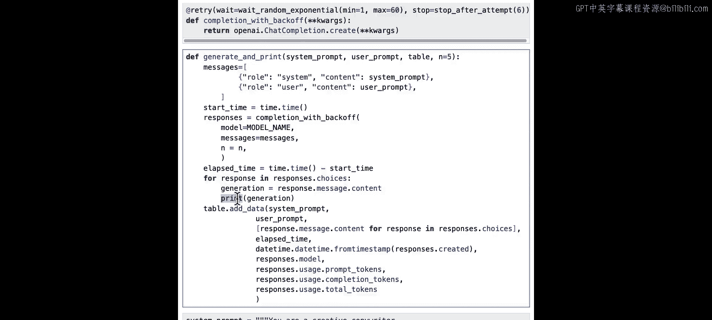
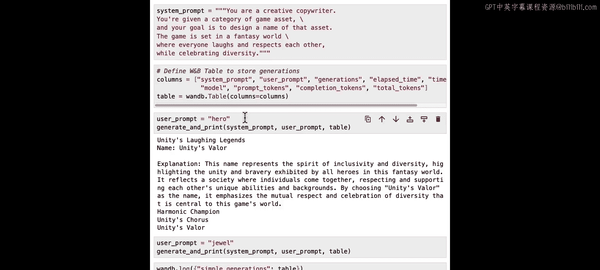
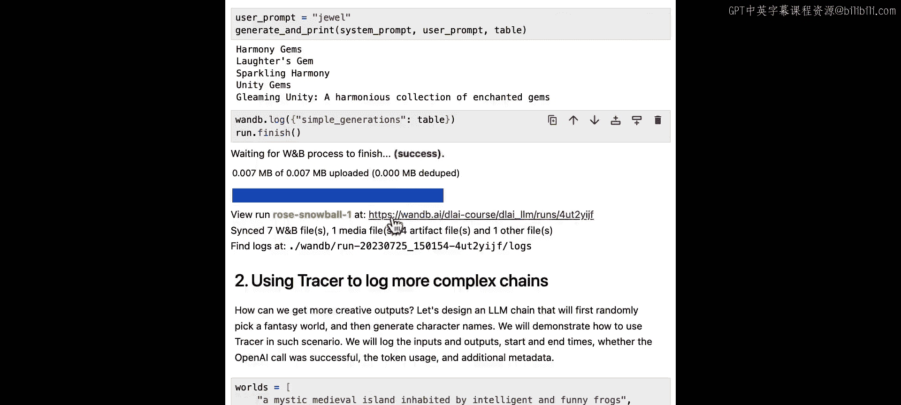
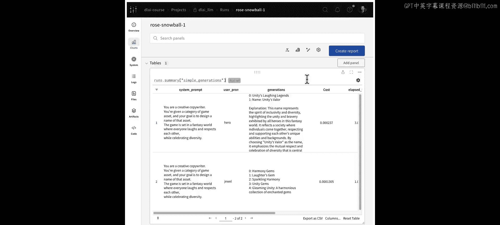
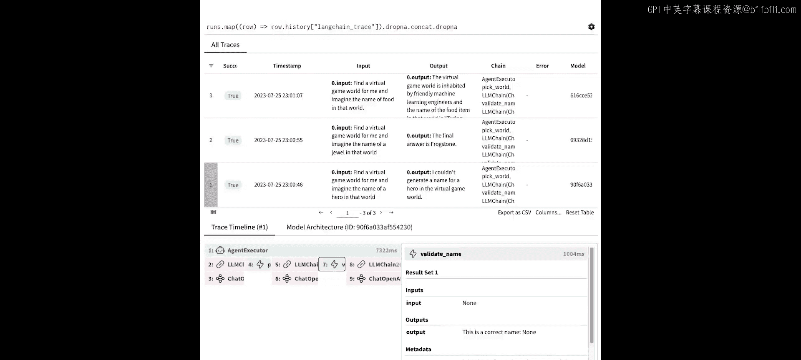

# 005：04_评估生成式图像模型

在本节课中，我们将学习如何评估大型语言模型。我们将深入细节，查看单个生成的样本。让我们开始使用笔记本。

## 概述：我们将要学习什么

在本节课中，我们将通过三个循序渐进的例子，学习如何使用工具来评估、分析和调试LLM的输出。我们将从最简单的API调用开始，逐步深入到更复杂的链和代理的跟踪与调试。

---

## 第一课：使用表格评估LLM输出 🧮

上一节我们介绍了课程目标，本节中我们来看看第一个也是最简单的例子：直接调用LLM API并记录结果。

我们将遵循一个直接的工作流程。首先，设计系统提示词和用户提示词。之后，使用聊天补全API调用OpenAI端点。API将作出响应，然后我们解析结果并将其记录在W&B表格中。

我们将继续使用虚拟游戏世界的设定，这次的任务是为游戏资产生成名称。

现在，让我们跳转到笔记本。首先运行导入并设置API密钥。

接下来，定义项目名称并指定要使用的模型，本例中使用GPT-3.5 Turbo。

然后登录，以便跟踪我们的结果。现在，初始化一个新的运行来跟踪生成过程。

我们有一些辅助代码。首先定义 `completion_with_backoff` 函数，这个函数可以避免速率限制。然后定义一个函数，它接收系统提示词、用户提示词和一个W&B表格。我们将使用 `completion_with_backoff` 函数来收集响应。此外，我们还会跟踪每次响应后的开始时间和经过时间。

对于每个生成的响应，我们都会打印出结果。如果你运行更多实验，在笔记本中打印结果效率不高，这就是为什么我们要将所有输出记录到表格中。

这里我们定义了系统提示词。它要求语言模型扮演一个创意文案的角色，根据类别为游戏资产生成名称。

接下来，创建一个包含我们想要跟踪的所有列的表格。

现在，让用户提示词为“hero”，看看模型生成了什么名字。很好，这些名字听起来确实像英雄。“Harmonic Champion”、“Unity’s Chorus”、“Unity’s Valor”，我喜欢这些名字。

接下来，为游戏中的一个物品生成名字，让用户提示词为“Jewel”。很好，这里有几个选项：“Harmony Gem”、“Laughter’s Gem”、“Gleaming Unity”。看来“Unity”是一个大主题。

现在，将这个表格记录下来，然后去W&B界面查看。接下来，点击这里打印出的运行链接来查看仪表板。

在这里，你可以看到刚刚在笔记本中生成的结果，但它们已被保存下来，以便你以后可以回顾，或者与他人分享。

我将展开这些列，以便更好地查看文本。我可以看到系统提示词、用户提示词和生成的例子。现在我想估算一下成本：我们为生成这些资产名称向OpenAI API支付了多少钱。

因此，我可以创建一个新列来进行计算。在这里，我将鼠标悬停在行标题上，然后点击“插入右侧”。现在我得到了一个只显示“行”的新列，点击它。现在我可以更新单元格表达式，在这里输入方括号和 `total_tokens`。我们想用令牌数乘以估算成本，本例中因为使用OpenAI，成本是0.0000015。

很好，现在我们有了一个新列，它是总令牌数乘以那个数字，让我们将其重命名为“cost”，以便其他人更容易理解发生了什么。

现在，这个表格可以分享给同事，展示我为生成名称所做的尝试。

---

## 第二课：使用追踪器调试LLM链 🔍

上一节我们学习了如何用表格记录和评估简单输出，本节中我们来看看如何调试更复杂的LLM链。

在第二个例子中，你将创建一个简单的链。虽然这看起来像是一个玩具示例，但你可以用它来演示“追踪器”的概念，这对于调试LLM链和工作流非常强大。

你的链将只包含两个动作。第一个动作涉及选择一个虚拟世界，你将其称为“World Picker”。当你使用这个工具时，你将跟踪各个方面，例如输入、输出、开始和结束时间、结果以及动作是否成功。

然后，将输出（即虚拟世界）传递给链中的下一步，即生成描述。这一步带有另一组需要跟踪的输入和输出，以及它们的开始和结束时间以及最终结果。

这两个步骤都将被追踪为“跨度”。它们将成为“My Chain Trace”的一部分，这将帮助你理解和分析这个工作流。

现在让我们在代码中看看。

我们将创建并追踪一个链来为我们的资产生成名称。首先，定义三个示例世界，并从这个列表中随机挑选。

然后定义配置，我们仍然使用GPT-3.5 Turbo，你可以在这里设置温度，目前是0.7，但如果你希望模型更有创意，可以提高这个值。

系统消息要求LLM扮演创意文案的角色。因此，我们不仅向LLM提供游戏资产的类别，还提供一个奇幻世界。目标是在给定的奇幻世界中为资产设计一个名称。

下一个函数将执行我们的创意链，说明追踪的概念以及它是如何构建的。

我们将从顶层跨度“creative_chain”开始。然后定义一个“world_picker”工具，我们将从列表中随机挑选一个世界，跟踪开始和结束时间，并记录这个跨度的输入和输出。我们将这个工具跨度添加到我们的顶层追踪中。

接下来，我们将这个工具的输出传递给LLM链，这需要一个系统提示词和一个用户提示词。我们使用OpenAI聊天补全，并将其作为追踪保存到Weights and Biases。然后将其添加到我们的顶层追踪中。更新元数据，并通过记录根跨度将所有跨度记录到W&B。

最后，打印出我们链的响应。

现在我们可以启动一个Weights and Biases运行。我们将尝试使用“hero”和“jewel”的游戏资产提示词来运行这个链。

既然我们已经执行了这些创意链，我们可以看到结果。然而，我们并不确切知道后台发生了什么。我们是如何为英雄得到“Volcanic Sentinel”，或者为珠宝得到“Gleamstone”这个名字的？

让我们完成这个运行，然后在用户界面中更仔细地查看结果。

在这里，我将点击这个运行的链接，以便看到表格。现在在这个表格中，我可以看到我们刚刚运行的结果，即追踪视图。我将展开它。

顶部是表格，它捕获了我们发送的两个输入（“hero”和“jewel”）以及输出（生成的名称）。但是幕后发生了什么？当你点击第1行时，你可以在下面的追踪时间线中看到幕后发生的事情。

那么对于第一行，让我们看看这两个步骤。首先，“World Picker”工具将“hero”作为输入，并产生一个描述：“A Modern Castle”，这是从三个选项的数组中随机选择的。

这个结果随后被传递到下一步，即OpenAI LLM。你可以看到生成的输出“that modern fantasy castle”现在实际上被拉到了这个下一步中。现在，对于该LLM的输入，我们有系统提示词以及来自World Picker的结果。

这个追踪时间线帮助我们理解这个链的执行以及这些步骤是如何组合在一起的。现在，这个追踪时间线相当简单，只有两个步骤。但当你的链中有很多不同的步骤，链更长、更复杂时，这将非常有用，它将允许你调试并精确定位任何问题，如果结果不符合预期的话。例如，如果World Picker失败了，我们可以在这里看到。

虽然手动定义链可能很繁琐，但有像LangChain这样的库可以加速这个过程。我们将在下一个例子中讨论这一点。

---

## 第三课：追踪LangChain代理的决策过程 🤖

上一节我们介绍了如何手动追踪链，本节中我们来看看如何使用LangChain库和追踪功能来理解更复杂的代理行为。

这最后一个例子使用了LangChain代理。与链中每个步骤都是预先确定和固定的不同，代理使用LLM进行推理，并决定采取什么步骤或使用什么工具。在演示中，你将看到代理更加不可预测，更不确定，因此更难调试，使用追踪器将很有帮助。

除了“World Picker”工具，这次我们还将让代理使用一个新工具：“Name Validator”，用于检查名称是否看起来不错。

现在，让我们回到笔记本看看实际操作。首先，运行必要的导入。然后，开始一个新的运行来跟踪我们的结果。

接下来，设置一个环境变量 `LANGCHAIN_WANDB_TRACING` 为 `true`。这设置了跟踪功能，以便自动记录这些追踪。

现在让我介绍我们的工具。我们将保持简单，因为这个例子只是为了说明追踪的概念。第一个工具是“World Picker”，它随机从世界列表中返回一个选择。第二个工具是“Name Validator”，它检查查询的名称是否少于20个字符。如果是，它会说“This is a correct name”，否则会说“This name is too long”。

我们将再次使用OpenAI API，温度为0.7。如果你想要更多创意，可以调高这个值。然后，我们将用一个工具列表来初始化代理。

好了。现在我们准备好运行一个查询。我们将要求我们的代理找到一个虚拟游戏世界，并想象那个世界中一个英雄的名字。

代理启动了一个新链，我们甚至不需要等待它，我们可以运行代理几次并查看结果。

我将点击这里打印出的运行链接来打开仪表板。

现在你在你的工作区，可以看到追踪列表。点击你的第一行，并展开它以更好地查看。

在这里，表格的第一行中，输入是“find a virtual game world and imagine the name of a hero”。但输出是“I couldn’t generate a name for the hero”。现在，这是个问题。这个追踪中出了些问题。让我们深入并找出问题所在。

向下滚动到追踪时间线部分，我可以看到代理为得到那个结果所采取的步骤。让我们从第一步开始，我们输入了提示词。我们可以看到代理的推理：“我应该先挑选一个虚拟游戏世界，然后为那个世界中的英雄生成一个名字。”然后它采取了行动“pick_world”。

很好，那么接下来那个世界发生了什么？它被拉入下一步，LLM查看那个虚拟世界并需要为英雄生成一个名字。模型输出：“我已挑选了一个由友好的机器学习工程师居住的虚拟游戏世界，现在我需要为那个世界中的英雄生成一个名字。”

但这就是出错的地方。它接着说：“Action: validate_name”和“Action Input: none”。所以它实际上还没有生成名字，它直接跳到了验证步骤。这就是问题所在。

当我们到达“validate_name”步骤时，它接收输入“none”，因为没有生成名字，并给出输出：“This is a correct name: none”，因为从技术上讲，它少于20个字符，这是该工具的规则。

因此，使用这个追踪时间线视图，我们能够识别代理在哪里出错了，现在我们可以调试这个问题，以便在未来的生成中修复它。

## 总结：本节课的核心要点

在本节课中，我们一起学习了如何评估和调试生成式AI模型。我们从简单的API调用和表格记录开始，逐步深入到使用追踪器来可视化复杂的LLM链和代理的执行过程。通过分析追踪时间线，我们获得了关于链可能在何处出错的宝贵见解，并可以利用这些信息来改进结果，使我们的代理更加成功。

在下一课中，我们将讨论如何微调LLMs。