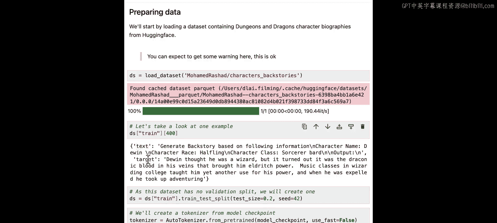
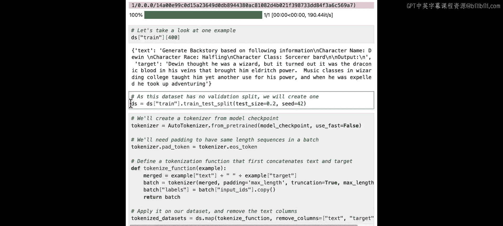
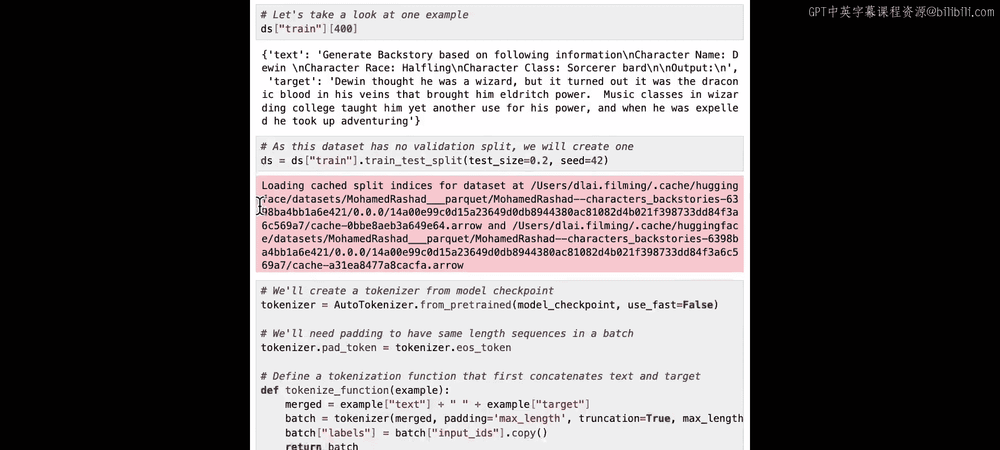
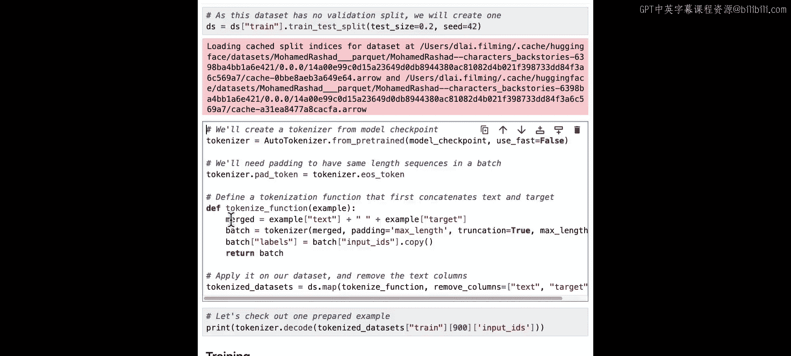
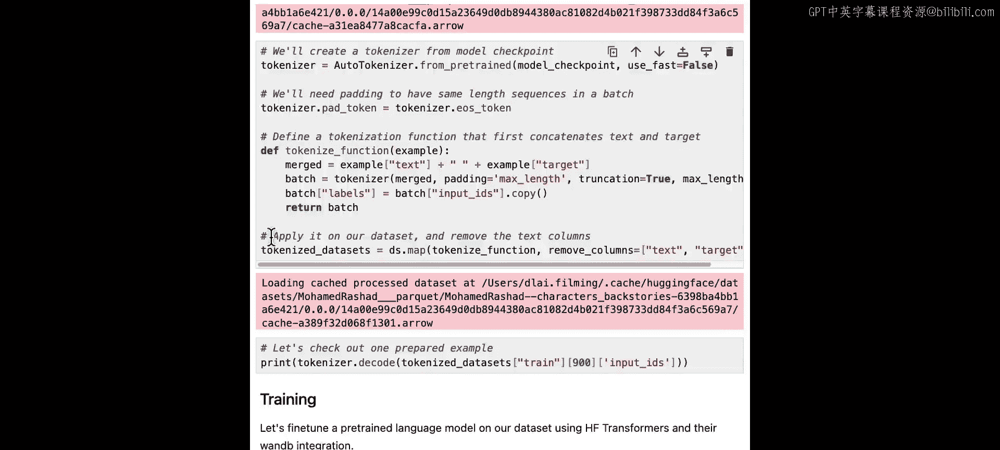
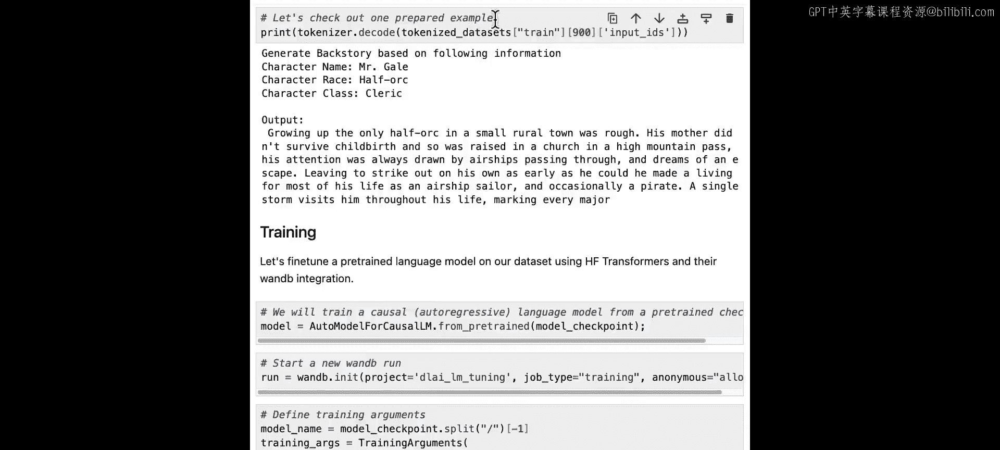
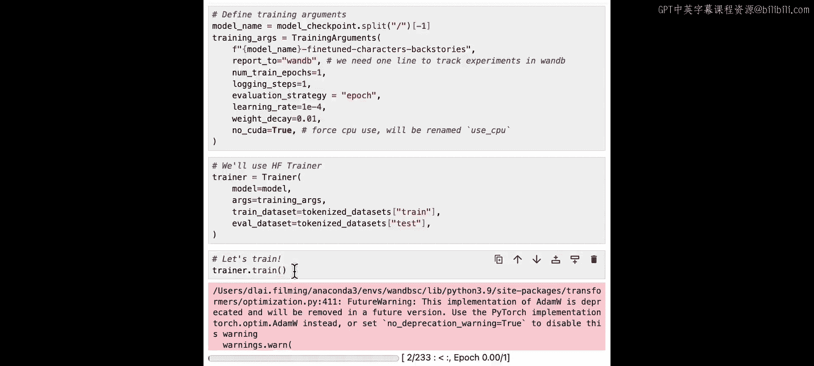
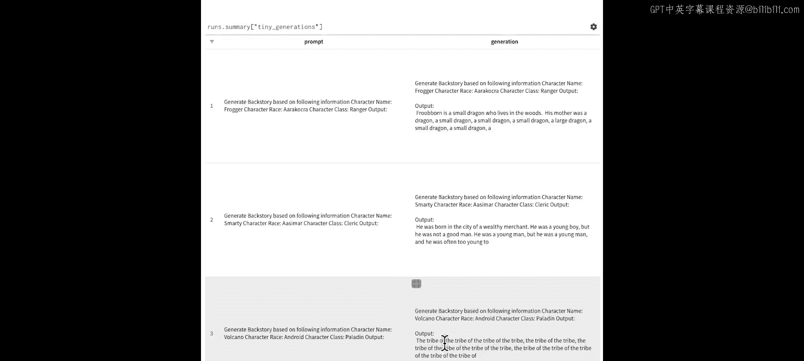

# 006：评估和调试大语言模型

在本节课中，我们将要学习如何训练或微调一个全新的大语言模型，并重点关注在此过程中的评估与调试方法。上一节我们介绍了通过API使用大语言模型，本节中我们来看看如何从零开始训练或对现有模型进行微调。

😊

从头开始训练大语言模型耗时且成本高昂，评估过程同样复杂且消耗资源。因此，密切监控训练过程并使用检查点来应对意外问题至关重要。

以下是训练过程中的关键监控点：
*   从仪表板获取有价值的信息，仪表板会显示训练进度和各项指标。
*   在需要时，仪表板能帮助你获取模型检查点。

微调方法让你能够以更经济的方式优化大语言模型，即使计算资源有限。但在评估过程中仍需谨慎。根据你希望大语言模型达成的目标，可能需要制定特定的评估策略。

接下来，让我们一起看看具体的代码实现。

我们将展示如何使用Hugging Face高效地在CPU上微调一个语言模型。为此，我们将使用一个名为`tiny-stories`、拥有3300万参数的小型语言模型。我们将在《龙与地下城》游戏世界的角色背景数据集上微调这个轻量模型。

和往常一样，从导入库和登录开始。然后设置要拉取的模型检查点。

我们将从Hugging Face Hub拉取数据集。观察这个示例，可以看到数据集有两列。`text`列要求模型生成背景故事，而`target`列则存放着已生成的角色背景故事。

我们将设置数据集分割，以便进行验证。

在训练模型之前，我们将合并并准备指令和故事，确保它们被分词和填充。我们还会创建标签。

标签与我们的输入完全相同。标签需要向右移动一个位置，因为模型应该预测序列中的下一个词元，这一步将由Hugging Face完成。

现在，让我们尝试生成一个样本来确保一切运行正常。当我们解码输出时，会看到指令后面跟着生成的背景故事。如果一切看起来都没问题，我们就可以继续了。

在进入模型训练之前，让我们先查看数据集中的一个示例，了解其具体样貌。

这里，它提取了角色名`Mr. Gail`和种族`Half-Orc`，然后给出了输出故事：“growing up that only half Ork in a small rural town was rough.” 这看起来不错，似乎是一个很好的模型输入。

现在让我们开始模型训练。我们将使用Hugging Face的`transformers.Trainer`，并演示其与Weights & Biases的简单集成。

我们创建的模型用于因果语言建模，这是一种类似于GPT的自回归语言模型架构，其核心是预测序列中的下一个词。我们将启动一个新的Weights & Biases运行，并将任务类型设置为`training`。

接下来，我们将定义一些训练参数，例如训练轮数、学习率、权重衰减。关键的是，我们将设置`report_to`为`wandb`。这意味着你所有的结果都将流式传输到同一个中央仪表板。这就是开始流式传输指标所需做的全部工作。让我们开始训练模型。

现在，我不想等到训练完成才开始查看结果，所以我会向上滚动到W&B运行记录。我可以点击这个链接来实时查看结果。

在这里，我可以看到指标随时间推移而流入，其中训练损失最让我感兴趣，这是我随时间监控的指标。在调试模型训练运行时，检查损失是否持续下降很有用，你希望看到这条曲线向右下方走。

一些非常大的语言模型可能需要数天甚至数周来训练，因此拥有这样一个可以远程查看的图表非常有帮助。这有助于我们确保模型持续改进，而不是浪费GPU资源。

很好，训练完成了。这是一个非常小的模型，为了效率只训练了一个轮次，所以结果不会完美。如果你有兴趣，我鼓励你尝试改进它们，也许可以通过延长训练时间或调整超参数。

😊

现在训练已完成，让我们从模型生成一些样本。回到笔记本中，我们定义了几个提示词，并用它们为我们的角色生成背景故事。之后，我们创建了一个新表格，针对每个提示词，我们将调用`model.generate`。我们可以在这里传递各种参数，如`top_p`或`temperature`来引导模型。我们将生成的文本添加到表格中，记录它并完成这次运行。

现在让我们在仪表板中查看结果。这里我正在项目页面查看结果，我可以展开那个表格来查看一些样本。

在表格中，我可以查看提示词和一些生成的输出样本。

这个提示词是针对一个名为`Froger`的角色。生成的内容是：“Fewborn is a small dragon who lives in the woods. His mother was a dragon, a small dragon, a small dragon, a small dragon, large dragon, a small dragon.” 这看起来可能有点卡在“dragon”这个想法上了。

我们有一个`Smarty`角色。他发生了什么？“He was born in the city of a wealthy merchant. He was a young boy, but he was not a good man.”

😊

最后，我们还有另一个例子，角色`Volcano`是一个安卓机器人。对于这个角色，输出仅仅是：“the tribe of the tribe of the tribe of the tribe.” 这作为一个背景故事似乎不太理想。

所以你可以看到这个小模型存在一些问题，这是可以理解的，因为我们优化的是速度而非性能。

从这里你可以看到，在训练生成式AI模型时，进行定性评估是多么重要。因为仅仅查看这些消息、这些输出，你就能判断它是否表现良好。

我们鼓励你根据你的具体用例想出可能相关的指标，然后实现它们，并与生成的文本一起记录下来。例如，你可以测量像**唯一词数量**这样的指标。在这个输出中，我们可以看到它实际上只用了三个词：“the”、“tribe”、“of”。所以这可能不是一个很好的输出。

因此，下次你训练或微调模型时，我们希望你能使用这些工具来更快地获得更好的结果。

😊

本节课中我们一起学习了如何微调一个大语言模型，包括数据准备、模型训练、使用仪表板监控训练过程（特别是**训练损失**曲线），以及如何对模型生成的结果进行**定性评估**。我们看到了即使是一个小型模型，通过监控和评估也能发现其生成内容的问题，这强调了在生成式AI开发中持续评估和调试的重要性。