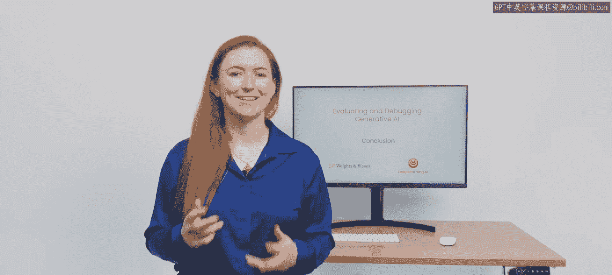
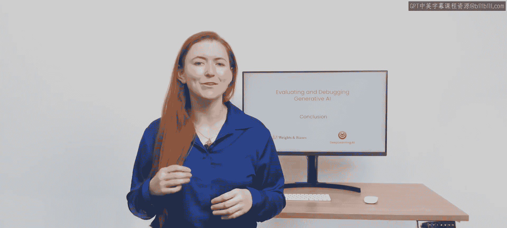
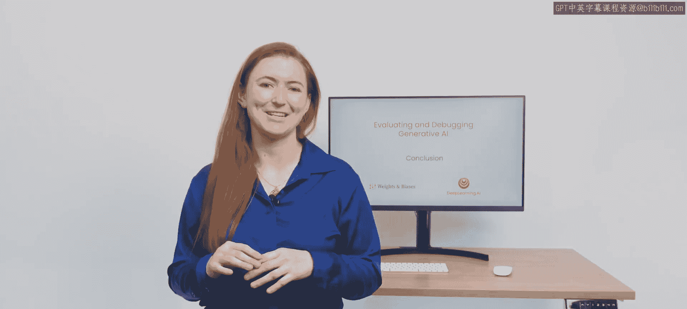

# 007：06_结论

在本节课中，我们将对《评估和调试生成型人工智能》课程进行总结，回顾所学到的核心技能与工具。

## 课程概述

恭喜你完成了本课程。现在，你已经掌握了如何对生成式模型进行迭代、如何追踪实验的结果，以及如何分享研究发现。借助这些工具，你的开发过程将变得更加透明和可复现。我迫不及待想看到你的成果。

## 核心技能回顾

上一节我们介绍了评估生成式AI的具体方法，本节中我们来总结整个课程的核心收获。以下是你在本课程中学到的关键能力：

*   **迭代生成式模型**：掌握了通过系统化实验来改进模型性能的方法。
*   **追踪实验结果**：学会了使用工具记录和管理不同实验的输入、输出与评估指标。
*   **分享研究发现**：理解了如何清晰地呈现和沟通实验过程与结论，促进团队协作。

## 工具的价值

拥有了上述技能和相应的工具，你现在能够建立一个更高效的开发流程。这个流程的核心优势在于其**透明性**和**可复现性**，这对于任何严肃的AI项目都至关重要。

## 总结

本节课中我们一起学习了《评估和调试生成型人工智能》课程的最终结论。我们回顾了如何迭代模型、追踪实验与分享发现，并明确了这些实践如何使你的开发工作更加透明和可复现。现在，你已经具备了推动生成式AI项目向前发展的坚实基础。