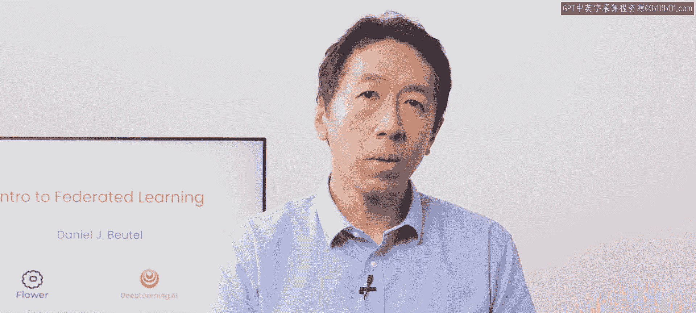
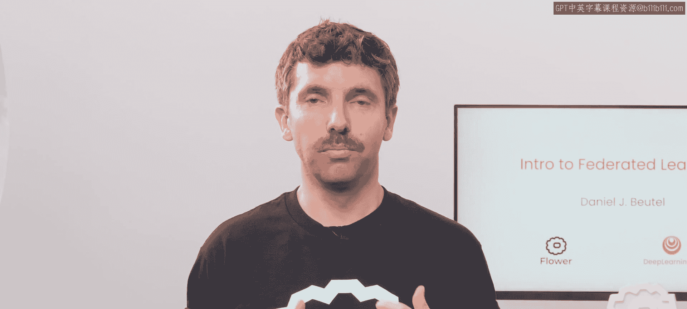
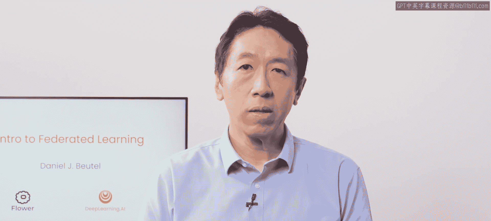
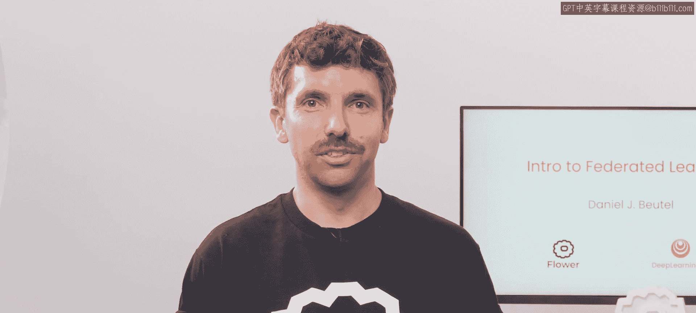
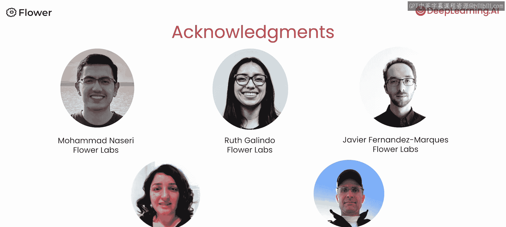

# 001：课程介绍与动机 🎯

在本节课中，我们将要学习联邦学习的基本概念、其核心动机以及它如何解决传统机器学习中的数据隐私和集中化挑战。我们将通过一个简单的例子来理解联邦学习的工作流程。

---

欢迎来到由Flower Labs合作打造的《联邦学习入门》课程。我很高兴向大家介绍本课程的讲师Daniel Boyitto，他是开源联邦学习框架Flower的创始人之一。

感谢Andrew。我很高兴来到这里。在本课程中，你将使用Flower探索联邦学习。Flower是一个流行的开源框架，拥有庞大的AI研究者和开发者社区。它将使你能够构建一个联邦学习系统，并以一种增强隐私保护的方式运行分布式机器学习训练任务。

## 什么是联邦学习？🤔

上一节我们介绍了课程和讲师，本节中我们来看看联邦学习要解决的核心问题。

假设你想在医学图像上训练一个模型，但这些图像分散在不同的医院中。由于隐私和法规限制，可能无法将所有图像集中收集到一个地方。而通过联邦学习，你可以在分布式数据源上进行训练，而无需将所有数据集中起来。

其核心思想是：**不将数据移动到训练处，而是将训练移动到数据处**。具体做法是在所有医院运行分布式训练任务，之后仅集中模型参数，而非原始数据本身。通过这种方式，最终可以得到一个受益于所有医院数据的模型，而无需任何原始数据离开其所在的医院。

## 联邦学习工作流程示例 ✍️

在理解了基本概念后，我们通过一个具体例子来看看联邦学习是如何运作的。

在本课程中，你将使用MNIST手写数字数据集进行探索。假设数据被分割，每个部分都缺少一些数字。例如，一部分数据缺少数字1，另一部分则缺少数字7。

以下是联邦学习在此场景下的工作步骤：

1.  **本地训练**：你使用你拥有的手写数字数据（例如，缺少数字1的数据集）在本地训练模型。同时，其他人使用他们自己的数据（例如，缺少数字7的数据集）进行训练。
2.  **参数上传**：训练完成后，每个人将更新后的模型参数发送到中央服务器。
3.  **聚合更新**：服务器聚合来自所有数据源的模型更新，从而改进一个全局模型。**关键点在于，服务器无法访问任何个体的原始数据源**。
4.  **模型共享**：改进后的全局模型可以与所有人共享。

这个过程可以公式化地表示为一种常见的聚合方法（如FedAvg）：
`w_global = ∑ (n_k / n) * w_k`
其中，`w_global`是全局模型参数，`n_k`是客户端k的数据量，`n`是总数据量，`w_k`是客户端k训练后的模型参数。

## 联邦学习的优势与意义 🌟

了解了工作流程后，我们来看看联邦学习为何如此令人兴奋及其重要意义。

联邦学习让我们能够在数据始终由拥有它的用户和组织控制的前提下，构建强大而精确的模型。通过在单个设备或服务器上本地训练模型，我们可以利用广泛的数据，而无需在中心共享实际数据。

这种方法对于医疗保健和金融等领域尤其重要，因为这些领域的数据非常敏感，需要被保护。联邦学习使我们能够为那些以前没有足够数量或足够多样性训练数据的任务训练模型。

## 本课程你将学到什么 📚

在概述了联邦学习的价值之后，本节将简要介绍你将在本课程中掌握的具体技能。

在本课程中，你将学习：
*   联邦训练过程的工作原理。
*   如何调整和优化联邦学习系统。
*   如何在联邦学习中考虑数据隐私。
*   如何考虑联邦学习过程中的带宽使用。

你还将学习**差分隐私**，通常简称为DP。这是一种保护个体数据点（如消息或图像）的技术。在本课程中，我们将描述一种向模型权重添加少量噪声的技术，以掩盖训练集中可能存在的任何潜在的私人敏感细节，同时仍然允许模型进行有效学习。

你将获得联邦学习系统中不同组件的概述，学习如何自定义和调整它们，以及如何协调训练过程以构建更好的模型。

## 课程结构与致谢 🙏

最后，我们来看看第一课的具体安排，并对课程制作人员表示感谢。

在第一课中，你将从使用联邦学习的动机开始。你将探索传统集中式机器学习的挑战（即数据必须收集在一处），并了解联邦学习如何通过分布式训练来解决这个问题。

这听起来很棒，让我们进入下一个视频，正式开始学习。

许多人为创建本课程付出了努力。我要感谢Flower Labs的Mohammed Nassri、Ruth Galino、Javier Fernandez Marquina，以及DeepLearning.AI的Dila Eadin和Jeff Ladray。

---

**本节课总结**：本节课我们一起学习了联邦学习的核心动机，即在不集中原始数据的前提下进行协同模型训练，以保护数据隐私。我们通过一个手写数字识别的例子，了解了联邦学习的基本工作流程（本地训练、参数上传、服务器聚合、模型共享），并认识了其在不同领域的应用价值。最后，我们预览了本课程将要涵盖的关键技术主题，如系统调优和差分隐私。