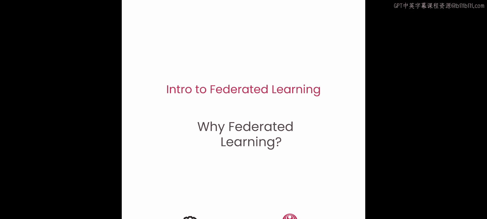
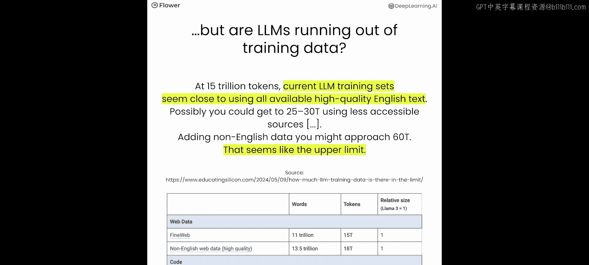
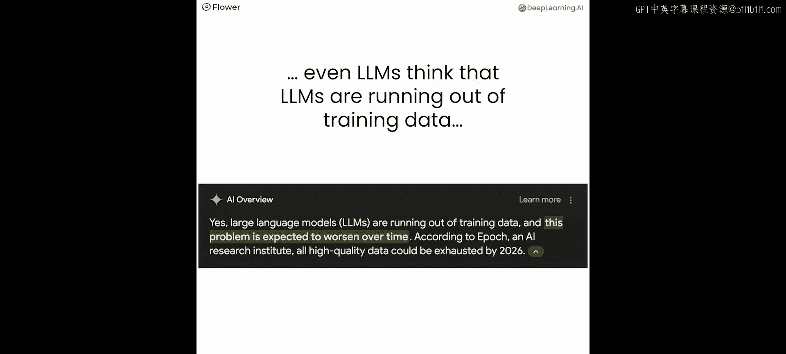
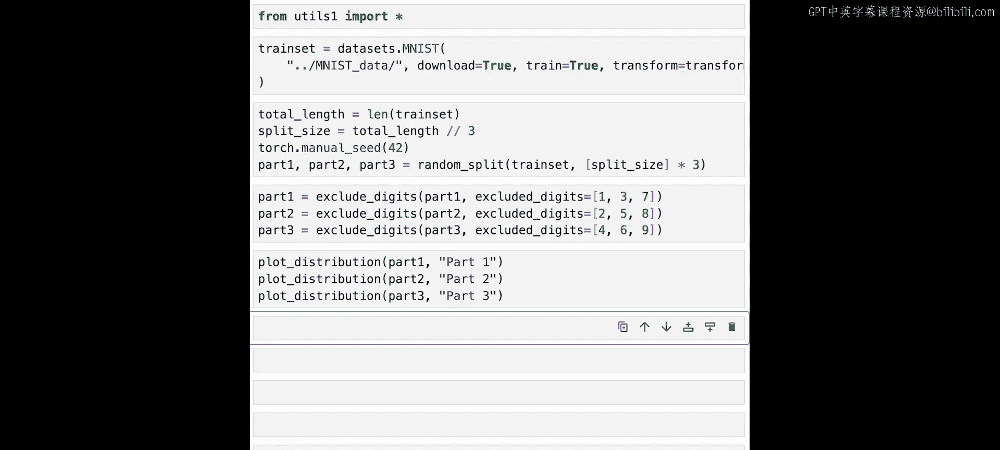
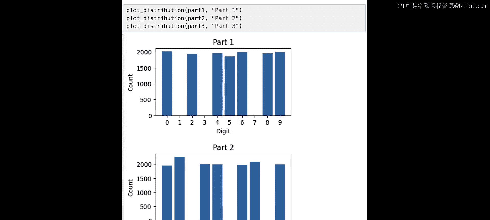
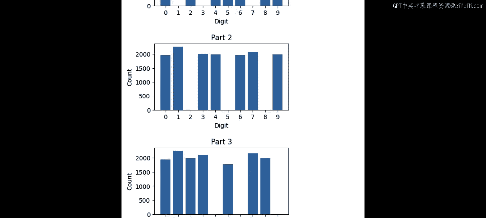
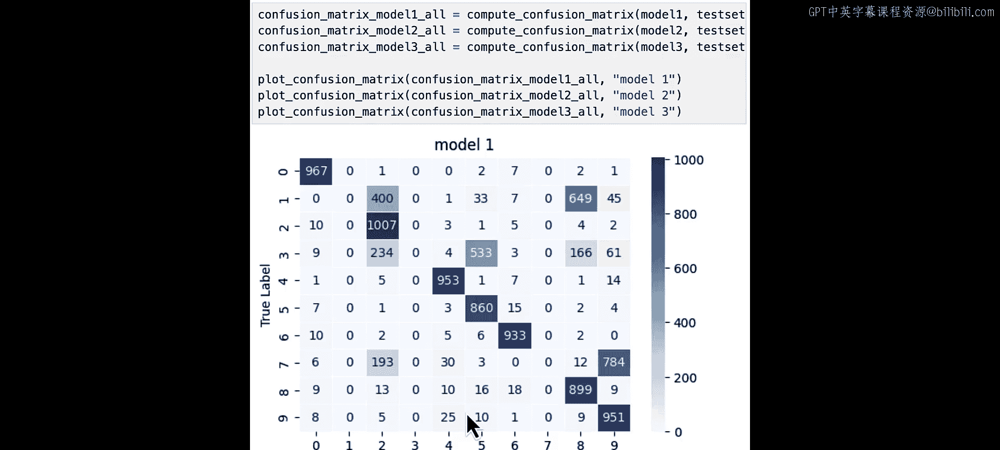
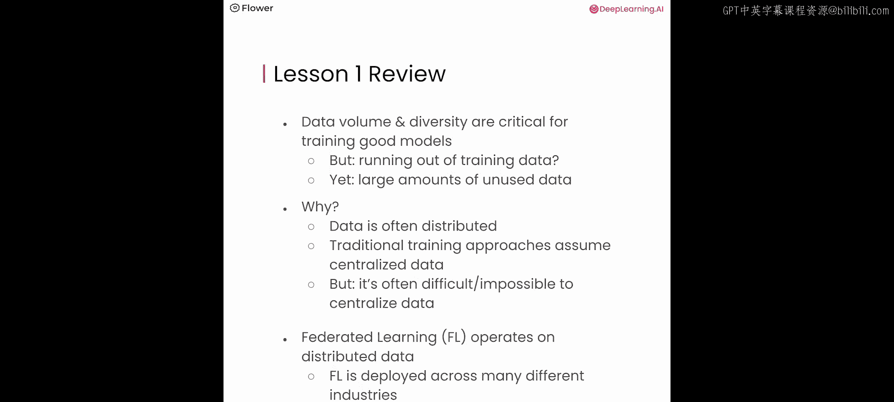

# 002：为什么需要联邦学习 🧠




在本节课中，我们将学习为什么联邦学习是解锁大量当前无法访问的训练数据的关键。你将看到训练数据对于训练优秀模型的重要性，同时也会了解传统训练方法的局限性。我们还将通过实例，了解联邦学习如何用于在分布于不同组织甚至数亿用户设备的数据上训练模型。

---

## 数据的重要性与挑战

上一节我们介绍了课程目标，本节中我们来看看数据在现代机器学习中的核心地位。

以近期发布的 Llama 3 为例，它仅在 Llama 2 发布九个月后问世。Llama 3 的性能相比 Llama 2 有了巨大飞跃。最令人印象深刻的细节之一是，最小的 Llama 3 模型（8B 参数）在多项指标上大幅超越了最大的 Llama 2 模型（70B 参数）。





这是如何实现的？Llama 2 和 Llama 3 之间最显著的变化之一是训练数据量。根据官方公告，Llama 3 的训练数据集是 Llama 2 的七倍大，并且包含了四倍多的代码。Llama 2 使用了大约 2 万亿个词元进行训练，而 Llama 3 将这个数字增加到了 15 万亿。这充分证明了**海量、高质量训练数据的重要性**。

与此同时，业界也在讨论大型语言模型是否正在耗尽训练数据。全球可用数据的总量难以精确估计。根据 `Epoch AI` 博客的近期估算，全球可用于 LLM 训练的高质量英文文本数据大约在 **15 万亿词元**左右。当前的 LLM 训练集似乎已经接近用尽所有可用的高质量英文文本。我们或许能通过数据增强等方式略微增加数据量，但这被认为是公开可用训练数据的上限。

有趣的是，即使是 LLM 自身也认为 LLM 正在耗尽训练数据，并且这个问题会随着时间的推移而加剧。

---

## 公开数据 vs. 私有数据

一个较少被讨论的重要方面是公开数据与私有数据的对比。

与 FineWeb 数据集中的 15 万亿词元和非英文数据中的 18 万亿词元相比，**仅私人存储的即时消息中就估计有 650 万亿词元，所有存储的电子邮件中甚至有 1200 万亿词元**。

这并非建议将这些数据纳入 LLM 训练，而是作为一个数据点，用以对比全球公开数据与敏感私有数据的数量级。

这引出了一个有趣的现象：我们知道数据对于训练优秀模型至关重要，我们似乎正在耗尽训练数据，但同时，又有海量的数据未被利用。

我们将在课程 2 中深入探讨基于私有数据的联邦 LLM 微调。在本课程中，我们通过介绍联邦学习来为此奠定基础。

---

## 敏感数据的分布式本质

让我们更深入地探讨敏感数据的主题。数据天然是分布式的。



以下是数据在不同领域的分布情况：
*   **医疗保健**：数据分布在不同的医院。
*   **政府**：数据分布在不同的政府机构。
*   **金融**：数据分布在不同的监管区域。
*   **制造业**：数据分布在不同的工厂。





在用户设备层面，敏感数据不仅存在于手机和笔记本电脑上，也存在于其他类型的智能设备中，如汽车甚至家中的扫地机器人。

**传统集中式训练**假设数据是集中的，它只在一个数据集上运行，而忽略了所有其他数据集。结果是，大量有价值的数据并未被用于训练。实际上，世界上大部分数据都无法轻易用于模型训练。

常见的解决方法是尝试将更多数据收集到一个地方，以增加单个数据集的规模。但在太多情况下，收集数据根本行不通。数据需要移动，但这往往由于多种原因而不可行：数据可能很敏感、数据量可能太大、用户隐私可能阻止我们收集数据、法规可能强制数据留在特定区域，有时这根本不切实际。

---

## 数据缺失的影响：一个实验

你可能会想，这实际上是一个多大的问题？如果我有数据，但分布不均，会发生什么？为了理解这一点，我们将构建三个数据集。

以下是实验步骤：
1.  **导入工具**：首先导入一些工具函数，包括 `utils.py` 中的 `MNIST` 数据集处理函数。
2.  **加载并分割数据**：使用 `torchvision.datasets.MNIST` 下载 MNIST 数据集，并将其随机分割成三个部分，以模拟分布在三个分区（如三个组织或用户设备）的数据。
    ```python
    # 示例代码：分割数据集
    total_len = len(train_dataset)
    part_size = total_len // 3
    part1, part2, part3 = random_split(train_dataset, [part_size, part_size, total_len - 2*part_size])
    ```
3.  **模拟非独立同分布**：通过在每个数据集中排除特定的数字来改变数据分布，模拟现实世界中不同数据源拥有不同数据特性的情况。
    *   数据集 1 排除数字 1、3、7。
    *   数据集 2 排除数字 2、5、8。
    *   数据集 3 排除数字 4、6、9。
4.  **训练三个独立模型**：在每个数据集上分别训练一个具有相同架构的简单神经网络模型（例如，一个包含两个全连接层的 PyTorch 模型）。训练 10 个周期，观察损失下降。
5.  **评估模型性能**：在完整的 MNIST 测试集上评估每个模型。然后，为每个模型创建特定的测试子集，仅包含其训练时未见过的数字（例如，为模型 1 创建仅包含数字 1、3、7 的测试集），并再次评估。
6.  **分析混淆矩阵**：计算每个模型在完整测试集上的混淆矩阵，以深入了解模型对每个数字的分类表现。

**实验结果**：
*   每个模型在完整测试集上的准确率大约在 **65% 到 70%**，这优于随机猜测（10%），但由于缺少三个数字的训练样本，性能受限。
*   然而，在仅包含其训练时缺失数字的特定测试子集上，每个模型的准确率都是 **0%**。
*   混淆矩阵显示，对于训练中缺失的标签（例如，模型 1 中的数字 1、3、7），模型学会了**从不预测这些类别**，而是错误地预测为其他看似相近的类别（例如，将数字 1 预测为 2 或 8）。

这个实验清晰地展示了**训练数据的重要性以及数据缺失的后果**：如果训练数据缺失某些类别，模型不仅无法识别它们，还会学会做出错误的预测。



---

## 联邦学习的核心理念

现在你已经看到了集中式训练的问题，以及当数据缺失某些部分时它是如何失效的。那么，联邦学习能让你做什么？它如何帮助解决这种情况？

在理想情况下，我们可以在所有可用数据集上训练模型，同时每个参与者都能保留对自己数据的控制权，或保持其数据的私密性。用户可以将数据保持私有，但仍然可以进行训练协作。在医疗保健等关键领域训练模型时，联邦学习是实现这一未来的关键组成部分。

**联邦学习的核心思想是将模型训练移动到数据所在之处，而让数据保持原位**。数据可以保留在组织的孤岛中或用户设备上，组织或用户保留对其数据的完全控制权。模型训练发生在数据所在的地方：公司的 GPU 集群、组织存储数据的云账户，甚至用户设备上。

联邦学习**协调**这些不同数据集和设备之间的训练过程。这使得联邦学习能够访问更多的数据和计算资源，包括组织孤岛中的敏感分布式数据以及用户设备上的数据。

在下一课中，你将确切了解这是如何运作的。但首先，让我们看几个联邦学习在工业界的真实案例。

---

## 联邦学习的实际应用案例


以下是联邦学习在不同场景下的应用实例：

*   **金融领域**：金融数据受到严格监管。例如，美国客户的交易数据必须存储在美国，欧洲客户的交易数据必须存储在欧洲。这些交易数据对于训练反洗钱模型非常有价值。借助联邦学习，可以在保持数据存储在世界各地不同区域的同时，仍然能够跨这些分布式数据训练一个统一的模型。
*   **谷歌键盘（Gboard）**：这是联邦学习的另一个极端案例。该系统部署在**数亿台用户设备**上。当你使用谷歌键盘输入句子时，键盘会尝试预测你接下来要输入的单词或补全句子（智能撰写）。这些功能由语言模型驱动。用于训练的用户数据非常敏感，无法被收集。谷歌实际上是**最早提出并开创联邦学习**的公司之一，以使这些模型能够在无需收集数据的情况下在用户设备上进行训练。
*   **医疗健康协作**：前两个例子我们看到的是单个组织拥有分布式数据（跨区域或跨设备）。第三个例子的特殊之处在于**多个组织之间的协作**。在医疗领域，数据通常分布在许多医院。在下一课中将用到的 Flower 框架，曾被英国国家医疗服务体系用于与牛津大学合作，基于 13 万名患者的血液和生命体征数据，训练了一个早期的 COVID 筛查模型。这是一个激动人心的项目，因为它允许不同的医院协作训练模型。这种方法是在医疗健康领域推广 AI 的关键推动力，因为单个组织几乎从未拥有足够的数据来训练现代数据饥渴型模型架构。

---


## 总结

本节课中我们一起学习了以下内容：
1.  **数据的重要性**：数据的体量和多样性对于训练优秀模型至关重要。
2.  **数据的困境**：我们似乎正在耗尽（公开）训练数据，但同时又有海量的（私有）数据未被使用。
3.  **根本原因**：数据通常是分布式的，而传统训练方法假设数据是集中的。集中化数据通常很困难或几乎不可能。
4.  **联邦学习的价值**：你看到了联邦学习在分布式数据上运行，它被部署在许多不同行业，并运行在分布式设备或组织孤岛之上。
5.  **实际应用**：我们探讨了联邦学习在金融、消费级应用（谷歌键盘）和跨组织医疗协作中的实际案例。



在下一课中，我们将深入探讨联邦学习具体是如何工作的。