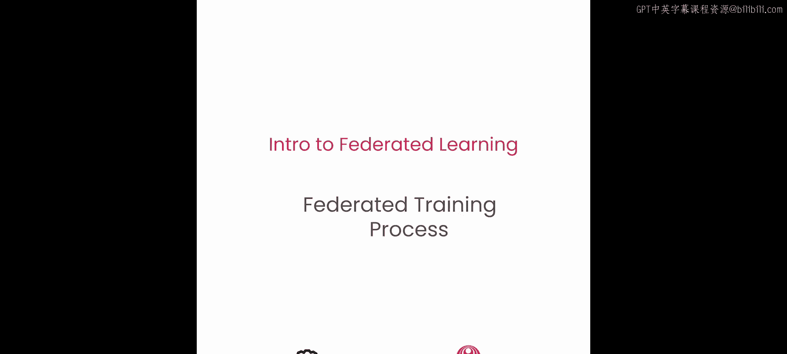
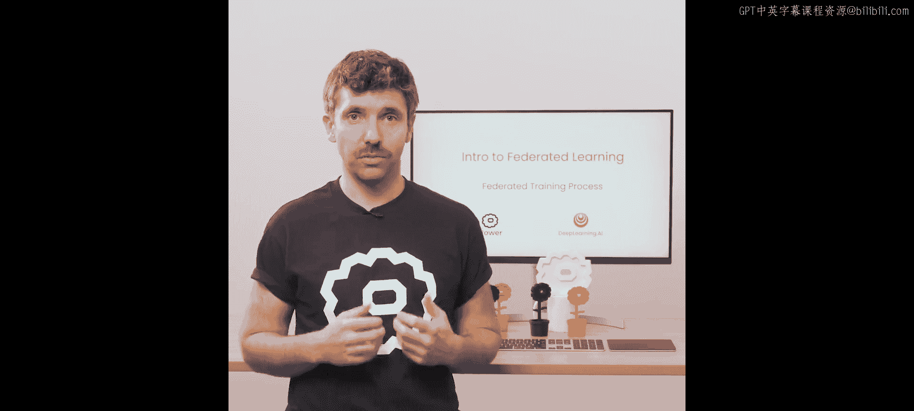
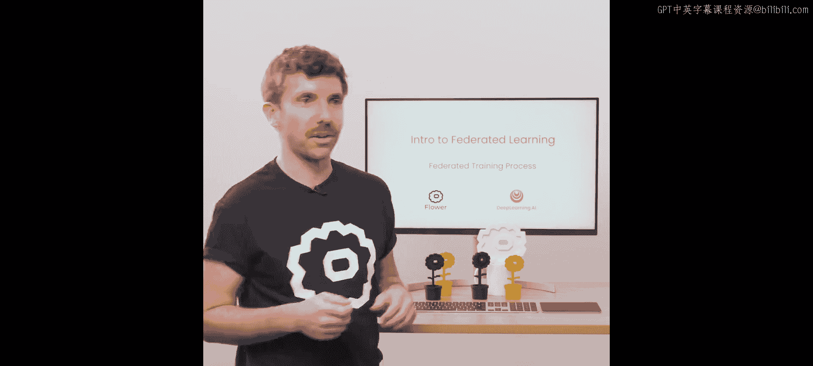
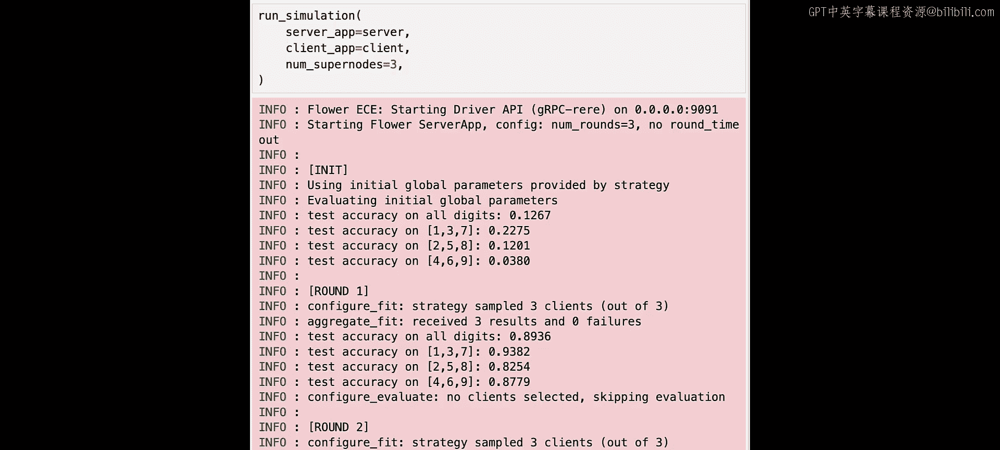
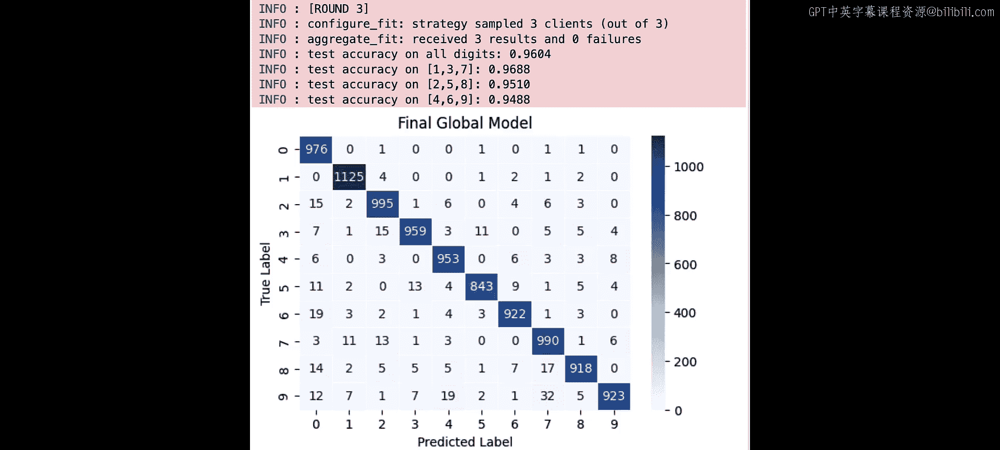
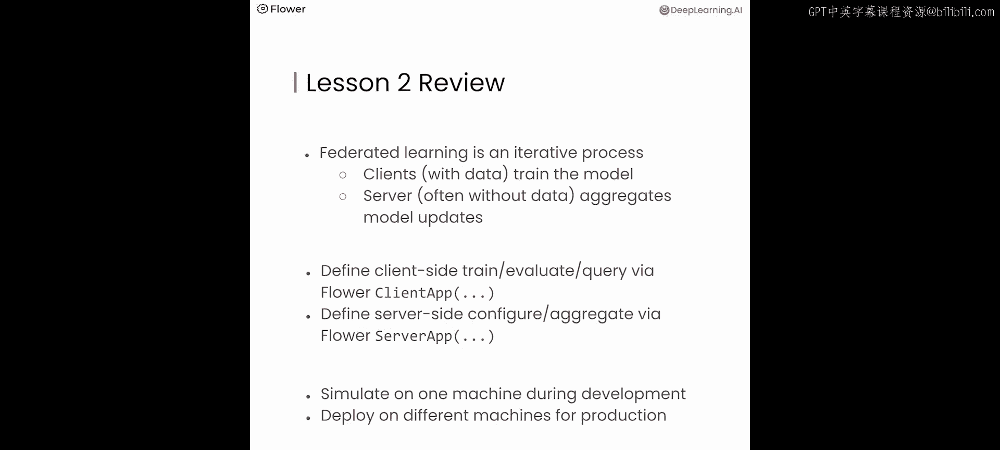

# 003：联邦训练流程 🚀

在本节课中，我们将使用 Flower 和 PyTorch 构建第一个联邦学习项目。你将学习联邦学习如何让你在分布式数据上训练 AI 模型。我们将使用的模型和数据只是一个示例，用于展示联邦学习的实际运作，但请记住，这种方法可以扩展到大多数其他模型、数据集，甚至不同的框架，如 TensorFlow、JAX、Hugging Face Transformers 和 Apple 的 MLX。现在，让我们开始构建。

## 联邦学习系统概述

上一节我们介绍了联邦学习的基本概念，本节中我们来看看一个基础联邦学习系统的构成。

在一个基础的联邦学习系统中，有一个服务器和多个客户端。服务器本身通常没有任何数据。它可能有一些用于评估全局模型的数据。但在经典的联邦学习中，它没有训练数据。客户端才是拥有实际训练数据的一方。

如果你有一个由五家医院协作进行模型训练的系统，那么你会有五个客户端，每家医院一个。每个客户端都运行在各自的医院环境中，并且能够访问该特定医院的数据。如果你有一个由一亿个用户设备持有数据的系统，那么你就有一亿个客户端，每个用户设备上运行一个客户端。

服务器的角色是协调这些客户端之间的训练。客户端的角色是在各自的本地数据上进行实际的训练。服务器和客户端都拥有自己的模型副本。服务器上的模型通常称为**全局模型**。客户端上的模型通常称为**本地模型**。

## 跨客户端的训练流程

上一节我们介绍了系统构成，本节中我们来看看训练是如何在多个客户端之间进行的。

整个过程从服务器初始化全局模型参数开始。服务器将全局模型的参数发送给客户端。在示例中，我们有五个客户端（平板、台式机、手机、笔记本电脑和服务器）。这五个客户端随后在其本地数据上训练模型。它们只训练一小段时间，通常只在本地数据集上训练一个轮次。

本地训练结束后，客户端将其改进后的模型发送回服务器。现在服务器拥有五个改进后的模型，它们的权重都略有不同。但我们需要的是一个模型，而不是五个。为了得到一个模型，服务器会聚合这五个模型。聚合模型的方法有多种，但最常见的一种是简单地**平均权重**。

在第一次聚合之后，你会得到一个略有改进的全局模型版本。使用这个新版本的全局模型，你将重复之前描述的步骤：将新模型发送给客户端，客户端在其本地训练数据上训练，它们发回改进后的模型，然后服务器聚合这些模型。联邦学习是一个迭代过程，它会一遍又一遍地重复这些所谓的**轮次**，直到收敛。

## 联邦学习算法

以下是联邦学习算法的更正式描述：

1.  **初始化**：服务器初始化全局模型。
2.  **通信轮次**：对于每个通信轮次，服务器将全局模型发送给参与的客户端，每个客户端接收全局模型。
3.  **客户端训练与模型更新**：每个参与的客户端在本地数据集上训练接收到的模型。完成后，客户端将其本地更新后的模型发送回服务器。
4.  **模型聚合**：服务器使用聚合算法（例如**联邦平均**）聚合从所有客户端收到的更新模型。联邦平均是对从客户端收到的所有模型更新进行加权平均，权重由每个特定客户端用于训练的训练样本数量决定。
5.  **收敛检查**：如果满足收敛标准，则结束联邦学习过程。否则，进入下一个通信轮次（即步骤2）。

## 构建第一个联邦学习项目

在上一课中，我们构建了三个独立的数据集并在其上训练了三个独立的模型。在本课中，我们将连接这些独立的模型，目标是在三个分布式数据集上训练一个协作模型。让我们进入实验环节。

和之前一样，我们将从一些导入开始。在本课中，我们将使用 Flower 联邦学习框架来“联邦化”之前使用的训练流程。因此，除了实用程序外，我们还有一些与 Flower 相关的导入，例如 `ClientApp`、`ServerApp` 和 `FedAvg`（联邦平均策略）。

### 准备数据集

第一步是重新创建上一课中用于在 MNIST 数据上训练的三个数据集。MNIST 训练数据集以与之前相同的变换加载以进行归一化。然后，数据集被分成三个部分：Part1、Part2 和 Part3，大小与上一课相同。使用相同的随机种子以确保可复现性。数字 1、3 和 7 从 Part1 中排除；数字 2、5 和 8 从 Part2 中排除；数字 4、6 和 9 从 Part3 中排除。为了后续使用，我们将所有三个训练数据集放入一个名为 `train_sets` 的列表中。

完整的 MNIST 测试数据集以相同的变换加载，并且我们还创建了与第 1 课相同的三个测试数据子集：`test_set_137`、`test_set_258` 和 `test_set_469`。

### 模型权重交换函数

在联邦学习中，需要在服务器和客户端之间交换模型参数。当客户端从服务器接收到模型参数时，它需要用这些新参数更新本地模型。当客户端完成训练时，它需要将本地模型参数的最新版本发送回服务器。为了实现这一点，我们需要两个函数：`set_weights` 和 `get_weights`。

`get_weights` 函数接受一个参数，即对我们简单 PyTorch 模型的引用。然后它遍历 `state_dict` 中的项，将每一项转换为 NumPy 数组，并返回包含所有这些数组的列表。我们在本地模型训练完成后使用 `get_weights` 来获取模型更新后的权重并将其发送回服务器。

`set_weights` 函数则相反。它接受两个参数：对我们简单 PyTorch 模型的引用和一个 NumPy 数组列表。然后它使用这个 NumPy 数组列表来更新模型 `state_dict` 中的所有项。我们在本地模型训练之前使用 `set_weights`，利用从服务器接收到的新权重来更新模型的权重。请注意，这两个函数都是模型特定的。如果你使用不同的模型，可能需要相应地调整 `set_weights` 和 `get_weights`。

### 创建 Flower 客户端

为了连接你现有的训练和评估流程，你需要编写一个 Flower 客户端。`FlowerClient` 使用现有的函数（如 `train_model` 和 `evaluate_model`）来使 Flower 框架能够在一组参与的客户端上编排联邦训练。Flower 客户端类被定义为 `NumPyClient` 的子类。你向构造函数传递三个参数来初始化一个 Flower 客户端对象：`net`（我们在 PyTorch 中实现的简单神经网络模型）、`train_set`（一个特定客户端的训练数据集）和 `test_set`（一个特定客户端的测试数据集）。

Flower 客户端通常定义两个方法：`fit` 方法使用提供的参数和本地训练数据训练神经网络；`evaluate` 方法使用提供的参数和本地测试数据集评估神经网络的性能。

为了使 Flower 框架在需要时能够创建客户端对象，我们需要实现一个名为 `client_fn` 的函数，该函数按需创建 Flower 客户端实例。这对于优化资源利用率是必要的。联邦训练可以轻松扩展到数百个客户端，但在构建此类系统时，你希望在一台机器上高效地模拟它们。每当 Flower 需要一个特定客户端的实例来调用 `fit` 或 `evaluate` 时，它就会调用 `client_fn`。这使得框架能够在特定客户端对象不再需要时丢弃它们并释放资源。

最后，我们通过传入之前定义的 `client_fn` 来创建一个 `ClientApp` 实例。`ClientApp` 是客户端端所有操作的入口点，你将在接下来的课程中了解 `ClientApp` 的更多功能。

### 创建服务器端评估与聚合

现在你有了一个可以执行本地训练和评估的 `ClientApp`，你需要一个服务器端的对应部分来聚合从客户端收到的更新模型。当然，你也想看看全局模型的表现如何。

为此，你首先创建一个名为 `evaluate` 的评估函数。`evaluate` 接受三个参数：当前服务器轮次、全局模型参数的最新版本（一个 NumPy 数组列表）和一个配置字典。类似于 `FlowerClient.evaluate`，它使用 `set_weights` 用最新参数更新模型。它在多个测试数据集上评估模型的性能。在我们的例子中，是 `test_set`、`test_set_137`、`test_set_258` 和 `test_set_469`，以评估其在完整 MNIST 测试集以及不同数字子集上的准确性。它会打印评估结果，包括所有数字的准确率以及特定子集（137、258 和 469）在每个服务器轮次上的准确率，这样我们可以看到准确率在联邦学习的多轮中是如何演变的。如果当前服务器轮次是最后一轮（由 `server_round == 3` 表示），它会计算并绘制模型在整个测试数据集上预测的混淆矩阵。这将使你能够理解联邦模型与第 1 课中的三个独立模型相比表现如何。

要创建 `ServerApp`，你需要决定要使用哪种策略。策略是一种抽象，它实现了服务器端的联邦学习算法。我们之前介绍过联邦平均，但还有许多其他算法，如 FedAdam、FedMedian 和 Q-FedAvg，其中许多在 Flower 中作为内置策略提供。让我们从简单的联邦平均开始。

要初始化 `FedAvg`，你需要传递 `fraction_fit`（选择用于训练的可用客户端的比例）、`fraction_eval`（选择用于评估的可用客户端的比例）、`initial_parameters`（初始模型权重）和 `evaluate_fn`（用于服务器端模型评估的函数）。

现在你有了一个策略，你可以创建一个 `ServerApp` 实例。有了 `ClientApp` 和 `ServerApp`，你终于可以开始训练了。一个真正的联邦学习系统将分布在多台服务器或用户设备上。在这个笔记本环境中，你通过在一台机器上运行所有内容来模拟这样的系统。为此，你使用一个名为 `run_simulation` 的函数，它接受三个参数：`ServerApp`、`ClientApp` 和 `num_supernodes`（要模拟的客户端数量）。`run_simulation` 调用客户端 `supernodes` 是为了强调这些节点在联邦学习过程中的重要性，与传统的客户端-服务器设置（拥有强大的服务器和瘦客户端）相比，在联邦学习中，客户端才是真正的明星。它们拥有宝贵的数据和进行计算训练的能力。让我们运行它。

### 运行模拟并分析结果

你可以看到 `run_simulation` 启动了 Flower 服务器应用，使用一个执行三轮联邦学习的配置。它告诉我们它正在使用策略提供的初始全局模型参数。然后它继续使用你之前定义的评估函数来评估这些初始全局模型参数。这意味着它评估所有数字的测试准确率，也评估你之前定义的三个不同子集上的准确率。然后它继续进入联邦学习的第一轮。策略从总共三个可用客户端中采样三个客户端。它对这些客户端进行采样，将全局模型参数发送给这三个客户端，并要求这些客户端在其本地数据集上执行训练。这需要一分钟才能完成。

你现在可以看到服务器收到了三个结果，零个失败。所有三个客户端都将其结果提交回服务器。然后服务器继续再次调用评估函数，以查看新聚合的全局模型在测试集（完整测试集以及你之前定义的三个不同测试集）上的表现。服务器继续进行第二轮。它再次从总共三个可用客户端中采样三个客户端。你可以看到，服务器再次收到了三个结果，零个失败。它继续再次调用评估函数来评估新聚合的全局模型。然后进入第三轮。对于第三轮，它再次从三个可用客户端中采样三个客户端。这又需要一分钟才能在客户端完成。当三个客户端完成其本地训练时，它们将其更新后的模型发送回服务器。你可以看到服务器收到了三个结果，零个失败。然后它继续调用 `evaluate` 来评估最终全局模型在完整 MNIST 测试集以及你之前构建的三个特定集合上的表现。

请记住，在第 1 课中，当你训练三个独立模型时，这些模型达到了大约 65% 到 70% 的准确率。在这里，通过联邦学习，你可以看到准确率大幅跃升至 96%。这意味着全局模型比第 1 课中训练的任何单个模型都要好得多。也许更有趣的是，你可以看到在这些特定子集上，全局模型的准确率从之前的 0% 跃升至 94% 到 96% 之间。观察混淆矩阵，我们看到与第 1 课中训练的单个模型的混淆矩阵相比，情况大不相同。该模型学会了如何分类所有数字，即使这些数字在其中一个数据集中缺失。因此，我们不再看到任何列中只有零的情况。

## 课程总结

在本节课中，我们一起学习了联邦学习的核心流程。联邦学习是一个迭代过程，拥有数据的客户端训练模型，而通常没有数据的服务器则聚合模型更新。你通过 Flower 的 `ClientApp` 定义客户端端的训练、评估或分析，并通过 Flower 的 `ServerApp` 定义服务器端的配置或聚合。在开发过程中，你通常在一台机器上模拟这些系统，但在生产环境中，你将它们部署在拥有各个数据集的不同机器上。