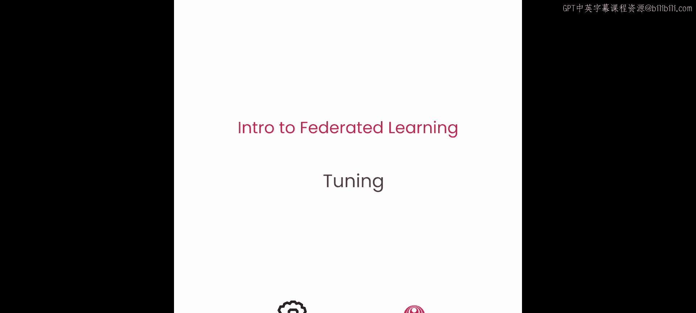
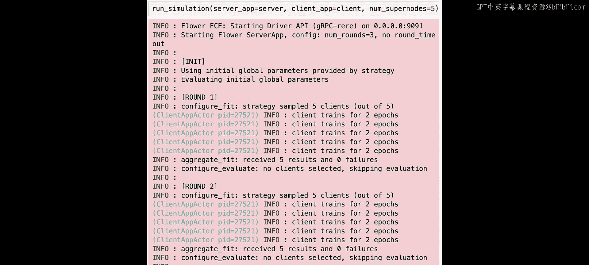
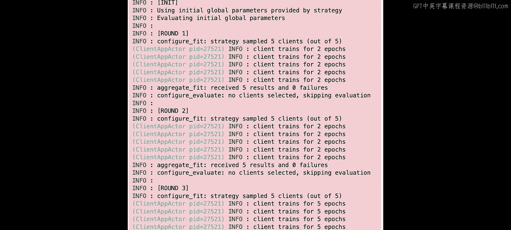
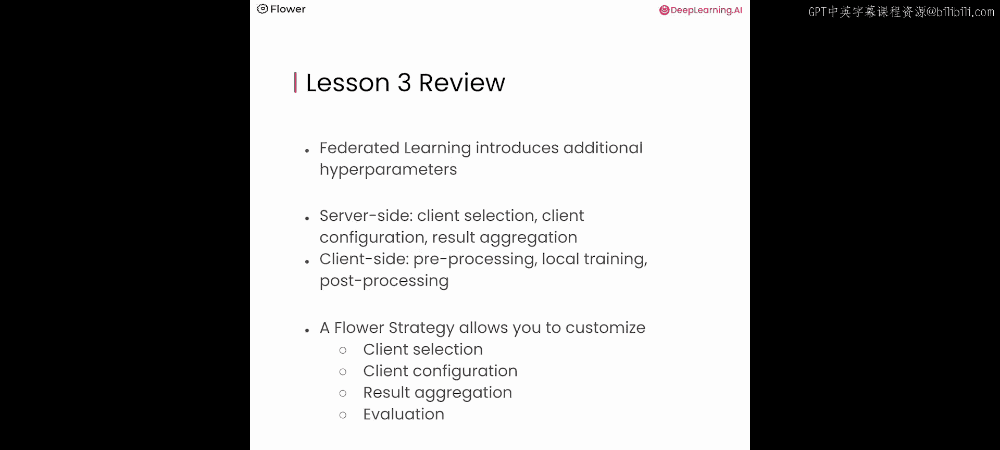

# 004：调优与自定义 🛠️



在本节课中，我们将对第2课中构建的Flower项目进行自定义和调优。你将学习联邦系统中通常需要调优的多个方面，并将在本课中实现一个自定义的训练调度方案。


好了，让我们开始吧。

## 概述

与传统的集中式训练相比，联邦学习引入了一些额外的概念和组件，这些组件在训练过程中可以进行自定义和调优。本节课我们将探讨这些可调优的方面，并学习如何在Flower框架中实现它们。

## 联邦学习中的可调优组件

上一节我们介绍了联邦学习的基本流程，本节中我们来看看其中可以自定义和调优的关键组件。

### 客户端选择策略

一个重要的因素是，如何选择参与每一轮训练的客户端。在下图中，你可以看到五个客户端。与其将全局模型发送给所有五个客户端，你可以在第一轮只选择三个客户端发送模型。这三个客户端将照常参与训练。然后在下一轮，你可以选择另外三个客户端。

在只有少数客户端的场景中，答案通常是每轮选择所有客户端。如果你像图中一样只有五个客户端，你可能会在联邦学习的每一轮中都选择它们全部。然而，在拥有大量客户端的场景中，你通常不会这样做。事实上，研究表明，选择越来越多的客户端会产生收益递减效应。相反，你只会从可用客户端中选择一个子集。在拥有数百万客户端的移动设备场景中，你通常每轮只选择几百个客户端，或者根据任务最多选择几千个。

以下是选择客户端的不同策略：

*   **随机选择**：一种非常常见的方法是随机选择客户端。
*   **周期性训练**：严格来说，这并非联邦学习，但可能非常有用。在这种方法中，你会将模型发送给一个客户端，让该客户端训练，然后发送回服务器，再发送给下一个客户端，如此一个接一个地进行。

### 客户端配置

一旦选择了客户端，你需要决定如何配置它们。你需要确定客户端应该做什么、训练模型多长时间、应该使用哪些超参数，以及客户端是否需要知道其他信息来正确执行训练或评估。

你可以看到客户端上突出显示的小模型图标。这表示客户端用于执行任务的配置。

### 聚合方法

第三个通常需要自定义或调优的例子是聚合。在联邦学习中，有许多不同的聚合模型参数的方法。

你在上一课中已经看到并使用了联邦平均算法。还有许多其他方法，如Q-Fed平均或FedAdam，它们对基础的联邦平均算法提供了某些改进。你在上一课中使用的Flower框架内置了许多这样的方法，它们被称为“策略”。

## 在Flower中配置客户端训练

让我们进入实验环节，看看服务器如何配置客户端训练。

和往常一样，我们从一些导入开始。

```python
import flwr as fl
from flwr.common import Parameters
import torch
from torchvision import datasets, transforms
from torch.utils.data import DataLoader, random_split
```

### 使用联邦数据集

在第1课和第2课中，我们手动划分MNIST数据集来模拟分布在多个用户设备或多个组织上的多个数据集。现在，与其在参与者之间手动划分数据，我们可以使用一个名为`feddatasets`的库。

`feddatasets`为我们提供了一个名为`FederatedDataset`的类。这个抽象层可以划分许多现有的数据集，如MNIST，并允许你为每个客户端生成小的训练集和测试集。

`load_data`函数加载并准备用于联邦学习的数据。它接收一个`partition_id`作为输入，指定要加载的数据集分区。这里使用的数据集是MNIST，它被划分为10个分区。然后，加载的分区以80:20的比例被分割为训练和测试子集，这是通过`train_test_split`函数完成的。应用了一个自定义的转换来标准化数据。最后，分别为训练和测试子集创建了数据加载器，使用的是PyTorch的`DataLoader`。

### 向客户端发送配置值

除了模型参数，你通常还想向客户端发送配置值。配置值可以用于各种目的。

假设你希望服务器控制每个客户端执行的本地训练轮数（即本地客户端在训练期间遍历本地数据集的次数）。为此，你定义一个名为`fit_config`的函数，它只接收一个参数——当前服务器轮次，并返回一个配置字典。

在配置字典中，你放入一个名为`local_epochs`的键，其整数值告诉客户端要训练多少个本地轮次。在这个例子中，你可以看到如何根据当前服务器轮次来改变这个数字。

```python
def fit_config(server_round: int):
    """返回训练配置字典。"""
    config = {
        "local_epochs": 2 if server_round < 3 else 5,  # 前两轮训练2个epoch，之后训练5个
    }
    return config
```

客户端可以使用这个值来动态改变其在本地数据集上训练的轮数。这意味着客户端最初将训练2个轮次，然后在后续轮次中增加本地训练轮数。

接下来，我们像往常一样初始化联邦平均策略。我们将`fraction_evaluate`设置为0，因为我们不打算执行任何客户端评估，并将初始模型参数传递给策略。

现在，为了让策略使用我们新的`fit_config`函数，我们只需在初始化`FedAvg`时通过参数`on_fit_config_fn`将其传入。

```python
strategy = fl.server.strategy.FedAvg(
    fraction_fit=1.0,  # 每轮选择全部客户端进行训练
    fraction_evaluate=0.0,  # 不进行评估
    min_fit_clients=5,
    min_evaluate_clients=0,
    min_available_clients=5,
    on_fit_config_fn=fit_config,  # 传入配置函数
    initial_parameters=parameters,
)
```

将一个`fit_config`函数传递给联邦平均策略，将使该策略在每一轮都调用这个函数。返回的配置字典将被包含在发送给每个客户端的消息中。它每次都会调用该函数，使你能够每一轮都向客户端发送不同的配置值。

最后，我们定义一个`ServerApp`的实例。

### 客户端接收并使用配置

你还需要像往常一样创建一个Flower客户端类。唯一的区别是，你希望使用配置中的`local_epochs`值。

`FlowerClient`类中的`fit`方法负责训练。它接收两个主要参数：`parameters`（来自服务器的模型参数）和`config`（用于训练的配置参数）。

和往常一样，该方法首先使用服务器提供的参数来设置模型的参数。然后从配置字典中提取`local_epochs`的值，以确定本地训练的轮数。在这里，你锁定这个值，然后调用`train_model`函数。`train_model`函数被调用来使用客户端的本地训练数据（存储在`self.trainloader`中）训练模型。这次，我们将本地训练轮数作为一个额外的参数传递。

```python
class FlowerClient(fl.client.NumPyClient):
    def __init__(self, trainloader, valloader):
        self.trainloader = trainloader
        self.valloader = valloader
        self.model = Net()
        self.device = torch.device("cuda:0" if torch.cuda.is_available() else "cpu")
        self.model.to(self.device)

    def fit(self, parameters, config):
        # 设置模型参数
        set_parameters(self.model, parameters)

        # 从配置中获取本地训练轮数
        local_epochs = config.get("local_epochs", 1)

        # 使用指定的轮数进行训练
        train_model(self.model, self.trainloader, epochs=local_epochs, device=self.device)

        # 返回更新后的参数和其他信息
        return get_parameters(self.model), len(self.trainloader), {}
```

然后，我们像往常一样创建客户端函数和客户端应用。

让我们运行`server_app`和`client_app`，看看会发生什么。



你可以看到Flower服务器应用启动，并执行了三轮联邦学习。它初始化了由策略提供的全局参数，然后进入第一轮联邦学习。策略从5个可用客户端中采样了5个客户端，即采样了所有可用客户端。然后，它将配置字典与模型参数一起发送给所有参与的客户端，也就是我们的全部5个客户端。你可以看到第一个客户端记录它训练了2个轮次，第二个客户端也是如此，其他所有客户端都一样。训练结束后，聚合函数接收了5个结果和0个失败。

你还可以看到有一条日志显示“没有选择客户端，跳过评估”。这是因为之前在初始化联邦平均策略时，我们将`fraction_evaluate`设为了0，所以在客户端侧不进行评估。

在第二轮中，我们看到的情况基本相同。我们可以看到我们所有的五个客户端都被选中了，并且可以看到每个客户端都训练了2个轮次。

现在，看第三轮，你可以看到再次从5个客户端中选择了5个。但是，你可以看到客户端突然不再只训练2个轮次，而是训练了5个轮次。这是由这些客户端从服务器接收到的配置字典引起的。因此，本地训练轮数由服务器控制，客户端根据从服务器接收到的任何配置值做出反应，并执行适当数量的本地训练轮次。

配置字典是一个相当灵活的概念。你可以在该字典中放入许多不同类型的键和值，这是一个非常适合进行实验的东西。例如，你可以用它来从服务器向客户端发送学习率，并控制每个客户端应该使用的学习率。你可以用它来控制客户端训练过程的许多不同方面。

请随意尝试和实验，并告诉我们进展如何。

## 总结

本节课中我们一起学习了联邦学习的调优与自定义。联邦学习引入了额外的超参数和概念，这些概念对于控制服务器端的训练过程非常重要。

在服务器端，我们可以自定义和调优诸如**客户端选择**、**客户端配置**和**结果聚合**等方面。在客户端，我们可以配置诸如**数据预处理**、**本地训练**以及将权重发送回服务器之前要进行的任何**后处理**。

Flower的**策略**允许你自定义我们讨论过的所有这些客户端侧和服务器侧的行为。它允许你自定义客户端选择、客户端配置、结果聚合和服务器端评估。





通过本节课的学习，你应该能够理解联邦学习系统中可调优的关键组件，并掌握在Flower框架中通过配置字典动态控制客户端行为的基本方法。