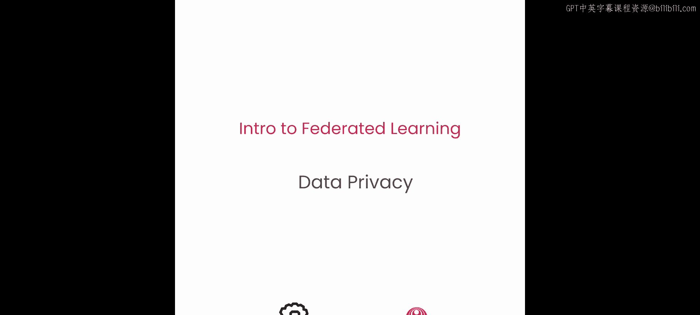
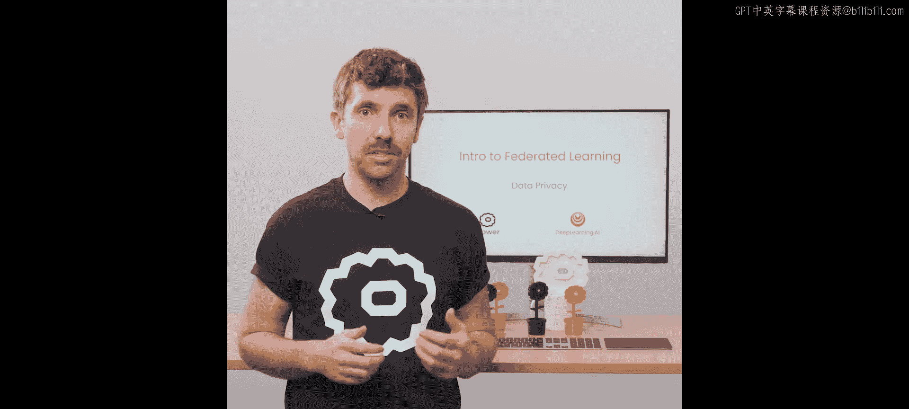
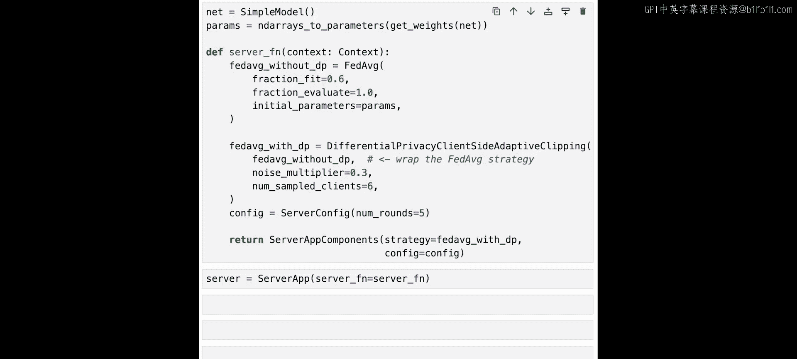
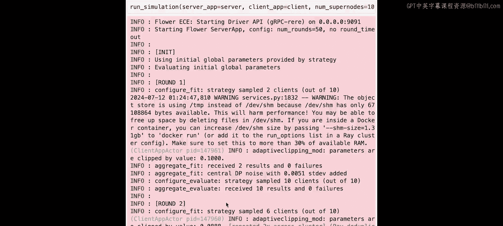
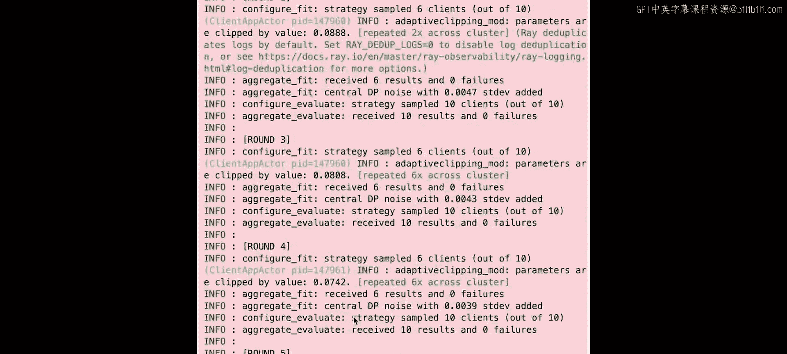
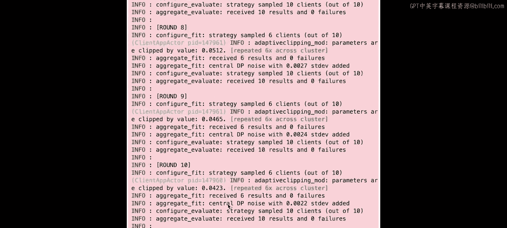
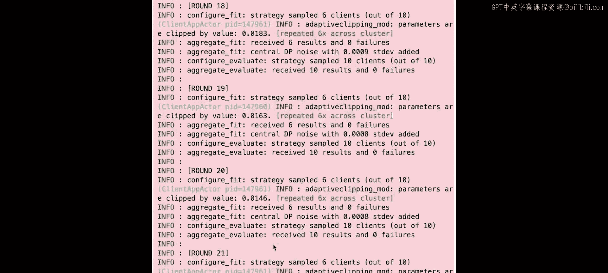
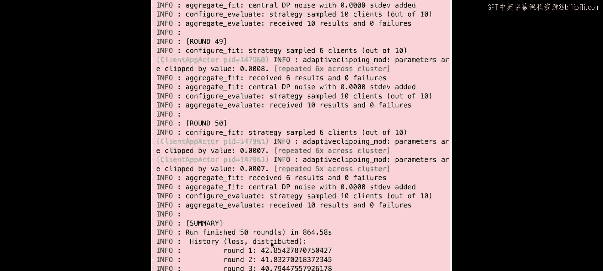
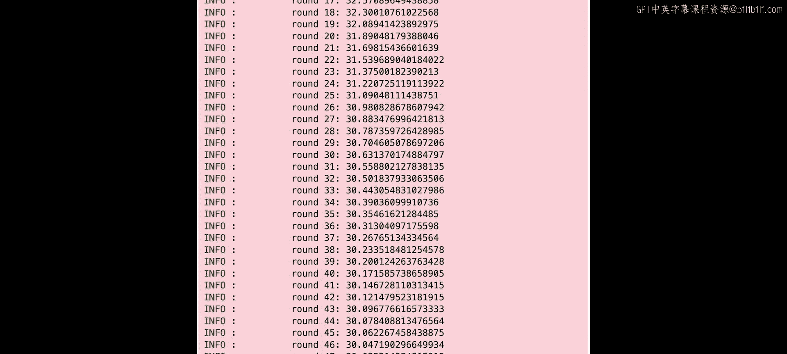
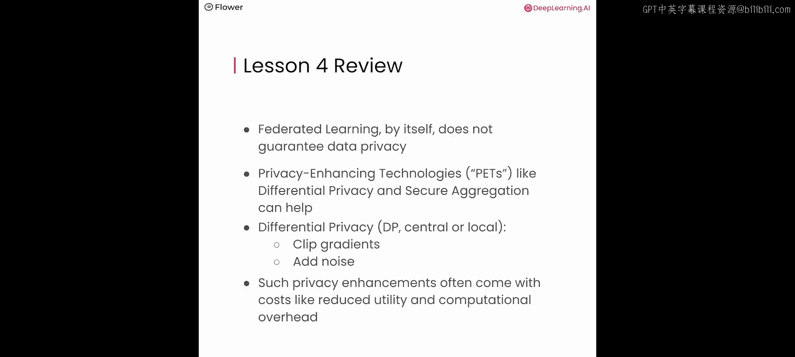

# 005：数据隐私 🔒

在本节课中，我们将学习数据隐私以及隐私增强技术。你将了解隐私在联邦学习中的重要性，学习如何思考隐私保护技术，并以差分隐私为例进行深入探讨。

## 概述

联邦学习通过防止直接访问数据，本身可被视为一种数据最小化解决方案。然而，客户端与服务器之间交换的模型更新仍可能导致隐私泄露。根据攻击模型和攻击者在联邦学习中的角色，存在多种可能的攻击方式需要考虑。

## 隐私攻击类型

攻击者可以是客户端、服务器或第三方。以下是三种攻击示例：

*   **成员推断攻击**：旨在推断特定数据样本是否参与了训练。
*   **属性推断攻击**：旨在推断训练数据中未见的属性。
*   **重建攻击**：旨在推断具体的训练数据样本。

例如，有研究论文表明，在特定设置下，恶意服务器能够重建联邦学习中特定客户端的训练数据样本。可以看到，重建的图像并非完全相同，但其质量惊人地接近原始数据。

## 差分隐私简介

差分隐私是一种在数据分析中增强个人隐私的突出解决方案。它通过向查询结果添加校准过的噪声来模糊个体数据，确保任何单个数据点的存在与否都不会显著影响分析结果。这保证了在不泄露敏感信息的前提下进行准确分析。

假设有两个数据集 **D** 和 **D'**，它们仅相差一个数据点。差分隐私保证，任何分析 **M**（例如计算平均收入）对这两个数据集产生的结果 **O** 和 **O'** 将几乎相同。

在机器学习中，差分隐私为我们提供以下保证：如果我们在数据集 **D** 上训练模型 **M1**，然后添加或移除一个数据点（例如本例中A的数据）后训练第二个模型 **M2**，那么得到的模型 **M1** 和 **M2** 将在一定程度上无法区分。这种不可区分性的程度由我们旨在实现的隐私保护水平来量化。

## 联邦学习中的差分隐私

在联邦学习的背景下，差分隐私可以应用于流程的各个阶段，包括模型训练、模型更新的聚合以及客户端与服务器之间的通信。根据其应用方式，差分隐私提供不同级别的隐私保护。

本节课你将学习差分隐私的两种变体：**中心化差分隐私** 和 **本地差分隐私**。

关于差分隐私有两个重要主题：

1.  **裁剪**：用于限制敏感度并减轻异常值的影响。此处的“敏感度”是指当数据集中添加或移除单个数据点时，输出可能改变的最大量。
2.  **加噪**：通过添加校准过的噪声，使输出在统计上无法区分。

### 中心化差分隐私

在中心化差分隐私中，中央服务器负责向全局聚合的参数添加噪声。需要注意的是，这要求信任服务器。整体方法是先裁剪客户端发送的模型更新，然后向聚合后的模型添加一定量的噪声。

### 本地差分隐私

在本地差分隐私中，每个客户端负责在本地执行差分隐私操作，然后再将更新后的模型发送给服务器。本地差分隐私避免了对完全可信聚合器的需求。每个客户端在将更新模型发送到服务器之前，负责在本地执行裁剪和加噪。

## 实践环节

现在，让我们进入实验环节。

与往常一样，我们首先导入实用函数和类。我们同时导入一个服务器端差分隐私策略（称为 `DifferentialPrivacyClientSideAdaptiveClipping`）和一个客户端自适应裁剪模块（称为 `adaptive_clipping_mod`）。稍后我们将解释这些组件的作用。

与上一课类似，我们加载 MNIST 数据并使用 Flower 的数据工具将其划分为 10 部分。我们还像之前一样定义了一个 Flower 客户端。

我们定义了一个 `client_fn` 函数，用于初始化训练加载器、测试加载器和 Flower 客户端。在定义客户端应用时，我们使用了一个名为 `flower mods` 的新功能。

Mods（也称为修饰器）允许你在任务在 `ClientApp` 中被处理之前和之后执行操作。你可以使用内置的 mods，甚至可以定义自己的自定义 mods。这里我们使用 `adaptive_clipping_mod`，它在将模型更新发送回服务器之前执行自适应裁剪。

在服务器端，你首先像往常一样创建联邦平均策略。这次我们给它一个不同的名字，称为 `fed_avg_without_dp`。然后，我们不直接将联邦平均策略对象传递给 `server_app`，而是用一个名为 `DifferentialPrivacyClientSideAdaptiveClipping` 的包装策略来包装它。

为此，你创建 `DifferentialPrivacyClientSideAdaptiveClipping` 的一个实例，并将之前创建的策略对象以及两个 DP 特定参数（噪声乘数和客户端采样数量）传递给它。`DifferentialPrivacyClientSideAdaptiveClipping` 策略包装器本身就是一个策略，它包装其他策略并负责在服务器端应用差分隐私。这意味着它接收模型更新，将其转发给内部策略进行聚合，然后向聚合后的模型添加噪声。

最后一步是像往常一样创建 `server_app`。现在，你有了一个匹配的服务器应用和客户端应用，它们可以执行带有客户端自适应裁剪的中心化差分隐私。

### 运行实验

现在，我们有了一个匹配的服务器应用和客户端应用，它们共同可以执行带有客户端自适应裁剪的中心化差分隐私。

配置好我们的服务器端 DP 策略和客户端裁剪模块后，我们可以看到联邦训练如何与 DP 一起运行。在本地训练之后，客户端模块裁剪参数并将裁剪后的模型更新发送到服务器。内部策略然后聚合这些模型更新，DP 包装策略向聚合后的模型添加噪声。

你可以像往常一样通过 `run_simulation` 运行此实验。这次，你使用 10 个模拟客户端运行模拟，并在每一轮中选择其中的 6 个客户端（这是 `fraction_fit=0.6` 的结果）。现在的日志信息更多一些，但你可以看到在客户端，模块裁剪了参数。你可以看到一些以 `adaptive_clipping_mod` 开头的日志，它显示参数被某个值裁剪。在以 `aggregate_fit` 开头的部分日志中，你可以看到添加了具有特定标准偏差的中心化 DP 噪声。

由于裁剪和加噪，DP 通常会导致收敛速度变慢。因此，在这个实验中，我们使用了一个较小的噪声乘数（这导致隐私性较低），并运行联邦训练 50 轮（理想情况下，根据所需的隐私性和实用性，可以运行更多轮）。

## 总结

本节课我们一起学习了数据隐私在联邦学习中的重要性。联邦学习本身并不能保证数据隐私。隐私增强技术（通常简称为 PETs），如差分隐私和安全聚合，可以提供帮助。

差分隐私（无论是中心化还是本地化）通过裁剪梯度和添加噪声来工作。此类隐私增强通常会带来成本，例如效用降低和计算开销增加。