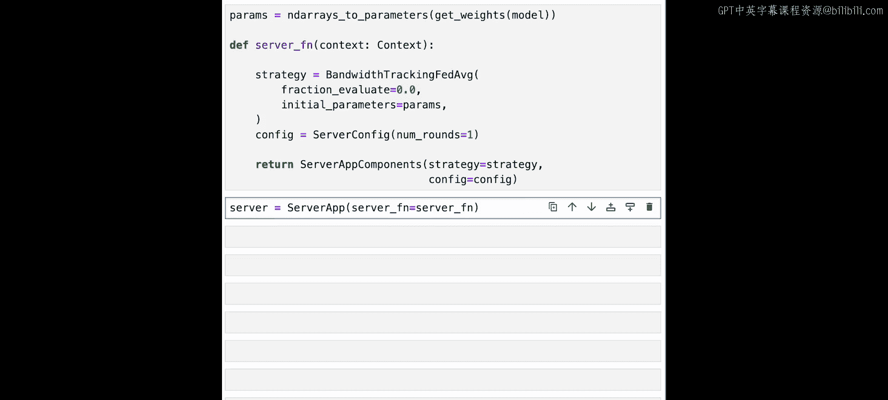
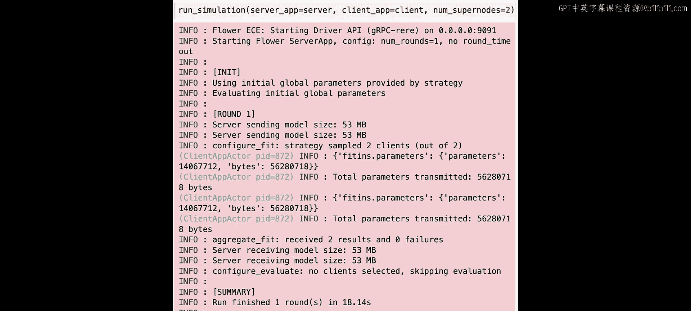
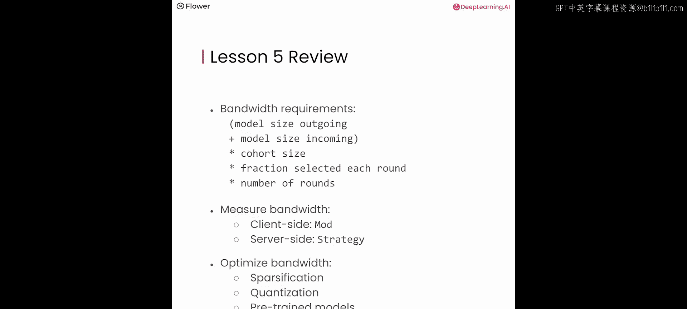

# 006：带宽分析 📊

在本节课中，我们将深入学习使用联邦学习训练模型时的带宽需求。你将理解如何在理论上分析联邦系统的带宽使用情况，以及如何在实践中使用Flower框架测量带宽消耗。

上一节我们介绍了联邦学习的基本流程，本节中我们来看看其通信开销。

## 带宽需求计算公式 📐

为了更好地理解联邦学习系统的带宽使用情况，我们将逐步推导一个公式，用于计算运行此类系统的大致带宽需求。

我们首先关注发送给单个客户端的模型大小，以及从该客户端接收回来的模型更新大小。在某些场景下，这两个大小并不相同。有时我们向客户端发送完整的模型参数，但客户端返回的是压缩后的梯度，因此从客户端接收的更新大小会小于我们发送出去的模型大小。

将发送给客户端的模型大小与从客户端接收的模型更新大小相加，就得到了向一个客户端发送模型并接收其更新所需的带宽需求。

接着，我们将这个数值乘以**队列规模**，即系统中客户端的总数。然后，我们需要乘以**每轮选择的客户端比例**。如果我们有100个客户端，但每轮只选择其中的20%，我们就需要乘以0.2。

最后，我们将这个数字乘以**执行的轮数**。前面的步骤给出了单轮联邦学习的带宽需求，再乘以总轮数即可得到总带宽需求。

如果发送出去的模型大小与从客户端接收回来的模型大小相同，我们可以简化为：`模型大小 × 2`。

以下是计算联邦学习带宽需求的简化公式：

**总带宽 ≈ (发送模型大小 + 接收更新大小) × 队列规模 × 选择比例 × 轮数**

## 计算示例 🔢

让我们通过一个例子来应用这个公式。在课程2中，将涉及在私有数据上进行联邦大语言模型微调。将使用的语言模型是EleutherAI的Pythia-14m模型，这是一个拥有1400万个参数的模型。该模型的大小为53 MB。

根据我们的简化公式，我们将其乘以2，得到向一个客户端发送模型并接收其更新所需的带宽。如果我们跨两个客户端训练此模型，则将该数字乘以2。因为我们只有两个客户端，所以每轮都会选择它们。

如果我们有100个客户端，在单轮联邦学习中只选择其中的50个是合理的。在这种情况下，我们将选择比例设置为0.5，而不是1.0。

最后，我们乘以联邦学习的轮数。在实验中，为了节省时间，我们只进行一轮，因此将其设置为1。这样，我们得到单轮联邦学习的**总带宽使用量约为212 MB**。

## 实验验证 🧪

现在，让我们进入实验环节，看看我们的计算是否正确。

以下是实验的关键步骤：

1.  **导入模块**：导入必要的工具函数和类，以及一个用于在客户端跟踪参数传输大小的模块。
2.  **初始化模型**：初始化一个拥有1400万个参数的Pythia-14m语言模型，并计算其大小（确认为53 MB）。
3.  **定义客户端**：定义Flower客户端。与之前课程不同的是，我们跳过了实际的训练和评估部分，因为我们只想在服务器端计算带宽。
4.  **创建自定义策略**：为了跟踪发送和接收的模型大小，我们创建一个名为`BandwidthTrackingFedAvg`的自定义策略。它扩展了之前课程中使用的联邦平均策略。
    *   在`aggregate_fit`方法中，它为每个客户端的结果计算接收到的模型更新大小（以MB为单位）并记录。
    *   在`configure_fit`方法中，它计算即将发送给客户端的模型大小（以MB为单位）并记录。
5.  **配置服务器**：创建服务器应用，将策略设置为自定义策略，并将轮数设置为1（因为在此设置中，带宽需求在连续轮次中不会改变）。
6.  **运行模拟并查看结果**：启动模拟后，在日志中可以看到：
    *   要发送的模型大小为53 MB。
    *   服务器接收了两个大小约为53 MB的模型。
    *   最后，通过汇总记录的所有带宽大小，得到**总带宽使用量为212 MB**，这与我们使用公式计算的结果完全一致。

## 带宽优化策略 ⚙️

在实验中我们看到，即使只进行一轮联邦学习，也可能快速消耗大量带宽。有许多方法可以减少联邦学习中的带宽使用。

优化带宽主要分为两类：**减少单个更新的大小**和**减少通信频率**。

以下是减少更新大小的几种方法：

*   **稀疏化**：例如使用Top-K稀疏化。如果要通信的梯度低于某个阈值，则将其作为零进行通信（实际上可以跳过），从而节省通信成本。这在训练后期尤其有效，因为梯度中更多元素的幅度会变小。
*   **量化**：量化有多种形式，它们通过减少表示标量所需的位数来降低客户端与服务器之间交换的更新大小。

你也可以利用**预训练模型**。在许多场景下，可以找到一个对特定应用有用的预训练模型，然后联邦学习可以在此基础上继续训练。在这种情况下，我们可能不需要训练每一层，而只需通信被联邦训练修改的层。

另一种方法是**在本地训练更长时间**，然后再与服务器交换更新。例如，不是只训练一个本地周期，而是在发送更新后的模型回服务器之前训练五个周期。但需要注意，这也可能阻碍收敛。如果本地模型训练过多周期，它们可能会越来越发散，导致聚合后的模型变差而非变好。

## 总结 📝

本节课中我们一起学习了联邦学习的带宽分析。

*   我们可以通过将发送的模型大小与接收的更新大小相加，再乘以队列规模、每轮选择的客户端比例以及总轮数，来计算带宽需求。
*   在实际实现中，我们可以使用Flower中的客户端模块和服务器端策略来测量服务器端和客户端的带宽需求。
*   我们可以通过应用稀疏化或量化等技术、使用预训练模型（不通信所有层）或者在交换模型更新之前进行更多的本地训练，来优化带宽利用率。

理解并管理带宽是构建高效、可扩展的联邦学习系统的关键一步。