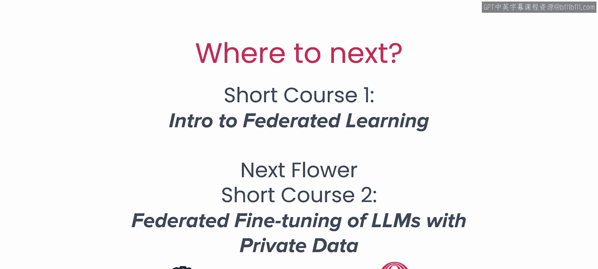
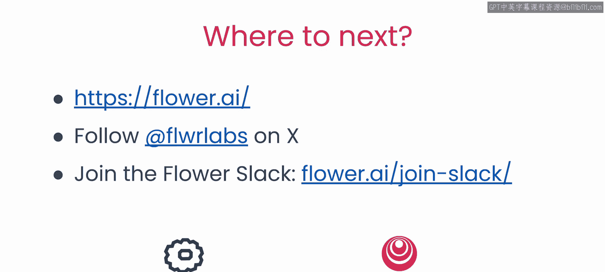

# 007：课程总结与展望 🎯

在本节课中，我们将对联邦学习课程的核心内容进行总结，并展望后续的学习方向与应用前景。

## 课程概述 📚

在本系列课程中，我们学习了联邦学习及其在解锁大量当前未被利用的分布式训练数据方面所扮演的重要角色。

## 核心学习内容回顾 🔄

上一节我们介绍了联邦学习的应用场景，本节中我们来回顾整个课程的核心要点。

以下是本课程涵盖的主要学习模块：

*   使用 **Flower** 联邦学习框架，构建了不同版本的联邦训练流程。
*   学习了如何调整联邦系统的不同方面。
*   探讨了如何考量数据隐私问题。
*   掌握了如何使用 **Flower** 计算和测量联邦系统的带宽使用情况。

## 后续学习方向 🚀

那么，接下来该做什么？这是两门系列课程中的第一门。下一门课程将介绍如何在私有数据上进行联邦大语言模型（LLM）的微调。

## 探索与实践鼓励 💡

我也鼓励你开始自己的探索。我们非常乐意在 **Flower AI** 或 **X** 平台的 **FLwr labs** 上听到你的声音。加入 **Flower** 社区 **Slack** 频道，那里有成千上万志同道合的人工智能研究者和开发者正在交流想法。

## 致谢与展望 🙏

感谢令人惊叹的 **Flower** 社区。看到如此多的项目不断突破边界，这真是一种激励。我期待着看到你们自己构建的作品。

## 课程总结 ✨

本节课中，我们一起学习了联邦学习的基础概念、使用Flower框架的实践方法、系统调优、隐私考量以及资源评估。联邦学习为在保护数据隐私的前提下利用分散数据提供了强大的解决方案，希望你已准备好将其应用于自己的项目中。