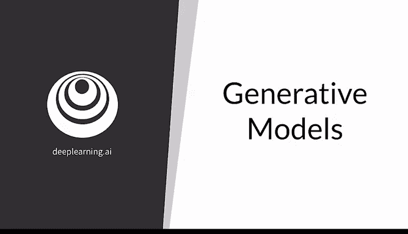
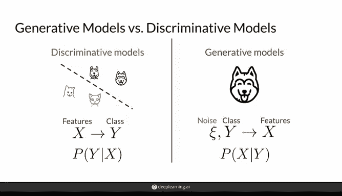
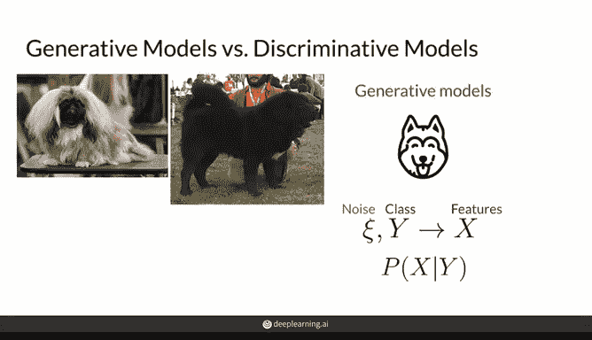
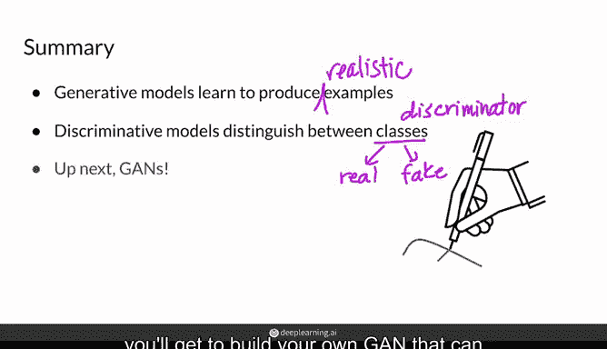

# 03：生成对抗网络（GAN）入门 🎨🤖

在本节课中，我们将学习生成模型的基本概念，并了解生成对抗网络（GAN）及其相关模型的工作原理。通过对比判别模型与生成模型，我们将初步认识两种流行的生成模型架构：变分自编码器（VAE）和生成对抗网络（GAN）。课程结束时，你将能够构建一个生成手写数字的GAN模型。

---

## 生成模型简介

上一节我们概述了课程目标，本节中我们来看看什么是生成模型。生成模型是机器学习中的一类模型，其目标是学习并生成逼真的数据样本，例如图像或音乐。GAN是生成模型的一种。

你可能已经熟悉判别模型，但可能不清楚它们在机器学习大背景下的位置。判别模型通常用于分类任务。它们学习如何区分不同类别，例如狗和猫，常被称为分类器。

判别模型接收一组特征 **X**（例如是否有湿鼻子或是否发出呼噜声），并根据这些特征确定类别 **Y**（判断图像是狗还是猫）。换句话说，它们试图建模给定特征 **X** 时类别 **Y** 的概率，公式表示为 **P(Y|X)**。

相比之下，生成模型试图学习如何生成某个类别的逼真表示，例如一张逼真的狗图片。生成模型接收一些随机输入（这里用噪声表示），噪声可以是一组随机值，例如 `[3, -5, 2.6]`，实际上它是一个向量。生成模型有时也接收类别 **Y**（例如“狗”）。基于这些输入，其目标是生成一组特征 **X**，使其看起来像一只逼真的狗，例如具有湿鼻子或吐舌头特征的狗图像。

你可能会问为什么需要噪声输入。噪声主要是为了确保每次生成的内容不完全相同，从而产生多样化的输出。如果只生成同一只狗，既无趣也缺乏意义。因此，可以将噪声视为额外的随机输入。

更一般地说，生成模型试图捕捉给定类别 **Y**（如狗）时特征 **X** 的概率分布。通过添加噪声，这些模型能够生成该类别的逼真且多样化的表示。如果只生成一个类别（如狗），则可能不需要条件输入 **Y**，而是直接建模所有特征 **X** 的概率。

从对比中可以看出，判别模型和生成模型在某种程度上是相互镜像的。

---

## 生成模型示例

以下是生成模型的一个运行示例。在一次良好的生成过程中，你可能得到一张啄食鹅的图片；在另一次运行中，可能生成一只藏獒。

如果多次运行生成模型而不加限制，最终会得到更多代表训练数据集的图片，例如许多可爱的拉布拉多犬。

---

## 流行生成模型架构

生成模型有多种类型，以下简要介绍两种最流行的架构：变分自编码器（VAE）和生成对抗网络（GAN）。

### 变分自编码器（VAE）

VAE包含两个模型：编码器和解码器，它们通常是神经网络。训练过程首先将逼真图像（例如一张逼真的狗图片）输入编码器。编码器的任务是找到在潜在空间中表示该图像的有效方式。假设它在潜在空间中找到一个点，可以用向量 `[6.2, -3, 21]` 表示。

VAE随后将潜在表示（或接近它的点）输入解码器。解码器的目标是重建编码器之前看到的逼真图像。训练初期，解码器可能无法准确重建图像，生成的狗可能具有邪恶的眼睛。训练完成后，我们通常移除编码器，并可以在潜在空间中随机选择点（例如另一个位置），解码器将学会生成逼真的狗图像。

上述描述主要是自编码器部分。变分部分在训练过程中向整个模型注入一些噪声。编码器不是将图像编码为潜在空间中的单个点，而是将其编码为一个分布，然后从该分布中采样一个点输入解码器以生成逼真图像。由于可以从分布中采样不同的点，这增加了一定的噪声。

### 生成对抗网络（GAN）

GAN的工作方式截然不同。它同样由两个模型组成：生成器和判别器。生成器接收随机噪声输入（例如向量 `[1.23, -5]`），并生成图像（类似于VAE中的解码器）。生成器的作用在某种程度上与VAE的解码器非常相似。

不同之处在于，这次没有编码器来指导应输入生成器的噪声向量。相反，有一个判别器同时查看真实图像和生成图像，并试图区分哪些是真实的、哪些是伪造的。随着时间的推移，两个模型相互竞争、相互学习，因此被称为“对抗”网络。

你可以想象，随着它们相互竞争和学习，它们的“肌肉”会逐渐增长，直到达到一个阶段：我们不再需要判别器，生成器可以接收任何随机噪声并生成逼真图像。例如，随机向量 `[-5, 6.2, 8]` 可以生成这只可爱的拉布拉多犬。

在本专项课程中，我们将重点学习GAN。如果你对VAE感兴趣，可以自行阅读更多资料。如果你还不完全理解GAN的工作原理，不必担心，本周接下来的视频将深入探讨其架构和学习方式。

---

## 总结

本节课中我们一起学习了生成模型的基本概念。生成模型学习生成逼真的样本，就像一位艺术家能够绘制出看起来像照片的画作。同时，判别模型用于区分不同类别。生成模型就像试图学习如何创作逼真艺术的艺术家，而判别模型则像区分狗和猫的分类器。

当然，你也看到判别模型可以作为生成模型的子组件，例如判别器其类别是“真实”和“伪造”。生成模型有多种类型，但在本专项课程中，我们将重点研究GAN。到本周末，你将能够构建自己的GAN模型，用于生成手写数字。

多么酷啊！准备开始吧。