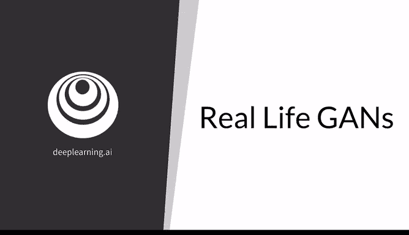
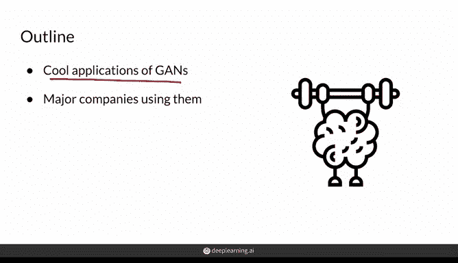
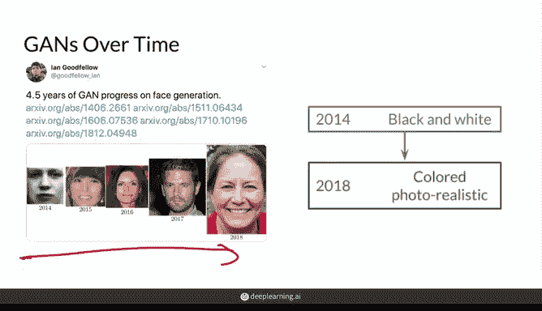
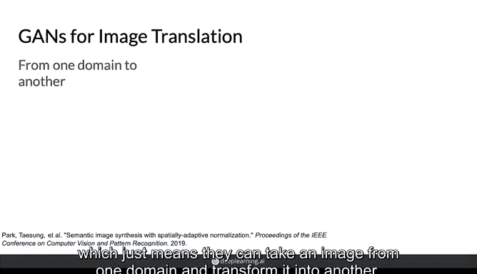
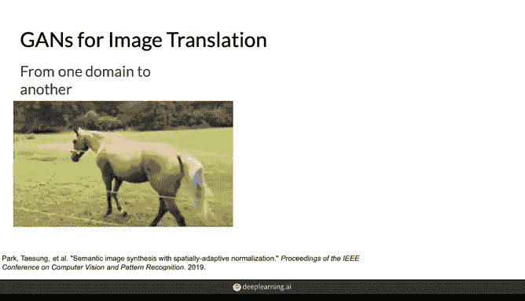
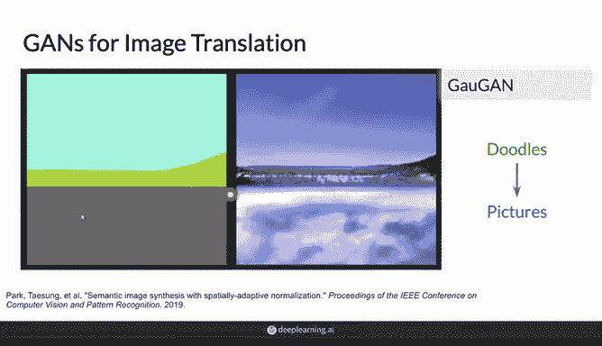
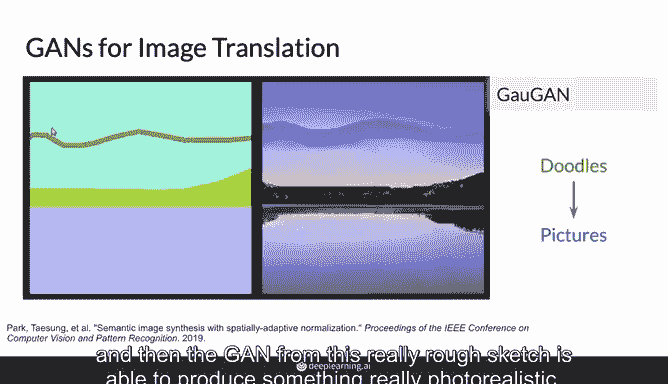
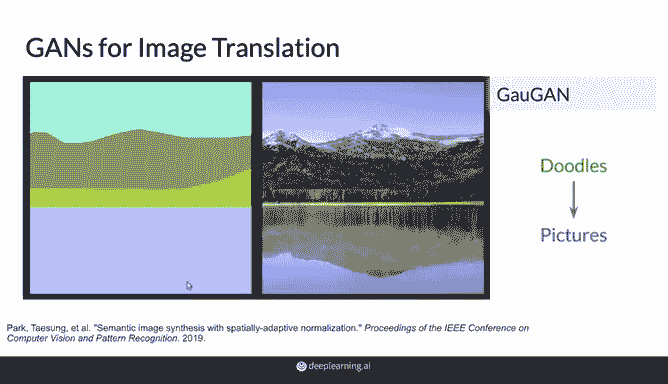
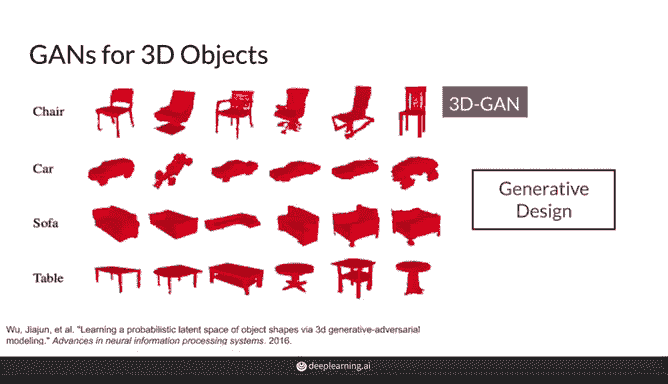
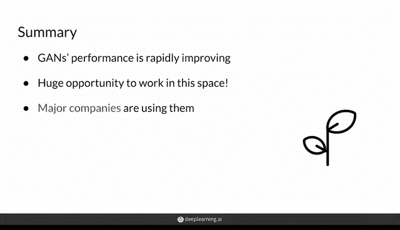

# 04：现实生活中的GAN应用 🎨

在本节课中，我们将要学习生成对抗网络（GAN）在现实世界中的多种应用。自2014年诞生以来，GAN已在众多任务中取得了令人瞩目的成就。如果你还未见识过它们的成果，接下来的内容将为你带来惊喜。

---

## GAN的快速发展 📈

上一节我们介绍了GAN的基本概念，本节中我们来看看其实际应用的发展速度。

伊恩·古德费洛（Ian Goodfellow）被广泛认为是GAN的创造者。他的一条推文生动地展示了GAN近年来惊人的进步速度。

从2014年生成黑白且看起来不太真实的人脸，到2018年生成更高质量、色彩逼真的照片级人脸，GAN一直在不断进步。实际上，直到今天，它们的表现仍在持续提升。

一个典型的例子是，在2020年初，英伟达发布了一个能够生成如下图像的GAN。这些图像分辨率极高，看起来像专业照片，并且具有柔和的背景虚化效果。

很容易认为这些人是真实存在的，但他们实际上并不存在。这很神奇，不是吗？

---

## 超越人脸的生成能力 🐱

GAN可以从给定的任何训练数据中学习，因此它们的能力不限于生成人脸。以下是同一个模型生成的猫的图像。

仔细观察，你会发现一些看起来非常奇怪的图像，因为并非每个生成的样本都是完美的。这里虽然有些像猫的轮廓，但当然，我也不知道那具体是什么。

另一个有趣的现象是，你可以在生成的图像上观察到文字。这是因为如前所述，生成模型试图模仿其训练数据的分布。在本例中，训练数据是从网络上抓取的所有猫的图片，其中包含许多带有 meme 文字的猫 meme 图。

有趣的是，这些生成猫 meme 图上的文字并不构成真正的单词，因为生成模型的目标不是建模文字，而是追求视觉上的真实感。尽管如此，其中一些生成的图像仍然相当可爱和逼真，尽管它们可能还不足以登上 Reddit。

---

## 图像翻译与风格转换 🖼️➡️🦓

GAN还可以执行图像翻译，这意味着它们可以将一个领域的图像转换成另一个领域。例如，它们可以将马的图像转换成斑马，反之亦然。

真正有趣的是，你实际上并不需要斑马和马做相同动作的成对示例，模型可以直接将风格迁移过去。

---

## 从草图到照片级渲染 ✏️

同样地，GAN可以帮助你绘画。这个模型可以接受一幅粗糙的风景草图，并将其变得具有照片般的真实感。

在左侧，你可以看到笔触，这是一个用非常粗糙的笔触勾勒出不同类别（如云、山或湖）的人。然后，GAN能够根据这个非常粗糙的草图生成非常逼真的图像。

在这幅草图中，一个人仅用几根线条和颜色进行粗略的素描，然后GAN就能将它们转换成逼真的图片。

---

## 图像动画与3D生成 🎬

GAN还可以处理静态肖像，例如《蒙娜丽莎》，并利用任何真实人脸的运动来使其动画化。扮演者甚至不需要长得像蒙娜丽莎。

如果你联想到了《哈利·波特》中会说话的肖像画，那么你并非唯一有这种想法的人。从某种意义上说，GAN就是魔法。

GAN的应用不止于2D图像，它们还能生成3D物体，如椅子和桌子。这可以应用于生成式设计等领域，为你家创造很酷的家具。

在医学领域也有多种应用，例如使用GAN生成人工医疗数据，甚至检测X光片中的异常。你将在课程3中看到更多相关内容，但要展示所有酷炫的应用可能需要数小时。

---

## 知名公司的GAN应用案例 🏢

一些知名公司也已开始将生成对抗网络用于各种应用。

以下是部分公司的应用方向：

*   **Adobe**：正在构思下一代Photoshop，让新手艺术家也能达到专家水平，例如通过那些涂鸦。
*   **Google**：主要将其用于文本生成，但也涉及图像。
*   **IBM**：将GAN用于数据增强，即使用GAN生成合成样本来扩充下游分类器的数据集。例如，当某类或某种图像数据不足时。
*   **Snapchat和TikTok**：将其用于创造性的新滤镜，你可能已经见过并使用过。
*   **迪士尼**：将其用于超分辨率技术。

在本专项课程结束时，你也将能够将GAN用于你喜欢的任何应用。

---

## 总结 📝

本节课中我们一起学习了GAN在过去几年取得的快速进展。我向你展示了几个非常酷的应用，并提到了一些大公司使用GAN的方式。然而，GAN还有更多事情可以做，你也有许多潜在的方向可以利用这些模型。

