# 05：GANs背后的直觉 🧠

在本节课中，我们将学习生成对抗网络（GANs）背后的核心直觉。我们将了解生成器和判别器这两个关键组件如何通过相互竞争来学习，最终使生成器能够创造出逼真的图像。

---

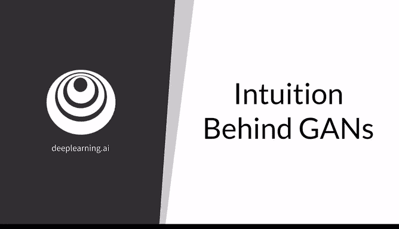

## 概述

生成对抗网络（GANs）是一种强大的模型，它通过学习生成难以与真实对象区分的逼真对象，例如人脸。GANs通过让生成器和判别器相互竞争来学习。本节将讨论生成器和判别器的目标，并展示它们之间的博弈如何开始，以及它们如何相互促进，直到我们获得一个能够生成逼真图像的优秀生成器。

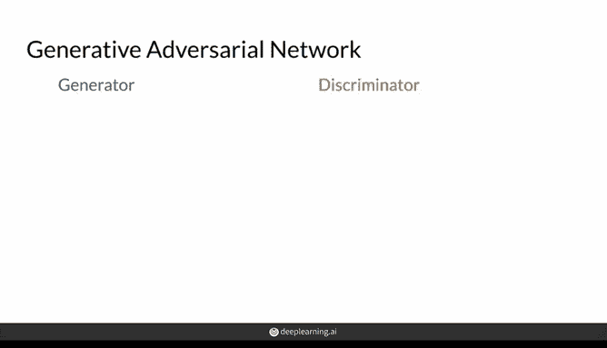

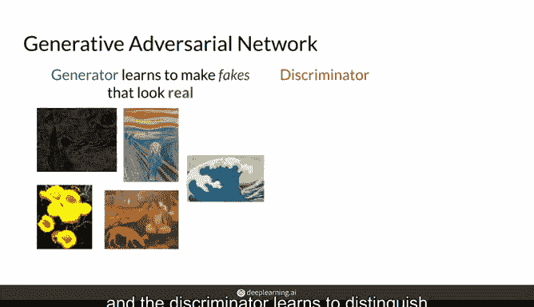

---

## 生成器与判别器：核心组件

上一节我们介绍了GANs的基本概念，本节中我们来看看它的两个核心组件。

GANs包含两个部分：一个称为**生成器**，另一个称为**判别器**。它们通常是两个不同的神经网络。

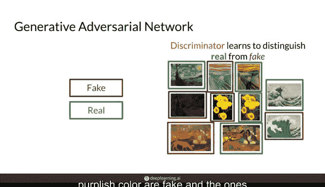

*   **生成器** 学习生成看起来真实的“假货”，以欺骗判别器。
*   **判别器** 学习区分什么是真实的，什么是伪造的。

你可以将生成器想象成绘画伪造者，而判别器则是艺术鉴定师。

---

## 博弈的开始：初始状态

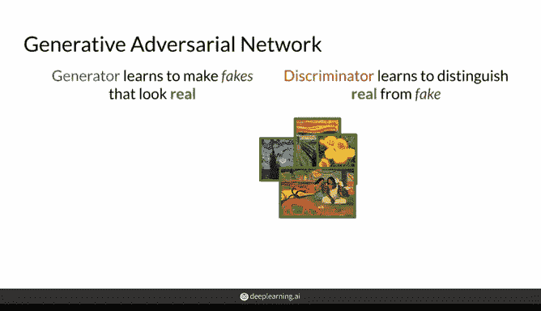

了解了基本组件后，我们来看看这场博弈是如何开始的。

要启动这场博弈，你只需要一组真实图像，例如一些著名的画作（如果你想生成名画的话）。

在博弈开始时，生成器实际上并不复杂，它不知道如何生成看起来真实的艺术品。我们可以用一个试图绘画的狗狗表情包来代表这个初级的生成器。

此外，生成器不允许看到真实图像，它甚至不知道这些画作应该是什么样子。这对生成器来说非常困难，尤其是在开始时。因此，在最开始，这个初级的生成器可能只会画出一堆涂鸦。

你的另一个初始组件是一个初级的判别器，它也不确定什么是真，什么是假。这里用一个戴着贝雷帽、试图成为艺术评论家的狗狗来代表它。但在这个阶段，它被允许查看真实的艺术品，只是这些真品与生成器制造的假货混在一起，它需要自己去分辨和学习如何决定。

---

## 训练过程：相互促进的竞争

现在，让我们深入这场竞争的具体训练过程。

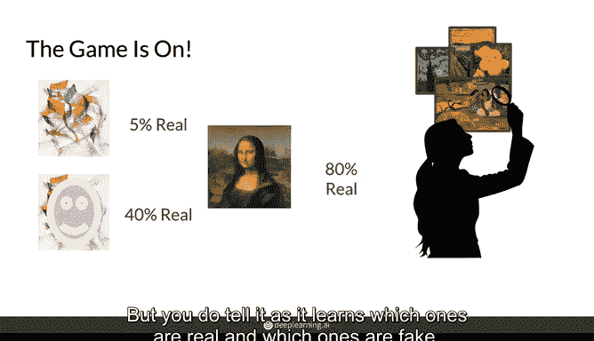

以下是启动竞争的关键步骤：

1.  **训练判别器**：你使用真实艺术品来训练判别器，让它能够知道哪些图像是真实的。当它做出判断（例如，“这个看起来像真的”）后，你会告诉它“对，那是真的”或“不，那是假的”。这样，判别器就能学会区分像涂鸦这样画得不好的图像和稍好一些的图像，并最终识别出真正的艺术品。
2.  **生成器获得反馈**：当生成器产生一批画作时，它会通过查看判别器对其作品给出的评分，来了解应该在哪个方向上改进。例如，如果某张画被认为“看起来更真实一点”，生成器可能会开始朝着绘制更逼真的蒙娜丽莎面孔方向努力。
3.  **判别器持续进化**：判别器也会随着时间的推移而改进，因为它在每一轮中都会从生成器那里收到越来越逼真的图像，并且它总是会收到混杂在一起的真假图像。本质上，随着图像质量提高，它会努力培养出越来越敏锐的“眼力”。
4.  **纠正错误**：例如，当判别器说生成器创建的某张图像有“60%的可能性是真实的”时，你实际上会告诉它这是错的，它并不真实，实际上是伪造的。

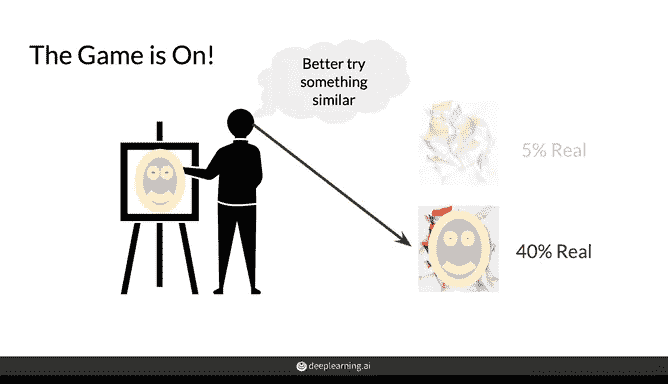

经过多轮竞争后，生成器将开始创作出越来越难以区分的画作，对于判别器来说，可能已经无法将它们与真品区分开来。

---

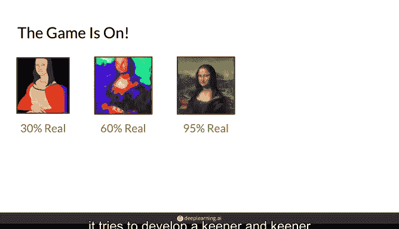

## 博弈的终结

当作为开发者的你对生成器的结果感到满意，认为它已经能够生成足够逼真的假图像时，这场博弈就会结束。

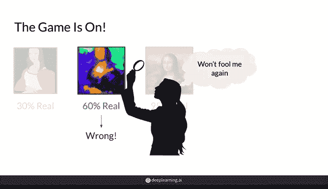

---

## 总结

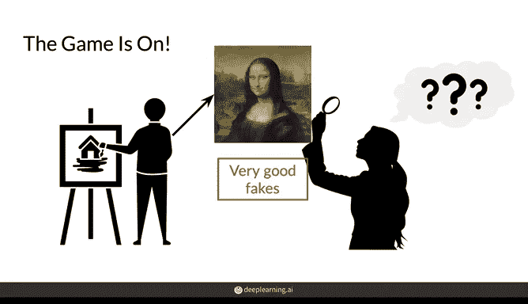

本节课中，我们一起学习了生成对抗网络（GANs）背后的核心直觉。重要的是要理解：

*   生成器的目标是生成让判别器信以为真的假货。
*   判别器的目标是将生成器制造的假货与你提供的真实样本区分开来。

两个模型都从与对方的竞争中学习，直到生成器产生的样本足够好，能够欺骗判别器。

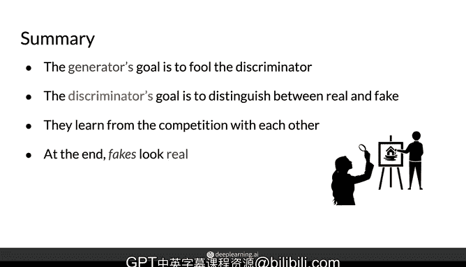

在接下来的视频中，你将基于这种直觉，更深入地探讨这种竞争机制是如何运作的。