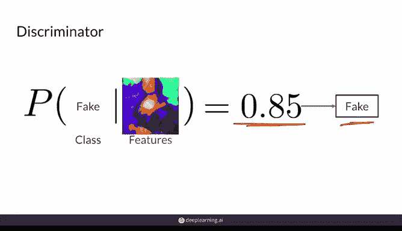
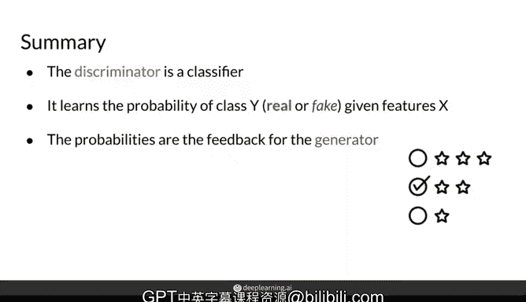

# 06：判别器详解 🧠

在本节课中，我们将要学习生成对抗网络（GAN）的核心组件之一：判别器。我们将从分类器的基本概念开始，逐步深入到判别器在GAN中的具体作用和工作原理。

---

## 分类器回顾

上一节我们介绍了GAN由生成器和判别器组成，本节中我们来看看判别器是如何工作的。判别器本质上是一种分类器，因此我们首先快速回顾一下分类器的基本概念。

分类器的目标是区分不同类别。例如，给定一张猫的图片，分类器应能判断出这是一只猫，而不是狗。分类器不限于图像分类，也可用于文本、视频等多种数据类型。

以下是分类器的一种常见实现方式：

*   使用神经网络作为模型。
*   输入为特征 `x`（例如 `x0, x1, ..., xn`）。
*   网络经过一系列非线性计算。
*   输出为各个类别的概率分布（例如，猫：45%，狗：45%，鸟：10%）。

在训练初期，模型的预测可能不准确。通过学习过程，模型会不断调整，试图使其预测 `Y_hat` 接近真实的标签 `Y`。

这个学习过程可以概括为以下几个步骤：

1.  拥有输入特征 `X` 和对应的真实标签 `Y`。
2.  神经网络（参数为 `θ`）学习从 `X` 到预测值 `Y_hat` 的映射。
3.  目标是最小化真实值 `Y` 与预测值 `Y_hat` 之间的差异。
4.  通过成本函数（Cost Function）来衡量这种差异。
5.  根据成本函数的梯度更新网络参数 `θ`。
6.  重复此过程，直到分类器性能良好。

---

## 判别器的概率视角

从概率的角度看，判别器的目标是为每个类别建模概率。具体来说，它建模的是在给定输入特征 `X`（例如图像的像素值）的条件下，样本属于某个类别 `Y` 的概率，即 `P(Y|X)`。这是一个条件概率分布。

现在，将其放回GAN的上下文中。GAN中的判别器是一个特殊的分类器，它检查样本（包括真实样本和生成器产生的假样本），并判断它们属于“真实”类还是“虚假”类。

例如，当判别器看到一张伪造的《蒙娜丽莎》图像时，它不再判断图像内容是猫、狗还是鸟，而是判断这幅画有多“假”。它可能输出此图像有85%的概率是伪造的。

用概率公式表示，判别器建模的是：给定输入 `X`，样本为“假”的概率，即 `P(fake|X)`。在上例中，`P(fake|image) = 0.85`。相应地，其为“真”的概率 `P(real|image) = 0.15`。

判别器不仅会给出“真假”的分类判断，更重要的是，它会将这个概率值（例如0.85）反馈给生成器，以帮助生成器改进。

---

## 总结

本节课中我们一起学习了判别器的核心原理。我们了解到：

*   判别器是一种分类器，其任务是建模给定输入特征（如图像的RGB像素值）后，样本属于“真实”或“虚假”类别的概率。
*   判别器输出的概率值是驱动生成对抗网络学习的关键。这些概率帮助生成器了解其生成样本的“假”的程度，从而在后续迭代中生成更逼真的样本。

判别器与生成器之间的这种对抗性互动，正是GAN能够学习生成高质量数据的基础。在下一节中，我们将探讨另一个核心组件——生成器。