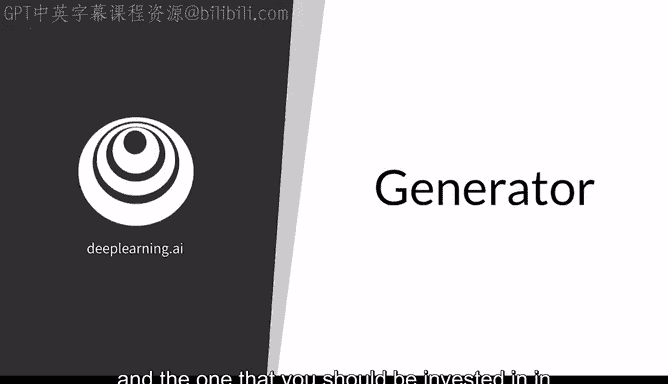
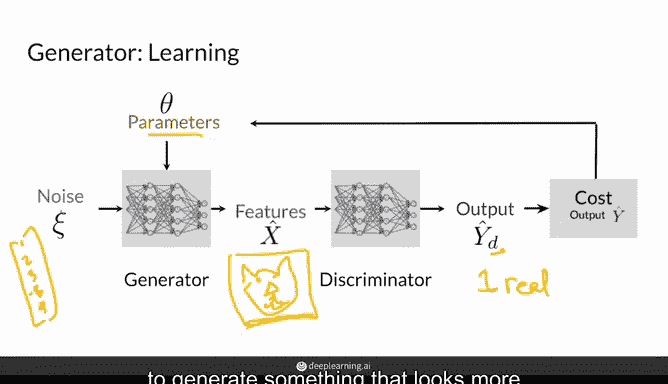
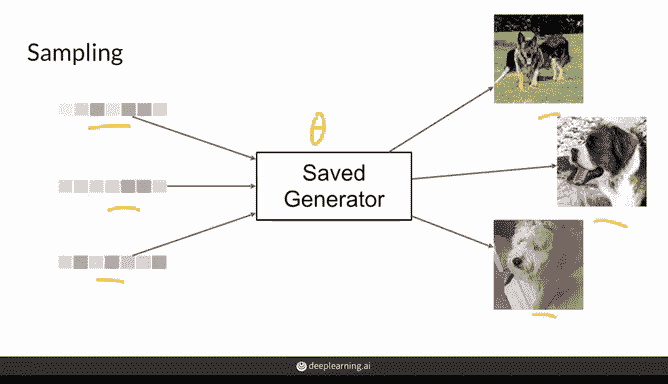
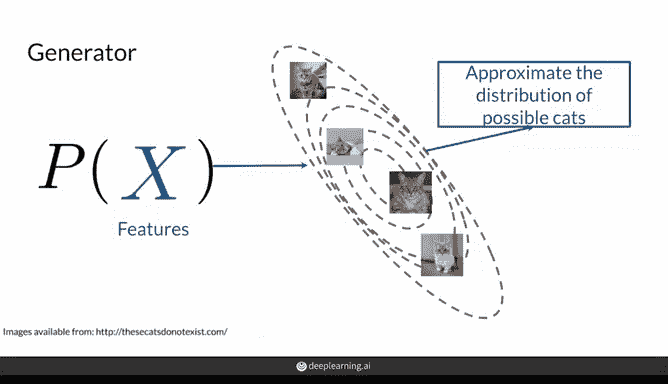
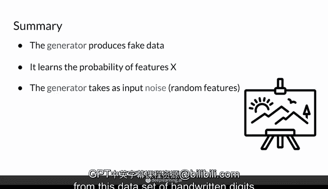

# 07：生成对抗网络（GAN）中的生成器 🧠

在本节课中，我们将要学习生成对抗网络（GAN）的核心组件之一——生成器。我们将探讨它的作用、工作原理、如何随时间改进，以及它在概率层面所建模的内容。

## 概述

生成器是GAN的“心脏”，是用于生成示例的模型。训练过程的最终目标就是帮助生成器达到极高的性能。

## 生成器的角色与目标

生成器的最终目标是能够生成特定类别的示例。例如，如果你用猫的图像训练它，生成器将通过一系列计算，输出一张看起来真实的猫的图片。

理想情况下，生成器每次运行时不会输出完全相同的猫。为了确保它每次都能生成不同的示例，我们需要向它输入不同的随机值集合，这被称为**噪声向量**。

这个噪声向量就是一组数值，可以想象成 `[1, 2, 5, 1.555, ...]`。这个噪声向量（有时连同类别标签Y，例如“猫”）会作为输入，馈送到生成器的神经网络中。

这意味着特征 `x0, x1, x2, ..., xN` 包含了类别信息和噪声向量中的数值。然后，神经网络中的生成器会基于这些输入计算一系列非线性变换，最终输出一些变量，这些变量在运行时看起来就像一只棕白相间的猫。

在这里，它的输出不是不同的类别，而是一张图像。你可以想象这张图像可能有300万个像素，因此输出层可能有300万个节点，每个节点代表一个像素的值，而非类别。

在另一次运行中，它可能生成一只斯芬克斯猫。在最后一次运行中，可能生成一只萨凡纳猫。这些不同的输出都源于输入了不同的噪声向量。

## 生成器如何随时间改进

上一节我们介绍了生成器的基本输入和输出，本节中我们来看看它是如何通过学习来改进的。

首先，你有一个噪声向量（即那些随机输入值），我们用希腊字母 **ζ** 表示。你将它传入一个由神经网络表示的生成器，以生成一组构成猫图像（或尝试生成猫图像）的特征。

例如，你的生成器可能生成这样一张图片。这张生成的图片 **X̂** 会被送入判别器。判别器通过检查它，来判断它认为这张图片有多真实或多虚假。

之后，基于判别器对它的判断（我们用 **ŷ_D** 表示，下标D代表这是判别器的预测），你可以计算一个成本函数。这个函数本质上衡量的是生成器产生的示例被判别器认为是“真实”的程度，因为生成器的目标就是让输出看起来尽可能真实。

简单来说，生成器希望 **ŷ_D** 尽可能接近1（代表“真实”），而判别器则试图让它接近0（代表“虚假”）。生成器利用这两者之间的差异来更新自身的参数，从而随时间改进，并知道该朝哪个方向调整参数，以生成看起来更真实、更能“欺骗”判别器的内容。

## 保存与使用训练好的生成器

一旦你获得了一个看起来相当不错的生成器，你可以保存生成器的参数 **θ**。这通常意味着冻结这些θ值并将其保存到某处。之后，你可以重新加载它，并从这个保存的生成器中“采样”。

“采样”基本上意味着：你准备一些随机噪声向量，将它们输入到保存的生成器中，它就能生成各种各样的不同示例。请注意，图中保存的生成器生成的示例是狗，这表明它可能不是用猫的图像训练的。

你可以持续生成新的噪声向量，将其输入这个保存的生成器，从而（在本例中）采样出更多的狗图像。

## 生成器建模的概率

在概率的领域中，生成器建模的是某个示例（如前例中的猫，或图中的狗，当然也可以是乌龟、鸟或鱼）出现的概率。

更一般地说，生成器试图建模给定类别Y（例如“猫”）时，猫的各种特征（如舔爪子、有可爱的胡须、有不同类型的毛发）的概率。这即是特征 **X** 给定类别 **Y** 的条件概率：**P(X|Y)**。

然而，如果我们目前只有一个类别（比如只生成猫），那么Y将始终相同。因此，你实际上不需要显式地写出条件，你建模的是 **P(X)**。当然，如果你希望生成器学习所有不同类型的类别，并且你关心类别信息，那么你就需要将类别信息输入进去。

现在，你有了世界上所有不同类型猫的 **P(X)**。生成器将建模特征X的无条件概率（因为类别Y始终是“猫”）。在这种情况下，它将尝试近似真实世界中猫的分布。

最常见的猫品种将有更高的概率被生成，因为它们在数据集中更常见。某些特征（如尖耳朵）也会更常见，因为大多数猫都有。而更稀有的品种被采样到的可能性则较低。

图中的线条代表了一个三维的概率分布，展示了“猫”这个类别的特征是如何分布的。最常见的猫类特征会显示并采样于中间区域（如果将其视为3D表示，则是凸出的部分），而稀有品种或外观独特的猫则位于边缘。

这意味着最常见的猫品种有更多机会被生成，而像斯芬克斯猫这样不常见的品种则会被更罕见地生成。在未来的视频中，你将看到如何控制采样过程以获得你想要的结果，但目前生成器的工作只是模拟自然界中猫的分布。

## 本周实践任务

为了总结，生成器产生试图看起来真实的虚假数据，它学习模仿你数据类别中特征X的分布。为了每次产生不同的输出，它以随机特征作为输入。

在本周的作业中，你将构建一个生成器G，用于生成手写数字的图像。它的设置相同：你只需给它随机噪声，它就能产生所有这些不同的手写数字。

这很酷，因为手写看起来并不完美，每次看起来也不尽相同。生成器将能够从作业中你将看到的手写数字数据集中，建模并生成各种不同样式的5、8等所有数字。

## 总结

本节课中，我们一起学习了生成对抗网络中生成器的核心作用。我们了解到生成器如同GAN的心脏，负责从随机噪声中生成逼真的数据。它通过接收噪声向量作为输入，并利用与判别器的对抗反馈来不断优化自身参数，从而学习并逼近真实数据的概率分布 **P(X)**。最终，训练好的生成器可以被保存并用于采样，创造出多样化的新样本。在接下来的实践中，你将亲手构建一个用于生成手写数字的生成器。