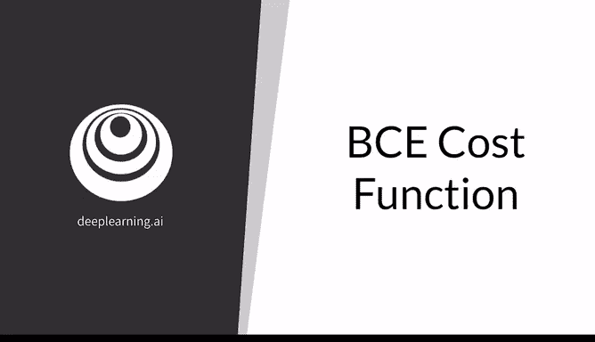
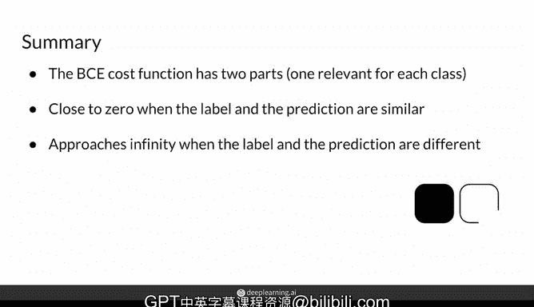

# 08：二元交叉熵（BCE）损失函数详解 🧮

在本节课中，我们将学习生成对抗网络（GAN）训练中一个核心的损失函数——二元交叉熵（Binary Cross Entropy，简称BCE）。我们将深入理解其公式、每个组成部分的含义，并通过直观的示例说明其工作原理。

---

## 概述

二元交叉熵函数专为二分类任务设计，例如区分“真实”与“伪造”数据。它通过量化模型预测与真实标签之间的差异，为模型训练提供优化方向。

---

## BCE损失函数公式

完整的BCE损失函数公式如下：

$$J(\theta) = -\frac{1}{m} \sum_{i=1}^{m} [y^{(i)} \log(h_{\theta}(x^{(i)})) + (1 - y^{(i)}) \log(1 - h_{\theta}(x^{(i)}))]$$

这个公式初看可能有些复杂，接下来我们将逐一拆解其中的每个部分。

---

## 公式拆解与含义

### 求和与平均

公式开头的 $\sum_{i=1}^{m}$ 和 $\frac{1}{m}$ 表示对当前小批量（mini-batch）中所有 $m$ 个样本的损失进行求和，然后取平均值。这确保了损失值不受批次大小的影响。

### 符号定义

*   **$h_{\theta}(x)$**：模型的预测输出。在GAN中，这通常是判别器（Discriminator）的输出，表示输入 $x$ 为“真实”的概率。
*   **$y$**：样本的真实标签。例如，`y=1` 代表真实样本，`y=0` 代表伪造样本。
*   **$\theta$**：模型的参数，即判别器中需要被优化的权重。

公式括号内的内容可以拆分为两个独立的项，每一项对应一种标签情况。

---

## 两项的直观理解

上一节我们介绍了公式的整体结构，本节中我们来看看公式中两个核心项的具体行为。

以下是每一项在不同预测情况下的表现：

**第一项：$y \log(h_{\theta}(x))$（当真实标签 $y=1$ 时激活）**
*   **情况A**：标签 $y=1$（真实），且模型预测 $h_{\theta}(x) \approx 1$（认为很真实）。
    *   此时 $\log(1) \approx 0$，该项值接近0，贡献的损失很小。
*   **情况B**：标签 $y=1$（真实），但模型预测 $h_{\theta}(x) \approx 0$（错误地认为很假）。
    *   此时 $\log(0) \to -\infty$，该项值趋向负无穷。

**第二项：$(1-y) \log(1 - h_{\theta}(x))$（当真实标签 $y=0$ 时激活）**
*   **情况C**：标签 $y=0$（伪造），且模型预测 $h_{\theta}(x) \approx 0$（认为很假）。
    *   此时 $\log(1-0) = \log(1) \approx 0$，该项值接近0，贡献的损失很小。
*   **情况D**：标签 $y=0$（伪造），但模型预测 $h_{\theta}(x) \approx 1$（错误地认为很真实）。
    *   此时 $\log(1-1) = \log(0) \to -\infty$，该项值趋向负无穷。

### 负号的作用

可以看到，当预测非常错误时（情况B和D），对数项会趋向负无穷。公式最外层的**负号** `-` 至关重要，它将负无穷转换为正无穷。在损失函数中，我们通常希望**较大的值代表较差的性能**，模型训练的目标就是最小化这个值。因此，将严重错误的惩罚设为巨大的正数，符合我们的优化逻辑。

---

## 损失函数曲线可视化

理解了各项的行为后，我们通过图像来直观感受BCE损失如何随预测值变化。

以下是两种标签情况下，单个样本的损失随模型预测值变化的曲线：

**当真实标签 $y=1$ 时**，损失简化为 $L = -\log(h_{\theta}(x))$。
*   当预测值 $h_{\theta}(x)$ 接近1（正确），损失接近0。
*   当预测值 $h_{\theta}(x)$ 接近0（错误），损失趋近于无穷大。

**当真实标签 $y=0$ 时**，损失简化为 $L = -\log(1 - h_{\theta}(x))$。
*   当预测值 $h_{\theta}(x)$ 接近0（正确），损失接近0。
*   当预测值 $h_{\theta}(x)$ 接近1（错误），损失趋近于无穷大。

图像清晰地展示了核心规律：**预测值与真实标签越接近，损失越低；差异越大，损失越高，直至无穷。**

---

## 总结

本节课中我们一起学习了二元交叉熵（BCE）损失函数。

1.  **设计目的**：BCE是专为二分类任务设计的损失函数，在GAN中用于评估判别器区分真假样本的能力。
2.  **核心机制**：公式包含两项，分别对应“真实”和“伪造”标签。每项都在模型预测严重错误时，通过对数运算产生巨大的惩罚。
3.  **计算过程**：对一个小批量中的所有样本计算BCE损失，然后取平均值，得到该批次的总体损失。
4.  **直观理解**：损失函数鼓励模型的预测概率向真实标签靠拢。预测正确则损失小，预测完全错误则损失极大。

掌握BCE损失函数是理解GAN训练过程的基础。在后续课程中，我们将看到生成器和判别器如何利用这个损失函数进行对抗性学习。