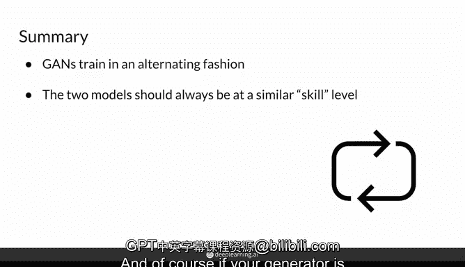

# 09：生成对抗网络（GAN）整体整合 🧩

在本节课中，我们将回顾生成对抗网络（GAN）的核心概念，并将所有组件整合起来，理解其完整的训练流程。我们将从GAN的基本架构开始，逐步讲解生成器和判别器的交替训练过程，并探讨训练中的关键注意事项。

---

## GAN 架构概览 🏗️

首先，我们来看一个基础GAN架构的示意图。

在基础GAN中，生成器以一个随机噪声向量 **z** 作为输入。生成器随后会生成一些假样本，记作 **X̂**（例如假图像）。目前我们暂不向生成器传递类别信息，这将在后续课程中介绍。

接着，这些生成的假样本 **X̂** 和一些真实样本 **X** 会被一同输入到判别器中。判别器的输出是一个概率值 **ŷ**，用于判断输入样本是真实还是虚假的可能性。

判别器的目标是尽可能准确地区分真实样本和生成样本。而生成器的目标则是生成尽可能逼真的假样本，以“欺骗”判别器。

---

## 交替训练过程 🔄

训练一个基础GAN需要交替训练生成器和判别器。上一节我们介绍了整体架构，本节中我们来看看具体的训练步骤。

### 判别器的训练

以下是判别器的训练步骤：

1.  首先，获取由生成器根据噪声 **z** 产生的一批假样本 **X̂**。
2.  将这些假样本 **X̂** 和一批真实样本 **X** 混合后输入判别器，暂时不告知判别器哪些是真、哪些是假。
3.  判别器对每个样本做出预测 **ŷ**，给出其是真实或虚假的概率分数。
4.  使用二元交叉熵损失函数，将预测值 **ŷ** 与样本的真实标签（假样本标签为0，真样本标签为1）进行比较。
5.  计算出的损失用于更新判别器的参数 **θ_D**。**注意，此步骤仅更新判别器的参数，不更新生成器。**

### 生成器的训练

接下来，我们看看生成器是如何训练的：

1.  生成器再次根据噪声 **z** 生成一批假样本 **X̂**。
2.  这些假样本被输入到判别器中。**在这个过程中，生成器只看到自己的假样本，看不到真实样本。**
3.  判别器对这些假样本做出预测 **ŷ**。
4.  这里有一个关键区别：计算损失时，我们将所有假样本的标签都视为“真实”（即标签为1）。因为生成器的目标是让判别器认为其生成的样本是真实的。
5.  计算损失后，梯度反向传播，用于更新生成器的参数 **θ_G**。**此步骤仅更新生成器的参数，不更新判别器。**

通过这种交替训练的方式，每次只训练一个模型，同时保持另一个模型的参数固定。

---

## 训练平衡的重要性 ⚖️

在以上交替训练的过程中，保持生成器和判别器能力的平衡至关重要。

如果判别器过于强大（远强于生成器），它可能会轻易地将所有生成样本判定为100%虚假。这对于生成器来说信息量不足，它无法从“完全错误”的反馈中学习如何改进。

反之，如果生成器过于强大，完全骗过了判别器，判别器给出的反馈（如所有生成样本都被判为100%真实）同样缺乏指导意义。

判别器的任务（区分真假）通常比生成器的任务（建模整个数据分布，如生成所有可能的猫的图像）要简单。因此，一个常见问题是判别器学习过快，导致训练失衡。

为了让训练有效进行，我们需要确保两个模型在训练初期保持相近的技能水平，并共同进步。判别器提供更具信息量的梯度（例如，输出0.87假而非1.0假），能更好地指导生成器逐步学习生成逼真的图像。

本节课中我们一起学习了GAN的整体训练流程，理解了生成器与判别器如何通过交替训练进行对抗学习，并掌握了保持两者训练平衡的核心要点。这是成功训练一个GAN模型的基础。