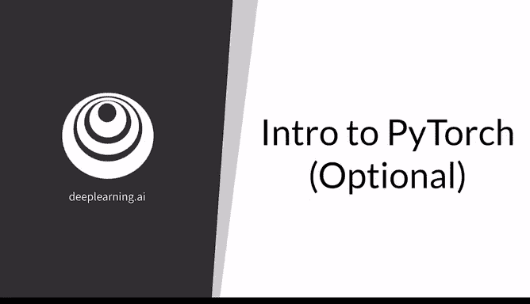
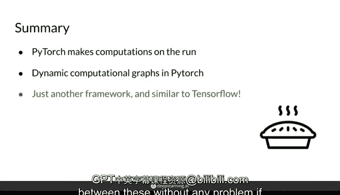

# 10：PyTorch入门教程 🚀

在本节课中，我们将学习PyTorch这一深度学习框架的基础知识。我们将了解PyTorch与TensorFlow的主要区别，并掌握如何使用PyTorch定义和训练一个简单的模型。本教程专为初学者设计，内容简单直白，确保你能轻松跟上。



---

## 概述

本课程将首先对比PyTorch与TensorFlow两大框架的核心差异。接着，我们会详细讲解如何在PyTorch中定义模型架构，并逐步演示模型的训练过程。通过本课的学习，你将能够理解PyTorch的基本工作流程，并为后续的实践打下坚实基础。

---

## PyTorch与TensorFlow对比

上一节我们概述了本课内容，本节中我们来看看PyTorch与TensorFlow的主要区别。两者都是当前最流行的深度学习框架。如果你学习过深度学习专项课程，可能对TensorFlow较为熟悉。但这里有个小秘密：我更喜欢PyTorch。

它们的主要区别在于计算方式。在PyTorch中，计算是即时进行的，这种方式有时被称为**命令式编程**。在TensorFlow中，你首先定义计算方式，然后再执行计算，这被称为**符号式方法**。

这意味着在PyTorch中，你拥有变量A和B的值（例如 `a=1`, `b=2`），当你将它们相加时，会立即得到结果 `3`。而在TensorFlow中，A和B最初没有具体值，你可以将它们的和存储在另一个变量C中，这有些抽象。然后你需要编译C，并为A和B赋值才能得到计算结果。

因此，PyTorch能够支持**动态计算图**，这意味着你的神经网络在每次运行时都可以轻松改变其结构。然而，由于TensorFlow的计算图是静态的，其模型运行时间往往更短。最近，TensorFlow 2.0引入了**急切执行**模式，这与PyTorch的动态计算图非常相似。但总体而言，动态计算图在PyTorch中感觉更加自然。

不过，总的来说，这两个框架目前已经非常相似，你会发现在它们之间切换，尤其是从TensorFlow转向PyTorch，从未如此简单。

---

## 在PyTorch中定义模型

了解了框架间的区别后，本节我们聚焦于PyTorch，看看如何用它来定义一个模型。

首先，你需要导入PyTorch库：
```python
import torch
```
同时，导入`nn`模块（神经网络模块）也很有用，它包含了深度学习模型的各种定制层：
```python
from torch import nn
```

在PyTorch中，通常通过创建`nn.Module`类的子类来定义模型。以下是一个逻辑回归模型的示例：
```python
class LogisticRegression(nn.Module):
    def __init__(self, input_size):
        super(LogisticRegression, self).__init__()
        self.logistic_regression = nn.Sequential(
            nn.Linear(input_size, 1),
            nn.Sigmoid()
        )
    
    def forward(self, x):
        return self.logistic_regression(x)
```

以下是代码关键部分的解释：
*   `__init__` 方法是类的构造函数，用于接收模型参数。这里的 `input_size` 变量决定了逻辑回归模型的输入变量数量。
*   在构造函数内，你将模型架构定义为一个属性。对于逻辑回归，你可以在一个`Sequential`模块中使用一个线性层和一个Sigmoid激活函数。
*   `Sequential`模块用于按顺序堆叠层。这里，首先是线性层，然后是Sigmoid激活函数。
*   在线性层中，传入的`input_size`指定了输入的大小，输出为1，表示我们希望从所有这些输入中得到一个预测值（例如，是猫或不是猫的类别）。
*   Sigmoid激活函数会产生一个介于0和1之间的值。
*   最后，你定义模型类的`forward`方法。`forward`方法指的是给定输入后，模型在前向传播过程中如何产生输出。它不涉及反向传播。前向传播就是当你输入数据时，模型如何计算出输出。在这个例子中，你只需将输入X通过之前定义的`self.logistic_regression`这个顺序层序列并返回结果。

这是一个在PyTorch中定义模型的非常简单的通用大纲，当然你也可以用不同的代码结构达到相同的结果。

---

## 在PyTorch中训练模型

定义好模型后，接下来我们看看如何训练它。

首先，为你定义的模型类初始化一个实例。例如，使用上一张幻灯片的逻辑回归类，这个模型有16个输入变量：
```python
model = LogisticRegression(16)
```

然后，为你的模型确定一个损失函数（在PyTorch中常被称为`criterion`）：
```python
criterion = nn.BCELoss()  # 二元交叉熵损失
```

接着，选择你想要使用的优化器，例如随机梯度下降（SGD），并传入模型的参数（即之前提到的权重θ，它们将在训练中被更新）。你还需要为此优化器指定不同的超参数，例如学习率：
```python
optimizer = torch.optim.SGD(model.parameters(), lr=0.01)
```

最后，你可以训练你的模型多个周期（epoch）：
```python
num_epochs = 100
for epoch in range(num_epochs):
    # 前向传播：将输入传入模型，得到预测
    predictions = model(inputs)
    
    # 计算损失：使用损失函数比较预测值与真实标签
    loss = criterion(predictions, labels)
    
    # 反向传播与优化
    optimizer.zero_grad()  # 清零过往梯度
    loss.backward()        # 反向传播，计算当前梯度
    optimizer.step()       # 根据梯度更新参数
```

以下是训练循环的关键步骤说明：
*   你不需要担心确切的语法，但基本上发生的是：我们使用`optimizer.zero_grad()`将之前的梯度清零，以确保一切干净无误。
*   `loss.backward()`是反向传播的重要步骤，它计算当前损失的梯度。
*   最后的`optimizer.step()`意味着使用随机梯度下降法，以设定的学习率沿着梯度方向更新模型参数。

---

## 总结

本节课中，我们一起学习了PyTorch的基础知识。我们了解到PyTorch采用即时计算的方式，允许你在每次运行中灵活地实验和更改模型。同时，我们也看到PyTorch作为另一个深度学习框架，实际上与TensorFlow非常相似。如果你已经熟悉其中一种框架，将能够毫无障碍地在它们之间切换。



通过定义模型类、设置损失函数与优化器、以及编写训练循环，你已经掌握了使用PyTorch进行模型训练的核心流程。希望本教程能帮助你顺利入门PyTorch，并在后续的实践中继续探索。