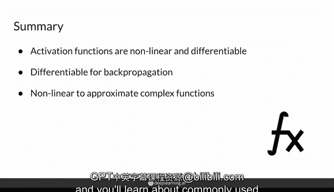

# 12：激活函数的基本性质 🧠

在本节课中，我们将学习激活函数的基本性质。激活函数是深度神经网络，特别是生成对抗网络（GANs）中的关键组件。我们将了解它们是什么、为什么必须是非线性的、可微分的，以及它们在神经网络中的作用。

---

## 什么是激活函数？

激活函数是一种以任意实数作为输入（也称为定义域），并通过一个非线性、可微分的函数，输出一个特定范围内数值的函数。在深度神经网络中，激活函数通常用于某些层之间的分类任务。

上一节我们介绍了激活函数的基本概念，本节中我们来看看它在神经网络中的具体作用。

以一个具有两个隐藏层和多个输入的神经网络为例。输入`x0`可能是毛色，`x1`可能是动物体型，以及其他各种特征。这个神经网络的目标是预测这些特征是否构成一只猫，最终输出一个介于0和1之间的概率值。

神经网络中所有这些节点共同构成了整个网络架构。接下来，我将从演示每个独立节点发生的过程开始。

---

## 单个节点的计算过程

一个节点接收来自前一层的信息，并预测两个部分，我将用虚线将其分开。

首先，它计算`Z`。其中`i`代表节点编号（例如，第一个节点`i=1`），`L`代表层数（例如，这里`L=1`表示第一层）。`Z`的计算公式如下：

**公式：**
`Z_i^L = Σ (W_ij^L * A_j^{L-1}) + b_i^L`

这里，`Z`是前一层的输出值`A`与权重`W`的加权和。`L-1`表示前一层的索引。这个计算过程通常被称为**线性层**，它既包括权重的缩放值，也包含一个偏置项`b`（可以整合到权重矩阵`W`中）。

然后，节点的另一侧输出`A`。`A`是激活函数`G`的输出，它以`Z`值作为输入。

**公式：**
`A_i^L = G(Z_i^L)`

---

## 为什么需要非线性和可微分性？

激活函数`G`必须同时具备**非线性**和**可微分**这两个性质。

它需要是**可微分**的，因为训练神经网络和更新其参数时需要使用反向传播算法。可微分性意味着可以计算其导数（梯度），从而为前一层提供梯度信息。

它需要是**非线性**的，这样神经网络内部计算的特征才能变得复杂。如果不使用非线性激活函数，一个具有多个隐藏层和神经元的神经网络实际上可以坍缩成一个简单的线性回归模型。因为线性层可以相互堆叠合并，最终所有层等效于一个单一的线性层。

线性回归本质上就是一个带有偏置项的线性层（同样，偏置项可以整合到权重矩阵中）。

总而言之，你需要非线性且可微分的激活函数，才能充分利用深度学习模型，让各层有效堆叠，构建出能够建模复杂非线性函数的复杂神经网络。

非线性特性确保了你的线性层不会简化为线性回归中的单一线性层，从而使网络能够学习更复杂的函数。可微分特性则确保了网络能够通过计算导数，利用反向传播进行学习。

---

## 激活函数的选择

你可以为深度学习模型使用任何自定义函数作为激活函数，只要确保它是非线性且可微分的即可。

研究人员经常尝试不同的函数，以找出最适合特定任务的那一个。在下一讲中，你将学习到一些常用的激活函数。

---

## 总结

本节课中，我们一起学习了激活函数的基本性质。我们了解到激活函数是神经网络中的非线性、可微分组件，它们接收线性组合的结果作为输入并产生输出。激活函数的非线性使得深度网络能够学习复杂模式，而其可微分性则使得通过反向传播进行有效训练成为可能。正确选择和使用激活函数对于构建强大的深度学习模型至关重要。