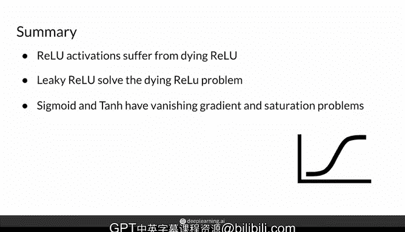

# 13：常见激活函数 🧠

在本节课中，我们将学习深度神经网络中几种常见的激活函数。激活函数对于引入非线性至关重要，它决定了神经元是否应该被“激活”。我们将详细介绍四种最常用的激活函数：ReLU、Leaky ReLU、Sigmoid 和 Tanh，并了解它们各自的特性、公式以及优缺点。

## 概述

你已经了解到激活函数对于深度学习模型非常重要。有多种函数被用作激活函数。在本视频中，你将看到当今最流行的一些激活函数。

本视频将重点介绍四种常用的激活函数，你也将在你的GANs中使用它们。第一种是ReLU，第二种是其变体Leaky ReLU，最后两种是Sigmoid和Tanh。实际上，可能的激活函数有无限多种，但并非所有都理想。最流行且有效的激活函数之一被称为整流线性单元，简称ReLU。

## ReLU 激活函数

ReLU的作用是取`z`和`0`之间的最大值。这意味着，如果它的输入是来自当前层`L`的`z`，那么这个激活函数`g`（此处`g`代表ReLU）将取`0`和`z`之间的最大值。实际上，这意味着它消除了所有负值。

从图形上看，我可以将这个函数描述为：对于正值，它是一条斜率为1的直线。因此，任何进入`z`的值，例如值`2`，如果进入`g`，输出仍然是值`2`。现在，如果一个负数`z`被传入`g`，那么从图形上看，每当`z`值为负时，它将输出零。本质上，不允许负值，所以它看起来像一个曲棍球棒，这使其具有非线性（线性意味着一条单一的直线）。

你可能会注意到，严格来说，ReLU在`z=0`处不可微，但按照惯例和实现，ReLU在`z=0`处的导数通常被设置为`0`。

当`z`为负时，ReLU激活函数的平坦部分导数总是等于零，这可能会有问题。因为学习过程依赖于导数来提供关于如何更新权重的重要信息。导数为零时，一些节点的权重会卡在相同的值上，停止学习。因此，网络的这一部分将停止学习，事实上，网络的前面部分也会受到影响。这个问题被称为“ReLU死亡”问题，因为它意味着学习的终结。这就是为什么存在ReLU的一个变体，称为Leaky ReLU。

## Leaky ReLU 激活函数

Leaky ReLU所做的是保持与ReLU相同的形式。当`z`为正时，它保持与ReLU相同的形式，这意味着它再次保持与输入相同的正值。但当`z`小于`0`（即`z`为负）时，它在直线上增加了一个小的“泄漏”或斜率。它在`z=0`处仍然是非线性的，有一个斜率转折，但现在当`z`为负时，它有了非零导数。

这个斜率通常小于`1`，所以它不必与正值一侧形成一条直线（那将是不幸的，因为会变成线性）。注意，在`z=0`处的导数仍然被设置为`0`。通常，这个斜率被视为一个超参数，即这里的`a`，但它通常被设置为`0.1`，意味着相对于正斜率，泄漏仍然相当小。这在很大程度上解决了“ReLU死亡”问题。在实践中，大多数人仍然使用ReLU，但Leaky ReLU的受欢迎程度正在上升。

## Sigmoid 与 Tanh 激活函数

现在，我将向你展示另外两种看起来相当相似的常见激活函数。

首先是Sigmoid激活函数，它具有平滑的S形，输出值在`0`和`1`之间。当`z`大于或等于`0`时，Sigmoid激活输出一个介于`0.5`和`1`之间的值。当`z`小于`0`时，Sigmoid输出一个介于`0`和`0.5`之间的值。因为它输出一个介于`0`和`1`之间的值，Sigmoid激活函数经常被用在二元分类模型的最后一层，以表示一个介于`0`和`1`之间的概率。例如，预测图片中有猫的概率为`0.95`。

Sigmoid激活函数在隐藏层中不常用，因为该函数的导数在函数的两端趋近于零。这会产生所谓的“梯度消失”问题或饱和输出。你可以想象这个函数向两个方向延伸，因为它可以接受任何实数值作为输入。它在顶部渐近地趋近于`1`，在底部渐近地趋近于`0`。这会产生梯度消失问题，因为当输入`z`离`0`太远时，函数两端的输出总是接近`1`或接近`0`，导致饱和。

另一个形状与Sigmoid相似的函数是双曲正切函数，简称Tanh。然而，与Sigmoid相比，它输出介于`-1`和`1`之间的值。因此，当`z`为正时，它输出一个介于`0`和`1`之间的值；当`z`为负时，它输出一个介于`-1`和`0`之间的负值。

与Sigmoid的一个关键区别是，Tanh保留了输入`z`的符号，所以负数仍然是负数，这在某些应用中可能有用。然而，由于形状与Sigmoid相似，同样存在饱和和梯度消失的问题，两端同样向两个方向延伸，顶部趋近于`1`，底部趋近于`-1`。

## 总结

本节课中，我们一起学习了深度学习中几种核心的激活函数。以下是关键要点：

*   **ReLU**：公式为 `g(z) = max(0, z)`。计算高效，但可能导致“神经元死亡”问题。
*   **Leaky ReLU**：公式为 `g(z) = max(az, z)`，其中 `a` 是一个小的正数（如 `0.1`）。解决了ReLU的“死亡”问题，允许小的负梯度通过。
*   **Sigmoid**：公式为 `g(z) = 1 / (1 + e^{-z})`。将输出压缩到`(0, 1)`区间，常用于输出层表示概率，但隐藏层中易导致梯度消失。
*   **Tanh**：公式为 `g(z) = (e^{z} - e^{-z}) / (e^{z} + e^{-z})`。将输出压缩到`(-1, 1)`区间，且输出是零中心的，但同样存在梯度消失问题。

所有这些激活函数都用于神经网络，特别是在你即将实现的GANs中。实际上还有更多的激活函数，研究人员一直在开发新的。如果你有兴趣，可以设计自己的激活函数，只需确保它是非线性且可微的。

总而言之，目前有许多不同的函数被用作激活函数，我向你展示了ReLU、Leaky ReLU、Sigmoid和Tanh。它们大多有自己的问题：ReLU有“死亡”问题，Sigmoid和Tanh有梯度消失和饱和问题。在本专业课程你将实现的模型中，你会看到并使用这里介绍的所有这些激活函数。

