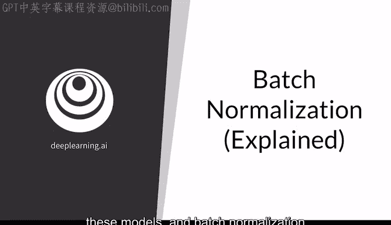
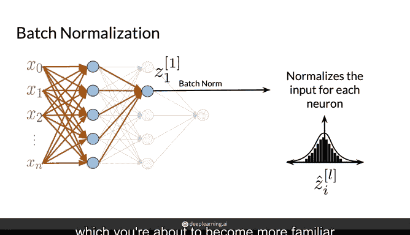
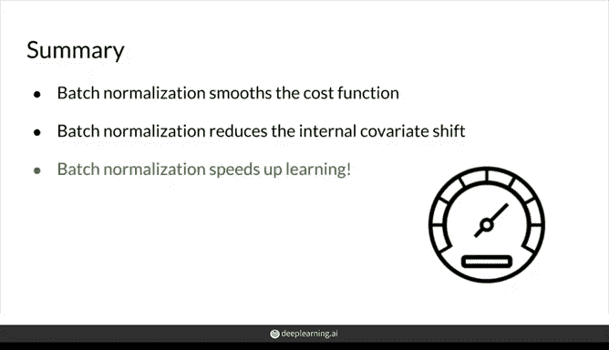

# 14：批归一化（Batch Normalization）详解 🧠

在本节课中，我们将学习批归一化（Batch Normalization）的概念及其在训练生成对抗网络（GANs）和深度神经网络中的重要作用。批归一化是一种关键技术，能显著加速训练过程并提升模型稳定性。

---

## 概述

生成对抗网络（GANs）的训练通常耗时较长，尤其在构建复杂应用时。GANs的学习过程较为脆弱，不如分类器直接，生成器和判别器的能力有时也不完全同步。因此，任何能加速和稳定训练的技巧都至关重要，批归一化已被证明在这方面非常有效。

---

## 归一化对训练的影响

首先，回顾归一化对训练的影响。假设有一个简单的神经网络，包含两个输入变量：`x1`（代表大小）和`x2`（代表毛色）。网络输出基于这些特征判断示例是否为猫。

假设`x1`（大小）的数据分布呈正态分布，集中在中等大小附近，极少有极小或极大的示例。而`x2`（毛色）的数据分布则偏向较高值，均值较高，标准差较低。这里较高值代表较深的毛色。需要注意的是，直接比较毛色和大小的数值意义不大，因为深色毛色和大尺寸之间没有有意义的关联。

然而，这种不同的数据分布会影响神经网络的学习方式。例如，如果网络试图到达某个局部最小值，而输入变量的分布差异很大，代价函数会变得细长。这意味着与每个输入相关的权重变化对代价函数的影响不同，使得训练变得困难、缓慢，且高度依赖于权重的初始化。

此外，如果新的训练或测试数据中毛色非常浅（即数据分布发生某种变化），代价函数的形状也可能改变，甚至局部最小值的位置也会移动，即使判断是否为猫的基本事实（即图像的标签）没有变化。这种现象称为**协变量偏移（Covariate Shift）**，在训练集和测试集之间经常发生，尤其是在未对数据分布变化采取预防措施时。

---

## 输入归一化的效果

如果对输入变量`x1`和`x2`进行归一化，新的输入变量`x1'`和`x2'`的分布会更相似，例如均值为0，标准差为1。这样，代价函数在这两个维度上会更平滑、更平衡，从而使训练更容易、更快速。

此外，无论原始输入变量的分布如何变化（例如从训练集到测试集），归一化变量的均值和标准差都会被调整到相同的位置（均值为0，标准差为1）。对于训练数据，这是通过批统计量实现的：在训练每个批次时，计算均值和标准差，并将数据调整到均值为0、标准差为1。对于测试数据，可以使用训练过程中收集的统计量来调整测试数据，使其更接近训练数据的分布。

通过归一化，协变量偏移的影响将显著减少。因此，输入归一化的主要效果是平滑代价函数并减少协变量偏移。

---

## 内部协变量偏移

然而，即使确保数据集的分布与建模任务相似（即测试集的分布与训练集相似），神经网络仍然容易受到**内部协变量偏移（Internal Covariate Shift）**的影响。这意味着在网络的内部隐藏层中也会发生协变量偏移。

以神经网络第一个隐藏层的激活输出为例，观察其中一个节点。在训练模型时，所有影响该激活值的权重都会更新，从而导致该激活值的分布发生变化，并受到训练过程的影响。这种偏移类似于输入变量分布的变化（如毛色），但发生在内部节点上，这些节点的含义比毛色和大小更抽象。

批归一化旨在解决这个问题，通过基于每个输入批次计算的统计量来归一化所有这些内部节点，以减少内部协变量偏移。这样做还有额外的好处：平滑代价函数，使神经网络更容易训练，并加速整个训练过程。

批归一化中的“批”字表示使用批统计量，这在本周后续视频中会进一步熟悉。

---

## 批归一化的作用总结

以下是批归一化的主要作用：

*   **平滑代价函数**：使优化过程更稳定。
*   **减少内部协变量偏移**：使网络各层的输入分布更稳定。
*   **加速和稳定训练**：特别有助于训练GANs等复杂模型。

需要注意的是，虽然批归一化对GANs和神经网络非常有效，但内部协变量偏移背后的理论尚未完全定论。我们仍在寻找批归一化在模型中可能有用的其他原因的证据。

---

## 总结

本节课中，我们一起学习了批归一化（Batch Normalization）的核心概念。我们了解了它对平滑代价函数、减少内部协变量偏移的重要作用，以及它如何加速和稳定神经网络的训练过程，尤其是在构建生成对抗网络（GANs）时。批归一化通过归一化网络内部各层的激活值，使训练更加高效和可靠。