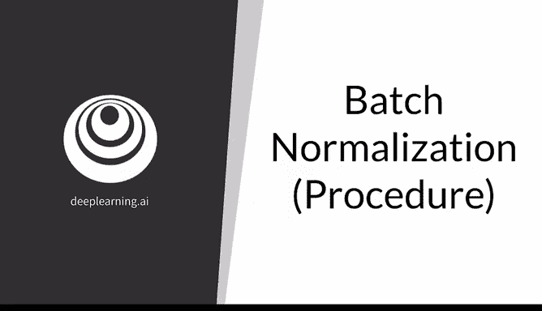
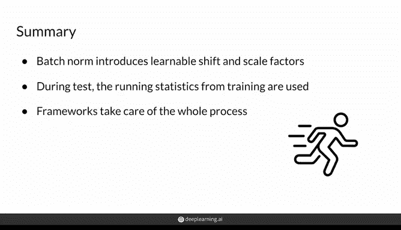

# 15：批归一化流程详解 🧠

在本节课中，我们将要学习批归一化的完整流程。批归一化是深度学习中的一项重要技术，它通过规范化神经网络中间层的激活值，帮助模型更快、更稳定地训练。我们将详细拆解它在训练和测试阶段的不同操作，并解释其核心优势。

---

批归一化听起来可能有些复杂，但它是一个相当直观的过程，你甚至可以自己从头实现它。不过，像PyTorch这样的深度学习框架已经为你实现了这个功能。在本视频中，我将向你展示它的工作原理。

通过本视频，你将熟悉批归一化的操作，并了解它在训练和测试阶段的不同之处。批归一化的目标是创建如你所见的、令人愉悦的归一化数值分布。

以一个具有两个隐藏层、多个输入和一个输出的神经网络为例。我将聚焦于其中一个内部隐藏层来解释批归一化是如何工作的。

所以，这里的输入Z来自之前所有的节点。批归一化会考虑批次中的每一个样本Z_i。例如，你的批次大小可能是32，那么这里就会有32个Z值。再次提醒，这里的上标i代表该层中的第i个节点，上标l代表这是第l层。例如，这是第0层，第1层，或者这是节点0，节点i1。

因此，批归一化会获取批次的大小（例如32），这里有32个Z值。它希望将这些Z值归一化，使其均值为0，标准差为1。

以下是具体的操作步骤：

首先，计算批次的均值μ，这仅仅是这32个值的平均值。然后，计算批次的方差σ²，同样基于这32个值。

为了将这些z值归一化为均值为0、标准差为1的分布，你需要减去均值并除以标准差。这里的标准差是方差的平方根，并加上一个很小的常数ε，以确保分母不为零。

最终，你得到了归一化的Z值，我们称之为Z_hat。

好的，在得到归一化值Z_hat之后，批归一化层中还有需要学习的参数。这意味着你将有一个称为β的值，它是偏移因子；以及一个称为γ的值，它是缩放因子。这些参数在训练过程中学习，以确保你将Z转换到的分布对你的任务来说是最优的。

因此，在完全归一化得到Z_hat之后，你再根据这些学习到的值γ和β对其进行重新缩放。

这就是输入归一化与批归一化的主要区别。因为在这里，你并非每次都强制分布具有零均值和单位标准差，而是在归一化之后，可以根据任务需要重新调整分布。关键在于，批归一化让你能够控制该分布在神经网络中向前传播时的形态。

经过偏移和缩放后的最终值将被称为Y，这个Y随后被送入激活函数。

以上是训练阶段的过程。在测试阶段，你需要防止不同的批次产生不同的均值和标准差，因为这可能导致同一个样本在不同的批次中，由于该批次特定的均值或标准差而被不同地归一化，从而产生不同的结果。因此，在测试时，你希望获得稳定的预测。

在测试阶段，你使用的是在整个训练集上计算得到的“运行均值”和“运行标准差”。这些值在训练后是固定的，不再变化。

但在此之后，你只需遵循一个非常相似的过程。这里的μ是那些z值的期望值（即运行均值），σ²是那些z值的方差（取其平方根得到标准差）。你仍然会加上ε以防止分母为零。之后，你只需遵循与训练时相同的过程，将这些归一化值输入到学习到的参数中，然后送入激活函数。

不过，不必过于担心这个过程的细节。正如我之前所说，像TensorFlow和PyTorch这样的框架会为你跟踪这些统计量。你所要做的就是创建一个名为`BatchNorm`的层，然后当你的模型切换到测试模式时，框架会自动为你计算或保存整个数据集上的运行统计量，这非常方便。

你可能也听说过测试模式被称为测试时间、推理时间、评估模式或E模式，它们大致是等价的，你可以将它们理解为“非训练时间”。

---

上一节我们详细介绍了批归一化的具体计算步骤。本节中，我们来总结一下它的核心优势。

总而言之，批归一化与标准归一化的不同之处在于以下几点：

首先，在训练期间，它使用每个批次的统计量，而不是整个数据集的统计量。这减少了计算时间，使训练更快，无需等待遍历整个数据集后才能使用批归一化。

其次，通过引入可学习的偏移和缩放参数，你并不强制目标分布必须具有零均值和单位标准差。

最后，在测试时，应用的是训练期间计算得到的运行统计量到整个数据集，这保持了预测的稳定性，因为训练值是独立且固定的。

一个重要的注意事项是，深度学习框架已经为你实现了训练和测试的整个过程。因此，你只需要知道何时在你的GAN或其他你想训练的出色模型中使用它。

在接下来的课程中，你还将学习到更先进的归一化技术，敬请期待。

---

本节课中，我们一起学习了批归一化的完整流程。我们理解了它如何在训练时利用批次统计量进行归一化和再参数化，在测试时则切换到固定的运行统计量以确保稳定性。批归一化通过赋予模型对中间数据分布的控制能力，成为了加速和稳定深度神经网络训练的关键技术之一。