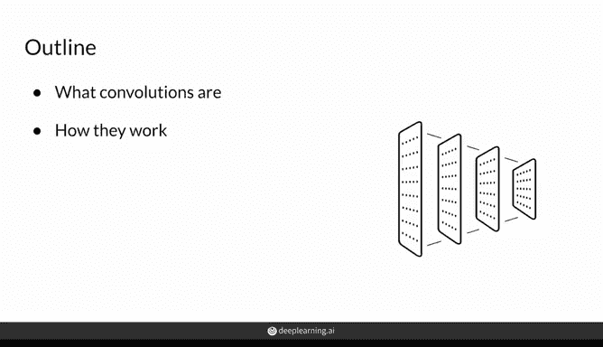
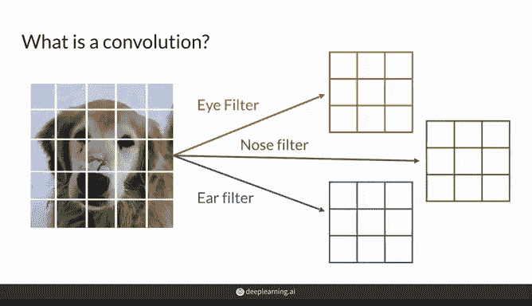
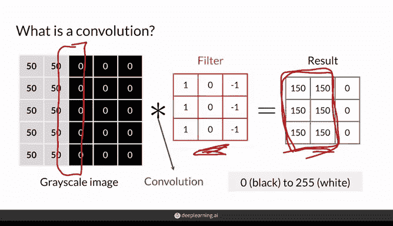
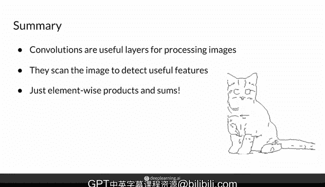

# 16：卷积回顾 🧠

在本节课中，我们将学习卷积（Convolution）的基本概念及其在图像处理中的应用。卷积是许多生成对抗网络（GAN）架构的核心组成部分，它通过扫描图像来检测关键特征。

---

## 什么是卷积？

卷积是图像处理中的一项基本操作，它允许你使用过滤器（filter）检测图像不同区域的关键特征。这些过滤器在图像上滑动扫描，以寻找各种特征。例如，一个“眼睛”过滤器会告诉你图像的哪些部分包含眼睛，“鼻子”过滤器会告诉你哪些部分包含鼻子，“耳朵”过滤器会告诉你哪些部分包含耳朵。

每个过滤器实际上是一个由实数值组成的矩阵，这些具体的数值在训练过程中学习得到。这些数值用于在输入图像上计算卷积。实际上，这些过滤器比“眼睛”或“鼻子”过滤器更为抽象，但它们确实能够捕捉到相当高级的特征，例如眼睛和鼻子。

---

## 卷积操作详解

卷积操作非常直观。让我们来看一个简单的例子：一个5x5的灰度图像，其中每个方块代表一个像素，其值介于0到255之间。0代表纯黑色像素，255代表纯白色像素，灰色值介于两者之间，例如这里看到的50。

假设你有一个学习到的3x3过滤器，其第一列为1，第二列为0，第三列为-1。在卷积操作中，使用这个过滤器对灰度图像进行处理，我们用星号（*）表示它们之间的卷积操作。这意味着你要在整个灰度图像上应用这个过滤器。

操作过程如下：从左上角开始，将过滤器的所有元素与对应位置的像素值相乘。例如，将50乘以1，50乘以0，依此类推，与过滤器匹配。然后，取所有这些乘积的总和，并将结果放入结果矩阵的第一个单元格中。

之后，将过滤器向右移动一个位置，再次计算元素乘积，求和并将结果存储在矩阵中，依此类推。当你到达一行的末尾时，向下移动一行，重新从左侧开始，继续应用过滤器，直到覆盖整个图像。最终，你会得到一个3x3的结果矩阵。

有趣的是，这个过滤器实际上是一个垂直线检测器。在你的图像中有一条垂直线，过滤器在这里检测到了一些非常高的值，试图表明：“嘿，我在这里真的看到了这条垂直边缘。”

这些过滤器可以有许多不同的值，通过组合多层这些过滤器，可以获得更抽象、更高级的概念，例如鼻子或眼睛。

---

## 卷积的变体与调整

以上是计算卷积的基本过程，但你可以对这个简单操作进行一些调整，这些调整对你后续的学习会很有帮助。接下来，我们将讨论这些调整。

---

## 总结

在本节课中，我们一起学习了卷积的基本概念及其在图像处理中的应用。卷积通过扫描图像的每个部分来检测特征，从而识别模式。归根结底，卷积只是整个图像上元素乘积的一系列总和。

卷积操作的核心公式可以表示为：

**结果矩阵 = 输入图像 * 过滤器**

其中，* 表示卷积操作，即对每个局部区域进行元素乘积并求和。

---

通过本节课的学习，你应该对卷积有了基本的理解，并能够将其应用于图像处理任务中。在后续的课程中，我们将进一步探讨卷积在生成对抗网络中的具体应用。