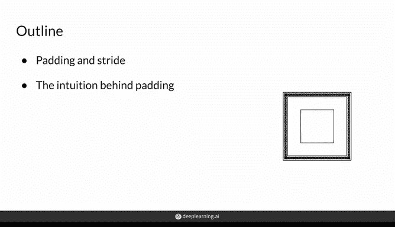
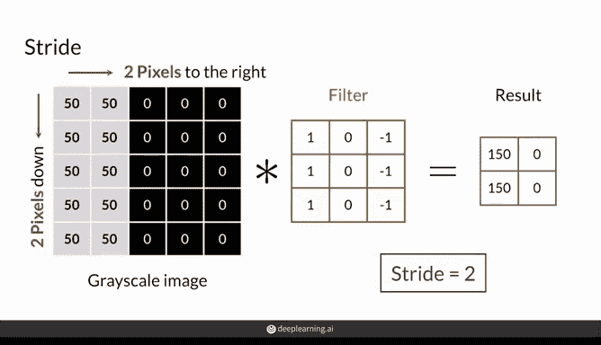
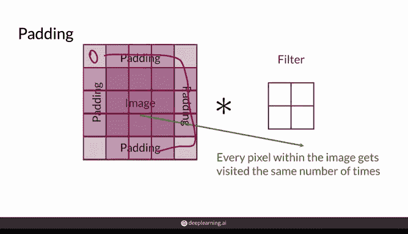
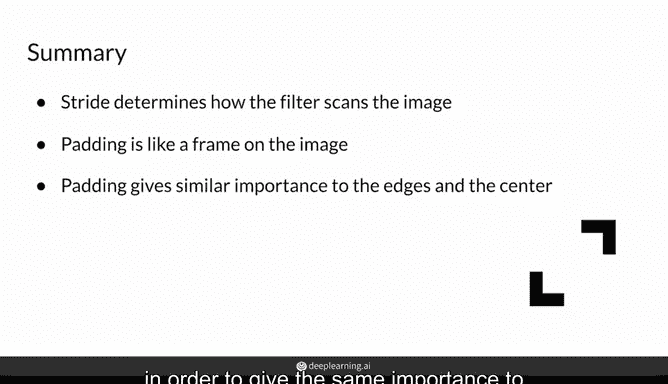

# 17：填充与步长 🧩


在本节课中，我们将学习卷积神经网络中的两个重要概念：**填充（Padding）** 与 **步长（Stride）**。我们将了解它们如何影响卷积操作，以及为何在图像处理中需要调整这些参数。



---

## 卷积操作回顾

在上一节中，我们介绍了卷积是一种用于检测图像不同区域特征的简单操作。本节中，我们来看看如何通过调整填充与步长来优化卷积操作。

卷积操作通过一个滤波器（例如3x3的矩阵）在图像上滑动，计算每个位置的元素乘积和。例如，对于一个灰度图像，我们首先将滤波器放置在图像的左上角3x3区域，计算乘积和，然后移动滤波器。

---

## 步长（Stride）的作用

步长决定了滤波器每次移动的像素数量。以下是步长如何影响卷积操作的详细说明：

*   **步长为1**：滤波器每次向右或向下移动1个像素。这是最常见的设置，能最大程度地覆盖图像。
*   **步长大于1**：例如步长为2时，滤波器每次移动2个像素。这会减少滤波器访问的图像区域数量，从而**加快计算速度**，但也会**丢失一些图像信息**。因此，选择步长需要在计算效率和信息完整性之间进行权衡。



例如，对一个图像应用3x3滤波器，步长为2时，滤波器访问的区域会减少，最终输出的特征图尺寸也会变小。

**公式表示**：若输入图像尺寸为 `n x n`，滤波器尺寸为 `f x f`，步长为 `s`，则输出尺寸约为 `((n - f) / s) + 1`。

---

## 填充（Padding）的作用

填充是在图像边缘周围添加一个边框（通常由0构成，称为“零填充”）。以下是使用填充的主要原因和方式：

*   **解决边缘信息丢失问题**：在没有填充的卷积中，图像边缘的像素被访问的次数远少于中心像素。这意味着边缘的特征（例如位于角落的物体）可能被忽略。
*   **实现方式**：通过在图像周围添加一个像素框（填充层），使得原始图像的所有像素在卷积过程中都能被平等地访问。滤波器会扫描这个带边框的新图像。
*   **保持输出尺寸**：填充还可以用于控制卷积后输出特征图的大小。例如，通过合适的填充，可以使输出尺寸与输入尺寸保持一致。

**代码示例**（概念性描述）：
```python
# 假设使用零填充，填充层宽度为p
padded_image = pad(original_image, width=p)
# 卷积操作会应用在这个padded_image上
```

---

## 总结

本节课中，我们一起学习了卷积神经网络中的两个关键调整参数。



*   **步长** 控制了滤波器扫描图像的步进距离，它直接影响输出特征图的尺寸和计算速度。更大的步长意味着更快的计算，但可能丢失细节。
*   **填充** 通过在图像边缘添加边框，确保了图像中所有位置（尤其是边缘）的像素都能在卷积中获得同等的关注度，同时也能帮助我们控制输出的大小。



理解并合理设置步长与填充，是构建高效、准确的卷积神经网络模型的重要基础。