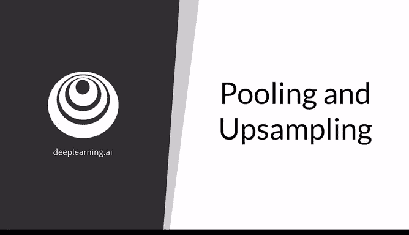
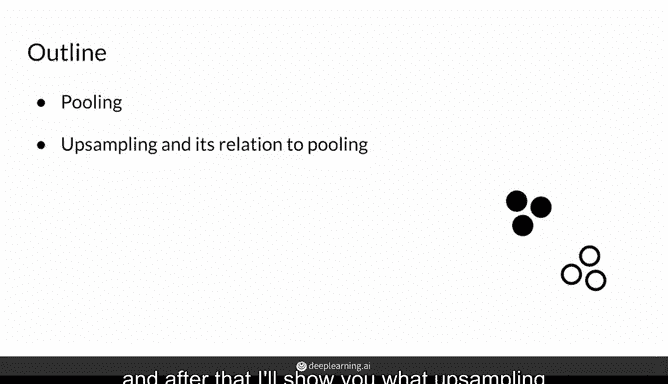
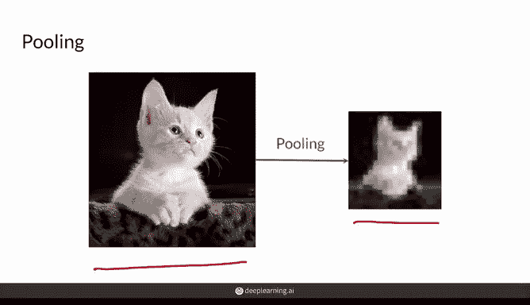
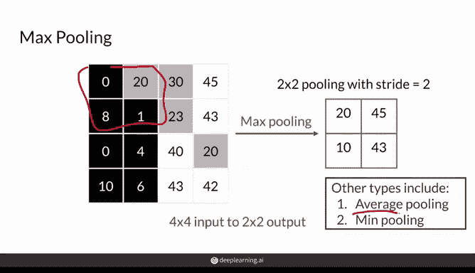
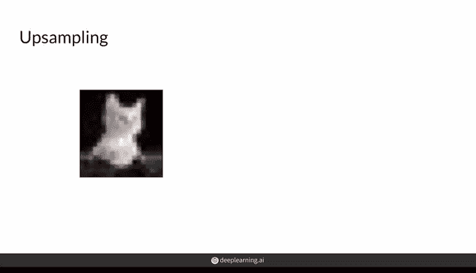
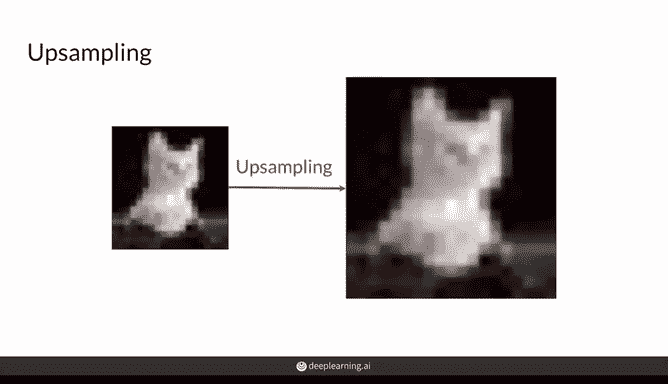
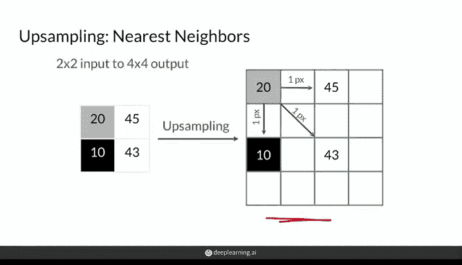
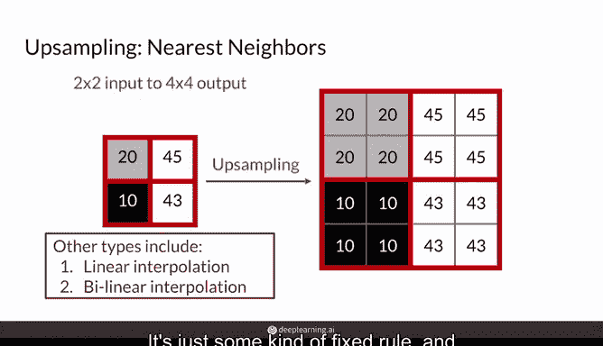
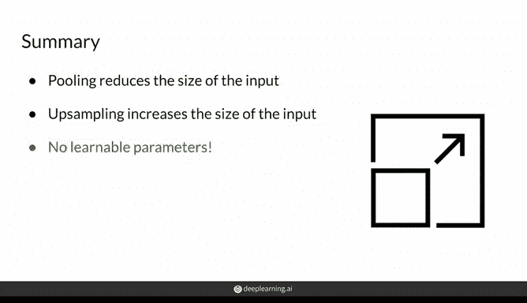

# 18：池化与上采样 🧠

在本节课中，我们将要学习卷积神经网络中两种非常常见的层：**池化层**和**上采样层**。池化层用于降低输入数据的尺寸，而上采样层则用于增加其尺寸。理解这两种操作对于构建和理解生成对抗网络（GAN）等模型至关重要。

---

## 池化层：压缩信息 🔽

上一节我们介绍了卷积神经网络的基本概念。本节中，我们来看看**池化层**。池化层通过计算图像不同区域的平均值或最大值，来降低输入图像的维度。

例如，一张猫的图片经过池化层处理后，会得到一张尺寸更小、分辨率更低的模糊图像。虽然图像变模糊了，但其颜色分布和整体形状仍与原始图像相似。在池化后的图像上进行计算，其计算成本远低于原始图像。因此，池化本质上是一种**信息提炼**的过程。

以下是池化操作的几种常见类型：

*   **最大池化**：取滑动窗口内的最大值。
*   **平均池化**：取滑动窗口内的平均值。
*   **最小池化**：取滑动窗口内的最小值。

需要特别注意的是，池化层**没有可学习的参数**。这与卷积层不同，池化只是在整个图像上应用一个简单的固定规则。

---

### 最大池化示例

让我们通过一个简单的例子来理解最大池化是如何工作的。假设我们有一个4x4的灰度图像，我们希望使用最大池化将其缩减为2x2的输出图像。

操作步骤如下：
1.  使用一个2x2的“池化窗口”（或称过滤器，但无权重）在输入图像上滑动。
2.  设置步长为2，确保窗口不重叠。
3.  对于窗口覆盖的每个2x2区域，取其中像素值的**最大值**。
4.  将该最大值填入输出图像的对应位置。

通过这个过程，输出图像中的每个值都代表了原始图像中一个2x2区域的最显著（值最大）的特征。这对于在只关心最突出信息的场景下提炼信息非常有用。

---

## 上采样层：扩展信息 🔼

了解了如何压缩信息后，我们来看看与之相反的操作：**上采样**。给定一张低分辨率图像，上采样的目标是输出一张更高分辨率的图像。

当然，上采样生成的结果并非完美，因为它需要为新增的像素**推断**出合适的值。有多种方法可以实现上采样。

---

### 最近邻上采样示例

一种简单的上采样方法是**最近邻上采样**。这种方法通过复制输入像素的值多次来填充输出图像。

操作步骤如下：
1.  将输入图像中的像素值按一定间距（例如，每隔一个像素）放置到输出图像的对应角落位置。
2.  对于输出图像中剩余的空缺像素，将其值设置为与其**最近**的、已有值的邻居像素相同。

与池化层类似，上采样层也**没有可学习的参数**，它同样遵循某种固定的规则。除了最近邻法，还有线性插值、双线性插值等方法，深度学习框架（如TensorFlow和PyTorch）会自动处理这些实现细节。

---

## 总结 📝

本节课中我们一起学习了卷积神经网络中的两种重要操作：
1.  **池化层**：用于**减小**输入尺寸，提炼信息，常见类型有最大池化和平均池化。其核心是应用**固定规则**（如取最大值），**没有可学习参数**。
2.  **上采样层**：用于**增大**输入尺寸，常见方法如最近邻上采样。它同样**没有可学习参数**，通过固定规则为新增像素推断值。

与具有可学习权重的卷积层不同，池化和上采样都是基于规则的变换。在接下来的课程中，我将介绍一种特殊的、**具有可学习参数**的上采样方法——转置卷积。