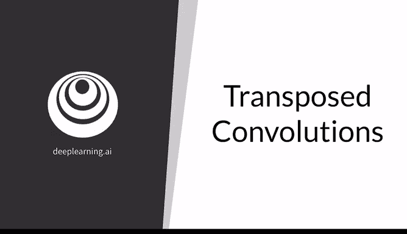
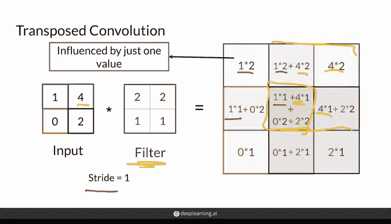
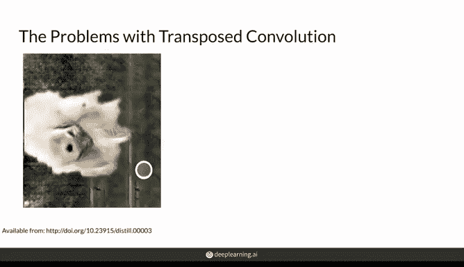
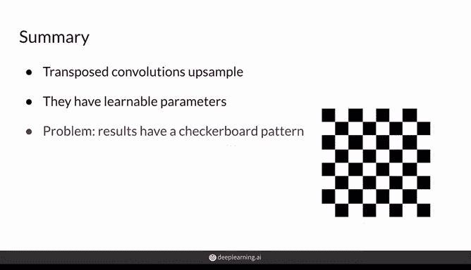

# 19：转置卷积 🧩

在本节课中，我们将要学习转置卷积。这是一种用于上采样的技术，它使用可学习的滤波器来放大输入尺寸。我们将详细解释其工作原理，并讨论其特有的“棋盘格”问题。

---

## 概述

上一节我们介绍了卷积、池化和上采样层。本节中，我们来看看**转置卷积**。这是一种通过可学习滤波器来放大输入尺寸的上采样方法。

## 转置卷积的工作原理

转置卷积的操作过程与普通卷积非常相似，但其目的是增大特征图的尺寸。

以下是转置卷积将一个2x2输入上采样为3x3输出的具体步骤：

1.  使用一个2x2的可学习滤波器，设置步长（stride）为1。
2.  从输入的左上角像素开始，将其值与滤波器中的每个值相乘。
3.  将相乘的结果放置在输出特征图左上角的2x2区域内。
4.  将滤波器按步长1移动，对输入的下一个像素（例如右上角像素）重复此过程，将结果累加到输出特征图的相应位置。
5.  重复此过程，直到遍历完整个输入。

通过这种计算方式，输出中的某些像素值会受到输入像素的更大影响。例如，输出中心的像素值受到输入所有四个像素的影响，而角落的像素值只受一个输入像素的影响。

## 转置卷积的“棋盘格”问题

尽管转置卷积功能强大，但它存在一个常见问题：**棋盘格效应**。

这个问题源于计算方式的不均匀性。在之前的例子中，输出中心的像素被访问了四次（受所有输入像素影响），而边缘像素只被访问了一次。这种不均匀的“贡献度”会导致生成的图像出现类似棋盘格的规则图案。

下图展示了一个转置卷积的实际输出，其中可以观察到明显的棋盘格图案：

## 应用现状与替代方案

尽管存在棋盘格问题，转置卷积在研究中仍然相当流行。

然而，为了避免这个问题，目前一种更受欢迎的技术是组合使用**上采样层（如最近邻插值）和普通卷积层**。这种方法先通过无参数的上采样增大尺寸，再通过卷积层进行学习，通常能产生更平滑的结果。

## 总结

本节课中我们一起学习了转置卷积的核心内容：

*   **转置卷积**是一种上采样方法，其滤波器参数是可学习的。
*   其操作过程与卷积类似，但目的是增大特征图尺寸。
*   使用转置卷积的一个主要问题是可能导致输出出现**棋盘格图案**。
*   尽管有此问题，转置卷积仍然被广泛使用，在本专项的某些模型中也会用到它。同时，“上采样+卷积”的组合正成为更流行的替代方案。