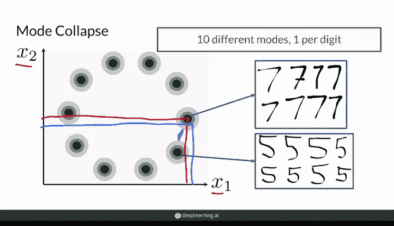
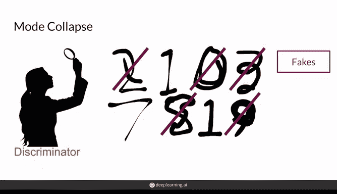
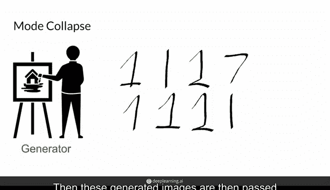
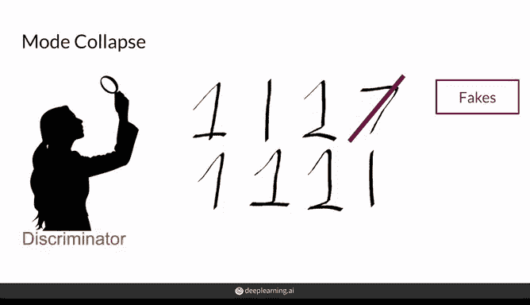
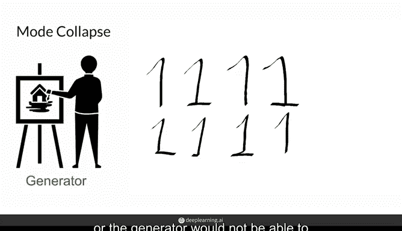
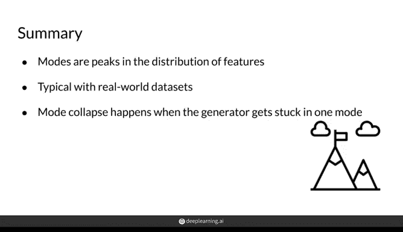

# 21：模式坍塌 (Mode Collapse) 🎭

在本节课中，我们将要学习生成对抗网络训练中一个常见的问题——模式坍塌。我们将了解什么是概率分布中的“模式”，以及模式坍塌在GAN训练中是如何发生的。

---

## 什么是“模式”？📊

上一节我们介绍了GAN训练中可能遇到的问题。本节中，我们来看看“模式”在概率分布中的具体含义。

在数据的概率分布中，一个“模式”指的是观测值高度集中的区域。例如，正态分布的均值就是该分布的单一模式。当然，也存在具有多个模式的分布，其均值不一定是模式之一。

更直观地说，在特征的概率密度分布上，任何一个峰值都是该分布的一个模式。

以下是理解模式的一个具体例子：

*   **特征表示**：假设手写数字可以用特征 `X1` 和 `X2` 来表示。这两个维度可以是任何用于表示不同手写数字的数值。
*   **概率分布**：在这种情况下，概率密度分布将是一个具有许多峰值的曲面，每个峰值对应一个数字（0-9）。因此，这是一个具有10个不同模式的多峰分布。
*   **模式中心**：例如，所有数字“7”的观测值将由相似的 `(X1, X2)` 特征对表示。这些值会聚集在一起，其中最中心的点（红色标记）可以看作是“平均的7”。同样，数字“5”的观测值会聚集在另一个区域，形成另一个峰值。
*   **低概率区域**：在两个模式（如“7”和“5”）之间的区域，概率密度非常低。这意味着在真实数据集中，几乎不可能出现一个看起来介于7和5之间的数字。

因此，在这个由特征 `X1` 和 `X2` 构成的概率密度分布上，总共有10个模式，每个数字对应一个。

---

## 什么是“模式坍塌”？🏚️

理解了模式的概念后，我们继续使用手写数字的例子，来探讨模式坍塌意味着什么。

直观上，模式坍塌听起来就像是所有事物都坍缩到一个或少数几个模式上，而其他模式消失了。以下是它发生的过程：

1.  **判别器的局部最优**：假设一个判别器已经学会了很好地识别哪些手写数字是伪造的，**除了**那些看起来像数字“1”或“7”的生成图像。此时，判别器处于其损失函数的一个局部最小值。
2.  **生成器接收反馈**：生成器看到判别器的反馈后，得到了一个如何在下一轮欺骗判别器的好主意。它发现所有被判别器错误分类的图像都类似于“1”或“7”。
3.  **生成器利用漏洞**：因此，生成器开始大量生成类似于“1”或“7”的图片。
4.  **判别器调整**：在下一轮，这些生成的图像被传递给判别器。判别器可能调整后，能正确识别出像“7”的假图，但仍然会错误分类那些像“1”的图片。
5.  **坍塌到单一模式**：生成器获得这个新反馈，发现判别器的弱点在于处理像手写“1”的图片。于是，这次它生成的所有图片都只模仿数字“1”。这样，生成器的输出就从整个可能的手写数字分布，“坍塌”到了单一的模式上。

最终，判别器可能会察觉并学会识别伪造的“1”，从而跳出那个局部最小值。但生成器也可能迁移到分布的另一个模式（例如“5”），导致博弈再次坍塌到另一个不同的模式。或者，生成器可能无法找到其他可以多样化的方向。

---

## 本节总结 📝

本节课中我们一起学习了模式坍塌的核心概念：

*   **模式**：是特征概率分布上的峰值。真实世界的数据通常具有多个模式，对应数据集中的每个可能类别（如手写数字数据集中的10个数字）。
*   **模式坍塌**：发生在生成器通过学习只从整个训练数据集的**单一类别**（例如只生成手写数字“1”）中产生样本来欺骗判别器时。这是不幸的，因为虽然生成器在优化以欺骗判别器，但这并不是我们最终希望生成器做的事——我们希望它能生成**多样且高质量**的样本。