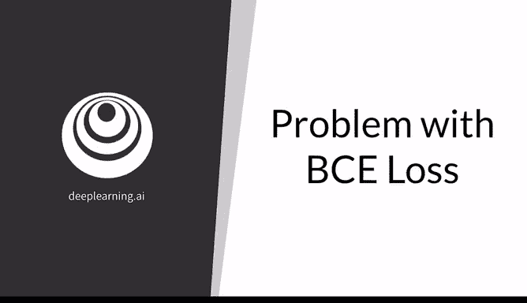
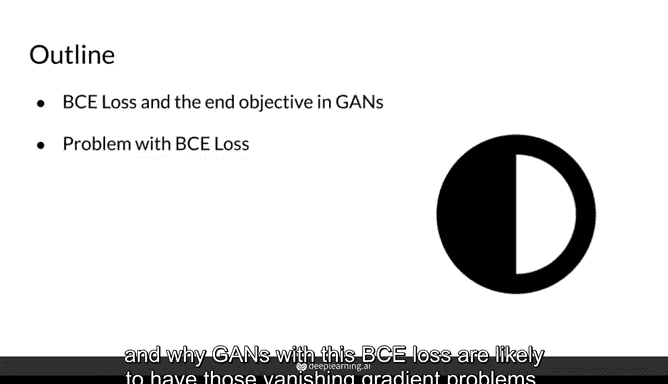
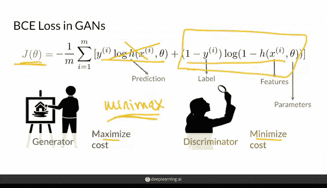
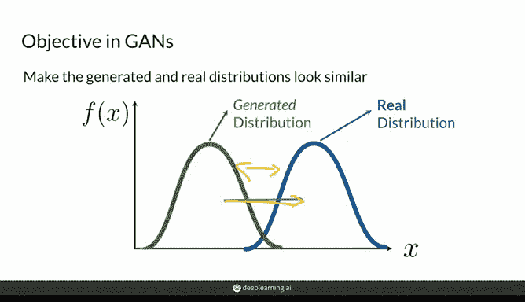
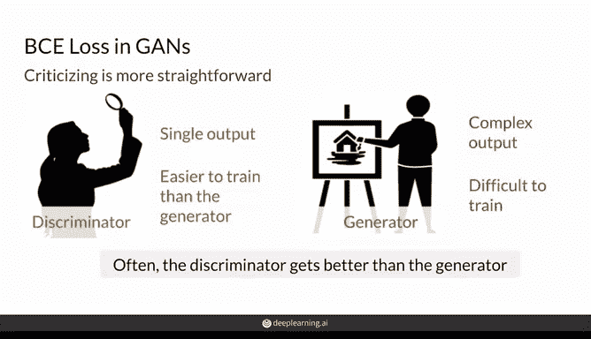
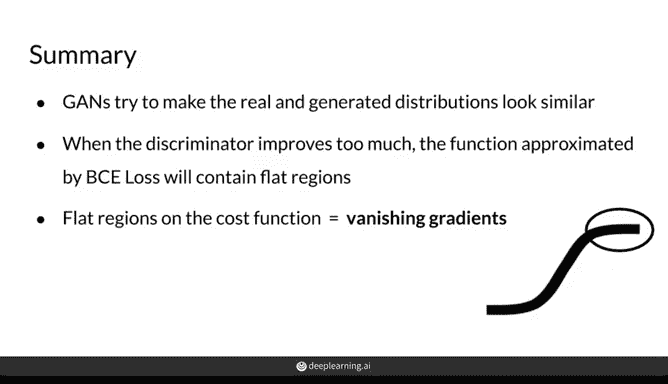

# 22：BCE损失的问题与梯度消失 🧠

在本节课中，我们将探讨生成对抗网络（GAN）训练中常用的二元交叉熵（BCE）损失函数，并分析其为何可能导致梯度消失问题。我们将回顾BCE损失的形式，理解生成器和判别器的目标，并解释在何种情况下训练会变得困难。

---





## BCE损失函数回顾

上一节我们介绍了GAN的基本概念，本节中我们来看看其常用的损失函数。传统上，GAN使用二元交叉熵损失进行训练，但这并非最佳方法。使用BCE损失时，GAN容易遭遇模式崩溃和其他问题。

BCE损失函数的形式是判别器对真实样本和生成样本误分类代价的平均值。其公式如下：

```
L = - [y * log(D(x)) + (1 - y) * log(1 - D(G(z)))]
```

其中，第一项针对真实样本，第二项针对生成样本。损失值越高，表明判别器的性能越差。



生成器的目标是最大化这个损失，因为这意味着判别器表现不佳，将生成的假样本误判为真实样本。而判别器的目标是最小化这个损失函数，因为这表示其分类正确。生成器只关注公式中与生成样本相关的部分。这种最大化与最小化的博弈常被称为**极小极大博弈**。

---

## GAN的全局目标

通过这个极小极大博弈，生成器与判别器的互动最终转化为整个GAN架构的一个更宏观的目标：使生成数据的特征分布与真实数据的特征分布尽可能相似。换句话说，是让生成分布无限接近真实分布。



因此，二元交叉熵损失函数的极小极大过程，近似于在最小化另一个更复杂的、旨在实现分布匹配的函数。在整个训练过程中，判别器自然地试图尽可能清晰地区分真实与生成分布，而生成器则试图让生成分布看起来更像真实分布。

---

## 判别器与生成器的角色差异

然而，让我们退一步，再次审视生成器和判别器的角色。在GAN中，判别器只需要输出一个介于0和1之间的预测值，而生成器则需要产生一个由多个特征组成的复杂输出（例如一张图像）来试图欺骗判别器。



因此，判别器的任务往往相对简单一些。换句话说，欣赏博物馆里的画作比创作那些杰作要直接得多。在训练过程中，判别器完全有可能在性能上超越生成器，事实上，这种情况非常普遍。

---

## 梯度消失问题的产生

以下是训练过程中可能发生的情况：

在训练初期，判别器能力不强，区分生成分布与真实分布存在困难。两者分布存在重叠，判别器不太确定，因此它能够以非零梯度的形式向生成器提供有用的反馈。

随着训练进行，判别器能力增强，开始更清晰地区分生成分布与真实分布。此时，真实样本的预测值会集中在1附近，而生成样本的预测值会趋近于0。

当判别器变得过于优秀时，它开始提供信息量较少的反馈。具体来说，它回传的梯度可能接近于0。这对生成器毫无帮助，因为生成器无法知道该如何改进。**梯度消失问题**便由此产生。

---

## 总结



本节课中我们一起学习了BCE损失在GAN训练中的局限性。GAN试图通过最小化一个衡量分布差异的底层代价函数，来使生成分布逼近真实分布。然而，当训练中判别器比生成器更容易提升，且两个分布差异较大时，该代价函数会产生平坦区域。此时判别器能轻易区分真假样本（给真实样本打标签1，给生成样本打标签0），从而导致梯度消失问题，阻碍生成器的进一步学习。