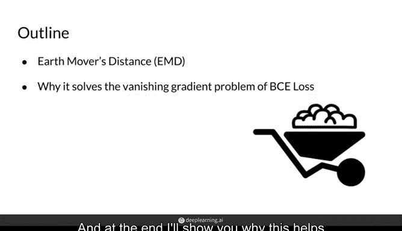
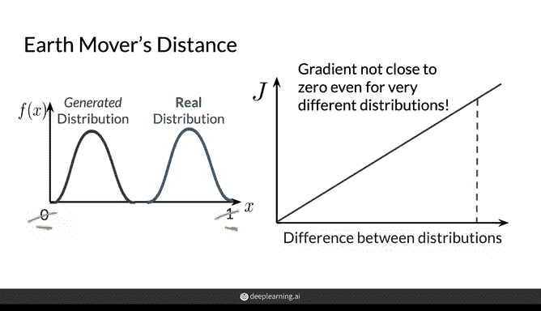
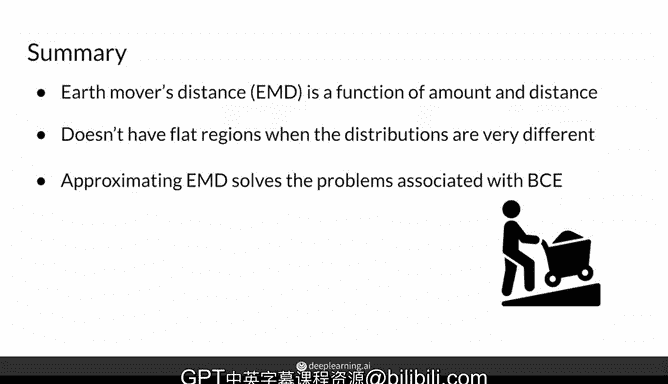

# 23：推土机距离 🚜

在本节课中，我们将学习生成对抗网络中一个重要的概念——推土机距离。我们将了解为何传统的二元交叉熵损失函数会导致模式崩溃和梯度消失问题，并探讨推土机距离如何通过测量两个分布之间的差异来提供更优的训练效果。

---

## 概述


使用二元交叉熵损失训练生成对抗网络时，由于整个架构的基础成本函数特性，常会遇到模式崩溃和梯度消失问题。尽管判别器的输出值在0到1之间有无限多个小数，但随着判别器的改进，其输出会趋向于两端极值。


本节视频将介绍一种不同的基础成本函数，称为推土机距离。它用于测量两个分布之间的距离，并且在训练生成对抗网络时，其表现通常优于与二元交叉熵损失相关的函数。最后，我们将解释为何这种方法有助于缓解梯度消失问题。



---

## 推土机距离的直观理解

假设我们有一个生成分布和一个真实分布，它们具有相同的方差但不同的均值，并且可能都是正态分布。推土机距离的作用是，通过估计将生成分布转化为真实分布所需付出的“努力”程度，来衡量这两个分布之间的差异。

直观地理解，如果生成分布是一堆泥土，那么推土机距离衡量的是将这堆泥土移动并塑造成真实分布的形状和位置有多困难。这就是“推土机距离”一词的含义。

该函数同时取决于生成分布需要移动的**距离**和需要移动的**量**。我们将在下一节视频中介绍计算此距离的函数。

---

## 二元交叉熵损失的问题

上一节我们了解了推土机距离的概念，本节中我们来看看传统方法的问题所在。

二元交叉熵损失的问题是，随着判别器的改进，它会开始在0和1之间给出更极端的值，即更接近1或更接近0的值。因此，它反馈给生成器的信息变得不那么有用，导致生成器因梯度消失问题而停止学习。

以下是该问题的简化表示：
```
判别器输出 -> 极端化 (接近0或1) -> 梯度消失 -> 生成器停止更新
```

---

## 推土机距离的优势

与二元交叉熵损失不同，推土机距离在0和1之间没有这样的上限。因此，无论这两个分布相距多远，成本函数都会持续增长，并且该度量的梯度不会趋近于0。

因此，使用推土机距离的生成对抗网络更不容易出现梯度消失问题，进而也减少了模式崩溃的可能性。

---

## 总结

本节课中我们一起学习了推土机距离。

推土机距离是一个衡量使一个分布等于另一个分布所需付出的努力的函数，因此它同时取决于距离和数量。与二元交叉熵损失不同，当分布开始变得非常不同且判别器大幅改进时，它不会出现平坦区域。

因此，近似这种度量可以消除梯度消失问题，并降低生成对抗网络中出现模式崩溃的可能性。




在接下来的几节视频中，我将展示一个使用推土机距离来训练生成对抗网络的损失函数。



