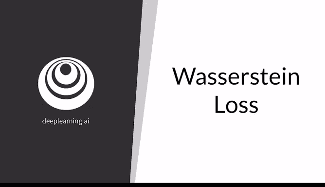
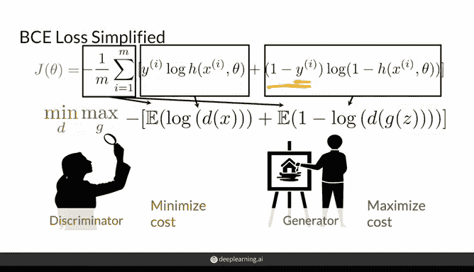
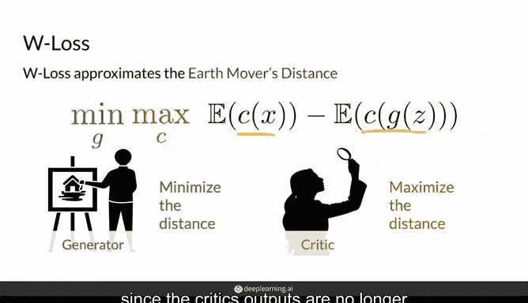
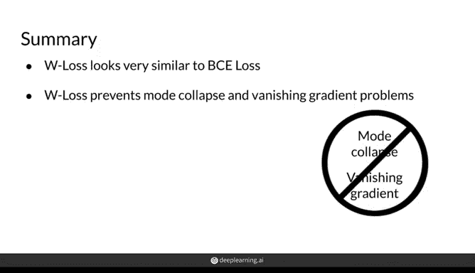

# 24：Wasserstein损失函数 🧠

在本节课中，我们将学习生成对抗网络（GAN）中的一种替代损失函数——Wasserstein损失（W Loss）。我们将了解其基本概念、计算方式，并与传统的二元交叉熵（BCE）损失进行对比。

---

## 概述

之前你已经看到，传统上使用二元交叉熵（BCE）损失来训练GAN。然而，由于其函数形式的近似特性，BCE损失存在许多问题。本节将介绍一种替代损失函数——Wasserstein损失（简称W Loss），它近似于上一节中提到的“推土机距离”（Earth Mover's Distance）。

---

## BCE损失的简化形式

上一节我们介绍了BCE损失的基本概念，本节中我们来看看它的简化表达方式。

BCE损失通过一个较长的方程计算，本质上衡量了判别器将观测样本分类为“真”或“假”的平均错误程度。生成器希望最大化这个损失，因为这意味着判别器认为其生成的假样本看起来非常真实；而判别器则希望最小化这个损失，这通常被称为“极小极大博弈”。

这个复杂的BCE损失方程可以简化为以下形式：

\[
L_{\text{BCE}} = \mathbb{E}[\log(D(x))] + \mathbb{E}[\log(1 - D(G(z)))]
\]

其中，求和与除以样本数M的操作即为均值或期望值。方程的第一部分衡量判别器对真实样本（y=1）的分类错误程度，第二部分衡量其对生成器产生的假样本（y=0）的分类错误程度。

---

## Wasserstein损失的计算

现在，让我们转向Wasserstein损失。与BCE损失不同，W损失近似于真实分布与生成分布之间的“推土机距离”，并具有比BCE更优的性质。

W损失的计算形式与简化后的BCE损失相似，其函数计算的是判别器（在W损失中常称为“评论家”）对真实样本和假样本预测值之间的差异：

\[
L_{\text{W}} = \mathbb{E}[C(x)] - \mathbb{E}[C(G(z))]
\]

这里，C代表评论家，x是真实样本，G(z)是生成器根据噪声向量z生成的假样本（也可记作\(\hat{x}\)）。判别器试图最大化其对真实样本和假样本评价之间的距离，即努力将这两个分布推得尽可能远。与此同时，生成器希望最小化这个差异，因为它希望判别器认为其生成的假图像尽可能接近真实图像。

与BCE损失相比，W损失函数中没有对数运算，因为评论家的输出不再被限制在0和1之间。

---

## 判别器与评论家的区别

以下是BCE损失与W损失在判别器/评论家设计上的主要区别：

*   **激活函数与输出范围**：为使BCE损失有意义，判别器的输出必须是0到1之间的预测概率。因此，使用BCE损失训练的GAN，其判别器神经网络的输出层通常使用Sigmoid激活函数，将值压缩到0和1之间。
*   **输出层设计**：W损失没有上述限制。因此，评论家神经网络的最后一层可以是线性层，产生任意实数值输出。
*   **功能与名称**：评论家的输出可以解释为图像被评价为“真实”的程度。由于输出不再局限于0（假）和1（真），它不再是在这两个类别之间进行分类或判别。因此，将这个神经网络称为“判别器”不太合适，在W损失的语境下，其等价物被称为“评论家”。评论家的目标是最大化其对假样本和真实样本评价之间的距离。

---

## 核心差异总结

本节课我们一起学习了Wasserstein损失函数及其与BCE损失的关键区别。

W损失与BCE损失的主要区别在于：
1.  **输出范围**：BCE损失下的判别器输出0到1之间的值；而W损失下的评论家可以输出任意数值。
2.  **损失函数形式**：两者的成本函数形式相似，但W损失内部没有对数运算，因为它衡量的是评论家对真实样本的预测与对假样本的预测之间的距离。而BCE损失衡量的是预测值与真实标签（1或0）之间的距离。
3.  **训练稳定性**：关键要点在于，判别器的输出有界（0到1），而评论家的输出无界，它只是尽可能地将两个分布分开。因此，由于无界性，评论家可以在不降低反馈质量的情况下持续改进，这缓解了梯度消失问题，并有助于避免模式崩溃，因为生成器总能获得有用的反馈。

总之，W损失看起来与BCE损失相似，但其背后的数学表达式不那么复杂。它的作用是近似推土机距离，从而防止模式崩溃和梯度问题。然而，为了使该损失函数有效工作，还需要一个额外的条件，这将在后续视频中介绍。